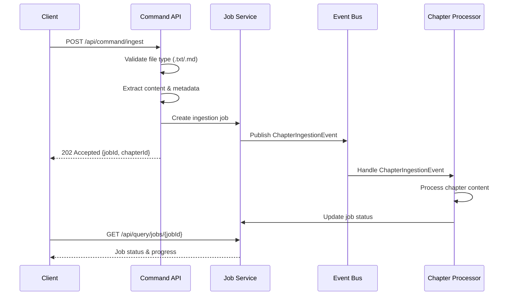
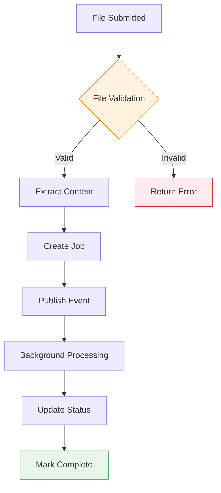

# LoreVault REST API Specification

**Purpose**: Define the complete REST API interface for the LoreVault content ingestion and lore exploration system, implementing CQRS patterns with clear command/query separation.

**Scope**: All public HTTP endpoints, request/response formats, error handling, and integration patterns for the LoreVault API. Covers current v0.8.0 implementation and planned expansion through v1.0.0.

**Dependencies**: 
- Architecture Document: ### Performance Requirements

### Response Time Targets

| Operation | Target | Maximum |
|-----------|--------|---------|
| File submission | < 200ms | 500ms |
| Job status query | < 100ms | 200ms |
| Job list query | < 300ms | 1000ms |
| Semantic search | < 500ms | 2000ms |
| RAG question answering | < 3000ms | 8000ms |

### Throughput Specifications

| Operation | Peak Load | Sustained Load |
|-----------|-----------|----------------|
| File submissions | 10/minute | 100/hour |
| Status queries | 100/minute | 1000/hour |
| Search queries | 50/minute | 500/hour |
| RAG queries | 20/minute | 200/hour |oint (02-functional-viewpoint.md) - CQRS patterns
- Neo4j Content Data Model (neo4j-content-data-model.md) - Entity structures
- Scene Detection Specification (scene-detection-specification.md) - Processing workflow

## Process Overview

The LoreVault API implements a strict CQRS design that separates content ingestion commands from lore exploration queries. The API supports the complete workflow from content submission through processing job monitoring to structured lore access and intelligent question answering.

### Core API Domains

1. **Content Commands** (`/api/command/`): Command operations for content modification
2. **Query Operations** (`/api/query/`): All read operations including job monitoring, search, and QA

## CQRS Endpoint Structure

### Command Operations
- `POST /api/command/ingest` - Submit content for processing

### Query Operations  
- `GET /api/query/jobs/{jobId}` - Get job status
- `GET /api/query/jobs` - List jobs with filtering
- `POST /api/query/search/semantic` - Vector similarity search
- `GET /api/query/search/semantic/status` - Search availability
- `POST /api/query/ask/vector` - Vector-based question answering
- `POST /api/query/ask/rag` - RAG-powered question answering with citations
- `GET /api/query/health` - System health and service status

## Detailed Workflow

### Content Submission Flow




#### Submit File Endpoint

**Endpoint**: `POST /api/command/ingest`  
**Purpose**: Submit narrative content files for processing  
**Content-Type**: `multipart/form-data`

**Request Parameters**:
```
file: MultipartFile          (required) - .txt or .md file
universe: string             (required) - Universe name (e.g., "Cosmere", "Middle Earth")
series: string               (optional) - Series name (e.g., "Mistborn", "The Lord of the Rings")
bookNumber: integer          (required) - Book number in series (1-based)
chapterNumber: integer       (required) - Chapter number in book (1-based)
partNumber: integer          (optional) - Part number within book (1-based)
title: string                (optional) - Chapter title (auto-extracted if omitted)
```

**Request Example**:
```bash
# Standalone book in a universe
curl -X POST /api/command/ingest \
  -F "file=@chapter1.md" \
  -F "universe=Cosmere" \
  -F "bookNumber=1" \
  -F "chapterNumber=1" \
  -F "title=Warbreaker - Chapter 1"

# Book in a series
curl -X POST /api/command/ingest \
  -F "file=@chapter1.md" \
  -F "universe=Cosmere" \
  -F "series=Mistborn" \
  -F "bookNumber=1" \
  -F "chapterNumber=1" \
  -F "title=The Final Empire - Chapter 1"
```

**Response Format**:
```json
{
  "jobId": "550e8400-e29b-41d4-a716-446655440000",
  "chapterId": "123e4567-e89b-12d3-a456-426614174000",
  "status": "submitted",
  "message": "Chapter submitted successfully for processing"
}
```

**Validation Rules**:
- File size limit: 1MB maximum
- Supported file types: `.txt`, `.md` for now
- Universe name: required, standard text (letters, numbers, spaces, hyphens, apostrophes)
- Series name: optional, standard text (letters, numbers, spaces, hyphens, apostrophes) 
- Book/chapter numbers: positive integers (1-based indexing)
- Part number: positive integer if provided (1-based indexing)
- Title: 1-500 characters if provided

### Job Monitoring Domain

#### Get Job Status

**Endpoint**: `GET /api/query/jobs/{jobId}`  
**Purpose**: Retrieve processing status for a specific job

**Path Parameters**:
```
jobId: UUID (required) - Unique job identifier
```

**Response Format**:
```json
{
  "jobId": "550e8400-e29b-41d4-a716-446655440000",
  "chapterId": "123e4567-e89b-12d3-a456-426614174000",
  "status": "EMBEDDING_CHUNKS",
  "progress": 45,
  "createdAt": "2025-08-06T10:15:00Z",
  "completedAt": null,
  "isComplete": false,
  "statusHistory": [
    {
      "status": "QUEUED",
      "stepDescription": "Chapter submitted and queued for processing",
      "timestamp": "2025-08-06T10:15:00Z",
      "progressPercent": 0
    },
    {
      "status": "DETECTING_SCENES",
      "stepDescription": "Performing deterministic text segmentation",
      "timestamp": "2025-08-06T10:15:30Z", 
      "progressPercent": 15
    },
    {
      "status": "EMBEDDING_CHUNKS",
      "stepDescription": "Created 47 chunks from chapter content",
      "timestamp": "2025-08-06T10:16:00Z",
      "progressPercent": 45
    }
  ]
}
```

#### List Jobs

**Endpoint**: `GET /api/query/jobs`  
**Purpose**: Retrieve list of jobs with optional filtering

**Query Parameters**:
```
universe: string (optional) - Filter by universe (matches Chapter.coordinates.universe)
status: string (optional) - One of [ACTIVE | QUEUED | PREPROCESSING_STARTED | DETECTING_SCENES | EMBEDDING_CHUNKS | COMPLETE | FAILED]
limit: integer (optional, default: 20, min: 1, max: 100) - Page size
offset: integer (optional, default: 0, min: 0) - Pagination offset
```

**Response Format**:
```json
{
  "jobs": [
    {
      "jobId": "550e8400-e29b-41d4-a716-446655440000",
      "chapterId": "123e4567-e89b-12d3-a456-426614174000",
      "universe": "Middle Earth",
      "series": "The Lord of the Rings",
      "bookNumber": 1,
      "partNumber": null,
      "chapterNumber": 2,
      "chapterTitle": "The Shadow of the Past",
      "status": "COMPLETE",
      "progress": 100,
      "createdAt": "2025-08-06T10:15:00Z",
      "completedAt": "2025-08-06T10:16:30Z"
    }
  ],
  "pagination": {
    "total": 1,
    "limit": 20,
    "offset": 0,
    "hasMore": false
  }
}
```

- ACTIVE returns jobs whose current status is not in [COMPLETE, FAILED].
- Results are ordered by `createdAt` desc.

### Search & QA Domain

#### Semantic Search

**Endpoint**: `POST /api/query/search/semantic`  
**Purpose**: Perform vector-based similarity search across chunk content  
**Status**: Available in v0.7.0+

**Request Format**:
```json
{
  "query": "What is Kaladin's relationship with Bridge Four?",
  "topK": 5,
  "threshold": 0.7,
  "filters": {
    "universe": "Cosmere",
    "series": "Stormlight Archive", 
    "bookNumber": 1,
    "chapterNumber": null
  }
}
```

**Response Format**:
```json
{
  "results": [
    {
      "chunkId": "789e0123-e89b-12d3-a456-426614174000",
      "score": 0.89,
      "snippet": "Kaladin looked at the men of Bridge Four, his crew, his responsibility...",
      "chapterId": "456e7890-e89b-12d3-a456-426614174000", 
      "bookNumber": 1,
      "chapterNumber": 15
    }
  ],
  "metadata": {
    "query": "What is Kaladin's relationship with Bridge Four?",
    "totalResults": 1,
    "returnedResults": 1,
    "processingTimeMs": 145
  }
}
```

#### Search Status

**Endpoint**: `GET /api/query/search/semantic/status`  
**Purpose**: Check availability of semantic search functionality

**Response Format**:
```json
{
  "available": true,
  "message": "Semantic search is available"
}
```

#### Ask Vector

**Endpoint**: `POST /api/query/ask/vector`  
**Purpose**: Vector-only question answering (mirrors semantic search for comparison)  
**Status**: Available in v0.8.0+

**Request/Response**: Same format as semantic search endpoint

#### Ask RAG

**Endpoint**: `POST /api/query/ask/rag`  
**Purpose**: RAG-based question answering with synthesized answers and citations  
**Status**: Available in v0.8.0+

**Request Format**:
```json
{
  "question": "How does Vin learn about Allomancy?",
  "topK": 5,
  "threshold": 0.6,
  "filters": {
    "universe": "Cosmere",
    "series": "Mistborn",
    "bookNumber": 1
  }
}
```

**Response Format**:
```json
{
  "answer": "Vin learns about Allomancy through several key experiences. Initially, she discovers her abilities accidentally when she instinctively burns pewter during a fight. Kelsior then becomes her primary teacher, explaining the fundamentals of Allomantic metals and their effects.",
  "citations": [
    {
      "chunkId": "abc12345-e89b-12d3-a456-426614174000",
      "snippet": "'You're an Allomancer, Vin,' Kelsior said. 'The metal you've been burning is pewter...'",
      "score": 0.92
    }
  ],
  "metadata": {
    "question": "How does Vin learn about Allomancy?",
    "retrieved": 5,
    "used": 2,
    "processingTimeMs": 2340
  }
}
```

### System Health Domain

#### Health Check

**Endpoint**: `GET /api/health`  
**Purpose**: System health status including AI service connectivity

**Response Format**:
```json
{
  "healthy": true,
  "timestamp": "2025-08-19T10:30:00Z",
  "version": "0.8.0",
  "checks": {
    "llm": {
      "healthy": true,
      "description": "Large Language Model API connectivity"
    },
    "embeddings": {
      "healthy": true,
      "dimension": 1536,
      "durationMs": 145
    }
  }
}
```

### Lore Exploration Domain

#### List Chapters

**Endpoint**: `GET /api/lore/{universe}/chapters`  
**Purpose**: Retrieve chapters for a specific universe  
**Status**: Planned for v0.3.0+

**Path Parameters**:
```
universe: string (required) - Universe identifier
```

**Response Format** (Future):
```json
{
  "universe": "Middle Earth",
  "chapters": [
    {
      "chapterId": "123e4567-e89b-12d3-a456-426614174000",
      "book": "The Fellowsahip of the Ring",
      "title": "The Shadow of the Past",
      "chunkCount": 47,
      "processedAt": "2025-08-06T10:16:30Z"
    }
  ]
}
```

## State Management

### Job Status States

| Status | Progress % | Description | Terminal |
|--------|------------|-------------|----------|
| `QUEUED` | 0 | Job created, waiting for processing | No |
| `PREPROCESSING_STARTED` | 5 | Content validation and preparation | No |
| `DETECTING_SCENES` | 15 | Text segmentation in progress | No |
| `EMBEDDING_CHUNKS` | 45 | Chunk creation and storage | No |
| `COMPLETE` | 100 | Processing completed successfully | Yes |
| `FAILED` | varies | Processing failed with error | Yes |
| `ACTIVE` | varies | Job is currently being processed | No |

### Content Processing States



## Error Handling

### HTTP Status Codes

| Code | Usage | Scenarios |
|------|-------|-----------|
| `200 OK` | Successful query | Job status retrieved, chapters listed |
| `202 Accepted` | Command accepted | File submitted for processing |
| `400 Bad Request` | Client error | Invalid file type, missing parameters |
| `404 Not Found` | Resource not found | Job ID doesn't exist |
| `413 Payload Too Large` | File too large | File exceeds 1MB limit |
| `415 Unsupported Media Type` | Invalid file type | Non-.txt/.md file uploaded |
| `500 Internal Server Error` | Server error | Processing failure |

### Error Response Format

```json
{
  "error": {
    "code": "INVALID_FILE_TYPE",
    "message": "Only .txt and .md files are supported",
    "details": {
      "supportedTypes": [".txt", ".md"],
      "receivedType": ".pdf"
    }
  },
  "timestamp": "2025-08-06T10:15:00Z",
  "path": "/api/ingest/submit-file"
}
```

### Error Categories

#### Client Errors (4xx)

**File Validation Errors**:
- `INVALID_FILE_TYPE`: File extension not supported
- `FILE_TOO_LARGE`: File exceeds size limit
- `EMPTY_FILE`: File contains no content
- `INVALID_ENCODING`: File not UTF-8 encoded

**Parameter Validation Errors**:
- `MISSING_UNIVERSE`: Universe parameter required
- `INVALID_BOOK_NUMBER`: Book number must be positive integer
- `INVALID_CHAPTER_NUMBER`: Chapter number must be positive integer  
- `INVALID_PART_NUMBER`: Part number must be positive integer if provided
- `TITLE_TOO_LONG`: Chapter title exceeds 500 character limit  
- `INVALID_UNIVERSE_FORMAT`: Universe contains unsupported characters

#### Server Errors (5xx)

**Processing Errors**:
- `CONTENT_EXTRACTION_FAILED`: Unable to read file content
- `JOB_CREATION_FAILED`: Unable to create processing job
- `EVENT_PUBLISHING_FAILED`: Unable to publish processing event

## Performance Requirements

### Response Time Targets

| Operation | Target | Maximum |
|-----------|--------|---------|
| File submission | < 200ms | 500ms |
| Job status query | < 100ms | 200ms |
| Job list query | < 300ms | 1000ms |

### Throughput Specifications

| Operation | Peak Load | Sustained Load |
|-----------|-----------|----------------|
| File submissions | 10/minute | 100/hour |
| Status queries | 100/minute | 1000/hour |

### Resource Limits

| Resource | Limit | Rationale |
|----------|-------|-----------|
| File size | 1MB | Typical chapter length |
| Request timeout | 30 seconds | File upload completion |
| Job retention | 30 days | Historical tracking |

## Integration Points

### Event System Integration

**Published Events**:
- `ChapterIngestionEvent`: Triggered when file is successfully submitted
  - `jobId`: UUID
  - `chapterId`: UUID

**Event Handlers**:
- `ChapterProcessor.handleChapterIngestion()`: Processes submitted content

### Database Integration

**Tables Affected**:
- `chapters`: Content storage with universe/book context
- `ingestion_jobs`: Job tracking and status management
- `status_records`: Detailed progress history

### External Service Integration

**Future Integrations** (v0.3.0+):
- LLM service (three-slot configuration): Scene detection and entity extraction
- External AI services (GPT-4/Claude): Advanced synthesis
- Vector database (pgvector): Semantic search capabilities

## Validation Criteria

### Functional Validation

**File Upload Success Criteria**:
- ✅ File uploaded and content extracted successfully
- ✅ Job created with QUEUED status
- ✅ ChapterIngestionEvent published
- ✅ Valid jobId and chapterId returned

**Job Monitoring Success Criteria**:
- ✅ Job status accurately reflects processing progress
- ✅ Status history provides complete audit trail
- ✅ Terminal states (COMPLETE/FAILED) correctly identified

### Performance Validation

**Load Testing Requirements**:
- Submit 10 files simultaneously within 5 seconds
- Query 100 job statuses within 10 seconds  
- Maintain < 200ms response time under normal load

### Error Handling Validation

**Error Response Validation**:
- ✅ Invalid file types rejected with appropriate error
- ✅ Missing parameters return clear validation messages
- ✅ Non-existent job IDs return 404 with helpful message

## API Evolution Strategy

### Version Compatibility

**Current Version**: v0.8.0 (Vector Search Integration & RAG QA)  
**API Stability**: CQRS endpoints are stable for v0.8.x series  
**Breaking Changes**: Endpoint restructure from v0.7.0 (legacy endpoints removed)

### Future Enhancements

**v0.9.0 Additions**:
- Spoiler-aware search filtering
- Advanced entity relationship queries
- Graph traversal endpoints

**v1.0.0 Additions**:
- `/api/query/lore/{universe}/characters` endpoint
- Full entity relationship queries
- Production authentication/authorization

### Deprecation Policy

**Advance Notice**: 6 months for breaking changes
**Support Period**: Previous major version supported for 12 months
**Migration Path**: Clear migration guides and compatibility layers

## Security Considerations

### Input Validation

**File Content Sanitization**:
- UTF-8 encoding validation
- Content length limits
- Malicious content scanning (future)

**Parameter Sanitization**:
- Universe/book name validation (standard text characters)
- SQL injection prevention
- XSS prevention in error messages

### Rate Limiting

**Per-Client Limits**:
- File uploads: 10 per minute
- Status queries: 100 per minute
- List queries: 20 per minute

### Future Security Enhancements

**Authentication** (v2.0+):
- API key authentication
- Universe-level access controls
- User-specific job filtering

**Authorization** (v2.0+):
- Universe ownership permissions
- Read-only vs. write access levels
- Admin vs. user role separation
