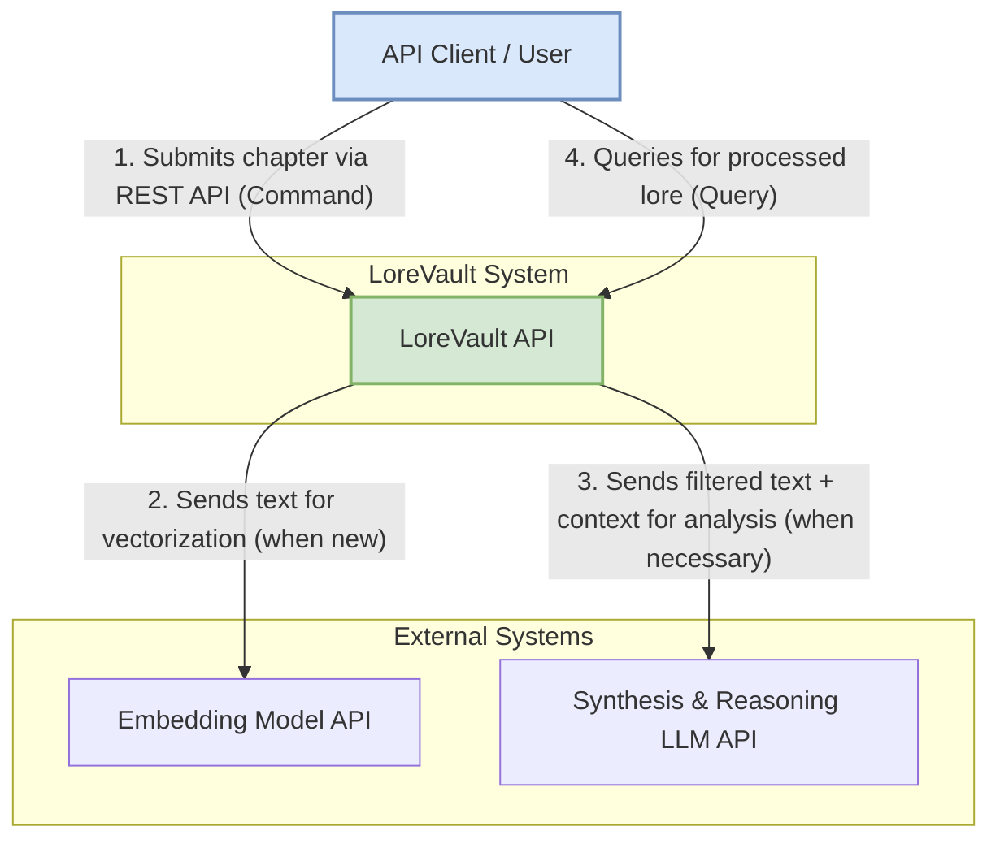
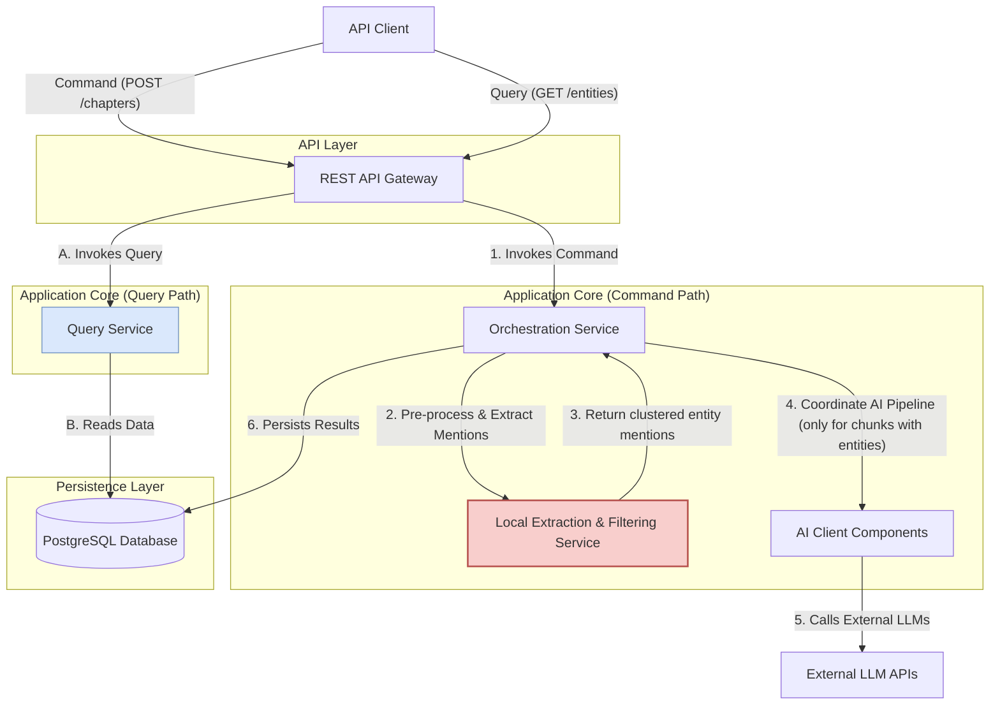
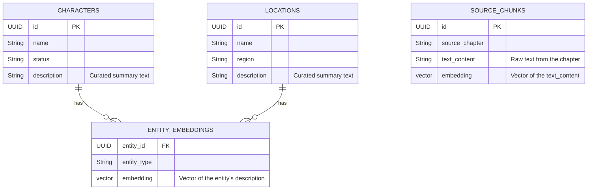
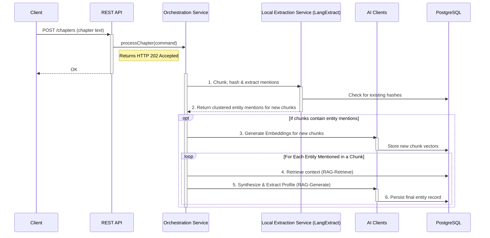
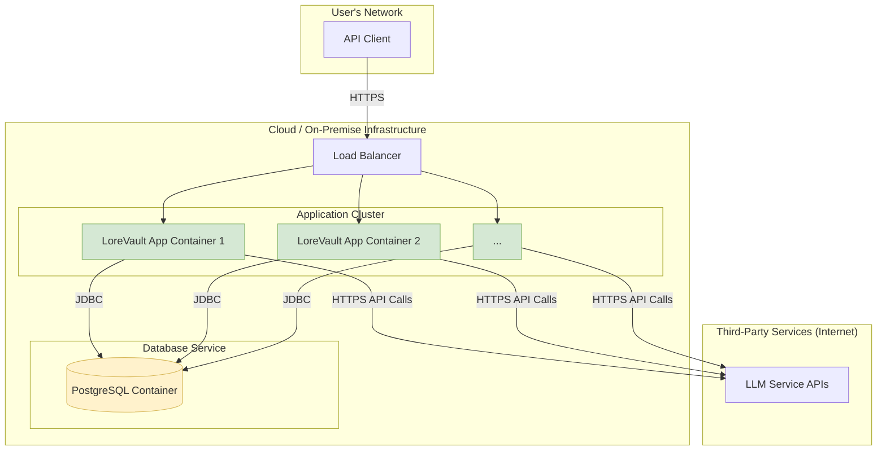

# LoreVault: System Architecture Overview

### Introduction to the Architecture

This document set describes the software architecture for the **LoreVault** system. The primary goal is to create an intelligent, automated system that builds a structured and searchable knowledge base from unstructured narrative text.

The architecture is designed to be robust, scalable, and maintainable, leveraging the Spring Boot ecosystem. It treats the AI components not as magic boxes, but as specialized services with distinct responsibilities, integrated into a familiar enterprise application pattern.

A key architectural choice is the use of the **Command Query Responsibility Segregation (CQRS)** pattern. This is a natural fit for the system's workload:

- **Commands:** The "write" side of the system involves complex, resource-intensive, and potentially long-running processing tasks (e.g., "Process this chapter"). These operations don't need to return data immediately.
    
- **Queries:** The "read" side involves serving the structured, processed data to users, which needs to be fast and efficient.
    

Separating these two paths simplifies the design, improves performance, and enhances scalability. This documentation uses the Rozanski & Woods viewpoints and perspectives style to describe the system from various architectural standpoints.

### 1. Context Viewpoint

This viewpoint describes the relationships, dependencies, and interactions between the LoreVault system and its environment. It defines the system's boundaries and identifies its external dependencies.

System Scope and Responsibilities:

The LoreVault system is responsible for ingesting raw text (chapters), orchestrating a multi-step AI pipeline to extract and synthesize information, and persisting that information in a structured and searchable format. It exposes its capabilities via a REST API. The system's internal architecture is designed to minimize reliance on external AI services to manage cost and latency.

External Dependencies:

The system relies on external, third-party Large Language Model (LLM) services. From an architectural perspective, these are treated as remote, stateless, and potentially non-deterministic service dependencies. They are specialized "processors" that the system calls only when programmatic logic is insufficient. langextract is considered an internal, local library, not an external system.

Diagram: System Context

This diagram shows the LoreVault system as a single box in the center, interacting with its users and the external AI services it depends on.

### 2. Functional Viewpoint

This viewpoint describes the system's runtime functional elements, their responsibilities, interfaces, and the interactions between them. This view has been updated to incorporate `langextract` as a core part of the pre-processing stage.

Architectural Pattern: Command Query Responsibility Segregation (CQRS)

The system is structured around a CQRS pattern. The Command Path is explicitly designed with a local, intelligent pre-processing stage to protect and optimize the use of expensive AI components.

**Key Functional Components:**

- **API Gateway:** Exposes the REST endpoints. It routes Commands to the `Orchestration Service` and serves Queries by reading from the `Query Service`.
    
- **Orchestration Service:** The central coordinator of the Command path. Its primary role is to execute the high-level workflow, delegating specific tasks to the local and remote services.
    
- **Local Extraction & Filtering Service:** A critical component responsible for all deterministic, low-cost tasks. It wraps the `langextract` library (via JNI or a similar integration method). Its responsibilities include:
    
    - Text cleaning and chunking.
        
    - Change detection (via hashing) to prevent re-processing of known content.
        
    - Using `langextract` to perform high-fidelity mention extraction and clustering, producing a definitive list of all entities mentioned in a text chunk.
        
- **AI Client Components:** A set of specialized clients for targeted AI tasks.
    
    - `EmbeddingClient`: Generates vectors for _new or changed_ text chunks only.
        
    - `SynthesisClient`: The primary interface to the powerful LLM. It is only called when the `Local Extraction & Filtering Service` has identified entities that require analysis. It receives the text chunk and the list of entities to focus on, then performs the RAG-powered synthesis and structured data extraction.
        
- **Query Service:** A simple, read-only service that provides fast access to the persisted entity data for the Query path.
    
- **Persistence Service:** Provides a repository-based interface to the database.
    

Diagram: Functional Components with LangExtract

This diagram highlights the new Local Extraction & Filtering Service acting as an intelligent gatekeeper before the Orchestration Service engages the expensive AI components.

### 3. Information Viewpoint

This viewpoint describes the data architecture of the system. The data models remain the same, but the process for generating the data is now more reliable due to the improved pre-processing.

Data Storage Strategy:

The system utilizes a unified PostgreSQL database that serves two distinct roles, managed by a single persistence layer.

1. **Structured Data Store (The "Source of Truth"):** Standard relational tables store the canonical, structured information for each lore entity (Characters, Locations, etc.).
    
2. **Vector Store (The "Semantic Index"):** The `pgvector` extension stores numerical vector embeddings of source text chunks and curated entity descriptions to enable semantic search.
    

Information Flow:

The flow of information is a multi-stage process. Raw text is first processed by the Local Extraction & Filtering Service which uses langextract to create a high-fidelity list of entity mentions. This list acts as a set of "candidate tasks." Only these qualified tasks are then sent for AI analysis, ensuring that expensive LLM calls are focused and necessary. The resulting structured information is what finally gets persisted in the database.

Diagram: High-Level Entity Relationship Model

The ERD is structurally unchanged, as the final persisted data model is the same.

### 4. Concurrency Viewpoint

This viewpoint describes how the system handles concurrent requests and manages its processing tasks. The sequence diagram is updated to show the new, more intelligent `langextract`-based filtering step.

Processing Model: Asynchronous Command Execution with Intelligent Pre-filtering

The asynchronous processing model is critical. The initial local extraction steps are fast, but the overall process remains potentially long-running.

1. **Request Reception:** The API controller immediately hands off the command for background processing and returns `HTTP 202 Accepted`.
    
2. **Local Extraction:** The first steps in the background thread are the deterministic checks (hashing) and the call to the `Local Extraction & Filtering Service`. This service uses `langextract` to find all entity mentions. Many text chunks may be discarded at this stage if they contain no entities, saving all downstream costs.
    
3. **Targeted AI Processing:** Only if a chunk contains entity mentions does the `Orchestration Service` proceed with the RAG loop and the expensive call to the `SynthesisClient`.
    

Diagram: Sequence Diagram for Chapter Ingestion (with LangExtract)

This diagram shows the new langextract step providing a high-quality filter.

### 5. Deployment Viewpoint

This viewpoint describes the physical environment into which the system will be deployed. The core deployment model is unchanged, but the main application container now has an additional local dependency.

Deployment Strategy: Containerization

The system is designed to be deployed as a set of containers for consistency and scalability.

**Runtime Components:**

1. **LoreVault Application Container:** A Docker container running the Spring Boot application JAR. This container must also include the `langextract` compiled library and any necessary runtime dependencies (e.g., C++ standard libraries) for it to function.
    
2. **PostgreSQL Container:** A Docker container running the PostgreSQL database instance with the `pgvector` extension enabled.
    
3. **External LLM Services:** Remote API endpoints for the powerful synthesis and reasoning models.
    

Configuration Management:

All external service configurations (database URLs, LLM API keys) will be managed via environment variables or a configuration service.

Diagram: Deployment Model

The diagram remains the same, with the understanding that the "LoreVault App Container" now has an internal, compiled dependency on langextract.

