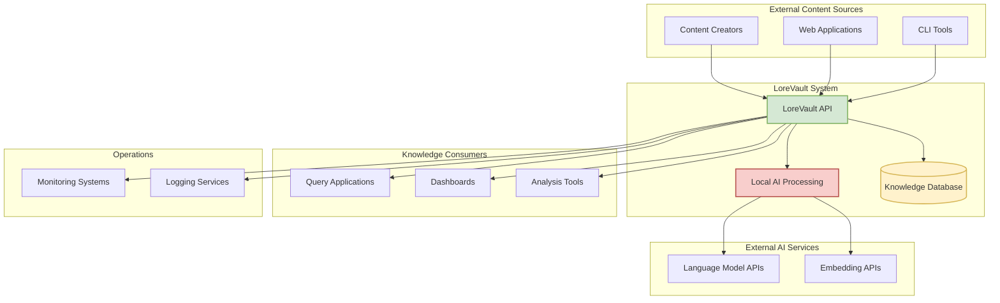

# Context Viewpoint

**Stakeholders:** System administrators, external integrators, business stakeholders  
**Concerns:** System boundaries, external dependencies, user interactions

## Overview

This viewpoint describes the relationships, dependencies, and interactions between the LoreVault system and its environment. It defines the system's boundaries and identifies critical external dependencies that affect system operation.

## System Scope and Responsibilities

LoreVault is an intelligent knowledge ingestion service that automatically builds structured lore databases from narrative text. The system operates as a service-oriented platform that transforms unstructured content into queryable knowledge.

### Core Responsibilities
1. **Content Ingestion**: Accept and process narrative text through REST API
2. **Knowledge Extraction**: Transform unstructured text into structured entities and relationships
3. **Data Management**: Persist and maintain knowledge in searchable format
4. **Query Services**: Provide fast access to processed knowledge via REST API
5. **Quality Assurance**: Detect and resolve conflicts in extracted information

### System Boundaries

**Within LoreVault System:**
- REST API gateway and endpoints
- Local AI processing capabilities
- Database management and persistence
- Background processing orchestration
- Entity relationship management

**Outside LoreVault System:**
- External AI service providers
- Client applications and users
- External monitoring and logging systems
- Infrastructure and deployment platforms

## External Dependencies

### Critical External Services

#### Large Language Model Providers
- **Purpose**: Complex reasoning, synthesis, and conflict resolution
- **Business Impact**: Essential for high-quality knowledge extraction
- **Dependency Type**: External API services (OpenAI, Anthropic, Google)
- **Risk Profile**: Service availability affects processing quality, not system availability
- **Mitigation**: Multi-provider support with automatic failover

#### Embedding Service Providers  
- **Purpose**: Text vectorization for semantic search capabilities
- **Business Impact**: Required for semantic search features
- **Dependency Type**: External API services for text-to-vector conversion
- **Risk Profile**: Affects search quality, cached vectors reduce dependency
- **Mitigation**: Local embedding alternatives available

### External Actors

#### Primary Users
- **Content Creators**: Submit narrative chapters for processing
- **Knowledge Consumers**: Query processed lore information  
- **System Integrators**: Build applications on top of LoreVault API

#### Secondary Users
- **System Administrators**: Deploy, monitor, and maintain the system
- **Content Reviewers**: Resolve conflicts and improve data quality

## System Context Diagram

## Integration Patterns

### Content Ingestion Flow
1. **Client Submission**: Users submit content via REST API
2. **Immediate Acknowledgment**: System returns processing job ID
3. **Background Processing**: Content processed asynchronously
4. **Status Updates**: Clients poll for processing progress and completion

### Knowledge Query Flow
1. **Query Submission**: Applications query for specific entities or relationships
2. **Database Lookup**: System retrieves structured data from knowledge base
3. **Response Delivery**: Formatted results returned to client
4. **Caching**: Frequently accessed data cached for performance

### External AI Integration
1. **Local Filtering**: Content pre-processed locally to identify AI processing needs
2. **Selective API Calls**: Only necessary content sent to external AI services
3. **Result Integration**: AI outputs integrated with existing knowledge base
4. **Cost Management**: Local processing minimizes external API usage

## Environmental Constraints

### Development Environment
- **Local Development**: Containerized services for database and external service simulation
- **Testing**: In-memory databases with mock external services
- **Integration Testing**: Containerized external service simulators

### Production Environment
- **Scalability**: Horizontal scaling requirements for processing load
- **Availability**: High availability needs for query services
- **Performance**: Sub-second response times for query operations
- **Cost Management**: External AI service cost optimization

### Security Requirements
- **API Security**: Authentication and authorization for content submission
- **Data Protection**: Secure handling of potentially sensitive narrative content
- **External Communications**: Encrypted connections to all external services
- **Audit Requirements**: Complete audit trail of all processing activities

## Business Context

### Value Proposition
- **Automation**: Eliminates manual lore tracking and note-taking
- **Consistency**: Provides structured, standardized knowledge representation
- **Searchability**: Enables complex queries across narrative content
- **Scalability**: Handles large volumes of content automatically

### Success Criteria
- **Processing Accuracy**: >95% accuracy in entity extraction and relationship identification
- **Cost Efficiency**: 90% reduction in processing costs compared to external-API-only solutions
- **Performance**: Average processing time <5 minutes per chapter
- **User Adoption**: Integration with popular content management workflows

### Business Risks
- **External Service Dependency**: Reliance on third-party AI service availability
- **Data Quality**: Potential for incorrect entity extraction affecting knowledge quality
- **Scaling Costs**: External AI service costs scaling with processing volume
- **Competition**: Alternative automated knowledge extraction solutions

## Assumptions and Constraints

### Key Assumptions
1. **Content Type**: Primary focus on English-language narrative fiction
2. **Processing Volume**: Designed for 100-1000 chapters per day processing load
3. **External Service Availability**: 99%+ uptime for critical AI services
4. **User Behavior**: Asynchronous processing acceptable for content ingestion

### Technical Constraints
1. **Local Processing**: Limited by available computational resources for AI models
2. **Database Storage**: Vector storage requirements grow with content volume
3. **API Limitations**: External AI service rate limits and cost considerations
4. **Network Dependency**: Requires reliable internet connectivity for external services

### Business Constraints
1. **Budget**: External AI service costs must remain within operational budget
2. **Compliance**: Must handle content according to data protection regulations
3. **Performance**: Query response times must support real-time application use
4. **Maintenance**: System must operate with minimal manual intervention

