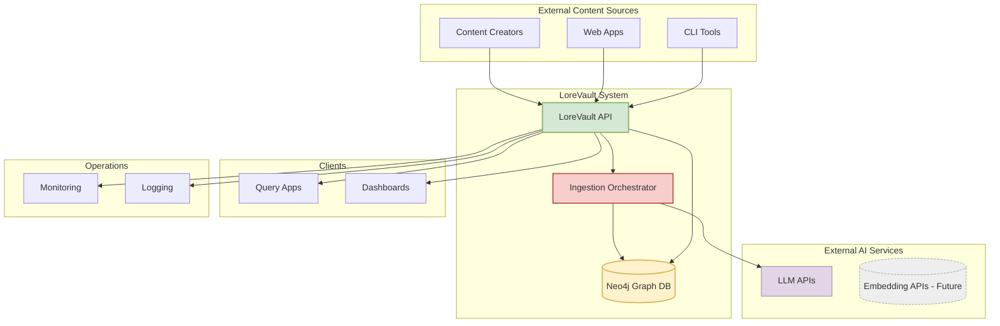

# Context Viewpoint

**Stakeholders:** System administrators, external integrators, business stakeholders  
**Concerns:** System boundaries, external dependencies, user interactions

## Overview

This viewpoint describes the relationships, dependencies, and interactions between the LoreVault system and its environment. It defines the system's boundaries and identifies critical external dependencies that affect system operation.

## System Scope and Responsibilities

LoreVault is an intelligent knowledge ingestion service that automatically builds structured lore graphs from narrative text. The system operates as a service-oriented platform transforming unstructured content into a navigable, query-ready graph (chapters → scenes → chunks; future: entities & relationships).

### Core Responsibilities
1. **Content Ingestion**: Accept and process narrative text through REST API
2. **Scene Detection & Chunking**: Derive semantic scenes and retrieval-friendly chunks (embeddings deferred)
3. **Graph Persistence**: Persist hierarchical content in Neo4j with integrity constraints
4. **Job Lifecycle Tracking**: Asynchronous ingestion workflow with status history
5. **(Future) Knowledge Extraction**: Entity & relationship mining (planned ≥ v0.6.0)
6. **(Future) Semantic Search**: Vector-based retrieval (planned v0.5.0)

### System Boundaries

**Within LoreVault System:**
- REST API (Spring Boot)
- Ingestion orchestration & background processors
- AI-assisted scene detection (LLM calls)
- Neo4j graph persistence adapter (port-driven)
- Status audit trail (StatusRecord nodes)

**Outside LoreVault System:**
- External LLM provider(s) for scene detection
- (Future) Embedding/vector providers
- Client applications / integrators
- Monitoring / logging infrastructure

## External Dependencies

### Current External Services (v0.4.0)

#### Large Language Model Providers
- **Purpose**: Scene boundary & summary detection
- **Risk**: Latency / availability affects ingestion throughput, not API uptime
- **Mitigation**: Retry with backoff; failure triggers cleanup for safe retry

### Deferred (Not active in v0.4.0)
#### Embedding / Vector Providers
- Semantic search disabled (endpoint returns 501)
- Will introduce vector storage and similarity queries in v0.5.0

## External Actors

**Primary Users**
- Content Creators (submit chapters)
- API Integrators (pipeline orchestration)

**Secondary Users**
- System Operators (deployment / monitoring)
- Future Knowledge Consumers (semantic + entity queries) – partial functionality now (no semantic search yet)

## System Context Diagram

## Integration Patterns

### Ingestion Flow (Graph-Oriented)
1. Submit chapter → returns jobId immediately
2. Job QUEUED → scene detection (LLM) → scene nodes persisted
3. Chunking over scenes → chunk nodes persisted
4. Status records appended (audit trail) until COMPLETE / FAILED
5. On failure: scenes & chunks cleaned for idempotent retry

### (Deferred) Semantic Search Flow
- Placeholder endpoint returns 501 until embeddings introduced.

## Environmental Constraints

### Development
- Single Neo4j container (no Postgres)
- Testcontainers Neo4j for integration tests (isolated graph state)
- No vector store yet (design reserved for v0.5.0)

### Production (Target)
- Neo4j causal cluster (future scaling) – current phase uses single instance
- Asynchronous ingestion threads isolated from request threads
- Planned introduction of vector index (Neo4j or external) post v0.4.0

### Security
- API authentication (future hardening roadmap) – basic controls current
- Encrypted outbound LLM traffic
- Content hash uniqueness prevents duplicate ingestion

## Updated Assumptions (v0.4.0)
1. Semantic search postponed; no embeddings stored yet
2. Chapter → Scene → Chunk hierarchy is authoritative graph structure
3. Status history retained indefinitely (volume modest at v0.4.0 scale)
4. Retry strategy must leave graph in clean state (hard requirement)

## Removed / Changed (from earlier RDBMS design)
- Postgres, JPA, Flyway eliminated; replaced by Spring Data Neo4j
- No relational schema migrations; constraints applied programmatically
- Entity classes are lightweight POJOs decoupled from persistence
- Job & status queries now port-driven with potential future Cypher optimization

## Risks & Mitigations (Current Phase)
| Risk | Impact | Mitigation |
|------|--------|------------|
| Naive in-memory filtering in adapter | Performance degradation at scale | Replace with targeted Cypher (planned) |
| LLM latency/failure | Slower ingestion / retries | Backoff + cleanup for deterministic retriable state |
| Missing ordering metadata on relationships | Complex ordering queries later | Future relationship properties (HAS_SCENE.index) |
| Constraint drift | Duplicate chapters | Startup constraint initializer |

## Roadmap Alignment
- v0.4.0: Graph migration foundation (DONE/NEAR DONE)
- v0.5.0: Embeddings + semantic search (vector layer, similarity ranking)
- v0.6.0: Entity extraction & relationship expansion

---
This context reflects the post-migration Neo4j architecture (v0.4.0) and intentionally excludes deferred vector/semantic components.

