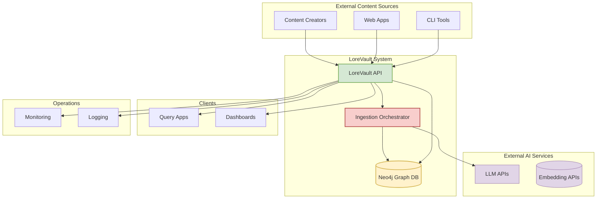

# Context Viewpoint

**Stakeholders:** System administrators, external integrators, business stakeholders  
**Concerns:** System boundaries, external dependencies, user interactions

## Overview

This viewpoint describes the relationships, dependencies, and interactions between the LoreVault system and its environment. It defines the system's boundaries and identifies critical external dependencies that affect system operation.

## System Scope and Responsibilities

LoreVault is an intelligent knowledge ingestion service that automatically builds structured lore graphs from narrative text. The system operates as a service-oriented platform transforming unstructured content into a navigable, query-ready graph (chapters → scenes → chunks; future: entities & relationships).

### Core Responsibilities

1. **Content Ingestion**: Accept and process narrative text through CQRS-aligned REST API
2. **Scene Detection & Chunking**: Derive semantic scenes and retrieval-friendly chunks with vector embeddings
3. **Graph Persistence**: Persist hierarchical content in Neo4j with native vector indexing
4. **Job Lifecycle Tracking**: Asynchronous ingestion workflow with comprehensive status history
5. **Semantic Search**: Vector-based natural language queries over chunk content
6. **RAG Question Answering**: Intelligent answers with source attribution and citations

### System Boundaries

**Within LoreVault System:**
- CQRS-aligned REST API (Spring Boot) with command/query separation
- Consolidated service architecture (Ingestion, Query, System services)
- AI-assisted scene detection and content processing
- Neo4j graph persistence with native vector indexing
- Comprehensive status tracking and audit trail

**Outside LoreVault System:**
- External LLM providers for scene detection and RAG processing
- Embedding providers for vector generation
- Client applications / integrators
- Monitoring / logging infrastructure

## External Dependencies

### Current External Services

#### Large Language Model Providers
- **Purpose**: Scene boundary detection, RAG question answering, content processing
- **Risk**: Latency / availability affects ingestion throughput and query response times
- **Mitigation**: Retry with backoff; failure triggers cleanup for safe retry; graceful degradation

#### Embedding Providers
- **Purpose**: Vector embedding generation for semantic search
- **Risk**: Service availability affects search functionality
- **Mitigation**: Cached embeddings, fallback providers, error handling

### Active Services (Fully Operational)

## External Actors

**Primary Users**
- Content Creators (submit chapters)
- API Integrators (pipeline orchestration)

**Secondary Users**
- System Operators (deployment / monitoring)
- Knowledge Consumers (semantic search and Q&A)

## System Context Diagram

## Integration Patterns

### Ingestion Flow (Graph-Oriented)
1. Submit chapter → returns jobId immediately
2. Job QUEUED → scene detection (LLM) → scene nodes persisted
3. Chunking over scenes → chunk nodes persisted
4. Status records appended (audit trail) until COMPLETE / FAILED
5. On failure: scenes & chunks cleaned for idempotent retry

### Semantic Search Flow

1. Client submits POST /api/query/ask/vector with natural language query
2. System generates query embedding and performs vector similarity search on chunk embeddings
3. Ranked results returned with scores and snippets

## Environmental Constraints

### Development

- Single Neo4j container (no Postgres)
- Testcontainers Neo4j for integration tests (isolated graph state)

### Production (Target)

- Neo4j causal cluster (future scaling) – current phase uses single instance
- Asynchronous ingestion threads isolated from request threads
- Native vector indexing enabled in Neo4j for semantic search

### Security

- API authentication: basic controls currently; hardening planned
- Encrypted outbound LLM traffic
- Content hash uniqueness prevents duplicate ingestion

## Current Assumptions

1. Native vector indexing operational in Neo4j with embedding storage
2. Chapter → Scene → Chunk hierarchy with native vector search capabilities
3. Status history retained indefinitely (volume modest at current scale)
4. Retry strategy maintains graph consistency (hard requirement)
5. CQRS command/query separation provides clear API boundaries

## Service Architecture

- **Consolidated Design**: Streamlined service areas (Ingestion, Query, System) with clear business capability boundaries
- **CQRS Structure**: API separation with `/api/command/` and `/api/query/` endpoints
- **Ports & Adapters**: External dependencies abstracted behind ports for testability and flexibility

## Risk Management

| Risk | Impact | Mitigation |
|------|--------|------------|
| LLM service outages | Processing delays | Retry logic with exponential backoff |
| Vector search performance | Query latency | Neo4j native indexing with optimized queries |
| Graph database failures | System unavailability | Transactional consistency with rollback capability |
| Content processing errors | Job failures | Comprehensive error handling with detailed status tracking |

