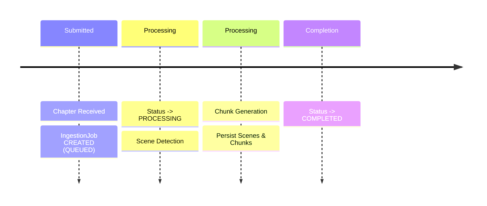
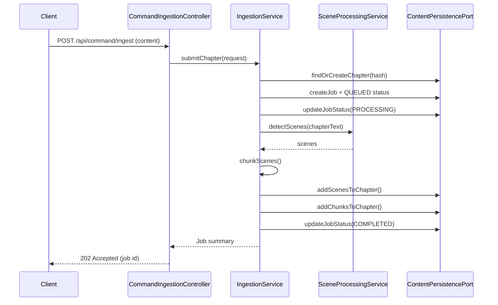

# Functional Viewpoint

**Stakeholders:** Developers, architects, testers  
**Concerns:** System functionality, component responsibilities, interfaces

## Overview

The functional architecture provides chapter ingestion with hierarchical decomposition, semantic search, and intelligent question answering capabilities. A synchronous REST submission triggers creation of an ingestion job; background processing performs scene detection, chunking, and embedding generation, persisting results as graph nodes. Semantic search endpoints enable natural language queries over chunk content using vector similarity, while RAG endpoints provide intelligent answers with source attribution.

## Implemented Components

### API Layer (CQRS-Aligned)

**Command Endpoints** (`/api/command/`)

- `POST /api/command/ingest` : submit content files for processing (replaces legacy chapter endpoints)
- `POST /api/command/library/create-universe` : create universe hierarchy node
- `POST /api/command/library/create-series` : create series within universe
- `POST /api/command/library/create-book` : create book within series

**Query Endpoints** (`/api/query/`)

- `GET /api/query/jobs` : list ingestion jobs with filtering
- `GET /api/query/jobs/{id}` : get specific job status and details
- `POST /api/query/ask/vector` : semantic search over chunk content using natural language queries
- `POST /api/query/ask/rag` : RAG-based question answering with source attribution
- `GET /api/query/health` : system health diagnostics and status

### Service Architecture (Post-Consolidation)

**Ingestion Services**

- `IngestionService`: Orchestrates chapter submission workflow, consolidated validation and duplicate detection, creates IngestionJob records, coordinates processing pipeline
- `IngestionJobService`: Manages job lifecycle (QUEUED → PROCESSING → COMPLETED/FAILED), status updates, job querying
- `SceneProcessingService`: Scene detection and processing logic using external LLM APIs
- `TextChunkingService`: Chunk generation from scenes (windowing/length rules)
- `EmbeddingService`: Vector embedding generation for chunk content

**Query Services**

- `SemanticSearchService`: Orchestrates semantic search using vector similarity, manages query embedding generation
- `RagService`: RAG-based question answering with source attribution and citation logic

**System Services**

- `LibraryService`: Universe/series/book hierarchy management
- `SystemHealthService`: Health diagnostics and system status monitoring
- `ModelRegistryService`: LLM model configuration and registry management

## Processing Flow

## Sequence Diagram (Ingestion Workflow)

## Quality Attributes

- **Simplicity**: Consolidated service architecture with clear boundaries
- **Integrity**: Idempotent chapter submission via content hash
- **Observability**: Job status records for monitoring progress
- **Testability**: Comprehensive unit and integration test coverage
- **Performance**: Neo4j native vector indexing for efficient search

## Architecture Decisions

- **Consolidated Services**: Streamlined from 7+ services to 3 main areas (Ingestion, Query, System) for reduced complexity
- **CQRS Pattern**: Clear command/query separation provides scalable API patterns
- **Ports & Adapters**: External dependencies abstracted behind ports for testability
- **Graph-First Persistence**: Neo4j native storage with embedded vector indexing for unified data access
- **Asynchronous Processing**: Job-based ingestion workflow enables reliable background processing
