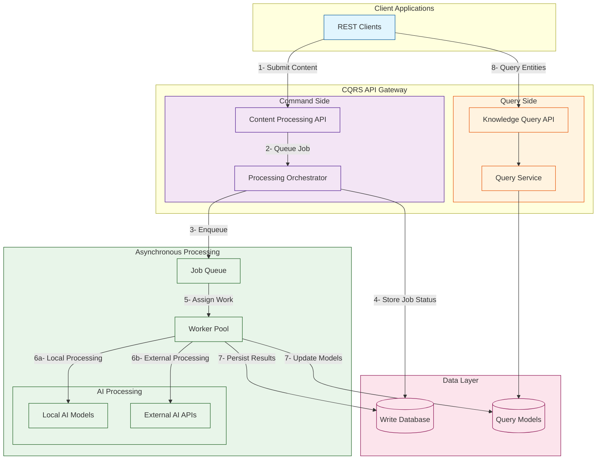
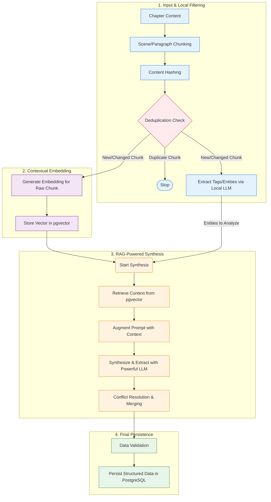
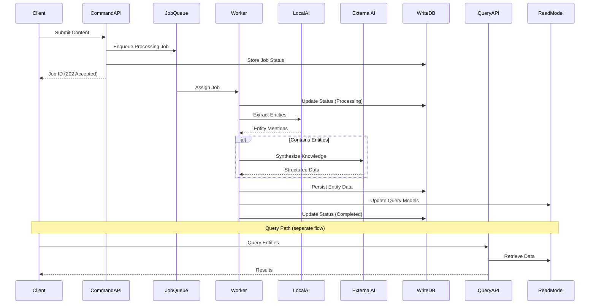

# Functional Viewpoint

**Stakeholders:** Developers, architects, testers  
**Concerns:** System functionality, component responsibilities, interfaces

## Overview

This viewpoint describes the system's functional architecture, including component responsibilities, architectural patterns, and key interactions. The design emphasizes clear separation of concerns and efficient resource utilization through hybrid local and external AI processing.

## Architectural Patterns

### Command Query Responsibility Segregation (CQRS)

LoreVault employs CQRS to separate complex write operations from simple read operations:

**Command Path (Write Operations)**:
- Purpose: Handle content ingestion and processing
- Characteristics: Complex, resource-intensive, long-running
- Optimization: Asynchronous processing with background workflows
- Components: Orchestration services, AI processing pipeline

**Query Path (Read Operations)**:
- Purpose: Serve processed knowledge to consumers
- Characteristics: Simple, fast, low-latency
- Optimization: Direct database access with caching
- Components: Query services, data repositories

### Hybrid AI Processing Pattern

The system implements a cost-effective hybrid approach to AI processing:

**Local Processing Tier**:
- Purpose: Fast, cost-effective pre-processing and filtering
- Technology: Local lightweight AI models
- Benefits: Eliminates unnecessary external API calls, reduces costs

**External Processing Tier**:
- Purpose: Complex reasoning and synthesis tasks
- Technology: External LLM services
- Benefits: High-quality results for complex analysis

## Component Architecture

### API Layer Components

#### REST API Gateway
- **Responsibility**: External interface and request orchestration
- **Key Functions**:
  - Request validation and routing
  - Authentication and authorization
  - Error handling and response formatting
  - Rate limiting and throttling
- **Interfaces**: HTTP REST endpoints for commands and queries
- **Non-functional**: Stateless design enables horizontal scaling

### Command Path Components

#### Orchestration Service
- **Responsibility**: Workflow coordination for content processing
- **Key Functions**:
  - Manage end-to-end processing pipeline
  - Coordinate between local and external AI services
  - Handle error recovery and retry logic
  - Track processing progress and status
- **Interfaces**: Internal service APIs for workflow management
- **Non-functional**: Asynchronous processing with job queuing

#### Local Extraction & Filtering Service
- **Responsibility**: Content pre-processing and entity identification
- **Key Functions**:
  - Text cleaning and chunking
  - Content change detection and deduplication
  - Local AI-based entity extraction
  - Entity clustering and initial analysis
- **Interfaces**: Internal APIs for text processing
- **Non-functional**: High-throughput processing with local AI models

#### AI Client Orchestrator
- **Responsibility**: Manage interactions with external AI services
- **Key Functions**:
  - Route requests to appropriate AI services
  - Implement rate limiting and cost management
  - Handle service failures and fallbacks
  - Batch processing for efficiency
- **Interfaces**: External AI service APIs
- **Non-functional**: Resilient design with circuit breakers

### Query Path Components

#### Query Service
- **Responsibility**: Fast access to processed knowledge
- **Key Functions**:
  - Entity retrieval by type and identifier
  - Semantic search using vector embeddings
  - Relationship navigation and aggregation
  - Response caching and optimization
- **Interfaces**: Internal APIs for data access
- **Non-functional**: Read-only operations optimized for performance

### Data Management Components

#### Persistence Service
- **Responsibility**: Data storage and retrieval abstraction
- **Key Functions**:
  - Entity lifecycle management
  - Vector storage and similarity search
  - Transaction coordination
  - Data consistency enforcement
- **Interfaces**: Repository pattern for data access
- **Non-functional**: ACID compliance with optimized indexing

## Component Interaction Patterns

### CQRS Architecture with Event-Driven Processing

### AI Processing Pipeline Detail

### Event-Driven Processing Flow

## Key Architectural Decisions

### Decision: CQRS Pattern Adoption
**Rationale**: 
- Write operations (content processing) are fundamentally different from read operations (entity queries)
- Allows independent optimization of processing and query performance
- Enables horizontal scaling of read and write paths separately

**Trade-offs**:
- ✅ Performance: Optimized paths for different operations
- ✅ Scalability: Independent scaling of read/write components
- ❌ Complexity: Additional coordination between command and query sides

### Decision: Hybrid AI Architecture
**Rationale**:
- Local processing reduces external API costs for high-volume operations
- External AI provides quality for complex reasoning tasks
- Filtering approach ensures external AI is used only when necessary

**Trade-offs**:
- ✅ Cost: Significant reduction in external AI service costs
- ✅ Performance: Local processing eliminates network latency
- ❌ Complexity: Managing both local and external AI components

### Decision: Asynchronous Processing Model
**Rationale**:
- Content processing involves multiple AI calls and can be time-consuming
- Immediate response improves user experience
- Background processing allows for retry and error handling

**Trade-offs**:
- ✅ Responsiveness: Non-blocking API responses
- ✅ Reliability: Better error handling and retry capabilities
- ❌ Complexity: Job tracking and status management required

## Interface Design Principles

### API Design
- **RESTful**: Standard HTTP methods and status codes
- **Resource-Oriented**: Clear resource hierarchy and relationships
- **Versioned**: API versioning for backward compatibility
- **Documented**: Comprehensive API documentation and examples

### Internal Interfaces
- **Loosely Coupled**: Components interact through well-defined interfaces
- **Event-Driven**: Asynchronous communication where appropriate
- **Fault Tolerant**: Graceful handling of component failures
- **Observable**: Comprehensive logging and monitoring capabilities

## Quality Attributes

### Performance
- **Throughput**: Designed for 100-1000 chapters per day processing
- **Latency**: Sub-second response times for query operations
- **Scalability**: Horizontal scaling capabilities for all components

### Reliability
- **Availability**: High availability for query services (99.9%+)
- **Fault Tolerance**: Graceful degradation on external service failures
- **Data Integrity**: ACID compliance for all data operations

### Maintainability
- **Modularity**: Clear component boundaries and responsibilities
- **Testability**: Comprehensive unit and integration testing capabilities
- **Observability**: Rich monitoring and logging for operational insight

### Security
- **Authentication**: Secure API access with proper authentication
- **Authorization**: Role-based access control for different operations
- **Data Protection**: Secure handling of potentially sensitive content
