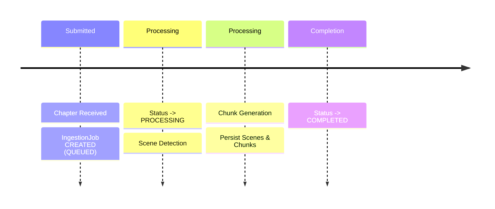
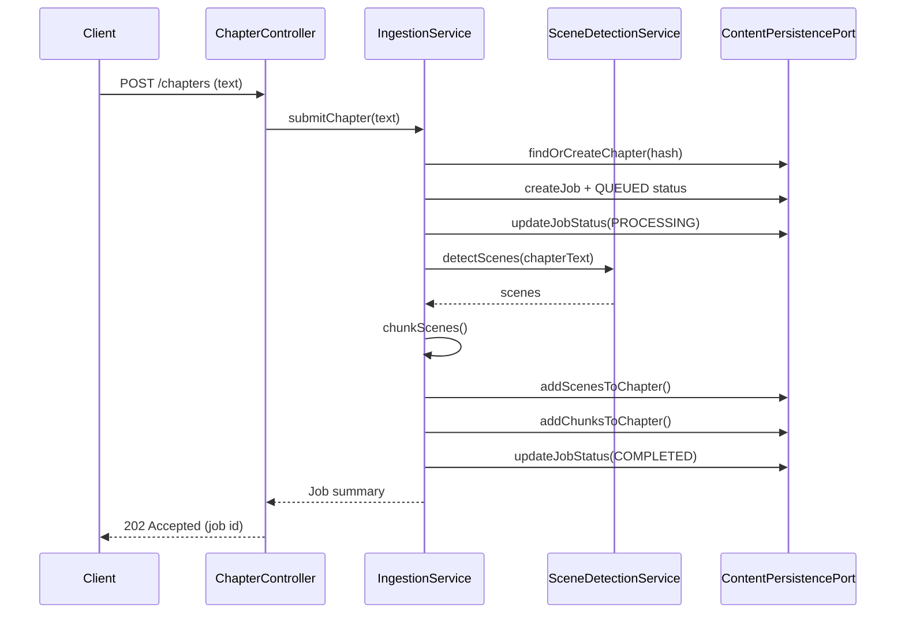

# Functional Viewpoint (v0.8.0 Current State)

**Stakeholders:** Developers, architects, testers  
**Concerns:** Implemented system functionality, component responsibilities, interfaces, deferred roadmap items

## Scope Clarification
Current release (v0.8.0) delivers: chapter ingestion, scene detection, text chunking, embedding generation, semantic search, RAG-based question answering, ingestion job + status tracking, and graph persistence in Neo4j.  
Deferred to v0.8.1: Neo4j native vector indexing (currently in-memory), materialized publication coordinates.  
Deferred to v0.9.0+: timeline modeling, knowledge entity extraction, hybrid AI orchestration, CQRS read model specialization.

## Overview
The functional architecture provides chapter ingestion with hierarchical decomposition, semantic search, and intelligent question answering capabilities. A synchronous REST submission triggers creation of an ingestion job; background processing performs scene detection, chunking, and embedding generation, persisting results as graph nodes. Semantic search endpoints enable natural language queries over chunk content using vector similarity, while RAG endpoints provide intelligent answers with source attribution.

## Implemented Components

### API Layer
- REST Controllers
  - POST /api/v1/chapters : submit chapter content (idempotent via contentHash)
  - GET  /api/v1/chapters/{id} : fetch stored chapter (basic)
  - GET  /api/v1/ingestion/jobs/{id}/status : job + recent status records
  - POST /api/search/semantic : semantic search over chunk content using natural language queries
  - GET  /api/search/semantic/status : availability status for semantic search functionality

### IngestionService
- Orchestrates chapter submission workflow
- Creates or reuses Chapter (dedupe via contentHash uniqueness constraint)
- Creates IngestionJob + initial StatusRecord (QUEUED → PROCESSING → COMPLETED / FAILED)
- Invokes SceneDetectionService then chunking logic; persists Scene and Chunk nodes via persistence port
- Handles failure path with FAILED status creation

### SceneDetectionService
- Wraps current LLM / heuristic scene boundary detection (single external call tier only)
- Returns ordered list of scene spans used for persistence

### Chunking Logic
- Derives smaller Chunks from Scenes (windowing / length rules)
- Stored as Chunk nodes linked to their Scene for downstream vectorization (future)

### Persistence Adapter (Neo4jContentPersistenceAdapter)
- Implements ContentPersistencePort
- Persists Chapters, Scenes, Chunks, IngestionJobs, StatusRecords
- Applies uniqueness constraint for Chapter.contentHash (via startup initializer)

### GraphModelMapper (Transitional)
- Simple POJO → Node conversion helper (slated for removal when inline creation adopted)

### Status Tracking
- StatusRecord nodes append-only; adapter returns recent records for job progress display

## Minimal Processing Flow (Implemented)

## Sequence Diagram (Current Ingestion)

## Quality Attributes (Current Focus)
- Simplicity: Minimized scope to accelerate datastore migration
- Integrity: Idempotent chapter submission via content hash
- Observability: Basic status records (no distributed tracing yet)
- Testability: Unit tests + Neo4j Testcontainer integration tests

## Deferred Components (v0.8.1+ Roadmap)
- Neo4j native vector indexing (v0.8.1 - currently in-memory cosine similarity)
- Materialized publication coordinates on Chunk nodes (v0.8.1)

## Deferred Components (v0.9.0+ Roadmap)
(Original design elements retained here for continuity; not yet implemented)
- CQRS specialization (separate optimized query services)
- Hybrid Local + External AI orchestration layer
- Knowledge entity extraction & graph enrichment pipeline
- Timeline modeling with Scene-as-Event entities
- Event / job queue abstraction (currently inline method calls)

### Deferred Diagram References (Removed for Clarity)
Previous diagrams showing: full CQRS gateway, job queue/worker pool, multi-tier AI pipeline, vector-enhanced RAG flow. These will be reinstated once corresponding capabilities are implemented.

## Rationale for Current Scope
- Semantic search provides foundation for future RAG-based question answering
- Linear in-memory scoring establishes ports & adapters pattern for future optimization
- Embeddings infrastructure enables knowledge entity extraction in next milestone
- Early delivery enables iterative optimization before adding complex reasoning layers

## Risks & Mitigations (Current Scope)
- Adapter inefficiency (in-memory filtering) → Plan: replace with targeted Cypher (next iteration)
- Over-reliance on transitional mapper → Plan: remove after inline node construction refactor
- Limited status insight (no progress percentages) → Future: fine-grained stage events

## Planned Near-Term Improvements

1. Replace in-memory vector search with Neo4j native vector indexing (v0.8.1)
2. Materialize publication coordinates on Chunk nodes for efficient spoiler filtering (v0.8.1)
3. Remove unused legacy repository stubs & deprecated ChunkService (v0.8.1)  
4. Inline node creation (drop GraphModelMapper) (v0.8.1)
5. Add timeline modeling with Scene-as-Event entities (v0.9.0)

---
(Updated for v0.8.0 to reflect RAG question answering implementation; future sections clearly marked as deferred.)
