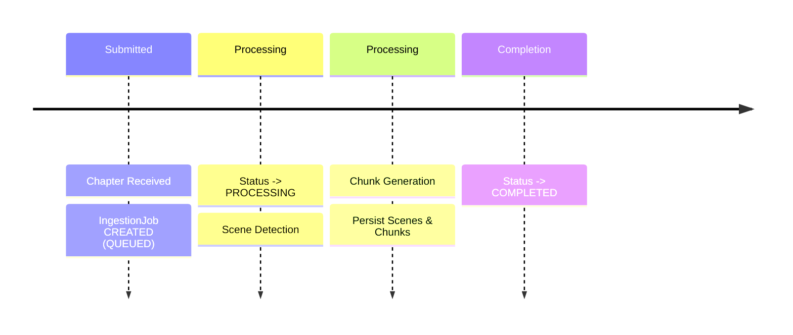
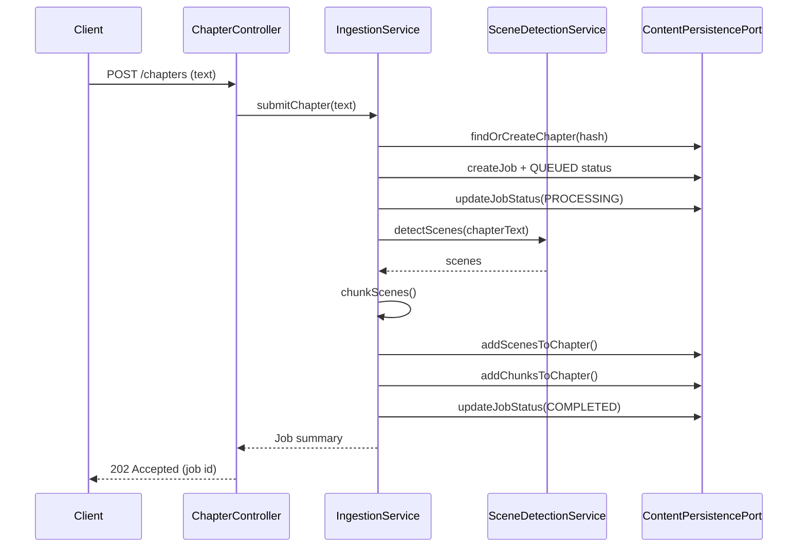

# Functional Viewpoint (v0.4.0 Current State)

**Stakeholders:** Developers, architects, testers  
**Concerns:** Implemented system functionality, component responsibilities, interfaces, deferred roadmap items

## Scope Clarification
Current release (v0.4.0) delivers: chapter ingestion, scene detection, text chunking, ingestion job + status tracking, and graph persistence in Neo4j.  
Deferred to v0.5.0+: embeddings, semantic/vector search, knowledge entity extraction, hybrid AI (local + external) orchestration, CQRS read model specialization.

## Overview
The current functional architecture is intentionally minimal: a synchronous REST submission triggers creation of an ingestion job; background processing (within the same service for now) performs scene detection and chunking, persisting results as graph nodes. Query endpoints are limited to retrieving submission/job status and basic stored structural content. A Not Implemented (501) response placeholder exists for semantic search.

## Implemented Components

### API Layer
- REST Controllers
  - POST /api/v1/chapters : submit chapter content (idempotent via contentHash)
  - GET  /api/v1/chapters/{id} : fetch stored chapter (basic)
  - GET  /api/v1/ingestion/jobs/{id}/status : job + recent status records
  - GET  /api/v1/search/semantic : returns 501 (deferred)

### IngestionService
- Orchestrates chapter submission workflow
- Creates or reuses Chapter (dedupe via contentHash uniqueness constraint)
- Creates IngestionJob + initial StatusRecord (QUEUED → PROCESSING → COMPLETED / FAILED)
- Invokes SceneDetectionService then chunking logic; persists Scene and Chunk nodes via persistence port
- Handles failure path with FAILED status creation

### SceneDetectionService
- Wraps current LLM / heuristic scene boundary detection (single external call tier only)
- Returns ordered list of scene spans used for persistence

### Chunking Logic
- Derives smaller Chunks from Scenes (windowing / length rules)
- Stored as Chunk nodes linked to their Scene for downstream vectorization (future)

### Persistence Adapter (Neo4jContentPersistenceAdapter)
- Implements ContentPersistencePort
- Persists Chapters, Scenes, Chunks, IngestionJobs, StatusRecords
- Applies uniqueness constraint for Chapter.contentHash (via startup initializer)

### GraphModelMapper (Transitional)
- Simple POJO → Node conversion helper (slated for removal when inline creation adopted)

### Status Tracking
- StatusRecord nodes append-only; adapter returns recent records for job progress display

## Minimal Processing Flow (Implemented)

## Sequence Diagram (Current Ingestion)

## Quality Attributes (Current Focus)
- Simplicity: Minimized scope to accelerate datastore migration
- Integrity: Idempotent chapter submission via content hash
- Observability: Basic status records (no distributed tracing yet)
- Testability: Unit tests + Neo4j Testcontainer integration tests

## Deferred Components (v0.5.0+ Roadmap)
(Original design elements retained here for continuity; not yet implemented)
- CQRS specialization (separate optimized query services)
- Hybrid Local + External AI orchestration layer
- Embedding generation & vector-backed semantic search
- Knowledge entity extraction & graph enrichment pipeline
- Event / job queue abstraction (currently inline method calls)

### Deferred Diagram References (Removed for Clarity)
Previous diagrams showing: full CQRS gateway, job queue/worker pool, multi-tier AI pipeline, vector-enhanced RAG flow. These will be reinstated once corresponding capabilities are implemented.

## Rationale for Deferral
- Priority was reliable migration from RDBMS to Neo4j with no functional regression
- Embeddings & semantic search introduce additional storage/index complexity best added atop stable graph persistence
- Early delivery enables iterative optimization of current adapter queries before layering advanced retrieval

## Risks & Mitigations (Current Scope)
- Adapter inefficiency (in-memory filtering) → Plan: replace with targeted Cypher (next iteration)
- Over-reliance on transitional mapper → Plan: remove after inline node construction refactor
- Limited status insight (no progress percentages) → Future: fine-grained stage events

## Planned Near-Term Improvements
1. Replace adapter in-memory filtering with Cypher queries
2. Remove unused legacy repository stubs & deprecated ChunkService
3. Inline node creation (drop GraphModelMapper)
4. Expand status model (timestamps on scenes/chunks) [optional]

---
(Updated for v0.4.0 to reflect implemented subset; future sections clearly marked as deferred.)
