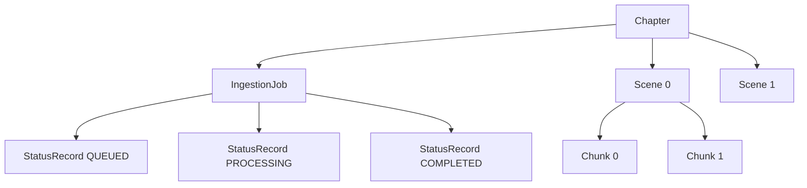

# Information Viewpoint

**Stakeholders:** Developers, database administrators, data architects  
**Concerns:** Data organization, storage requirements, data flow, semantic indexing

## Graph Data Model

The system uses Neo4j as the primary data store with a hierarchical content model and native vector indexing for semantic search capabilities.

### Node Types

- Chapter(id, contentHash, text, createdAt)
- Scene(id, index, startOffset, endOffset, text)
- Chunk(id, index, text, startOffset, endOffset)
- IngestionJob(id, chapterId, createdAt, status)
- StatusRecord(id, jobId, status, createdAt, message)

### Relationships

- (Chapter)-[:HAS_SCENE]->(Scene)
- (Scene)-[:HAS_CHUNK]->(Chunk)
- (Chapter)-[:HAS_JOB]->(IngestionJob)
- (IngestionJob)-[:HAS_STATUS]->(StatusRecord)

### Design Rationale

- Focus on structural provenance (where chunks originate) to enable semantic enrichment
- Status tracking via append-only StatusRecord nodes for audit trail
- Chunk-level embeddings stored as Neo4j vector properties for efficient similarity search
- Uniqueness constraint on Chapter.contentHash prevents duplicate ingestion

## Information Flow

## Persistence Strategy

- **Spring Data Neo4j**: Repository pattern for each node type with transactional consistency
- **Vector Indexing**: Native Neo4j vector properties on Chunk nodes for semantic search
- **Transactional Writes**: Multi-entity operations within single transaction boundaries
- **Idempotent Operations**: Content hash-based deduplication prevents duplicate processing

## Data Integrity

- **Uniqueness**: Chapter.contentHash constraint prevents duplicate ingestion
- **Audit Trail**: Append-only StatusRecord chain provides complete job history
- **Ordering**: Explicit index properties maintain structural sequence
- **Consistency**: Transactional boundaries ensure atomic operations

## Query Patterns

- **Hierarchical Traversal**: Chapter → Scene → Chunk relationship navigation
- **Status Monitoring**: Job → StatusRecord chains for progress tracking
- **Vector Search**: Native Neo4j vector similarity queries on chunk embeddings
- **Content Retrieval**: Direct node lookups by ID with relationship expansion
