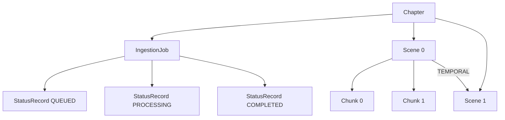

# Information Viewpoint

**Stakeholders:** Developers, architects  
**Concerns:** Implemented data structures, graph persistence model, deferred extensions

## Scope

Conceptual data view of the knowledge base used by LoreVault. Focused on core entities and relationships only.

## Current Graph Data Model

### Node Types (Implemented)

- Chapter(id, contentHash, text, createdAt)
- Scene(id, index, startOffset, endOffset, text)
- Chunk(id, index, text, startOffset, endOffset)
- IngestionJob(id, chapterId, createdAt, status)
- StatusRecord(id, jobId, status, createdAt, message)

### Relationships (Implemented)

- (Chapter)-[:HAS_SCENE]->(Scene)
- (Scene)-[:HAS_CHUNK]->(Chunk)
- (Chapter)-[:HAS_JOB]->(IngestionJob)
- (IngestionJob)-[:HAS_STATUS]->(StatusRecord)

Temporal precedence between Scenes (within and across chapters):

- (Scene)-[:TEMPORAL]->(Scene)

### Rationale

- Focus on structural provenance (where chunks originate) to enable later semantic enrichment
- Linear ordering preserved via index property on Scene / Chunk (relationship ordering properties deferred)

## Minimal Information Flow

## Persistence Strategy

High-level graph persistence in Neo4j. Implementation details live in development docs.

## Data Integrity

- Chapter uniqueness by contentHash prevents duplicate ingestion
- Append-only StatusRecord chain per job provides audit trail
- Ordering retained through explicit index attributes
