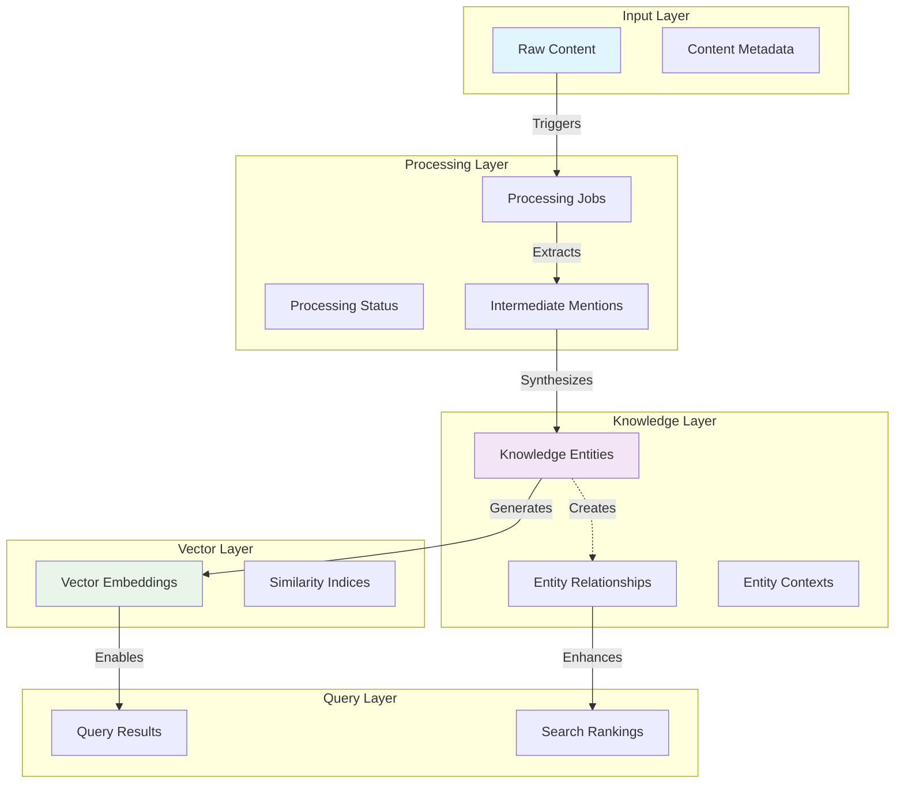
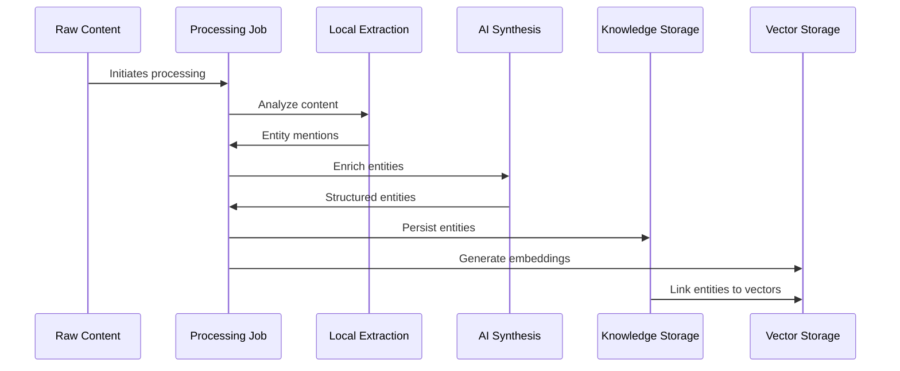
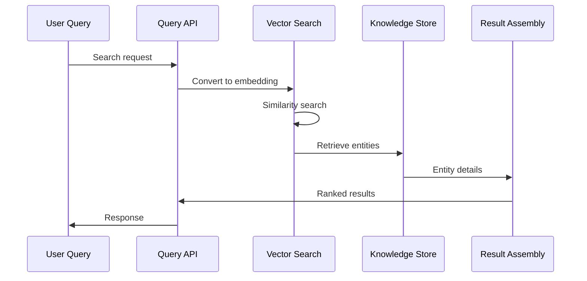

# Information Viewpoint

**Stakeholders:** Data architects, developers, database administrators  
**Concerns:** Data structures, information flow, persistence strategy

## Overview

This viewpoint describes the structure and flow of information within LoreVault, from content ingestion through knowledge extraction to storage and retrieval. The design emphasizes a graph-native approach using Neo4j, enabling natural representation of entity relationships combined with integrated vector search capabilities for GraphRAG-powered knowledge synthesis.

## Information Architecture

### Graph-Native Knowledge Representation

**Core Philosophy:** Narrative knowledge is inherently interconnected. A graph database naturally represents the complex web of relationships between entities without the impedance mismatch of mapping relationships to relational tables and joins.

**Technology Foundation:**
- **Neo4j Graph Database** - Primary knowledge store
- **Neo4j Vector Index** - Integrated vector embeddings for semantic search
- **Spring Data Neo4j** - Object-Graph Mapping framework

### Unified Graph + Vector Model

**Graph Structure:** Entities as nodes, relationships as edges, with properties on both
**Vector Integration:** Embeddings stored as node properties, enabling hybrid graph-semantic queries
**Schema Flexibility:** Dynamic schema evolution as new entity types and relationship patterns emerge

**Key Architectural Benefits:**
- **Relationship-First Modeling:** Direct representation of entity connections
- **Traversal Performance:** Native graph algorithms for relationship queries  
- **Contextual Embeddings:** Vector search enhanced by graph neighborhood context
- **Incremental Growth:** Organic schema evolution as understanding deepens

### Primary Data Domains

#### Content Domain
- **Purpose**: Raw input materials and their processing metadata
- **Lifecycle**: Ingestion → Processing → Archival
- **Key Entities**: Chapters, processing jobs, status tracking
- **Relationships**: One-to-many from content to extracted entities

#### Knowledge Domain  
- **Purpose**: Extracted and structured knowledge representation as graph nodes and relationships
- **Lifecycle**: Creation → Enrichment → Relationships → Query
- **Key Entities**: Characters, locations, organizations, concepts as labeled nodes
- **Relationships**: Rich interconnected graph with typed edges and properties

#### Vector Domain
- **Purpose**: Semantic representations integrated with graph structure
- **Lifecycle**: Generation → Storage as node properties → Search → Retrieval
- **Key Entities**: Embeddings as node properties, vector indices
- **Relationships**: Vector spaces coexist with graph relationships for hybrid queries

### Information Flow Architecture

## Data Model Architecture

### Graph Modeling Principles

**Node-Centric Entity Design:**
- Each entity type represented as labeled nodes
- Multiple labels supported for entity classification hierarchy
- Properties store entity-specific attributes
- Flexible schema allows new properties to emerge organically

**Relationship-Rich Connections:**
- Direct relationship modeling between any entity types
- Typed relationships with descriptive semantics
- Relationship properties for context, strength, timestamps
- Bidirectional relationships where appropriate

**Hierarchical Content Structure:**
- Source content organized in containment hierarchies
- Entity-to-source attribution maintaining provenance
- Version control through relationship timestamps

### Schema Evolution Strategy

**Incremental Discovery:** Schema grows as new entity types and relationships are encountered
**Type Safety:** Constraints ensure data integrity without rigid schema requirements
**Migration-Free Growth:** Add new node types and relationships without breaking existing data

**Architectural Flexibility:**
- New entity types introduced through new node labels
- New relationship types added as discovered in content
- Property schemas expand based on AI extraction capabilities
- No database migrations required for model evolution

### Content and Knowledge Entity Categories

**Content Entities:** Source materials and processing metadata (chapters, processing jobs, status tracking)
**Knowledge Entities:** Extracted narrative elements (characters, locations, organizations, concepts)
**Relationship Entities:** Connections and associations between knowledge entities with contextual metadata

*Specific entity properties, constraints, and relationship schemas will be documented incrementally as features are implemented.*

### Relationship Architecture

**Relationship Categories:**
- **Hierarchical**: Parent-child relationships (organizational structure, location containment)
- **Associative**: Peer relationships (character interactions, concept connections)
- **Temporal**: Time-based relationships (event sequences, character development)
- **Contextual**: Situational relationships (character presence, event participation)

**Relationship Metadata Strategy:**
- Relationship strength, confidence scoring, and temporal context
- Source chapter references for traceability
- Support for relationship evolution over narrative time

*Specific relationship types and properties will be defined as entity extraction capabilities are developed.*

### Integrated Graph-Vector Architecture

**Unified Storage Model:** Neo4j's native vector indexing eliminates the need for separate vector databases, allowing embeddings to coexist with graph structure in a single data model.

**Vector Integration Patterns:**
- **Content Embeddings:** Text chunks embedded for semantic content retrieval
- **Entity Embeddings:** Entity descriptions embedded for similarity matching
- **Relationship Context:** Contextual embeddings that consider graph neighborhood

**GraphRAG Enablement:**
- **Hybrid Queries:** Combine vector similarity with graph traversals in single operations
- **Contextual Retrieval:** Use graph relationships to expand and enrich vector search results
- **Multi-hop Reasoning:** Traverse relationships while maintaining semantic relevance scoring

**Query Pattern Examples:**
- Find semantically similar entities within relationship constraints
- Retrieve related content based on graph distance and semantic similarity
- Generate context-rich prompts using both direct relationships and semantic neighbors

### Vector Integration Strategy

**Unified Storage:** Embeddings coexist with graph structure as node properties within Neo4j
**Hybrid Queries:** Combine semantic similarity with relationship traversals in single operations
**Contextual Search:** Graph neighborhood context enhances vector search relevance and precision

*Vector indexing configurations, similarity metrics, and performance optimizations will be tuned based on usage patterns and performance requirements.*
## Query Architecture

### Graph-Native Query Patterns

**Traversal-Based Queries:** Leverage graph structure for relationship-based information retrieval
**Pattern Matching:** Use Cypher's pattern matching for complex relationship queries
**Aggregation Queries:** Compute metrics across graph neighborhoods
**Path Finding:** Discover connections between entities through relationship chains

### Hybrid Query Capabilities

**Vector-Enhanced Traversals:** Start with semantic search, then traverse relationships for context
**Relationship-Constrained Similarity:** Limit vector searches to specific graph neighborhoods
**Multi-Modal Retrieval:** Combine exact matches, fuzzy matching, and semantic similarity

### RAG-Optimized Query Patterns

**Context Expansion:** Given an entity, retrieve semantically relevant content plus relationship context
**Prompt Enrichment:** Build comprehensive prompts using graph traversals to gather related information
**Conflict Detection:** Query for potentially contradictory information across the knowledge graph

**Performance Characteristics:**
- Graph traversals: Optimized for relationship-heavy queries
- Vector searches: Efficient semantic similarity at scale
- Hybrid operations: Balanced performance across query types

## Information Flow Architecture

### Write Path: Content to Knowledge Graph

**Text Ingestion → Chunking → Embedding → Entity Extraction → Graph Integration**

1. **Source Content:** Raw narrative text enters the system
2. **Structural Analysis:** Content segmented into processable chunks
3. **Vector Generation:** Embeddings created for semantic search
4. **Entity Recognition:** AI identifies entities and relationships
5. **Graph Synthesis:** Entities and relationships integrated into knowledge graph

### Read Path: Knowledge Graph to Insights

**Query → Graph Traversal → Vector Search → Context Assembly → Response**

1. **Query Processing:** Parse and understand information requests
2. **Graph Navigation:** Traverse relationships to gather relevant entities
3. **Semantic Enhancement:** Use vector search to expand context
4. **Synthesis:** Combine structured and semantic information
5. **Response Generation:** Deliver comprehensive, contextualized answers

### Feedback Loops

**Quality Improvement:** Query patterns inform entity extraction optimization
**Schema Evolution:** Discovered relationships guide model expansion  
**Confidence Tracking:** Usage patterns improve reliability scoring

### Content Processing Flow

### Query Resolution Flow

## Data Quality and Consistency

### Entity Resolution Strategy
**Duplicate Detection**:
- **Vector Similarity**: High similarity scores indicate potential duplicates
- **Name Matching**: Fuzzy string matching for alternative names
- **Context Analysis**: Shared contexts and relationships suggest same entity
- **Human Review**: Flagged potential duplicates for validation

**Conflict Resolution**:
- **Source Priority**: Weight entities by content source reliability
- **Confidence Scoring**: Prefer high-confidence AI extractions
- **Temporal Ordering**: Later extractions may supersede earlier ones
- **Manual Override**: Support for curator corrections

### Data Consistency Rules
**Referential Integrity**:
- All entity relationships must reference valid entities
- Vector embeddings must have corresponding knowledge entities
- Processing jobs must link to valid source content

**Semantic Consistency**:
- Entity names within types should be unique after normalization
- Relationships must be logically consistent (no circular hierarchies)
- Confidence scores must be within valid ranges (0.0-1.0)

**Temporal Consistency**:
- Processing timestamps must follow logical sequence
- Entity evolution must maintain version history
- Relationship temporal bounds must be consistent

## Storage Architecture

### Graph-Native Storage Strategy

**Neo4j Database:**
- **Node Storage:** Entities represented as labeled nodes with flexible properties
- **Relationship Storage:** Direct relationship modeling with typed edges and properties
- **Vector Integration:** Embeddings stored as node properties with native vector indexing
- **Schema Evolution:** Dynamic schema growth without migration requirements

**Performance Characteristics:**
- **Traversal Optimization:** Native graph algorithms for relationship queries
- **Vector Search:** Integrated similarity search with graph context
- **Hybrid Operations:** Efficient combination of graph and vector operations
- **Memory Management:** Optimized caching for frequently accessed nodes and relationships

## Data Access Patterns

### Read Patterns
**Entity Retrieval:**
- **By Type:** Traverse nodes with specific labels
- **By ID:** Direct node lookup with properties and relationships
- **By Name:** Property-based matching with fuzzy search
- **By Relationship:** Navigate graph structure using relationship patterns

**Search Patterns:**
- **Semantic Search:** Vector similarity queries on node embeddings
- **Graph Search:** Cypher pattern matching for complex relationship queries
- **Hybrid Search:** Combined vector similarity with relationship constraints
- **Path Search:** Find connections between entities through relationship traversal

### Write Patterns
**Graph Construction:**
- **Node Creation:** Create entities as labeled nodes with properties
- **Relationship Building:** Establish typed relationships between nodes
- **Vector Integration:** Generate and store embeddings as node properties
- **Schema Evolution:** Dynamically add new labels and relationship types

**Incremental Updates:**
- **Property Updates:** Modify node and relationship properties
- **Relationship Refinement:** Adjust relationship types and properties
- **Graph Expansion:** Add new nodes and relationships as entities are discovered
- **Vector Updates:** Refresh embeddings when entity descriptions change

## Information Security and Privacy

### Data Classification
**Content Sensitivity**:
- **Public**: Published content with no restrictions
- **Private**: Personal or unpublished content requiring protection
- **Derived**: AI-generated insights inherit source sensitivity
- **Metadata**: Processing information with operational sensitivity

### Access Control Strategy
**Entity-Level Security**:
- **Ownership**: Content owner controls derived entities
- **Visibility**: Granular control over entity visibility
- **Sharing**: Controlled sharing of knowledge with other users
- **Audit**: Complete audit trail of data access and modifications

### Data Retention Policies
**Content Lifecycle**:
- **Active**: Currently processed and searchable content
- **Archived**: Historical content with limited access
- **Purged**: Permanently removed content and derived entities
- **Compliance**: Data retention aligned with legal requirements

## Performance and Scalability Considerations

### Query Performance Strategy
**Graph Query Optimization:**
- Index strategy for common access patterns
- Native vector indexing for semantic search operations
- Query planning optimization for graph traversals
- Application-level caching for frequently accessed patterns

### Scaling Architecture
**Vertical Scaling Approach:**
- Memory optimization for larger graph working sets
- Storage optimization for improved traversal performance
- Processing optimization for parallel graph operations

**Horizontal Scaling Strategy:**
- Read replica distribution for query load balancing
- Distributed caching for frequently accessed entities
- Load distribution across available graph database instances

*Specific performance metrics, indexing configurations, and scaling implementations will be optimized based on actual usage patterns and performance requirements.*
---

*This viewpoint focuses on the architectural patterns and information modeling capabilities enabled by the graph-native approach. Specific implementation details for entities, relationships, and constraints will be documented incrementally as features are developed.*
