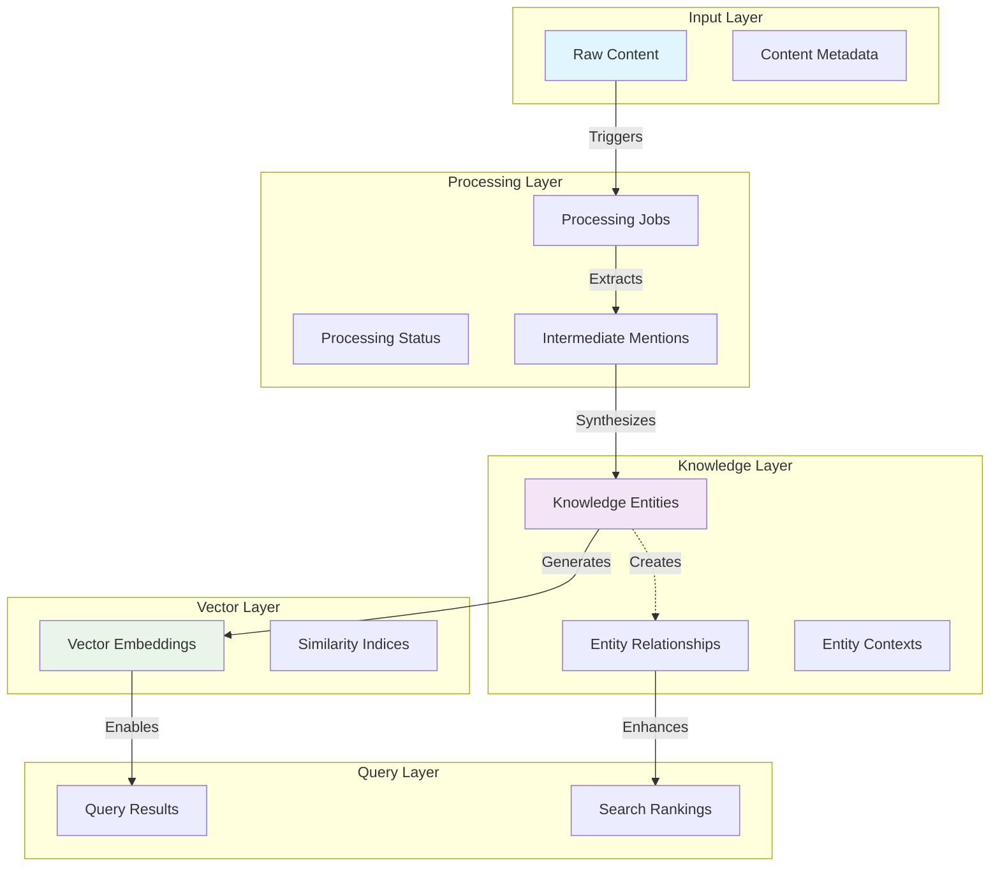
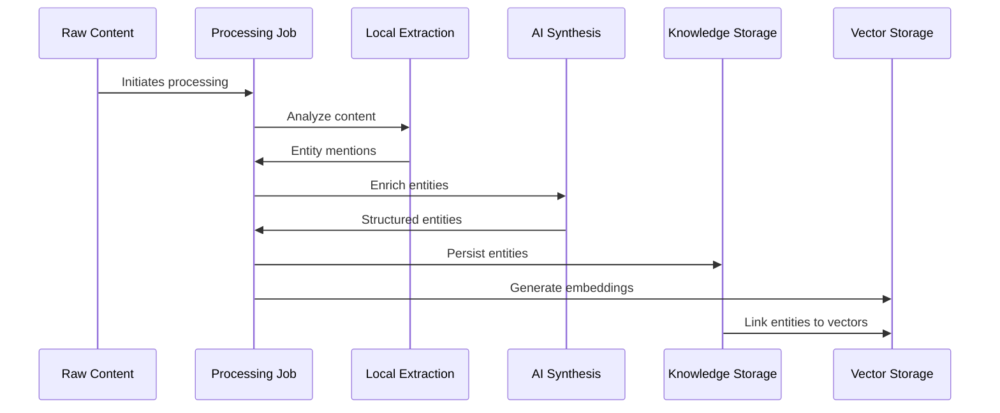
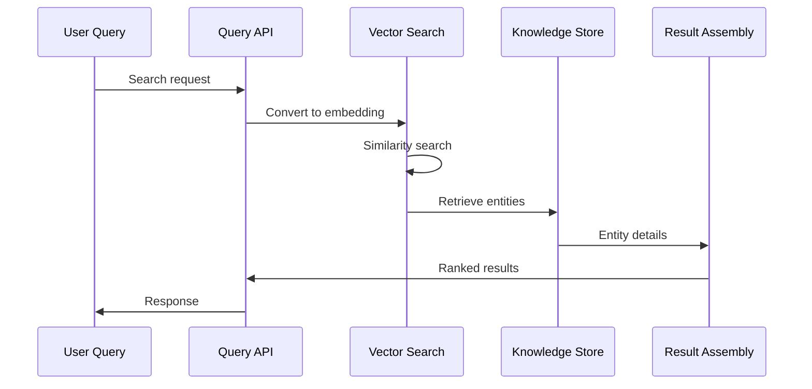

# Information Viewpoint

**Stakeholders:** Data architects, developers, database administrators  
**Concerns:** Data structures, information flow, persistence strategy

## Overview

This viewpoint describes the structure and flow of information within LoreVault, from content ingestion through knowledge extraction to storage and retrieval. The design emphasizes vector-based semantic search capabilities while maintaining efficient relational data structures.

## Information Architecture

### Primary Data Domains

#### Content Domain
- **Purpose**: Raw input materials and their processing metadata
- **Lifecycle**: Ingestion → Processing → Archival
- **Key Entities**: Chapters, processing jobs, status tracking
- **Relationships**: One-to-many from content to extracted entities

#### Knowledge Domain  
- **Purpose**: Extracted and structured knowledge representation
- **Lifecycle**: Creation → Enrichment → Relationships → Query
- **Key Entities**: Characters, locations, organizations, concepts
- **Relationships**: Rich interconnected graph of entity relationships

#### Vector Domain
- **Purpose**: Semantic representations for similarity search
- **Lifecycle**: Generation → Storage → Search → Retrieval
- **Key Entities**: Embeddings, similarity indices, search results
- **Relationships**: Vector spaces linked to knowledge entities

### Information Flow Architecture



## Data Model Architecture

### Core Entity Structure

#### Content Entities
**Chapter Entity**:
- Identity: Unique identifier, title, source information
- Content: Raw text, processed chunks, word count
- Metadata: Creation date, last modified, processing status
- Relationships: Extracted entities, processing jobs

**Processing Job Entity**:
- Identity: Job identifier, type, priority
- State: Status, progress, error information
- Timing: Started, completed, estimated duration
- Relationships: Source content, result entities

#### Knowledge Entities
**Character Entity**:
- Identity: Canonical name, alternative names, unique ID
- Profile: Description, key traits, significance
- Context: Origin sources, first appearance, evolution
- Relationships: Affiliations, relationships, appearances

**Location Entity**:
- Identity: Canonical name, alternative names, unique ID
- Geography: Description, type (city, region, building)
- Context: Cultural significance, historical importance
- Relationships: Sub-locations, characters present, events

**Organization Entity**:
- Identity: Canonical name, alternative names, unique ID
- Structure: Type, hierarchy, purpose
- Context: Formation, dissolution, transformation
- Relationships: Members, allies, rivals, locations

**Concept Entity**:
- Identity: Canonical term, alternative terms, unique ID
- Definition: Core meaning, context, significance
- Context: Usage patterns, evolution, related concepts
- Relationships: Related concepts, character associations

### Relationship Architecture

#### Entity Relationship Types
- **Hierarchical**: Parent-child relationships (organization structure, location containment)
- **Associative**: Peer relationships (character friendships, concept connections)
- **Temporal**: Time-based relationships (event sequences, character development)
- **Contextual**: Situational relationships (character presence in locations)

#### Relationship Metadata
- **Strength**: Quantified relationship importance (weak, moderate, strong)
- **Confidence**: AI extraction confidence level (0.0 to 1.0)
- **Context**: Source chapter references and textual evidence
- **Temporal**: Time periods or story arcs when relationship applies

### Vector Information Model

#### Embedding Strategy
**Entity Embeddings**:
- **Purpose**: Semantic similarity between entities
- **Dimensions**: 768-dimensional vectors for comprehensive representation
- **Scope**: Generated for all entity descriptions and contexts
- **Usage**: Entity clustering, duplicate detection, similarity search

**Content Embeddings**:
- **Purpose**: Semantic search across original content
- **Dimensions**: Chunk-level embeddings for fine-grained search
- **Scope**: Chapter sections, character descriptions, scene descriptions
- **Usage**: Context retrieval, relevant passage identification

#### Vector Search Architecture
**Similarity Metrics**:
- **Cosine Similarity**: Primary metric for semantic relationships
- **Euclidean Distance**: Secondary metric for clustering operations
- **Dot Product**: Optimized for ranking operations

**Index Structure**:
- **HNSW Algorithm**: Hierarchical Navigable Small World for fast approximate search
- **Dynamic Updates**: Incremental index updates as entities are processed
- **Partitioning**: Separate indices by entity type for optimized queries
## Information Flow Patterns

### Content Processing Flow



### Query Resolution Flow



## Data Quality and Consistency

### Entity Resolution Strategy
**Duplicate Detection**:
- **Vector Similarity**: High similarity scores indicate potential duplicates
- **Name Matching**: Fuzzy string matching for alternative names
- **Context Analysis**: Shared contexts and relationships suggest same entity
- **Human Review**: Flagged potential duplicates for validation

**Conflict Resolution**:
- **Source Priority**: Weight entities by content source reliability
- **Confidence Scoring**: Prefer high-confidence AI extractions
- **Temporal Ordering**: Later extractions may supersede earlier ones
- **Manual Override**: Support for curator corrections

### Data Consistency Rules
**Referential Integrity**:
- All entity relationships must reference valid entities
- Vector embeddings must have corresponding knowledge entities
- Processing jobs must link to valid source content

**Semantic Consistency**:
- Entity names within types should be unique after normalization
- Relationships must be logically consistent (no circular hierarchies)
- Confidence scores must be within valid ranges (0.0-1.0)

**Temporal Consistency**:
- Processing timestamps must follow logical sequence
- Entity evolution must maintain version history
- Relationship temporal bounds must be consistent

## Storage Architecture

### Relational Storage Strategy
**Entity Tables**:
- **Normalized Structure**: Separate tables for each entity type
- **Common Attributes**: Shared base structure for all entities
- **Type-Specific Attributes**: Extended attributes per entity type
- **Versioning**: Maintain entity evolution history

**Relationship Tables**:
- **Junction Tables**: Many-to-many relationships between entities
- **Relationship Metadata**: Strength, confidence, context information
- **Temporal Support**: Time-bound relationships with valid periods
- **Source Tracking**: Link relationships to originating content

### Vector Storage Strategy
**Integration Approach**:
- **PostgreSQL + pgvector**: Unified storage for relational and vector data
- **Co-location**: Vectors stored alongside entity data for efficiency
- **Indexing**: Optimized indices for both exact and approximate search
- **Scalability**: Partitioning strategy for large vector datasets

**Performance Optimization**:
- **Batch Operations**: Efficient bulk vector operations
- **Index Tuning**: Optimized HNSW parameters for workload
- **Caching**: Vector result caching for frequent queries
- **Compression**: Vector quantization for storage efficiency

## Data Access Patterns

### Read Patterns
**Entity Retrieval**:
- **By Type**: List all entities of specific type
- **By ID**: Direct entity lookup with full details
- **By Name**: Fuzzy name matching with alternatives
- **By Relationship**: Navigate entity relationship graph

**Search Patterns**:
- **Semantic Search**: Vector similarity for conceptual queries
- **Full-Text Search**: Traditional text search within descriptions
- **Faceted Search**: Filter by entity types, sources, confidence
- **Relationship Search**: Find entities by relationship patterns

### Write Patterns
**Batch Processing**:
- **Entity Creation**: Bulk entity insertion from processing jobs
- **Relationship Building**: Batch relationship creation
- **Vector Generation**: Bulk embedding computation and storage
- **Index Updates**: Incremental search index maintenance

**Incremental Updates**:
- **Entity Evolution**: Update entity details as new information emerges
- **Relationship Refinement**: Adjust relationship strengths and confidence
- **Conflict Resolution**: Merge or split entities based on new analysis
- **Quality Improvement**: Ongoing data cleaning and enhancement

## Information Security and Privacy

### Data Classification
**Content Sensitivity**:
- **Public**: Published content with no restrictions
- **Private**: Personal or unpublished content requiring protection
- **Derived**: AI-generated insights inherit source sensitivity
- **Metadata**: Processing information with operational sensitivity

### Access Control Strategy
**Entity-Level Security**:
- **Ownership**: Content owner controls derived entities
- **Visibility**: Granular control over entity visibility
- **Sharing**: Controlled sharing of knowledge with other users
- **Audit**: Complete audit trail of data access and modifications

### Data Retention Policies
**Content Lifecycle**:
- **Active**: Currently processed and searchable content
- **Archived**: Historical content with limited access
- **Purged**: Permanently removed content and derived entities
- **Compliance**: Data retention aligned with legal requirements

## Performance and Scalability Considerations

### Query Optimization
**Index Strategy**:
- **Composite Indices**: Multi-column indices for common query patterns
- **Vector Indices**: HNSW indices optimized for similarity search
- **Partial Indices**: Conditional indices for high-selectivity queries
- **Maintenance**: Automated index optimization and statistics updates

### Scaling Strategies
**Horizontal Scaling**:
- **Read Replicas**: Multiple read-only database instances
- **Sharding**: Partition data across multiple database instances
- **Caching**: Distributed caching for frequently accessed data
- **Load Balancing**: Distribute queries across available resources

**Vertical Scaling**:
- **Memory Optimization**: Increased RAM for larger working sets
- **Storage Optimization**: SSD storage for improved I/O performance
- **CPU Optimization**: Multi-core processing for parallel operations
- **Network Optimization**: High-bandwidth connections for data transfer

### Data Archival Strategy
**Lifecycle Management**:
- **Hot Data**: Recently processed entities with high access frequency
- **Warm Data**: Older entities with moderate access frequency
- **Cold Data**: Historical entities with low access frequency
- **Frozen Data**: Archived entities for long-term retention only

**Storage Tiering**:
- **Primary Storage**: High-performance storage for active data
- **Secondary Storage**: Cost-effective storage for warm data
- **Archive Storage**: Long-term retention storage for cold data
- **Backup Storage**: Disaster recovery and compliance storage
    resolution_method VARCHAR(100), -- automatic, manual, ai_assisted
    resolved_by VARCHAR(100),
    detected_at TIMESTAMP DEFAULT CURRENT_TIMESTAMP,
    resolved_at TIMESTAMP
);
```

## Query Optimization Strategy

### Indexing Approach
- **Composite Indexes**: Strategic multi-column indexes for common query patterns
- **Partial Indexes**: Conditional indexes for high-selectivity queries on active data
- **Vector Indexes**: Optimized indexes for semantic similarity searches
- **Maintenance**: Automated index optimization and statistics updates

### Performance Optimization
- **Materialized Views**: Pre-computed complex aggregations for frequent queries
- **Query Planning**: Strategic query path optimization for common access patterns
- **Cache Integration**: Coordinated caching strategy for frequent data access

## Data Consistency Strategy

### Consistency Guarantees
- **Entity Integrity**: Strong consistency for individual entity updates
- **Relationship Consistency**: Eventual consistency for cross-entity relationships
- **Search Index Consistency**: Near real-time consistency for search capabilities

### Conflict Resolution
- **Optimistic Locking**: Version-based conflict detection for concurrent updates
- **Merge Strategies**: Automated conflict resolution based on confidence scores
- **Manual Resolution**: Administrative tools for complex conflict cases

## Backup and Recovery Strategy

### Data Protection
- **Full Backups**: Daily automated backups with 30-day retention
- **Incremental Backups**: Hourly WAL shipping for point-in-time recovery
- **Vector Index Rebuild**: Automated re-indexing procedures for pgvector

### Disaster Recovery
- **RTO (Recovery Time Objective)**: 4 hours for full system restoration
- **RPO (Recovery Point Objective)**: Maximum 1 hour of data loss
- **Cross-Region Replication**: Read replicas for geographic distribution
