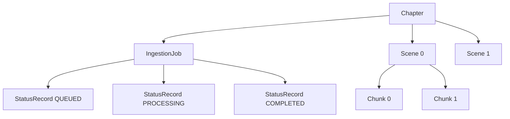

# Information Viewpoint (v0.4.0 Current State)

**Stakeholders:** Developers, architects  
**Concerns:** Implemented data structures, graph persistence model, deferred extensions

## Scope Clarification
Implemented now: storage of Chapters, Scenes, Chunks, IngestionJobs, StatusRecords as Neo4j nodes with relationships.  
Deferred (v0.5.0+): embeddings/vector index usage, knowledge entity extraction (characters, locations, etc.), relationship enrichment, hybrid graph+vector queries.

## Current Graph Data Model

### Node Types (Implemented)
- Chapter(id, contentHash, text, createdAt)
- Scene(id, index, startOffset, endOffset, text)
- Chunk(id, index, text, startOffset, endOffset)
- IngestionJob(id, chapterId, createdAt, status)
- StatusRecord(id, jobId, status, createdAt, message)

### Relationships (Implemented)
- (Chapter)-[:HAS_SCENE]->(Scene)
- (Scene)-[:HAS_CHUNK]->(Chunk)
- (Chapter)-[:HAS_JOB]->(IngestionJob)
- (IngestionJob)-[:HAS_STATUS]->(StatusRecord)

(Indices / constraints: uniqueness on Chapter.contentHash established; additional constraints deferred.)

### Rationale
- Focus on structural provenance (where chunks originate) to enable later semantic enrichment
- Linear ordering preserved via index property on Scene / Chunk (relationship ordering properties deferred)

## Minimal Information Flow (Implemented)

## Persistence Strategy (Current)
- Spring Data Neo4j repositories for each node type
- Adapter orchestrates multi-entity writes within single transactional boundaries (Spring @Transactional)
- Some lookups use in-memory filtering post-fetch (optimization pending)

## Deferred Model Elements (Not Yet Implemented)
- Knowledge entity nodes (Character, Location, Organization, Concept, Event, etc.)
- Rich relationships (APPEARS_WITH, LOCATED_IN, MEMBER_OF, PARTICIPATED_IN, etc.)
- Relationship properties (confidence, timestamps, provenance)
- Embedding properties & vector index configuration
- Hybrid graph+vector query patterns
- Entity resolution & deduplication rules beyond chapter contentHash

These remain design intentions but are excluded from current code to minimize migration complexity.

## Evolution Plan
1. Introduce Cypher-optimized queries for adapter (replace in-memory filtering)
2. Add relationship ordering via relationship properties (HAS_SCENE {index})
3. Introduce embeddings for Chunks → enable semantic search endpoint
4. Add knowledge entity extraction → new node labels & relationships
5. Implement entity resolution strategies & additional constraints

## Data Integrity (Current Guarantees)
- Chapter uniqueness by contentHash prevents duplicate ingestion
- Append-only StatusRecord chain per job provides audit trail
- Ordering retained through explicit index attributes

## Known Gaps
- No global uniqueness constraints for Scene/Chunk IDs beyond generated UUID
- No referential cleanup strategy on failed partial writes (handled logically via status only)
- No cascade delete semantics implemented
- No vector consistency / embedding versioning (deferred)

## Near-Term Improvements
- Add targeted repository / custom Cypher methods for status retrieval and latest job lookup
- Add uniqueness constraint on Chapter.id / job id if not implicit
- Add createdAt timestamps to Scene/Chunk for richer timeline (optional)

---
(Updated to reflect actual v0.4.0 implementation; advanced knowledge/embedding model material intentionally deferred and removed from this active viewpoint.)
