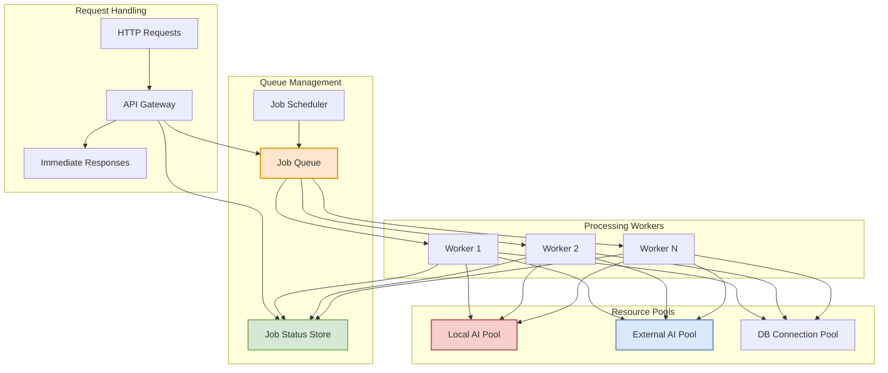
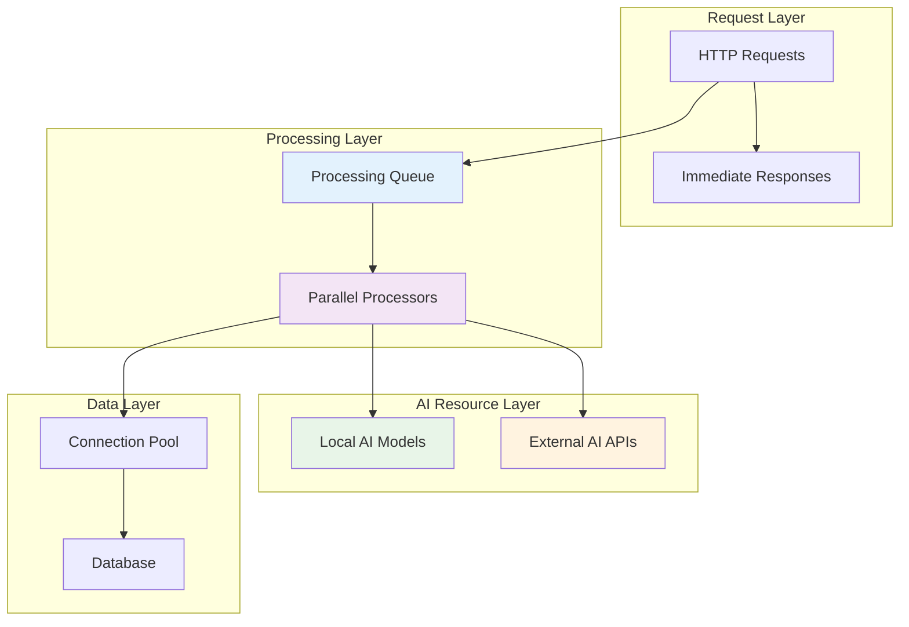
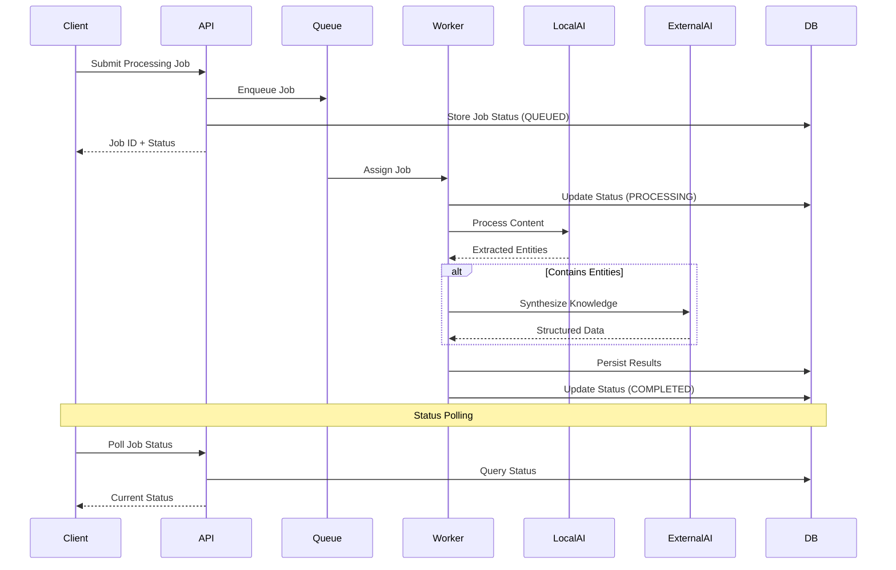
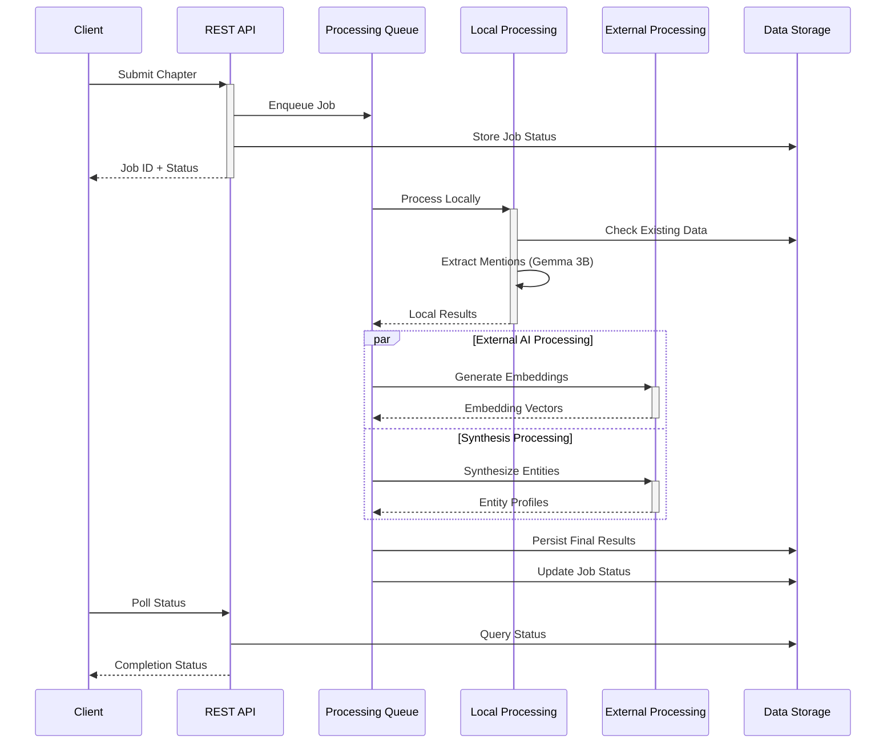

# Concurrency Viewpoint

**Stakeholders:** Performance engineers, system architects, technical leads  
**Concerns:** Concurrency patterns, parallel processing strategy, resource coordination

## Overview

This viewpoint describes how LoreVault handles concurrent operations to efficiently process multiple AI workloads while managing resource constraints. The architecture balances local processing capabilities with external AI service limitations through strategic concurrency patterns.

## Core Concurrency Strategy

### Asynchronous Processing Model

LoreVault employs a **non-blocking asynchronous pattern** to handle the inherent latency of AI processing:

**Request Pattern**:
- Immediate request acknowledgment with job tracking
- Background processing isolation from request handling
- Client-driven status polling for completion
- Resource protection through processing queues

**Processing Flow**:
1. Request reception and immediate response
2. Queue-based background processing
3. Parallel AI service utilization  
4. Coordinated result persistence

### Asynchronous Queue Processing Architecture

### Resource Coordination Architecture

## Queue-Based Asynchronous Processing

### Queue Management Strategy

The system employs a sophisticated queue-based approach to manage asynchronous content processing:

**Job Queue Architecture**:
- **FIFO Processing**: First-in-first-out job ordering ensures fair processing
- **Bounded Capacity**: Queue size limits prevent memory overflow during high load
- **Priority Support**: Future capability for priority-based job ordering
- **Persistence**: Job queue persisted to database for durability across restarts

**Job Status Tracking**:
- **Lifecycle Management**: Jobs transition through QUEUED → PROCESSING → COMPLETED/FAILED
- **Progress Updates**: Incremental progress tracking for long-running operations
- **Client Polling**: Clients poll for status updates using job identifiers
- **Error Handling**: Failed jobs captured with error details for troubleshooting

**Worker Pool Coordination**:
- **Dynamic Workers**: Worker threads dynamically acquire jobs from queue
- **Resource Affinity**: Workers coordinate access to shared AI and database resources
- **Load Balancing**: Automatic distribution of jobs across available workers
- **Graceful Shutdown**: Workers complete current jobs before shutdown

### Queue Processing Flow

## Processing Pipeline Concurrency

### Chapter Processing Workflow

The system processes chapters through coordinated parallel stages:

### Concurrency Patterns

#### Queue-Based Processing
- **Pattern**: Producer-consumer with bounded queues
- **Purpose**: Decouple request handling from processing workload
- **Benefits**: Request responsiveness, overload protection, fair processing

#### Parallel AI Utilization
- **Local Model Access**: Controlled concurrent access to prevent memory overflow
- **External API Coordination**: Rate-limited parallel requests with circuit breaker protection
- **Resource Balancing**: Dynamic allocation between local and external processing

#### Database Connection Strategy
- **Connection Pooling**: Shared connection pool across all processing threads
- **Transaction Isolation**: Read-committed level for entity consistency
- **Batch Operations**: Coordinated bulk operations for efficiency

## Resource Management Strategies

### AI Processing Resources

#### Local Model Coordination
- **Access Control**: Limited concurrent access to Gemma 3B model
- **Memory Management**: Controlled model loading and inference scheduling
- **Processing Isolation**: Independent processing contexts for parallel requests

#### External API Management
- **Rate Limiting**: Request throttling to respect API quotas
- **Circuit Breaking**: Automatic failover during service degradation
- **Request Batching**: Coordinated bulk requests for efficiency gains

### Database Resource Strategy

#### Connection Management
- **Pool Sizing**: Balanced pool size for concurrent processing needs
- **Leak Prevention**: Automatic connection cleanup and monitoring
- **Transaction Coordination**: Proper isolation and consistency guarantees

#### Data Access Patterns
- **Read Optimization**: Read-only transactions for query operations
- **Write Coordination**: Proper locking for entity updates
- **Bulk Operations**: Batch processing for multiple entity persistence

## Performance Characteristics

### Throughput Optimization

**Processing Parallelism**:
- Multiple chapters processed simultaneously
- Independent AI service utilization
- Parallel database operations where safe

**Resource Utilization**:
- Local CPU cores utilized for Gemma 3B inference
- Network bandwidth balanced across external APIs
- Database connections distributed across concurrent operations

### Scalability Approach

**Horizontal Scaling Readiness**:
- Stateless processing design enables instance scaling
- Queue-based coordination supports distributed processing
- Database connection pooling adapts to scaling requirements

**Resource Scaling Patterns**:
- Processing thread pools can be tuned based on available CPU
- AI client pools adjust to external service capacity
- Database connection pools scale with concurrent load

## Synchronization Strategy

### Data Consistency Approach

**Entity State Management**:
- Optimistic locking for entity updates
- Atomic operations for critical state changes
- Eventual consistency for cross-entity relationships

**Job Coordination**:
- Atomic job status transitions
- Progress tracking through coordinated updates
- Completion signaling through status polling

### Resource Coordination

**Shared Resource Access**:
- Fair access to limited AI processing resources
- Coordinated database connection utilization
- Balanced external API request distribution

**Error Handling Coordination**:
- Graceful degradation during resource unavailability
- Coordinated retry strategies across components
- Circuit breaker coordination for external dependencies

## Concurrency Patterns Implementation

### Asynchronous Processing Pattern
- **Non-blocking operations**: Request threads freed immediately after job submission
- **Future-based coordination**: Processing results coordinated through completion tracking
- **Error propagation**: Failures captured and reported through job status updates

### Resource Pool Pattern
- **Bounded resource access**: Limited concurrent access to expensive resources
- **Fair scheduling**: FIFO processing queue ensures fair request handling
- **Resource lifecycle**: Proper acquisition and release of shared resources

### Circuit Breaker Pattern
- **External dependency protection**: Automatic failover during service degradation
- **Recovery coordination**: Gradual service restoration after availability returns
- **Cascading failure prevention**: Isolated failures prevent system-wide degradation

## Future Scalability Considerations

### Distributed Processing Readiness
- Current queue-based design supports transition to distributed message queues
- Stateless processing enables horizontal scaling across multiple instances
- Database design supports read replicas for query path scaling

### Advanced Concurrency Features
- Potential for advanced scheduling algorithms based on processing complexity
- Opportunity for intelligent batching based on content similarity
- Consideration for priority-based processing for different content types

This concurrency architecture provides efficient resource utilization while maintaining system responsiveness and preparing for future scaling requirements.
