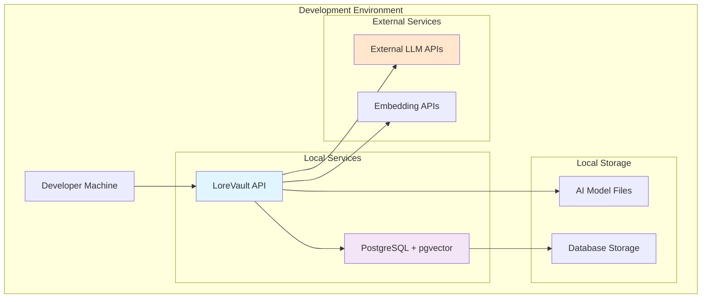

# Deployment Viewpoint

**Stakeholders:** Developers, system administrators  
**Concerns:** Basic component deployment, development environment setup

## Overview

This viewpoint describes the fundamental deployment components for LoreVault development prototyping. The focus is on identifying the core deployable components and their basic relationships for local development.

## Core Deployable Components

### Primary Components

#### LoreVault API Application
- **Purpose**: Main application providing REST API and orchestration services
- **Technology**: Spring Boot JAR application
- **Dependencies**: PostgreSQL database, external AI services
- **Resource Requirements**: 2GB RAM, 1 CPU core minimum

#### PostgreSQL Database with pgvector
- **Purpose**: Primary data storage with vector similarity search capabilities
- **Technology**: PostgreSQL 16 with pgvector extension
- **Dependencies**: Persistent storage for data
- **Resource Requirements**: 1GB RAM, 500MB CPU, 20GB storage

### Supporting Components

#### Local AI Model (Gemma 3B)
- **Purpose**: Local entity extraction and processing
- **Technology**: ONNX model files loaded by application
- **Dependencies**: Model files accessible to application
- **Resource Requirements**: Additional 1GB RAM for model loading

#### External AI Services
- **Purpose**: Advanced synthesis and embedding generation
- **Technology**: External HTTP APIs (OpenAI, etc.)
- **Dependencies**: Internet connectivity, API keys
- **Resource Requirements**: Network bandwidth for API calls

## Development Deployment Architecture

## Development Deployment Setup

### Docker Compose Architecture

The development environment uses container orchestration to coordinate core components:

**Service Coordination**:
- Application container dependent on database availability
- Shared network for inter-service communication
- Volume mounting for model file access and data persistence
- Environment-based configuration injection

**Container Strategy**:
- **API Container**: Application runtime with model file access
- **Database Container**: PostgreSQL with pgvector extension
- **Network Isolation**: Internal service communication with selective external exposure
- **Data Persistence**: Volume-based storage for database data retention

### Component Dependencies

#### Startup Order
1. **PostgreSQL Database**: Must be running first
2. **LoreVault API**: Starts after database is available
3. **AI Model Loading**: Happens during application startup
4. **External Services**: Connected as needed during processing

#### Configuration Dependencies
- **Database Connection**: Application requires database credentials and connection string
- **AI Model Path**: Application needs access to local Gemma 3B model files
- **API Keys**: External service credentials for LLM and embedding APIs
- **Port Configuration**: Homelab-compatible ports (18080 for API, 15432 for database)

## Component Specifications

### LoreVault API Application

**Deployment Package**: JAR file built using Maven build process

**Runtime Requirements**:
- Java 21 JRE
- 2GB heap memory minimum
- Access to AI model files
- Network access to database and external APIs

**Key Configuration Elements**:
- `application.properties`: Main configuration
- `application-development.properties`: Development overrides

### PostgreSQL Database

**Database Technology**: PostgreSQL 16 with pgvector extension

**Required Extensions**:
- Vector extension for similarity search capabilities

**Database Schema**: Automatically created during application startup

**Storage Requirements**:
- Minimum 1GB for development
- Persistent volume for data retention

### AI Model Files

**Model Storage Location**: `/app/models/` (within application container)

**Required Models**:
- Gemma 3B ONNX model for local entity extraction
- Model files must be accessible to the Java application

**Loading Strategy**: Models loaded into memory during application startup

## Network Configuration

### Port Assignments

| Service | Internal Port | External Port | Purpose |
|---------|---------------|---------------|---------|
| LoreVault API | 18080 | 18080 | REST API endpoints |
| PostgreSQL | 5432 | 15432 | Database connections |

### Network Topology
- **lorevault-network**: Internal Docker network for service communication
- **External Access**: API accessible on host port 18080
- **Database Access**: Direct database access on host port 15432 for development tools

### External Connectivity
- **Internet Access**: Required for external AI service API calls
- **DNS Resolution**: Required for external service endpoints
- **Firewall**: Outbound HTTPS (port 443) access needed

## Environment Variables

### Required Environment Variables

**Database Configuration**:
- Database connection URL
- Database credentials (username/password)
- Connection pool settings

**AI Service Configuration**:
- External LLM API keys
- Embedding service API keys
- Service endpoint configurations

**Application Configuration**:
- Spring profile activation
- Server port configuration
- Processing thread pool sizing

### Optional Configuration

**Processing Configuration**:
- Thread pool sizing for concurrent processing
- AI client pool configuration
- Model file path specifications

**Logging Configuration**:
- Log level adjustments for development
- Package-specific logging controls

## Deployment Process

### Development Deployment Steps

1. **Prerequisites Setup**:
   - Ensure Docker and Docker Compose are installed
   - Verify system requirements (4GB RAM, 2 CPU cores)

2. **Build Application**:
   - Use Maven to compile and package application
   - Ensure all dependencies are resolved

3. **Start Services**:
   - Use container orchestration to start all services
   - Services start in proper dependency order

4. **Verify Deployment**:
   - Check service health and availability
   - Validate API endpoints are responding
   - Confirm database connectivity

### Troubleshooting Common Issues

**Database Connection Issues**:
- Verify PostgreSQL container is running
- Check network connectivity between containers
- Validate database credentials

**AI Model Loading Issues**:
- Ensure model files are present in mounted volume
- Check file permissions and accessibility
- Monitor application logs for model loading errors

## Basic Resource Requirements

### Minimum Development Requirements

**Single Developer Machine**:
- 4GB RAM (2GB for application, 1GB for database, 1GB for system)
- 2 CPU cores
- 50GB storage (database growth, logs, models)
- Reliable internet connection for external AI services

### Storage Considerations

**Local Development Storage**:
- **Application Logs**: Stored in container, accessible via `docker logs`
- **Database Data**: Persistent Docker volume for data retention
- **AI Models**: Local filesystem mounted into container
- **Build Artifacts**: Maven target directory with JAR files

## Basic Security Considerations

### Development Security

**Environment Variable Security**:
- Store API keys in environment files (not in version control)
- Use `.env` files for local development configuration
- Keep development and production API keys separate

**Database Security**:
- Use simple passwords for development
- Database only accessible within Docker network by default
- Port 15432 exposed only for development tool access

**Network Security**:
- Default Docker network isolation between containers
- Only necessary ports exposed to host machine
- External API calls over HTTPS only

## Future Production Considerations

The following production features are intentionally **out of scope** for the current prototype:

- **Advanced Orchestration**: Kubernetes, service meshes, auto-scaling
- **High Availability**: Load balancing, clustering, failover mechanisms
- **Advanced Security**: Network segmentation, encryption at rest, certificate management
- **Monitoring & Observability**: Prometheus, Grafana, distributed tracing, centralized logging
- **CI/CD Pipeline**: Automated testing, deployment pipelines, blue-green deployments
- **Performance Optimization**: Caching layers, connection pooling, circuit breakers
- **Backup & Recovery**: Automated backups, disaster recovery procedures
- **Compliance**: Security scanning, audit logging, data retention policies

These will be addressed in future iterations as the prototype matures into a production-ready system.
