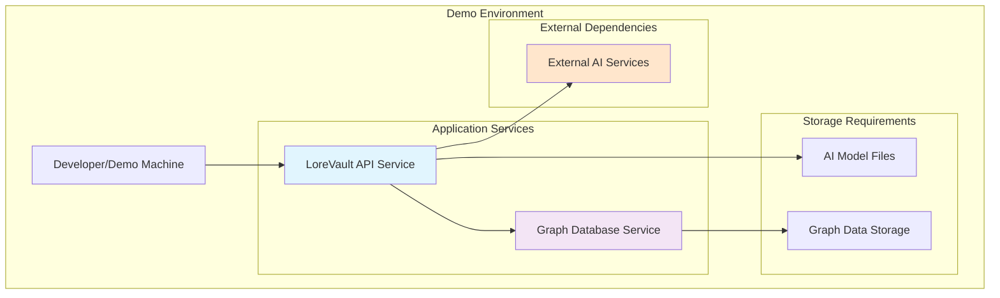

# Deployment Viewpoint

**Stakeholders:** Developers, AI researchers, demo audience  
**Concerns:** Development environment setup, demo deployment, AI integration exploration

## Overview

This viewpoint describes the deployment setup for LoreVault development and demonstration environments. The focus is on simple, local deployment that enables exploration of AI integration patterns and demonstration of GraphRAG capabilities without complex infrastructure requirements.

## Core Deployable Components

### Deployment Philosophy

This deployment approach prioritizes:
- **Ease of Setup**: Get running quickly to explore AI integration patterns
- **Demo Readiness**: Stable environment for showcasing GraphRAG capabilities  
- **Learning Focus**: Clear component relationships for understanding system architecture
- **Development Iteration**: Fast feedback loops for experimenting with AI workflows

### Primary Components

#### LoreVault API Application
- **Purpose**: Main application providing REST API and orchestration services
- **Technology**: Spring Boot JAR application
- **Dependencies**: Graph database service, external AI services
- **Resource Requirements**: 2GB RAM, 1 CPU core minimum

#### Graph Database Service
- **Purpose**: Primary data persistence with integrated vector capabilities
- **Technology**: Neo4j graph database
- **Dependencies**: Persistent storage for graph data and vector indices
- **Resource Requirements**: 2GB RAM, 1 CPU core minimum, 20GB storage

### Supporting Components

#### Local AI Model (Gemma 3B)
- **Purpose**: Local entity extraction and processing
- **Technology**: ONNX model files loaded by application
- **Dependencies**: Model files accessible to application
- **Resource Requirements**: Additional 1GB RAM for model loading

#### External AI Services
- **Purpose**: Advanced synthesis and embedding generation for demo capabilities
- **Technology**: External HTTP APIs (OpenAI, etc.)
- **Dependencies**: Internet connectivity, API keys
- **Resource Requirements**: Network bandwidth for API calls

## Demo Environment Architecture

## Demo Deployment Setup

### Docker Compose Architecture

The demo environment uses container orchestration to coordinate core components:

**Service Coordination**:
- Application container dependent on database availability
- Shared network for inter-service communication
- Volume mounting for model file access and data persistence
- Environment-based configuration injection

**Container Strategy**:
- **API Container**: Application runtime with graph database connectivity
- **Database Container**: Neo4j graph database with vector support
- **Network Isolation**: Internal service communication with selective external exposure
- **Data Persistence**: Volume-based storage for graph database retention

### Component Dependencies

#### Startup Order
1. **Graph Database Service**: Must be running first
2. **LoreVault API**: Starts after database is available
3. **AI Model Loading**: Happens during application startup
4. **External Services**: Connected as needed during processing

#### Configuration Dependencies
- **Database Connection**: Application requires graph database credentials and connection parameters
- **AI Model Path**: Application needs access to local Gemma 3B model files
- **API Keys**: External service credentials for LLM and embedding APIs
- **Port Configuration**: Homelab-compatible ports (18080 for API, 17474/17687 for database)

## Component Specifications

### LoreVault API Application

**Deployment Package**: JAR file built using Maven build process

**Runtime Requirements**:
- Java 21 JRE
- 2GB heap memory minimum
- Access to AI model files
- Network access to graph database and external APIs

**Key Configuration Elements**:
- `application.properties`: Main configuration
- `application-development.properties`: Development overrides

### Graph Database Service

**Database Technology**: Neo4j with integrated vector indexing capabilities

**Required Configuration**:
- Vector indexing capabilities enabled
- Graph schema constraints for data integrity

**Database Schema**: Graph model initialized during application startup

**Storage Requirements**:
- Minimum 2GB for development (graph data + vector indices)
- Persistent volume for data retention

### AI Model Files

**Model Storage Location**: `/app/models/` (within application container)

**Required Models**:
- Gemma 3B ONNX model for local entity extraction
- Model files must be accessible to the Java application

**Loading Strategy**: Models loaded into memory during application startup

## Network Configuration

### Port Assignments

| Service | Internal Port | External Port | Purpose |
|---------|---------------|---------------|---------|
| LoreVault API | 18080 | 18080 | REST API endpoints |
| Graph Database | 7474/7687 | 17474/17687 | Web UI / Bolt protocol |

### Network Topology
- **lorevault-network**: Internal Docker network for service communication
- **External Access**: API accessible on host port 18080
- **Database Access**: Graph database web UI accessible on host port 17474 for development tools

### External Connectivity
- **Internet Access**: Required for external AI service API calls
- **DNS Resolution**: Required for external service endpoints
- **Firewall**: Outbound HTTPS (port 443) access needed

## Environment Variables

### Required Environment Variables

**Database Configuration**:
- Graph database connection URI and credentials
- Connection pool settings for graph database driver
- Vector indexing configuration parameters

**AI Service Configuration**:
- External LLM API keys
- Embedding service API keys
- Service endpoint configurations

**Application Configuration**:
- Spring profile activation
- Server port configuration
- Processing thread pool sizing

### Optional Configuration

**Processing Configuration**:
- Thread pool sizing for concurrent processing
- AI client pool configuration
- Model file path specifications

**Logging Configuration**:
- Log level adjustments for development
- Package-specific logging controls

## Deployment Process

### Development Deployment Steps

1. **Prerequisites Setup**:
   - Ensure Docker and Docker Compose are installed
   - Verify system requirements (4GB RAM, 2 CPU cores)

2. **Build Application**:
   - Use Maven to compile and package application
   - Ensure all dependencies are resolved

3. **Start Services**:
   - Use container orchestration to start all services
   - Services start in proper dependency order

4. **Verify Deployment**:
   - Check service health and availability
   - Validate API endpoints are responding
   - Confirm database connectivity

### Troubleshooting Common Issues

**Database Connection Issues**:
- Verify graph database container is running
- Check network connectivity between containers
- Validate database credentials and connection parameters

**AI Model Loading Issues**:
- Ensure model files are present in mounted volume
- Check file permissions and accessibility
- Monitor application logs for model loading errors

## Demo Resource Requirements

### Target Demo Environment

**Standard Developer/Demo Machine**:
- 8GB RAM (2GB for application, 2GB for graph database, 4GB for system/OS)
- 2-4 CPU cores for responsive demo performance
- 50GB storage (graph database growth, logs, models)
- Reliable internet connection for external AI services
- **Demo Capacity**: Suitable for 1-5 concurrent users exploring the system

### Storage Considerations

**Demo Environment Storage**:
- **Application Logs**: Stored in container, accessible via `docker logs`
- **Graph Data**: Persistent Docker volume for Neo4j data retention
- **AI Models**: Local filesystem mounted into container
- **Build Artifacts**: Maven target directory with JAR files

## Demo Security Considerations

### Development/Demo Security

**Environment Variable Security**:
- Store API keys in environment files (not in version control)
- Use `.env` files for local development configuration
- Keep development and production API keys separate

**Database Security**:
- Use simple passwords for demo environments
- Graph database only accessible within Docker network by default
- Port 17474 exposed only for demo and development tool access

**Network Security**:
- Default Docker network isolation between containers
- Only necessary ports exposed to host machine
- External API calls over HTTPS only

## Future Production Considerations

The following production features are intentionally **out of scope** for the current learning/demo prototype:

- **Advanced Orchestration**: Kubernetes, service meshes, auto-scaling
- **High Availability**: Load balancing, clustering, failover mechanisms  
- **Advanced Security**: Network segmentation, encryption at rest, certificate management
- **Monitoring & Observability**: Prometheus, Grafana, distributed tracing, centralized logging
- **CI/CD Pipeline**: Automated testing, deployment pipelines, blue-green deployments
- **Performance Optimization**: Caching layers, connection pooling, circuit breakers
- **Backup & Recovery**: Automated backups, disaster recovery procedures
- **Compliance**: Security scanning, audit logging, data retention policies

This deployment viewpoint focuses on **learning AI integration patterns** and **demonstrating GraphRAG capabilities** rather than production operational concerns. These features will be addressed in future iterations as the prototype matures into a production-ready system.
