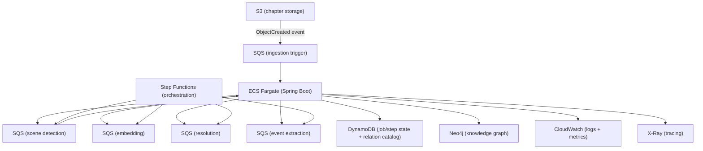

# AWS Cloud-Native Learning Path — May 2026

**Date:** May 2026
**Status:** Brainstorm — not yet accepted
**Purpose:** Capture how LoreVault could be transformed from a locally-deployed Spring Boot application into a cloud-native AWS deployment, framed as a structured learning path that fills CV gaps in managed services, event-driven messaging, distributed state, IaC, and observability. This is exploratory and solution-neutral; it is not an implementation plan for the current codebase.

---

## 1. Why This Exists

LoreVault is a working end-to-end knowledge ingestion service with a multi-stage pipeline, graph storage, and a growing set of domain features. As a portfolio project, it demonstrates backend architecture, AI integration, and domain modeling — but it currently runs as a single JVM process backed by a local Neo4j instance.

The project author's CV has a gap in cloud-native development: no AWS, Azure, or GCP experience, no managed serverless services, no cloud-native messaging, no IaC tooling, and no distributed observability stack. LoreVault's ingestion pipeline and domain shape map naturally onto AWS managed services, making it an ideal vehicle for structured cloud learning.

This document explores what a dedicated AWS-oriented clone of LoreVault could look like, which AWS services map to which domain concerns, and what learning phases would produce the strongest CV signal.

Long-term intent: clone the project for a dedicated `lorevault-aws` deployment, keeping `lorevault-kb` as the domain-focused reference implementation.

---

## 2. Current State of LoreVault

For context, here is the current architecture that any cloud transformation would operate on:

- **Stack:** Java 21, Spring Boot 3.5, Spring AI 1.1, Neo4j 5.26
- **Module structure:** `lorevault-core` (domain + services) and `lorevault-web` (HTTP/UI edge)
- **Pipeline:** Multi-stage ingestion driven by Spring application events — chapter upload, scene detection, parallel branches (embedding, mention extraction, event extraction, relation harvesting), fan-in completion
- **Storage:** Neo4j for graph + vector embeddings; no object store, no separate job-state store
- **Auth:** None (operator-only)
- **Observability:** Application-level logging only; no structured JSON pipeline, no distributed tracing, no cloud-native monitoring
- **Deployment:** Local JVM + local Neo4j via Docker Compose; `dev-api.sh` for development
- **Secrets:** `.env` file for API keys and database credentials
- **CI/CD:** None for deployment; Maven for build

---

## 3. CV Gap Analysis

| Gap | Current CV evidence | What is missing |
|-----|---------------------|-----------------|
| Cloud platform | None | Any AWS / Azure / GCP deployment |
| Managed services | Minio (self-hosted S3-compatible) | S3, DynamoDB, SQS, SNS, Step Functions, Cognito |
| Event-driven messaging | Spring ApplicationEventPublisher (in-process) | SQS, SNS, Kafka, RabbitMQ — any distributed messaging |
| Cloud-native state | All state in Neo4j | DynamoDB, conditional writes, TTL, distributed locking |
| CI/CD on cloud | GitLab CI, Bamboo, GitHub Actions (self-hosted) | CD pipeline that deploys to AWS |
| IaC | Ansible (configuration management) | Terraform, CDK, or CloudFormation |
| Observability | Application logging only | Structured logging, CloudWatch, X-Ray, distributed tracing |
| Container deployment on cloud | Docker, Kubernetes, Rancher (on-prem) | ECS Fargate, ECR, ALB |

---

## 4. Mapping LoreVault Domain to AWS Services

The key insight is that the multi-stage ingestion pipeline — not the library structure — is where the richest cloud-native learning happens.

### 4.1 What goes where

| Domain concern | Current implementation | AWS target | Why |
|---|---|---|---|
| Chapter content storage | In-process persistence to Neo4j | **S3** (with event notifications) | Blob content belongs in object storage; S3 events trigger downstream processing naturally |
| Ingestion job state | Neo4j graph nodes | **DynamoDB** | Job/step execution tracking is key-value access by job ID; DynamoDB conditional writes and TTL are purpose-built for pipeline state. The knowledge graph stays in Neo4j — it is genuinely graph-shaped data |
| Relation catalog | Not yet implemented (see [Relation Catalog Discovery Module](#relationship-to-other-docs)) | **Start in-process, graduate to DynamoDB** | The catalog needs semantic matching (fuzzy/embedding/LLM) on read and fast lookup by ID on write. An in-process module inside the modulith is the v1 per the planning doc. If the catalog grows large enough that in-process lookup becomes a bottleneck, DynamoDB with GSIs on `(name, subjectKind, objectKind)` is the natural graduation path. The catalog is *not* a good fit for Neo4j — it is lookup-heavy, not traversal-heavy |
| Pipeline stage transitions | Spring ApplicationEventPublisher (in-process) | **SQS queues** (one per stage) | Decouples stages, enables independent scaling, dead-letter queues for failures, visibility timeouts for processing time budgets |
| Fan-out (one result → multiple downstream stages) | Synchronous handler calls within the same JVM | **SNS → SQS fan-out** | Scene analysis results trigger embedding, mention extraction, event extraction, and relation harvesting independently |
| Pipeline orchestration | Coordinated completion logic in service code | **Step Functions** (Express) | The ingestion DAG has a natural shape: sequential start → parallel branches → fan-in completion. Step Functions model this with visual debugging and built-in retry/catch |
| Application configuration and secrets | `.env` file | **Parameter Store + Secrets Manager** | Non-sensitive config in Parameter Store; actual secrets (API keys, DB credentials) in Secrets Manager with rotation |
| HTTP edge | Spring Boot embedded Tomcat | **ALB → ECS Fargate** | Containerized Spring Boot on managed compute; ALB handles TLS termination, health checks, routing |
| Operator UI auth | None | **Cognito** (or API Gateway + authorizer) | Managed user pool for operator access; integrates with ALB |
| Observability | Application-level Logback | **Structured JSON → CloudWatch Logs**, **X-Ray / OpenTelemetry** | JSON logs queryable via Logs Insights; distributed traces across SQS/ECS/Step Functions |

### 4.2 What stays in Neo4j

Neo4j remains the knowledge graph store. The library structure (books, chapters, scenes), entity resolution results (individuals, locations, events), embedding vectors, and retrieval indexes all stay in Neo4j. This is the right home for graph-shaped, relationship-rich data.

Note the distinction between two different "catalogs" in this system:
- **Library catalog** (books/series/universes) — stays in Neo4j. It is traversal-heavy, relationship-rich, graph-shaped data. Moving it to DynamoDB would fight the data model and teach the wrong lesson.
- **Relation type catalog** (the managed vocabulary of relation IDs like `R:member_of`, `R:located_at`) — a separate concern, currently not yet implemented. This is lookup-heavy by `{name, subjectKind, objectKind}`, not traversal-heavy. It is a strong candidate for DynamoDB once it outgrows in-process memory (see the domain mapping table above).

---

## 5. Phased Learning Path

Each phase builds on the previous one. Phases 1–4 form a coherent v1 deployment. Phases 5–7 are where distributed systems learning accelerates. Phases 8–10 round out the picture.

### Phase 1 — Compute foundation

**Goal:** Deploy the Spring Boot application to AWS.

| What | Why |
|---|---|
| Dockerfile for `lorevault-web` | Containerization is prerequisite for cloud deployment |
| ECR repository | Push the container image |
| ECS Fargate task + service | Managed compute without Kubernetes overhead |
| Application Load Balancer | TLS termination, health checks, routing |
| VPC, subnets, security groups | Network isolation fundamentals |
| Terraform or CDK | All infrastructure as code from day one |

**CV signal:** AWS, ECS Fargate, ECR, ALB, VPC, Terraform or CDK, IaC

**Key learning:**
- Container-to-cloud deployment is more than `docker run` — IAM roles, task definitions, service discovery, and load balancing are all new concepts
- IaC from the start prevents the "click-through console" trap
- ECS Fargate is the right compute for JVM services (avoid Lambda cold starts)

### Phase 2 — Secrets and configuration

**Goal:** Move secrets out of `.env` into managed AWS services.

| What | Why |
|---|---|
| Parameter Store for non-sensitive config | `spring.datasource.url`, feature flags, environment-specific values |
| Secrets Manager for actual secrets | `GEMINI_AI_API_KEY`, `GROQ_API_KEY`, Neo4j credentials |
| ECS task pulls secrets at startup | No `.env` file in the container |
| IAM roles for secrets access | Least-privilege principle |

**CV signal:** AWS Secrets Manager, Parameter Store, IAM policies

**Key learning:**
- Managed secrets rotation vs. static env vars
- IAM least-privilege is not just "deny all" — it is "allow exactly what the task needs"
- The difference between config (Parameter Store, free) and secrets (Secrets Manager, paid but with rotation)

### Phase 3 — S3 for chapter storage + event notifications

**Goal:** Chapters land in S3 and trigger ingestion events.

| What | Why |
|---|---|
| S3 bucket for chapter content | Object storage for blob data |
| S3 Event Notifications → SQS | `ObjectCreated` events trigger processing |
| Spring Boot consumes from SQS | Replaces HTTP upload as the ingestion entrypoint (or runs alongside it) |
| IAM bucket policies | Least-privilege S3 access |

**CV signal:** Amazon S3, S3 Event Notifications, SQS (producer side), IAM bucket policies

**Key learning:**
- S3 is not just "a file store" — event notifications make it the entrypoint of event-driven architectures
- The shift from synchronous request/response (HTTP upload → immediate processing) to asynchronous event-driven processing (S3 put → SQS → processing) is the single most important architectural shift this path teaches
- Bucket policies, CORS, and lifecycle rules are practical S3 skills

### Phase 4 — Structured logging + CloudWatch

**Goal:** Replace ad hoc application logging with structured, queryable observability.

| What | Why |
|---|---|
| Logback + Logstash encoder | Structured JSON logs instead of unstructured text |
| CloudWatch Logs | Centralized log storage |
| CloudWatch Logs Insights | Query logs by correlation ID, job ID, stage, outcome |
| CloudWatch metrics + alarms | Basic operational monitoring (error rates, processing latency) |
| MDC propagation (already partially designed) | Correlate logs across async boundaries using job/step IDs |

**CV signal:** CloudWatch, structured logging, Logs Insights, operational monitoring

**Key learning:**
- Structured JSON logs are not cosmetic — they enable programmatic debugging at scale
- MDC (Mapped Diagnostic Context) propagation across async boundaries is how distributed tracing starts
- CloudWatch Logs Insights is surprisingly powerful for ad hoc operational queries

### Phase 5 — SQS for pipeline stage transitions

**Goal:** Replace in-process Spring events with distributed message queues.

This is the single highest-value learning investment in the entire path.

| What | Why |
|---|---|
| SQS queue per pipeline stage | `SceneDetectionQueue`, `EmbeddingQueue`, `MentionResolutionQueue`, `EventResolutionQueue`, `CompletionQueue` |
| SNS topic for fan-out | Scene analysis results broadcast to multiple downstream queues simultaneously |
| Dead-letter queues (DLQ) | Failed messages after X retries go to DLQ for inspection |
| Visibility timeouts | Processing time budget per message |
| Idempotency in consumers | SQS delivers at-least-once; handlers must be safe to re-process |
| DynamoDB conditional writes for dedup | Exactly-once processing pattern using DynamoDB as a dedup store |

**CV signal:** Amazon SQS, SNS, dead-letter queues, event-driven architecture, idempotent consumers, at-least-once delivery

**Key learning:**
- Distributed messaging changes everything: failures become visible, retries become automatic, but you must design for idempotency
- SNS fan-out is the natural pattern for "one stage produces results that multiple downstream stages need"
- Dead-letter queues are not an error state — they are a monitoring and recovery tool
- The gap between "at-least-once" and "exactly-once" is where real distributed systems thinking happens

### Phase 6 — DynamoDB for pipeline state and relation catalog

**Goal:** Move pipeline orchestration state and the relation type catalog out of Neo4j and into DynamoDB.

| What | Why |
|---|---|
| DynamoDB table for `IngestionJob` | Job status, step progress, retry counts, timestamps |
| DynamoDB table for `StepExecution` | Per-step state: pending, running, completed, failed |
| DynamoDB table for `RelationCatalog` | Managed relation vocabulary: `{name, usageHint, subjectKind, objectKind}` → candidate IDs, correlations, provisional keys. Lookup-heavy, not traversal-heavy — DynamoDB with GSIs on `(name, subjectKind, objectKind)` is the natural graduation from the in-process v1 specified in the [Catalog Module](../../planning/relation-catalog-module.md) |
| Conditional writes | Safe concurrent updates — "set status to RUNNING if status is PENDING" |
| TTL on completed jobs | Automatic cleanup of old job records |
| GSI for queries | "Find all failed jobs in the last hour"; "find all provisional relation types pending review" |
| DynamoDB Streams | Optionally trigger downstream actions on state changes |

**CV signal:** DynamoDB, conditional writes, GSI/LSI, TTL, DynamoDB Streams

**Key learning:**
- Key-value access patterns require thinking about access patterns upfront, not relationship traversal — the relation catalog is a good example: its primary access pattern is `{name, subjectKind, objectKind}` → candidates, not graph traversal, which makes it a natural DynamoDB concern rather than a Neo4j concern
- Conditional writes enable lock-free concurrency — this pattern appears everywhere in distributed systems
- DynamoDB TTL is a surprisingly useful operational tool (automatic cleanup of transient state)
- GSIs and LSIs are not indexes in the RDBMS sense — they change your table's data model and billing

### Phase 7 — Step Functions for ingestion orchestration

**Goal:** Model the ingestion DAG as an AWS Step Function.

| What | Why |
|---|---|
| Express Workflow for fast ingestion paths | Step Functions Express is cost-effective for high-throughput, short-duration workflows |
| Parallel branch states | Model scene detection → [embedding, mention, event, relation] → fan-in |
| Built-in retry + catch | Per-state retry policies replace manual retry logic in service code |
| Visual execution history | Step Functions console shows exactly which branches succeeded, failed, or are still running |
| Integration with SQS and DynamoDB | Step Functions can publish to SQS, read/write DynamoDB, and call ECS tasks |

**CV signal:** AWS Step Functions, state machines, distributed orchestration, Express Workflows

**Key learning:**
- State machines are not just orchestration — they are debuggable, observable coordination
- Express vs. Standard workflows: Express is cheaper and faster but has shorter history retention. Choose based on your workload
- The visual execution graph in the Step Functions console is one of the most powerful debugging tools in AWS
- Step Functions replaces a surprising amount of hand-written coordination code

### Phase 8 — API Gateway + Cognito

**Goal:** Add a managed HTTP edge and authentication.

| What | Why |
|---|---|
| API Gateway in front of ALB | Request routing, throttling, API keys, request/response transformation |
| Cognito User Pool | Managed authentication for operator UI |
| ALB integration or Lambda authorizer | Auth enforcement at the edge |
| Rate limiting | Protect the LLM-calling pipeline from accidental or malicious overuse |

**CV signal:** API Gateway, Amazon Cognito, rate limiting, managed auth

**Key learning:**
- API Gateway is not just a proxy — it is a policy enforcement point
- Cognito integrates with ALB and API Gateway for auth without writing auth code
- Rate limiting at the edge is more effective than rate limiting in the application

### Phase 9 — Distributed tracing

**Goal:** End-to-end trace correlation across all services.

| What | Why |
|---|---|
| OpenTelemetry instrumentation in Spring Boot | Vendor-neutral tracing SDK |
| AWS X-Ray or alternate trace backend | Centralized trace collection and visualization |
| Trace propagation through SQS | Correlate producer → consumer across queue boundaries |
| Custom subsegments for LLM calls | See how long each AI call takes in the context of the full ingestion pipeline |

**CV signal:** OpenTelemetry, AWS X-Ray, distributed tracing, observability

**Key learning:**
- Distributed tracing is how you debug across service boundaries — without it, you are correlating timestamps in logs
- OpenTelemetry is vendor-neutral and the right long-term choice
- LLM calls are slow and expensive; seeing them in the context of a trace makes optimization decisions data-driven

### Phase 10 — Infrastructure as Code maturity

**Goal:** Codify every resource created in phases 1–9.

| What | Why |
|---|---|
| CDK (TypeScript) or Terraform (HCL) | All infrastructure defined in code, version-controlled, reproducible |
| Environment promotion (dev → staging → prod) | Same template, different parameter values |
| Automatically reflect on IaC choices | Did CDK or Terraform feel more natural? Which produces clearer intent? Which has better community support for your use case? |

**CV signal:** CDK or Terraform, IaC, environment promotion, reproducible infrastructure

**Key learning:**
- IaC is not optional for cloud work — clicking through the console creates untracked, unreproducible infrastructure
- CDK with TypeScript leverages your existing programming skills; Terraform with HCL is the broader market standard
- Environment promotion teaches parameterization, separation of config and infrastructure, and the discipline of prod parity

---

## 6. What NOT to Do

Even though these are popular AWS patterns, they are wrong for this learning path:

| Don't | Why |
|---|---|
| **Lambda for the core Spring Boot app** | JVM cold starts on Lambda are measured in seconds. Spring Boot is not a good fit for Lambda. ECS Fargate is the right compute choice. If you want Lambda experience, add a lightweight Node.js or Python Lambda for S3 event processing in Phase 3 — not the main app |
| **Replace Neo4j with DynamoDB for the knowledge graph** | The knowledge graph is genuinely graph-shaped data. Forcing it into DynamoDB fights the data model and teaches the wrong lesson. Neo4j stays. The learning is in choosing the right tool per concern, not in making everything DynamoDB |
| **Kubernetes on EKS** | Your CV already has Kubernetes (Rancher). EKS adds complexity without adding new learning. ECS Fargate teaches the AWS-native path and is simpler to operate |
| **Gate every phase behind Terraform maturity** | Terraform from day one is correct. But do not let IaC perfectionism block early phases. Write Terraform for what you build, but ship first, codify second if needed |

---

## 7. What LoreVault Specifically Enables

LoreVault's domain makes certain AWS patterns unusually natural to learn:

- **Event-driven messaging** — The ingestion pipeline is already stageful and fan-out heavy. SQS/SNS does not need to be forced onto the domain; it matches the natural shape
- **State machine orchestration** — The scene detection → parallel branches → fan-in DAG is practically a Step Functions textbook example
- **Object storage + event notifications** — Chapters are blob content that flows through processing. S3 is the natural home, and S3 events are the natural trigger
- **Distributed state management** — Ingestion job tracking is high-write, key-value access by job ID. DynamoDB is purpose-built for this. The relation type catalog (managed vocabulary) is also lookup-heavy rather than traversal-heavy, making it a natural DynamoDB concern distinct from the graph-shaped knowledge graph that stays in Neo4j
- **Observability of async processes** — Multi-stage pipelines with LLM calls are exactly where distributed tracing earns its keep. Without it, you are correlating timestamps in logs across thread and process boundaries

---

## 8. Open Questions

- **Neo4j on AWS**: Run as a self-managed container on ECS, use Neo4j AuraDB (managed), or use Amazon EC2? AuraDB is the simplest but most expensive; ECS is the most educational; EC2 is the middle ground. This decision depends on budget and learning priorities.
- **CDK vs Terraform**: Both are excellent choices. CDK with TypeScript leverages your existing programming skills and produces highly composable infrastructure. Terraform with HCL is the broader market skill and has better community support for AWS specifically. Consider doing Phase 1 in both to feel the difference.
- **Clone strategy**: The intent is to clone `lorevault-kb` into a dedicated `lorevault-aws` repo. How much of the domain logic should be shared (as a library) vs. rewritten? The simplest approach is a full clone with divergent evolution — the domain stays the same, but the infrastructure adapters change.
- **Learning budget**: Phases 1–4 are achievable in 2–4 weeks of focused work. Phases 5–7 each require significant design investment (idempotency, conditional writes, state machine modeling). How much time to budget per phase?
- **Relation catalog on AWS**: The planning doc specifies an in-process v1. Should the `lorevault-aws` clone start with DynamoDB immediately, or respect the same in-process-first graduation strategy? Starting directly in DynamoDB would be a steeper learning curve but more directly CV-relevant.

---

## 9. Relationship to Other Docs

- [Catalog Module (planning)](../../planning/relation-catalog-module.md) — the catalog is a notable border case for the AWS mapping. The planning doc specifies an in-process module for v1, with open questions about whether canonical entries should live in Neo4j, YAML seed files, or both. For the AWS deployment, the catalog's read pattern (semantic matching by `{name, usageHint, subjectKind, objectKind}`) is more lookup-heavy than traversal-heavy, making DynamoDB with GSIs a strong graduation candidate once the catalog grows beyond in-process memory. The AWS path should track this planning item as it firms up
- [Event-driven architecture plan](../architecture/event-driven-architecture-plan.md) — the original proposal for splitting ingestion into independent pipelines. The AWS path is one concrete realization of this vision
- [StageRun DAG observability and recovery](../architecture/stage-run-dag-observability-and-recovery-brainstorm-april-2026.md) — the current proposal for durable stage-run tracking. DynamoDB-based job state (Phase 6) is a cloud-native alternative to the in-Neo4j StatusRecord approach
- [Async ingestion logging philosophy](../architecture/2026-04-17_async-ingestion-logging-philosophy-brainstorm.md) — the structured logging and MDC proposals. Phase 4 (CloudWatch + structured JSON) is the cloud-native home for this direction