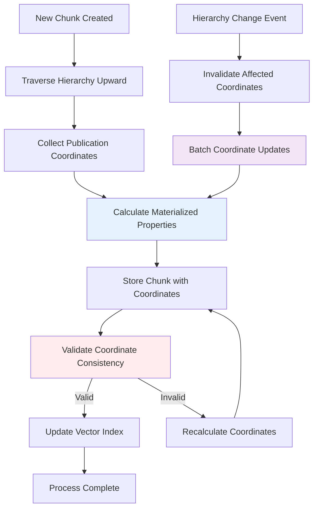

# Content Hierarchy Integration Specification

**Purpose**: Define the integration patterns, performance optimizations, and coordination mechanisms for managing publication hierarchies across system components

**Scope**: Component integration patterns, materialized coordinate strategies, performance optimization techniques, and system coordination. Excludes data model definitions and query processing workflows.

**Dependencies**: 
- Neo4j Content Data Model - Base node and relationship schemas
- Spoiler-Aware Retrieval Process - Query processing workflows
- Content Ingestion Process - Data population workflows

## Process Overview

The content hierarchy integration system coordinates between ingestion, storage, and retrieval components to maintain publication coordinate consistency while optimizing query performance. This specification defines the patterns for materializing coordinates, synchronizing hierarchy changes, and integrating with external services.

## Detailed Workflow

### Coordinate Materialization Process



### Performance Optimization Strategy

#### Materialized Coordinate Strategy
- **Purpose**: Avoid expensive hierarchy traversals during query filtering
- **Implementation**: Pre-calculate and store earliest publication coordinates on chunk nodes
- **Update Trigger**: Recalculate when hierarchy relationships change
- **Consistency**: Validate materialized coordinates match actual hierarchy position

#### Coordinate Calculation Logic
```
For each Chunk:
1. Traverse upward: Chunk → Scene → Chapter → Book → Series → Universe
2. Collect coordinates: universeId, seriesId, bookOrder, chapterOrder, sceneIndex
3. Calculate earliest position: minimum coordinates for cross-scene chunks
4. Materialize properties: universeId, seriesId, bookOrder_min, chapterOrder_min, sceneIndex_min
5. Validate consistency: ensure coordinates align with hierarchy
```

#### Batch Processing Optimization
- **Hierarchy Changes**: Process coordinate updates in batches
- **Change Detection**: Monitor relationship modifications
- **Update Scheduling**: Process updates during low-traffic periods
- **Progress Tracking**: Maintain update progress for large hierarchies

## State Management

### Coordinate Consistency State

**Materialization Status**:
```json
{
  "chunkId": "chunk-uuid-123",
  "materializationState": {
    "status": "valid",
    "lastUpdated": "2025-08-10T14:30:00Z",
    "calculatedFrom": {
      "universeId": "cosmere",
      "seriesId": "stormlight",
      "bookOrder": 1,
      "chapterOrder": 14,
      "sceneIndex": 2
    },
    "materializedCoordinates": {
      "universeId": "cosmere",
      "seriesId": "stormlight",
      "bookOrder_min": 1,
      "chapterOrder_min": 14,
      "sceneIndex_min": 2
    }
  }
}
```

**State Transitions**:
- **Valid**: Materialized coordinates match hierarchy position
- **Stale**: Hierarchy changed, coordinates need recalculation
- **Invalid**: Coordinates don't match hierarchy, immediate recalculation required
- **Processing**: Coordinate recalculation in progress

### Hierarchy Change Tracking

**Change Event Structure**:
```json
{
  "eventId": "event-uuid-456",
  "eventType": "hierarchy_change",
  "timestamp": "2025-08-10T14:30:00Z",
  "changes": [
    {
      "changeType": "book_reorder",
      "affectedSeries": "stormlight",
      "oldBookOrder": 2,
      "newBookOrder": 3,
      "impactedChunks": 1247
    }
  ],
  "processingStatus": "pending"
}
```

**Change Processing**:
- **Detection**: Monitor relationship modifications and ordering changes
- **Impact Analysis**: Calculate affected chunks and coordinate updates needed
- **Batch Planning**: Group related changes for efficient processing
- **Progress Tracking**: Monitor update completion and validate results

## Interface Specifications

### Coordinate Materialization Service

#### Input Interface
```json
{
  "operation": "materialize_coordinates",
  "chunkId": "chunk-uuid-123",
  "hierarchyContext": {
    "sceneId": "scene-uuid-456",
    "forceRecalculation": false
  }
}
```

#### Output Interface
```json
{
  "chunkId": "chunk-uuid-123",
  "materializedCoordinates": {
    "universeId": "cosmere",
    "seriesId": "stormlight",
    "bookOrder_min": 1,
    "chapterOrder_min": 14,
    "sceneIndex_min": 2
  },
  "calculationMetadata": {
    "calculatedAt": "2025-08-10T14:30:00Z",
    "hierarchyPath": ["universe-cosmere", "series-stormlight", "book-1", "chapter-14", "scene-2"],
    "processingTime": 45
  }
}
```

### Hierarchy Change Integration

#### Change Event Input
```json
{
  "changeEvent": {
    "eventType": "chapter_reorder",
    "seriesId": "stormlight",
    "bookId": "book-1",
    "reorderingMap": {
      "chapter-old-5": { "newOrder": 6 },
      "chapter-old-6": { "newOrder": 5 }
    }
  },
  "processingOptions": {
    "batchSize": 100,
    "priority": "normal",
    "validateResults": true
  }
}
```

#### Processing Status Output
```json
{
  "eventId": "event-uuid-789",
  "processingStatus": "in_progress",
  "progress": {
    "totalChunks": 1247,
    "processedChunks": 234,
    "estimatedCompletion": "2025-08-10T15:00:00Z"
  },
  "validation": {
    "consistencyChecks": "passed",
    "coordinateValidation": "passed",
    "indexUpdates": "in_progress"
  }
}
```

## Error Handling

### Coordinate Calculation Errors

**Hierarchy Traversal Failures**
- **Trigger**: Missing parent relationships, circular references
- **Detection**: Traversal path validation
- **Response**: Mark chunk as invalid, schedule manual review
- **Recovery**: Attempt traversal with alternative path strategies
- **Prevention**: Validate hierarchy integrity during creation

**Coordinate Inconsistency**
- **Trigger**: Materialized coordinates don't match calculated values
- **Detection**: Periodic consistency validation
- **Response**: Force coordinate recalculation
- **Recovery**: Rebuild coordinates from canonical hierarchy
- **Monitoring**: Track inconsistency frequency for root cause analysis

**Batch Processing Failures**
- **Trigger**: Batch update timeouts, resource exhaustion
- **Detection**: Batch processing monitoring
- **Response**: Split batches and retry with smaller sizes
- **Recovery**: Process failed items individually
- **Escalation**: Manual intervention for persistent failures

### Integration Component Failures

**Vector Index Update Failures**
- **Trigger**: Index service unavailable, update conflicts
- **Detection**: Index operation response validation
- **Response**: Queue updates for retry with exponential backoff
- **Recovery**: Rebuild index if corruption detected
- **Monitoring**: Track index update success rates

**Change Event Processing Failures**
- **Trigger**: Event queue overload, processing deadlocks
- **Detection**: Event processing timeout monitoring
- **Response**: Implement circuit breaker and dead letter queue
- **Recovery**: Replay failed events from persistent log
- **Resource Management**: Scale processing capacity dynamically

### Performance Degradation

**Coordinate Calculation Performance**
- **Trigger**: Calculation time exceeds 100ms target
- **Detection**: Performance monitoring and alerting
- **Response**: Optimize traversal paths and cache intermediate results
- **Recovery**: Use cached coordinates with scheduled recalculation
- **Prevention**: Index optimization and query pattern analysis

**Batch Processing Bottlenecks**
- **Trigger**: Batch processing falls behind change rate
- **Detection**: Queue depth and processing rate monitoring
- **Response**: Increase batch size and parallel processing
- **Recovery**: Implement priority processing for critical updates
- **Scaling**: Auto-scale processing workers based on queue depth

## Performance Requirements

### Coordinate Materialization Performance
- Single coordinate calculation: < 50ms
- Batch coordinate updates: < 100ms per chunk
- Hierarchy traversal: < 25ms per path
- Consistency validation: < 200ms for full hierarchy

### Change Processing Performance
- Change event detection: < 10ms from modification
- Impact analysis: < 500ms for large hierarchies
- Batch update processing: < 1000 chunks per minute
- Index synchronization: < 5 minutes for major changes

### Resource Utilization Targets
- Memory usage: < 1GB for coordinate calculation service
- CPU utilization: < 60% under normal change processing load
- Database connections: < 20 concurrent connections per service
- Queue processing: < 2 second average latency

## Integration Points

### Content Ingestion Integration
- **Trigger Events**: New chunk creation, hierarchy modifications
- **Data Flow**: Ingestion service → Coordinate materialization → Index updates
- **Error Handling**: Coordinate calculation failures block ingestion completion
- **Performance**: Coordinate calculation included in ingestion SLA

### Query Processing Integration
- **Data Access**: Query service reads materialized coordinates for filtering
- **Cache Strategy**: Cache frequently accessed coordinates in query service
- **Fallback**: Use hierarchy traversal if materialized coordinates unavailable
- **Consistency**: Accept eventually consistent coordinates for query performance

### Vector Index Integration
- **Update Coordination**: Coordinate index updates with coordinate changes
- **Batch Updates**: Group index updates for efficiency
- **Consistency**: Ensure index reflects current coordinate state
- **Recovery**: Rebuild index entries for coordinate inconsistencies

### Monitoring and Alerting Integration
- **Performance Metrics**: Track coordinate calculation and update performance
- **Consistency Monitoring**: Validate coordinate accuracy across system
- **Error Tracking**: Monitor and alert on coordinate processing failures
- **Capacity Planning**: Track resource usage for scaling decisions

## Validation Criteria

### Functional Validation
- ✅ Materialized coordinates match hierarchy traversal results
- ✅ Coordinate updates process within specified time limits
- ✅ Hierarchy changes trigger appropriate coordinate recalculation
- ✅ System maintains consistency during concurrent modifications
- ✅ Integration points handle failures gracefully

### Performance Validation
- ✅ Coordinate calculation meets sub-second performance targets
- ✅ Batch processing handles required throughput volumes
- ✅ Change event processing keeps pace with modification rate
- ✅ Resource utilization stays within configured limits
- ✅ Integration overhead doesn't impact query performance

### Integration Validation
- ✅ Components coordinate effectively during hierarchy changes
- ✅ Error conditions are handled consistently across integrations
- ✅ Performance degradation is detected and handled appropriately
- ✅ Monitoring provides adequate visibility into system health
- ✅ Recovery procedures restore consistency after failures

### Consistency Validation
- ✅ Materialized coordinates remain accurate across all operations
- ✅ Hierarchy modifications maintain referential integrity
- ✅ Concurrent updates don't create inconsistent states
- ✅ System validates and corrects coordinate drift
- ✅ Integration points maintain transactional consistency
