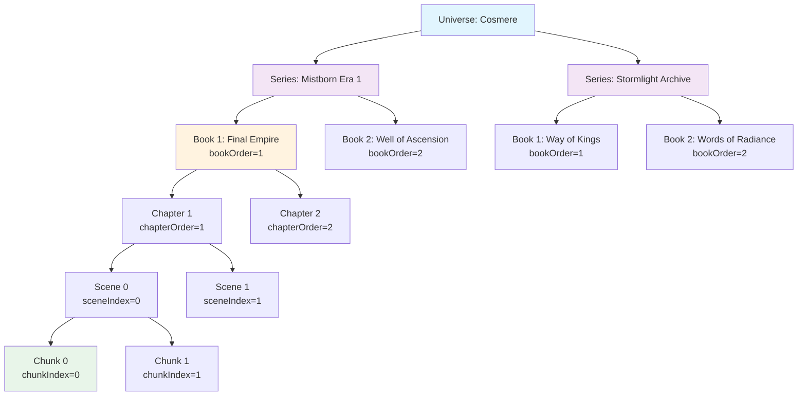

# Neo4j Content Data Model Specification

**Purpose**: Define the graph data structures, relationships, constraints, and validation rules for storing narrative content hierarchies with publication ordering

**Scope**: Node schemas, relationship patterns, data validation rules, and constraint definitions for Chapter-Scene-Chunk hierarchies. Excludes processing workflows, integration patterns, and query implementation details.

**Dependencies**: 
- Architecture Document: Information Viewpoint (03-information-viewpoint.md) - Graph data strategy
- Spoiler-Aware Retrieval Process Specification - Query processing that uses this data model
- Content Hierarchy Integration Specification - Performance optimization patterns

## Data Model Overview

The LoreVault system stores narrative content as a hierarchical graph structure: `Universe` → `Series` → `Book` → `Chapter` → `Scene` → `Chunk`. This data model enables spoiler-aware content retrieval through publication coordinate tracking and supports multi-series fictional universes.

### Data Model Design Principles

1. **Hierarchical Organization**: Content organized in publication order with numeric sequencing
2. **Distributed Content Storage**: Verbatim text at Chapter level, extracted text materialized at Scene and Chunk levels for traceability and embedding
3. **Publication Coordinates**: Numeric ordering enables deterministic position comparison
4. **Decoupled Chunk Units**: Chunks are context-agnostic embeddable units storing their own text, with sequence information on relationships
5. **Referential Integrity**: All relationships maintain parent-child hierarchy constraints

## Data Structure Specifications

### Content Hierarchy Structure

The content data model organizes narrative text in a six-level hierarchy that preserves publication order:



### Text Storage and Organization

**Chapter Level**: Complete verbatim text stored with original formatting and metadata
**Scene Level**: Extracted text content materialized from Chapter offsets for traceability and processing  
**Chunk Level**: Normalized text segments materialized and stored directly for embedding independence

### Publication Coordinate System

**Numeric Ordering**: All levels use integer sequences for deterministic ordering
- `seriesOrder`: Optional ordering of related series within universe
- `bookOrder`: Required sequential ordering within series (1, 2, 3...)
- `chapterOrder`: Required sequential ordering within book (1, 2, 3...)
- `sceneIndex`: Required sequential indexing within chapter (0, 1, 2...)
- `chunkIndex`: Required sequential indexing within scene (0, 1, 2...)

**Coordinate Benefits**: Integer-based ordering enables fast position comparisons and stable sort orders

## Data Validation Rules

### Data Integrity Constraints

**Hierarchical Integrity**:
- All child nodes must have exactly one parent in the hierarchy
- Parent-child relationships must form a valid tree structure
- No circular references or orphaned nodes permitted

**Ordering Uniqueness**:
- Book orders must be unique within each series
- Chapter orders must be unique within each book
- Scene indices must be sequential within each chapter (0, 1, 2, ...)
- Chunk indices must be sequential within each scene (0, 1, 2, ...)

**Text Boundary Consistency**:
- Scene startOffset/endOffset must align with chapter text boundaries
- Scene text must match Chapter.rawText[startOffset:endOffset] 
- Chunk text must be materialized and stored independently
- Chunk content derived from scene text boundaries but stored for embedding independence
- All offset values must be non-negative integers

**Coordinate Consistency**:
- Materialized coordinates must reflect actual hierarchy position
- Publication ordering must be monotonically increasing within scope
- Cross-reference validation between coordinate systems required

## Node Schema Definitions

#### Universe Node
```
Properties:
- id: UUID (required, unique)
- name: String (required, universe name)
- createdAt: DateTime (required)

Constraints:
- id must be unique across all Universe nodes
- name cannot be null or empty
```

#### Series Node
```
Properties:
- id: UUID (required, unique)
- name: String (required, series name)
- seriesOrder: Integer (optional, order within universe for related series)
- createdAt: DateTime (required)

Constraints:
- id must be unique across all Series nodes
- name cannot be null or empty
- seriesOrder must be unique within universe if specified
```

#### Book Node
```
Properties:
- id: UUID (required, unique)
- title: String (required)
- bookOrder: Integer (required, order within series)
- createdAt: DateTime (required)

Constraints:
- id must be unique across all Book nodes
- title cannot be null or empty
- bookOrder must be unique within series
- bookOrder must be positive integer
```

#### Chapter Node
```
Properties:

Note on property naming: the canonical property for the chapter's title is `chapterTitle`. Some historical data may contain `chaptertitle` (lowercase 't') on Chapter nodes. The application maps both and will prefer `chapterTitle`, falling back to `chaptertitle` when needed. Consider normalizing legacy nodes during maintenance windows.
- id: UUID (required, unique)
- title: String (required)
- chapterOrder: Integer (required, order within book)
- raw_text: String (required, verbatim source, fulltext search target (neo lucene))
- length: Integer (character count)
- checksumOriginal: String (hash of verbatim text)
- createdAt: DateTime (required)
- updatedAt: DateTime (optional)

Constraints:
- id must be unique across all Chapter nodes
- raw_text cannot be null or empty
- length must match actual text character count
- chapterOrder must be unique within book
- chapterOrder must be positive integer
```

#### Scene Node
```
Properties:
- id: UUID (required, unique)
- sceneIndex: Integer (0-based index within chapter)
- startOffset: Long (inclusive offset into Chapter.rawText)
- endOffset: Long (exclusive offset into Chapter.rawText)
- text: String (extracted scene text for traceability and processing)
- contextSummary: String (optional AI-generated scene summary)
- createdAt: DateTime (required)
- updatedAt: DateTime (optional)

Constraints:
- id must be unique across all Scene nodes
- startOffset < endOffset (valid character range)
- sceneIndex must be sequential within chapter (0, 1, 2, ...)
- startOffset/endOffset must align with Chapter text boundaries
- text content must match Chapter.rawText[startOffset:endOffset]
```

#### Chunk Node
```
Properties:
- id: UUID (required, unique)
- text: String (materialized chunk text for embedding independence)
- contentHash: String (hash of normalized text for deduplication)
- embedding: FloatArray (vector representation, null until generated)
- embeddingHash: String (SHA256 of model:contentHash for idempotency)
- embeddedAt: DateTime (timestamp when embedding was generated)
- lang: String (ISO language code, default: 'en')
- createdAt: DateTime (required)
- updatedAt: DateTime (updated on reembedding)

// Materialized coordinates for spoiler filtering performance (optional optimization)
- seriesId: UUID (series this chunk belongs to)
- bookOrder_min: Integer (earliest book containing this chunk)
- chapterOrder_min: Integer (earliest chapter containing this chunk)
- sceneIndex_min: Integer (earliest scene containing this chunk)

Constraints:
- id must be unique across all Chunk nodes
- text cannot be null or empty - chunk stores its own content for embedding
- contentHash enables deduplication across different contexts
- embedding array must match configured dimensions when present
- materialized coordinates must align with actual hierarchy if present
```

#### Entity Node
```
Properties:
- id: UUID (required, unique)
- createdAt: DateTime (required)
- entityType (would probably be a label)
- ...

Constraints:
- id must be unique across all Entity nodes
```

### Relationship Specifications

#### Universe-Series Relationship: `HAS_SERIES`
```
Properties:
- None (structural relationship only)

Constraints:
- One-to-many: Universe can have multiple Series
- Series must have exactly one parent Universe
```

#### Series-Book Relationship: `HAS_BOOK`
```
Properties:
- None (structural relationship only)

Constraints:
- One-to-many: Series can have multiple Books
- Books must have exactly one parent Series
- bookOrder provides ordering within series
```

#### Book-Chapter Relationship: `HAS_CHAPTER`
```
Properties:
- None (structural relationship only)

Constraints:
- One-to-many: Book can have multiple Chapters
- Chapters must have exactly one parent Book
- chapterOrder provides ordering within book
```

#### Chapter-Book Relationship: `IN_BOOK`
```
Properties:
- None (structural relationship only)

Constraints:
- Many-to-one: Multiple chapters can belong to one book
- Every chapter must have exactly one parent book
- Provides direct traversal from Chapter to Book
```

#### Chapter-Scene Relationship: `HAS_SCENE`
```
Properties:
- None (structural relationship only)

Constraints:
- One-to-many: Chapter can have multiple Scenes
- Scenes must have exactly one parent Chapter
- sceneIndex provides ordering within chapter
```

#### Scene-Chunk Relationship: `HAS_CHUNK`
```
Properties:
- chunkIndex: Integer (0-based sequential index within scene)
- startOffset: Long (optional: offset into Scene text where chunk begins)
- endOffset: Long (optional: offset into Scene text where chunk ends)

Constraints:
- chunkIndex must be sequential within scene (0, 1, 2, ...)
- startOffset < endOffset if both specified
- Chunks must have exactly one parent Scene via this relationship
- Chunks are context-agnostic - sequencing lives on the relationship edge
```

#### Scene-Scene Relationship: `TEMPORAL`
```
Properties:
- relationType: String (Allen temporal relation: 'before', 'after', 'meets', 'met_by', 'overlaps', 'overlapped_by', 'starts', 'started_by', 'during', 'contains', 'finishes', 'finished_by', 'equals')
- certaintyLevel: String ('Explicit', 'StronglyImplied', 'WeaklyImplied', 'Heuristic')
- timelineMarker: String (optional temporal reference extracted from scene)

Constraints:
- Consolidates all Allen temporal relations into single edge type
- Many-to-many relationship (Scene can have temporal relationships with multiple other Scenes)
- relationType must be from the 13 standard Allen interval relations
- certaintyLevel reflects confidence in the temporal relationship determination
- Supports cross-chapter temporal relationships through triad-based scene detection
```

#### Scene-Character Relationship: `FEATURES`
```
Properties:
- role: String (character's role in scene: 'protagonist', 'antagonist', 'mentioned')
- confidence: Float (0.0-1.0, extraction confidence score)

Constraints:
- role must be from predefined vocabulary
- confidence must be between 0.0 and 1.0
- Many-to-many relationship (Scene can feature multiple Characters)
```

## Materialized Coordinate Properties

### Purpose and Implementation

Publication coordinates are materialized on Chunk nodes to optimize query performance by avoiding expensive hierarchy traversals during content filtering operations.

### Materialized Properties on Chunk Nodes

```
Performance Optimization Properties:
- seriesId: UUID (series this chunk belongs to)
- bookOrder_min: Integer (earliest book containing this chunk)
- chapterOrder_min: Integer (earliest chapter containing this chunk)
- sceneIndex_min: Integer (earliest scene containing this chunk)

Validation Requirements:
- Materialized coordinates must align with actual hierarchy position
- Coordinates represent earliest publication position for cross-scene chunks
- Updates required when hierarchy relationships change
```

### Cross-Series Reference Support

**Extended Chunk Properties for Interconnected Series**:
```
- spoilsSeriesIds: Array<UUID> (optional, series this chunk spoils)

Usage Pattern:
- Content referencing earlier series events includes spoiled series IDs
- Enables filtering based on progress across multiple related series
- Supports complex universe structures with interconnected storylines
```

## Data Constraint Specifications

### Database Schema Constraints

**Identity Constraints**:
- All node types must enforce unique identifier constraints using UUID format
- Identity fields must be immutable after creation
- Constraint violations must trigger transaction rollback

**Referential Integrity Constraints**:
- All parent-child relationships must reference existing nodes
- Orphaned nodes must be prevented by foreign key constraints
- Cascade deletion behavior must be explicitly defined

**Ordering Constraints**:
- Publication ordering must be unique within parent scope
- Sequential ordering must be enforced at database level
- Gap detection and prevention for sequence integrity

### Data Type Validation Rules

**Text Content Validation**:
- Chapter rawText cannot be null, empty, or contain only whitespace
- Scene text must be extracted and materialized from Chapter rawText
- Chunk text must be materialized and stored independently for embedding
- Text length must match declared character count where applicable
- Character encoding must be UTF-8 compatible

**Numeric Validation**:
- All ordering fields must be positive integers
- Offset boundaries must satisfy start < end relationship
- Coordinate values must be within valid ranges

**Temporal Validation**:
- CreatedAt timestamps must be set during node creation
- UpdatedAt timestamps must reflect actual modification times
- Temporal ordering must be logically consistent

## Performance and Storage Requirements

### Content Size Constraints
- Maximum chapter size: 500KB text content
- Maximum scenes per chapter: 200 scenes
- Maximum chunks per scene: 50 chunks  
- Target chunk size: 600-800 tokens (~4000 characters)

### Query Performance Targets
- Content hierarchy traversal: < 50ms
- Coordinate validation: < 25ms per node
- Constraint enforcement: < 10ms per operation
- Index operations: < 100ms for updates

### Concurrency Requirements
- Support 100 concurrent read operations
- Support 10 concurrent write operations
- Maintain consistency during concurrent access
- Prevent data corruption during failures
