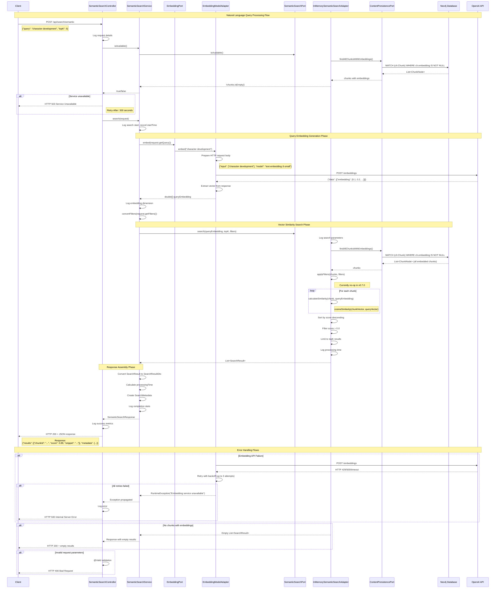

# Semantic Search Flow - Sequence Diagram

This diagram shows the complete flow when a user submits a Natural Language Query (NLQ) to the semantic search endpoint.



## Key Technical Details

### Embedding Generation
- Uses OpenAI-compatible API (configurable endpoint)
- Typical dimensions: 3072 for the current LoreVault embedding standard
- Includes retry logic with exponential backoff
- Falls back to empty vectors on failure (skipped in persistence)

### Vector Similarity Search
- **Current Implementation (v0.7.0)**: In-memory cosine similarity
- Loads all chunks with embeddings from Neo4j
- Calculates similarity: `dot(a,b) / (norm(a) * norm(b))`
- Returns scores from -1 to 1 (higher = more similar)

### Performance Characteristics
- **Query Embedding**: ~100-300ms (external API call)
- **Vector Search**: ~1-50ms depending on chunk count
- **Total Response Time**: Typically 200-500ms for small datasets

### Future Optimizations (Roadmap)
- Replace in-memory search with Neo4j vector indexes
- Add approximate nearest neighbor (ANN) algorithms
- Implement database-level filtering
- Add result caching for common queries

## Request/Response Examples

### Request
```json
{
  "query": "character development arc",
  "topK": 5,
  "threshold": 0.7,
  "filters": {
    "universe": "Cosmere",
    "bookNumber": 1
  }
}
```

### Response
```json
{
  "results": [
    {
      "chunkId": "uuid-1",
      "score": 0.89,
      "snippet": "The character's growth throughout the journey...",
      "chapterId": "chapter-uuid",
      "bookNumber": 1,
      "chapterNumber": 3
    }
  ],
  "metadata": {
    "query": "character development arc",
    "totalResults": 1,
    "returnedResults": 1,
    "processingTimeMs": 245
  }
}
```
