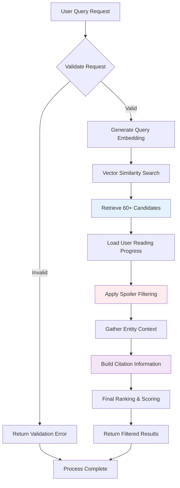

1 # Spoiler-Aware Retrieval Process Specification

**Purpose**: Define the step-by-step process for filtering and retrieving content based on user reading progress to prevent spoilers in multi-series fictional universes

**Scope**: Query processing workflow, filtering algorithms, progress tracking, and citation attribution. Excludes data model definitions and ingestion workflows.

**Dependencies**: 
- Neo4j Content Data Model - Node schemas and relationship patterns
- Architecture Document: Information Viewpoint (03-information-viewpoint.md) - Graph data strategy
- User Progress Tracking - Reading state management

## Process Overview

The spoiler-aware retrieval system ensures users only receive content from material they have already read, supporting complex multi-series universes where later books may reference earlier content. The process combines vector similarity search with publication coordinate filtering to deliver relevant, spoiler-safe results.

## Detailed Workflow

### Spoiler-Aware Semantic Search Process



### Step-by-Step Process Definition

#### 1. Query Preparation and Validation
- **Input**: User query text, user ID, universe context
- **Validation**: Verify user exists, universe is accessible, query is not empty
- **Embedding Generation**: Convert query text to vector representation
- **Error Handling**: Return HTTP 400 for invalid queries, HTTP 404 for missing users

#### 2. Vector Similarity Search (Oversample Phase)
- **Query Execution**: Perform vector similarity search against all chunks
- **Result Size**: Retrieve 60-100 candidates (3-5x target result count)
- **Scoring**: Include similarity scores for ranking
- **Performance Target**: Complete vector search within 200ms

#### 3. User Progress Loading
- **Data Retrieval**: Load current reading progress for all series in universe
- **Progress Format**: Extract bookOrder, chapterOrder, sceneIndex per series
- **Caching**: Cache progress data for session duration
- **Fallback**: Default to no progress (no content allowed) if loading fails

#### 4. Publication Coordinate Filtering
- **Primary Filter**: Apply per-series reading progress comparison
- **Cross-Series Filter**: Check `spoilsSeriesIds` arrays for interconnected content
- **Materialized Coordinates**: Use pre-calculated coordinates for performance
- **Filter Logic**: Allow content where chunk position ≤ user progress

#### 5. Entity Context Gathering
- **Relationship Traversal**: Follow Scene→Character relationships
- **Metadata Collection**: Gather character roles and confidence scores
- **Context Enrichment**: Add entity information to filtered chunks
- **Performance**: Batch relationship queries for efficiency

#### 6. Citation and Attribution Building
- **Hierarchy Traversal**: Collect complete publication coordinates
- **Citation Assembly**: Build structured citation objects
- **Source Attribution**: Enable jump-to-source navigation
- **UI Integration**: Include spoiler-safe citation display flags

#### 7. Final Ranking and Response
- **Score Combination**: Blend similarity scores with entity relevance
- **Result Limiting**: Return target number of results (typically 20)
- **Response Assembly**: Format results with scores, citations, and metadata
- **Performance Logging**: Track total query processing time

## State Management

### User Reading Progress State

**Progress Cursor per Series**:
```json
{
  "userId": "user-123",
  "universeId": "cosmere",
  "lastUpdated": "2025-08-10T14:30:00Z",
  "progress": [
    {
      "seriesId": "mistborn-era1",
      "bookOrder": 2,
      "chapterOrder": 15,
      "sceneIndex": 999999,
      "updatedAt": "2025-08-10T12:00:00Z"
    },
    {
      "seriesId": "stormlight",
      "bookOrder": 1,
      "chapterOrder": 45,
      "sceneIndex": 3,
      "updatedAt": "2025-08-09T18:30:00Z"
    }
  ]
}
```

**State Transitions**:
- **Progress Update**: User marks chapter/scene as read → Update coordinates
- **Series Completion**: User finishes series → Set final coordinates
- **Backtrack Reading**: User re-reads earlier content → No coordinate change
- **New Series**: User starts new series → Initialize progress at (1, 1, 0)

### Query Session State

**Session Context**:
- User reading progress (cached for session)
- Universe context and series mappings
- Query history and refinement state
- Performance metrics and timing data

**State Persistence**:
- Reading progress persisted to database
- Session state cached in memory
- Query context maintained for refinement
- Performance metrics logged for optimization

## Interface Specifications

### Input Request Format

```json
{
  "query": "What happens to Kaladin in the storms?",
  "userId": "user-123",
  "universeId": "cosmere",
  "maxResults": 20,
  "minScore": 0.7,
  "includeEntities": true,
  "citationFormat": "full"
}
```

### Response Format

```json
{
  "results": [
    {
      "chunkId": "chunk-uuid-123",
      "text": "Kaladin stumbled through the storm...",
      "score": 0.89,
      "citation": {
        "series": { "id": "stormlight", "name": "The Stormlight Archive" },
        "book": { "id": "book-1", "title": "The Way of Kings", "order": 1 },
        "chapter": { "id": "ch-14", "title": "Decisionpoint", "order": 14 },
        "scene": { "id": "scene-2", "index": 2 }
      },
      "characters": [
        { "name": "Kaladin", "role": "protagonist", "confidence": 0.95 },
        { "name": "Syl", "role": "mentioned", "confidence": 0.87 }
      ]
    }
  ],
  "metadata": {
    "totalCandidates": 67,
    "filteredCount": 23,
    "queryTime": 285,
    "spoilerCount": 44
  }
}
```

## Error Handling

### Query Processing Errors

**Invalid Query Parameters**
- **Trigger**: Missing required fields, invalid user ID, malformed query
- **Response**: HTTP 400 with specific validation errors
- **Recovery**: Client must correct parameters and resubmit
- **Logging**: Log validation failures for API improvement

**User Progress Loading Failures**
- **Trigger**: Database connection issues, corrupted progress data
- **Response**: Use conservative fallback (no content allowed)
- **Recovery**: Retry progress loading with exponential backoff
- **Escalation**: Allow manual progress reset if corruption detected

**Vector Search Failures**
- **Trigger**: Embedding service unavailable, index corruption, timeout
- **Response**: HTTP 503 with retry-after header
- **Recovery**: Implement circuit breaker pattern for embedding service
- **Fallback**: Use keyword search if vector search fails

### Filtering Process Errors

**Coordinate Inconsistency**
- **Trigger**: Materialized coordinates don't match hierarchy traversal
- **Detection**: Validation checks during filtering
- **Response**: Use conservative filtering (hierarchy traversal)
- **Recovery**: Schedule coordinate rematerialization job
- **Prevention**: Validate coordinates during chunk creation

**Cross-Series Spoiler Logic Errors**
- **Trigger**: Missing spoilsSeriesIds, circular dependencies
- **Detection**: Spoiler relationship validation
- **Response**: Apply safe default (filter out suspicious content)
- **Recovery**: Manual review of spoiler relationships
- **Quality Control**: Automated testing of spoiler logic

### Performance Degradation

**Slow Query Performance**
- **Trigger**: Query processing exceeds 500ms target
- **Detection**: Performance monitoring and alerting
- **Response**: Implement query circuit breakers and caching
- **Recovery**: Scale vector index or optimize filtering logic
- **Monitoring**: Track query performance distribution

**Memory Exhaustion**
- **Trigger**: Large result sets, complex entity relationships
- **Detection**: Memory usage monitoring
- **Response**: Implement result streaming and pagination
- **Recovery**: Reduce result set size and batch processing
- **Resource Management**: Limit concurrent query processing

## Performance Requirements

### Response Time Targets
- Vector similarity search: < 200ms
- Spoiler filtering operations: < 100ms
- Entity context gathering: < 50ms
- Total query processing: < 300ms

### Throughput Specifications
- Support 100 concurrent queries
- Process 1000 queries per minute
- Handle 50 queries per second sustained load
- Maintain response times under 95th percentile targets

### Resource Utilization
- Memory usage < 2GB per query processing instance
- CPU utilization < 70% under normal load
- Database connection pool < 80% utilization
- Cache hit ratio > 90% for user progress data

## Integration Points

### Vector Search Service
- **Input**: Query embedding, similarity threshold, result count
- **Output**: Ranked list of chunk IDs with similarity scores
- **Protocol**: gRPC or REST API with timeout handling
- **Error Handling**: Circuit breaker pattern with fallback strategies

### User Progress Service
- **Input**: User ID, universe context
- **Output**: Current reading progress coordinates per series
- **Caching**: Session-level caching with TTL expiration
- **Consistency**: Eventual consistency acceptable for progress updates

### Entity Extraction Service
- **Input**: Chunk IDs, entity relationship queries
- **Output**: Character and entity context with confidence scores
- **Batching**: Batch relationship queries for performance
- **Optional**: Degrade gracefully if entity service unavailable

## Validation Criteria

### Functional Validation
- ✅ Users only receive content within their reading progress
- ✅ Cross-series spoiler relationships are properly enforced
- ✅ Citation information enables accurate source attribution
- ✅ Query processing completes within performance targets
- ✅ Error conditions are handled gracefully with appropriate responses

### Performance Validation
- ✅ Vector similarity search completes within 200ms
- ✅ Spoiler filtering processes 1000+ chunks within 100ms
- ✅ Total query processing stays under 300ms for 95th percentile
- ✅ System maintains performance under concurrent load
- ✅ Memory usage remains within configured limits

### Quality Validation
- ✅ Spoiler filtering accuracy > 99.5% (verified by manual testing)
- ✅ Citation attribution matches source material exactly
- ✅ Entity context enhances result relevance without false positives
- ✅ Query results remain consistent across identical requests
- ✅ Error handling provides actionable feedback for troubleshooting
