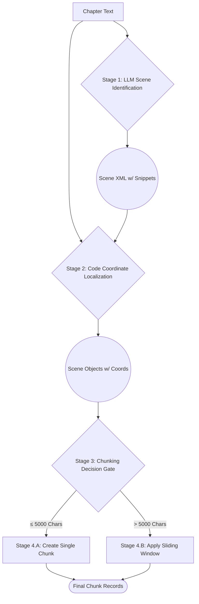

### **Specification: Chapter-to-Chunk Ingestion and Processing Workflow**

**Version**: 1.2  
**Date**: August 8, 2025

#### 1. Overview

This document specifies the end-to-end process for ingesting a raw `Chapter` text and decomposing it into structured `Scene` and `Chunk` components. AI-driven semantic analysis is decoupled from deterministic coordinate localization and chunk generation.

#### 2. Core Principles

  * Separation of Concerns: AI identifies scenes; application code localizes exact coordinates.
  * Semantic Coherence: `Scene` is the primary narrative unit; `Chunk` is a technical subdivision for downstream processing.
  * Processing Efficiency: A conditional logic gate avoids unnecessary subdivision of short scenes.

#### 3. Detailed Workflow

The process consists of four sequential stages.

##### Stage 1: Scene Identification (AI-powered)

  * Input: Full, unmodified text of a single `Chapter`.
  * Action: The chapter text is passed to the nlp-small model using an XML output template. The model returns scene candidates with snippet boundaries.
  * Output: XML containing a list of scenes with fields: `scene_index`, `context_summary`, `start_snippet`, `end_snippet`.

##### Stage 2: Coordinate Localization (Code-powered)

  * Input: The XML from Stage 1 and the original chapter text.
  * Action: Deterministic string matching locates the exact character positions of `start_snippet` and `end_snippet` within the chapter text. Validation ensures ordering and completeness.
  * Output: `Scene` objects with zero-indexed `[start, end)` character offsets.

##### Stage 3: Chunking Decision Gate

  * Input: A `Scene` with localized coordinates and extracted text.
  * Action: Compute the scene text length.
  * Decision Logic:
      * If length ≤ 5000 characters, proceed to Stage 4.A (single chunk).
      * If length > 5000 characters, proceed to Stage 4.B (multi-chunk sliding window).

##### Stage 4: Chunk Generation

Two possible paths based on Stage 3.

  * Stage 4.A: Single-Chunk Creation
      * Trigger: Scene length ≤ 5000 characters.
      * Action: Create one `Chunk` identical to the scene span; coordinates match the scene.
      * Output: One `Chunk` persisted and linked to the parent `Scene`.

  * Stage 4.B: Multi-Chunk Subdivision
      * Trigger: Scene length > 5000 characters.
      * Action: Apply sentence-aware sliding window segmentation.
          * Target chunk size: approximately 2000–4000 characters (configurable; default target 3000).
          * Overlap: 15% (configurable) to preserve context across boundaries.
      * Output: Multiple `Chunk` records persisted and linked to the parent `Scene`.

#### 4. Data Flow Diagram

#### 5. Parameters (Current Defaults)

- Decision threshold: 5000 characters
- Target chunk size: 3000 characters
- Min/max chunk size: 2000 / 4000 characters
- Overlap: 15%

#### 6. Final State

The database contains `Chapter`, `Scene`, and `Chunk` records with accurate relational links and positional data. This structure is ready for downstream embedding and analysis stages.
