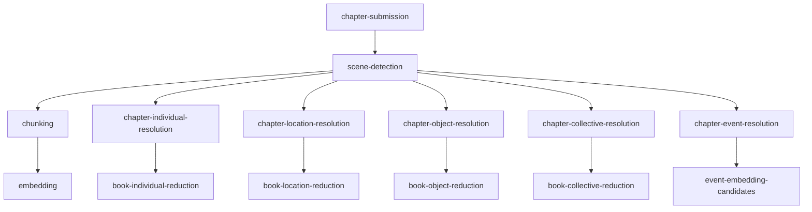

# CLI Module with Step-by-Step Pipeline Control

**Status:** SUPERSEDED — replaced by [Agent-Driven Step Execution API](agent-driven-step-execution-api.md). The CLI module will be removed; step execution moves to the REST API with `fireEvents` control.  
**Last Updated:** May 08, 2026

## Summary

A new `lorevault-cli` module that provides command-line access to domain logic, with the primary purpose of enabling step-by-step ingestion pipeline execution for substantive testing. The CLI runs pipeline steps sequentially and synchronously — calling core handler interfaces directly, bypassing Spring ApplicationEvents — so a developer can submit a chapter, run scene detection, verify results in Neo4j, then run the next step, all from the command line.

## Problem

Integration testing with TestContainers cannot reliably replicate the full complexity of the ingestion pipeline. The pipeline involves LLM calls, async event-driven fan-out, and multi-branch fan-in — making it difficult to verify that a specific step produces correct output in isolation. When a step produces unexpected results, the current options are:

1. Re-ingest the entire chapter (expensive in LLM cost and time)
2. Write ad hoc scripts against the REST API (fragile, no step-level control)
3. Inspect Neo4j manually after a full pipeline run (no way to stop between steps)

There is no mechanism to:

- Submit a chapter without triggering the full pipeline
- Run a single pipeline step and inspect its output
- Rerun a specific step after code changes
- Verify that prerequisite data exists before running a step
- Execute the pipeline through a specific step and stop

## Product Context

- Developers and operators need a faster feedback loop for pipeline step verification
- The operator dashboard brainstorm (see links) identifies selective step rerun as a key devx need
- Step-by-step execution enables targeted regression testing: change code for one step, rerun only that step, verify results
- CLI-driven testing is scriptable and composable in ways that a web UI is not
- The CLI is primarily a developer/operator tool, not an end-user product

## Technical Context

### Current pipeline architecture

The ingestion pipeline is event-driven. `IngestionService.submitChapter()` creates a job and publishes `ChapterIngestionEvent`, which triggers `SceneDetectionHandler`, which publishes `ScenesDetectedEvent`, which fans out to 6 parallel branches. Each handler is a Spring `@Async @EventListener` that cannot be called directly.

The pipeline has 13 steps with a DAG dependency structure:



### Handler thickness

Handlers vary in how much logic they contain versus delegating to services:

| Handler | Thickness | Core logic location |
|---------|-----------|-------------------|
| SceneDetectionHandler | Thick | Inline: scene detection + triad + 6 persistence calls |
| ChunkingHandler | Thick | Inline: coordinate math, hash computation, DB linking |
| EmbeddingHandler | Medium | Delegates to service, gathers stats inline |
| Chapter*Resolution (4) | Thin | Pure delegate to `*ResolutionService.resolveChapter()` |
| Book*Reduction (4) | Thin | Pure delegate to `*ReductionService.resolveBook()` |
| ChapterEventResolutionHandler | Thick | Two-step orchestration (coref + aggregation) |
| ChapterEventEmbeddingHandler | Thick | Inline data transforms between service calls |

### Related prior work

- The StageRun DAG brainstorm proposes persisted orchestration state for crash recovery and observability. The CLI step runner is complementary: it provides synchronous invocation for testing, while StageRun provides durable state for production recovery.
- The operator dashboard brainstorm identifies selective step rerun as a Phase 2 capability. The CLI provides this capability immediately without requiring a web UI.
- The existing `PipelineStageSupport` class provides failure handling and status tracking that the CLI can reuse.

### Module structure

The repo is a Maven multi-module project:

```
lorevault-parent
  lorevault-core    (domain logic, services, persistence)
  lorevault-web     (Spring Boot web application)
```

The CLI module would be a new sibling module at the same level as `lorevault-web`, depending on `lorevault-core`.

## Scope

### In scope

- New `lorevault-cli` Maven module with Picocli-based commands
- `StepCatalog` — declarative registry of pipeline steps, their dependencies, and prerequisite checks (CLI-exclusive concept)
- `StepOrchestrator` — synchronous sequential execution engine that calls core handler interfaces directly, no event publishing (CLI-exclusive concept)
- Handler interface extraction — single-method interfaces for each pipeline handler, with `@EventListener` delegating to `execute()`
- `prepare` command — submit a chapter without triggering the pipeline
- `run-step` command — run a single pipeline step synchronously
- `run-pipeline` command — run the pipeline through a specific step (with prerequisites)
- `check-prerequisites` command — verify that prerequisite data exists for a step
- `steps` command — list available steps and their dependency structure
- Library, search, ask, and health commands for non-pipeline domain access

### Out of scope

- StageRun DAG persistence (that belongs to the StageRun brainstorm proposal)
- Operator dashboard UI (that belongs to the operator dashboard brainstorm)
- Admin API namespace migration (that belongs to the operator dashboard brainstorm)
- LLM call result caching/replay (future optimization, not needed for first slice)
- Production deployment of the CLI module (developer/operator tool only)
- Replacing the existing async pipeline (the CLI runs steps synchronously alongside the existing event-driven pipeline)
- `inspect` commands for querying intermediate Neo4j results (query Neo4j directly for now; add later if needed)

## Solution Design

### Key design decisions

**Steps are a CLI-exclusive concept.** `StepKey`, `StepCatalog`, `StepOrchestrator`, and `StepResult` live in `lorevault-cli`. Core has no concept of "steps" — it has callable handler interfaces named `*Operation` (e.g., `SceneDetectionOperation`). The CLI maps those interfaces to named steps with dependency declarations.

**Sequential synchronous execution.** The CLI calls handler interface methods directly, in sequence, synchronously. No Spring ApplicationEvents are published. `run-step scene-detection` calls the handler's `execute()` method and returns. `run-pipeline --through embedding` calls scene-detection, then chunking, then embedding — in order, one after another. No fan-out, no async.

**Handler interface pattern.** Each pipeline handler implements a single-method interface (e.g., `SceneDetectionOperation.execute(jobId, chapterId)`). The naming is intentional: `*Operation` describes the domain work the handler performs, without leaking CLI-specific concepts like "step" or "batch" into core. The existing `@Async @EventListener` method becomes a thin adapter that extracts event fields, calls `execute()`, and publishes downstream events. The CLI calls `execute()` directly — no new service classes, no event publishing. All handler interfaces return a shared `StepResult` record — the 13 steps are far more similar than different (8 are structurally identical, the other 5 differ only in integer count fields), and the orchestrator only needs success/failure, a summary, and counts.

**Job tracking still works.** The `IngestionJob` + `StatusRecord` model still applies — the CLI updates it synchronously instead of through async events. Same outcomes, different execution model. The `prepare` command creates the job; each `run-step` command updates the job status.

**Book-scoped steps require explicit `--book`.** Steps like `book-individual-reduction` operate at the book level. The CLI requires `--book <id>` for these steps — no inference from chapter. Semantic clarity over convenience.

**Skip by default.** `run-pipeline --through` skips steps whose prerequisite data already exists. This is a conscious decision by the CLI user. If they changed the scene detection code and want to rerun it, they explicitly `run-step scene-detection`. There is no `--force` flag — steps must be run in DAG order.

**CLI provides the transaction.** The handler interface methods work within whatever transaction the caller provides. The CLI wraps calls in a Spring `@Transactional` context where needed.

### Architecture

```
lorevault-cli
  src/main/java/com/lorevault/api/cli/
    LoreVaultCliApplication.java       Spring Boot (WebApplicationType.NONE)
    step/
      StepKey.java                     enum of all pipeline step identifiers
      StepDefinition.java             key, prerequisites, data checks, invoker, description
      StepCatalog.java                 registry of step definitions with DAG traversal
      StepOrchestrator.java           prerequisite checking, synchronous invocation, dependency resolution
      StepContext.java                 execution context (chapterId, bookId, jobId)
    commands/
      LibraryCommand.java              universe/series/book CRUD
      IngestCommand.java               prepare, status, list
      StepCommand.java                run-step, run-pipeline, check-prerequisites, steps
      SearchCommand.java              semantic search
      AskCommand.java                  RAG Q&A
      HealthCommand.java              system health
    output/
      Format.java                      JSON/table rendering

lorevault-core (refactoring: handler interface extraction)
  ingestion/
    scene/
      SceneDetectionOperation.java     interface: execute(jobId, chapterId) -> StepResult
      SceneDetectionHandler.java        implements SceneDetectionOperation, @EventListener delegates to execute()
    chunk/
      ChunkingOperation.java           interface: execute(jobId, chapterId) -> StepResult
      ChunkingHandler.java              implements ChunkingOperation, @EventListener delegates to execute()
    embedding/
      EmbeddingOperation.java           interface: execute(jobId, chapterId) -> StepResult
      EmbeddingHandler.java             implements EmbeddingOperation, @EventListener delegates to execute()
    resolution/individual/
      ChapterIndividualResolutionOperation.java   interface: execute(jobId, chapterId) -> StepResult
      BookIndividualReductionOperation.java      interface: execute(jobId, bookId) -> StepResult
    resolution/location/
      ChapterLocationResolutionOperation.java     interface: execute(jobId, chapterId) -> StepResult
      BookLocationReductionOperation.java         interface: execute(jobId, bookId) -> StepResult
    resolution/object/
      ChapterObjectResolutionOperation.java       interface: execute(jobId, chapterId) -> StepResult
      BookObjectReductionOperation.java            interface: execute(jobId, bookId) -> StepResult
    resolution/collective/
      ChapterCollectiveResolutionOperation.java    interface: execute(jobId, chapterId) -> StepResult
      BookCollectiveReductionOperation.java        interface: execute(jobId, bookId) -> StepResult
    resolution/event/
      ChapterEventResolutionOperation.java         interface: execute(jobId, chapterId) -> StepResult
      ChapterEventResolutionHandler.java     implements ChapterEventResolutionOperation, @EventListener delegates to execute()
      EventEmbeddingOperation.java                  interface: execute(jobId, chapterId) -> StepResult
      ChapterEventEmbeddingHandler.java       implements EventEmbeddingOperation, @EventListener delegates to execute()
    pipeline/
      StepResult.java                     shared result record: success, stepName, summary, counts, durationMs
```

The handler interface pattern is the same for all 13 steps, regardless of handler thickness:

```java
// Interface in core
public interface SceneDetectionOperation {
    StepResult execute(UUID jobId, UUID chapterId);
}

// Handler implements interface, @EventListener delegates to execute()
@Component
public class SceneDetectionHandler implements SceneDetectionOperation {

    @Override
    public StepResult execute(UUID jobId, UUID chapterId) {
        // All the orchestration logic that was inline in the handler
        // Returns StepResult with success, summary, counts, duration
    }

    @Async("ingestionTaskExecutor")
    @TransactionalEventListener(AFTER_COMMIT)
    public void onChapterIngestion(ChapterIngestionEvent event) {
        var result = execute(event.getJobId(), event.getChapterId());
        applicationEventPublisher.publishEvent(new ScenesDetectedEvent(...));
    }
}
```

The CLI injects `SceneDetectionOperation` and calls `execute()` directly. No new service classes, no event publishing, no async execution. All interfaces return `StepResult`.

### Step catalog

Each pipeline step is declared as a `StepDefinition` with:

| Field | Purpose |
|-------|---------|
| `key` | `StepKey` enum value |
| `prerequisites` | Set of `StepKey` values that must complete before this step |
| `dataChecks` | Neo4j queries or repository calls to verify prerequisite data exists |
| `invoker` | Reference to the handler interface (e.g., `SceneDetectionOperation`) that the `StepOrchestrator` calls via `execute()` |
| `description` | Human-readable description for CLI help text |

The dependency DAG:

```
SCENE_DETECTION                    (prerequisites: none)
CHUNKING                           (prerequisites: SCENE_DETECTION)
EMBEDDING                          (prerequisites: CHUNKING)
CHAPTER_INDIVIDUAL_RESOLUTION      (prerequisites: SCENE_DETECTION)
BOOK_INDIVIDUAL_REDUCTION          (prerequisites: CHAPTER_INDIVIDUAL_RESOLUTION)
CHAPTER_LOCATION_RESOLUTION       (prerequisites: SCENE_DETECTION)
BOOK_LOCATION_REDUCTION            (prerequisites: CHAPTER_LOCATION_RESOLUTION)
CHAPTER_OBJECT_RESOLUTION          (prerequisites: SCENE_DETECTION)
BOOK_OBJECT_REDUCTION              (prerequisites: CHAPTER_OBJECT_RESOLUTION)
CHAPTER_COLLECTIVE_RESOLUTION      (prerequisites: SCENE_DETECTION)
BOOK_COLLECTIVE_REDUCTION          (prerequisites: CHAPTER_COLLECTIVE_RESOLUTION)
CHAPTER_EVENT_RESOLUTION           (prerequisites: SCENE_DETECTION)
EVENT_EMBEDDING_CANDIDATES          (prerequisites: CHAPTER_EVENT_RESOLUTION)
```

### StepOrchestrator

The orchestrator provides three operations:

1. **`checkPrerequisites(stepKey, context)`** — queries Neo4j to verify that prerequisite data exists. Returns which prerequisites are met and which are missing.

2. **`runStep(stepKey, context)`** — invokes a single step synchronously. Checks prerequisites first (enforced, no bypass). Calls the handler interface's `execute()` method directly. Returns the domain-specific result type.

3. **`runPipelineThrough(targetStep, context)`** — resolves the transitive prerequisite chain, runs all steps from the beginning through the target step in DAG order. Skips steps whose prerequisite data already exists (idempotent).

### Handler interface extraction

Each pipeline handler gets a single-method interface. The handler implements the interface, and the `@EventListener` method becomes a thin adapter that extracts event fields, calls `execute()`, and publishes downstream events.

**For thin handlers** (8 of 13 — the chapter-level resolution and book-level reduction handlers), the interface method simply delegates to the existing service call. The refactoring is minimal:

```java
// Before
@Component
public class ChapterIndividualResolutionHandler {
    @Async("ingestionTaskExecutor")
    @EventListener
    public void onScenesDetected(ScenesDetectedEvent event) {
        var result = chapterIndividualResolutionService.resolveChapter(event.getChapterId());
        applicationEventPublisher.publishEvent(new ChapterIndividualsResolvedEvent(...));
    }
}

// After
public interface ChapterIndividualResolutionOperation {
    StepResult execute(UUID jobId, UUID chapterId);
}

@Component
public class ChapterIndividualResolutionHandler implements ChapterIndividualResolutionOperation {
    @Override
    public StepResult execute(UUID jobId, UUID chapterId) {
        var result = chapterIndividualResolutionService.resolveChapter(chapterId);
        return StepResult.success("chapter-individual-resolution",
            Map.of("rawMentionsProcessed", result.rawMentionsProcessed(),
                   "chapterIndividualsCreated", result.chapterIndividualsCreated()),
            result.message());
    }

    @Async("ingestionTaskExecutor")
    @EventListener
    public void onScenesDetected(ScenesDetectedEvent event) {
        var result = execute(event.getJobId(), event.getChapterId());
        applicationEventPublisher.publishEvent(new ChapterIndividualsResolvedEvent(...));
    }
}
```

**For thick handlers** (5 of 13), the interface method contains the orchestration logic that was previously inline in the `@EventListener` method. The `@EventListener` method becomes a thin adapter:

```java
public interface SceneDetectionOperation {
    StepResult execute(UUID jobId, UUID chapterId);
}

@Component
public class SceneDetectionHandler implements SceneDetectionOperation {
    @Override
    public StepResult execute(UUID jobId, UUID chapterId) {
        // All the logic that was inline in onChapterIngestion()
        // scene detection, triad analysis, persistence, etc.
        // Returns StepResult with success, summary, counts, duration
    }

    @Async("ingestionTaskExecutor")
    @TransactionalEventListener(AFTER_COMMIT)
    public void onChapterIngestion(ChapterIngestionEvent event) {
        var result = execute(event.getJobId(), event.getChapterId());
        applicationEventPublisher.publishEvent(new ScenesDetectedEvent(...));
    }
}
```

The CLI injects the interface (`SceneDetectionStep`, `ChunkingStep`, etc.) and calls `execute()` directly. No new service classes, no duplication, no behavioral change to the existing pipeline.

| Handler | Interface | Refactoring effort |
|---------|-----------|-------------------|
| SceneDetectionHandler | `SceneDetectionOperation` | Thick — move inline logic to `execute()` |
| ChunkingHandler | `ChunkingOperation` | Thick — move inline logic to `execute()` |
| EmbeddingHandler | `EmbeddingOperation` | Medium — move service call + stats to `execute()` |
| ChapterIndividualResolutionHandler | `ChapterIndividualResolutionOperation` | Thin — wrap existing service call |
| BookIndividualReductionHandler | `BookIndividualReductionOperation` | Thin — wrap existing service call |
| ChapterLocationResolutionHandler | `ChapterLocationResolutionOperation` | Thin — wrap existing service call |
| BookLocationReductionHandler | `BookLocationReductionOperation` | Thin — wrap existing service call |
| ChapterObjectResolutionHandler | `ChapterObjectResolutionOperation` | Thin — wrap existing service call |
| BookObjectReductionHandler | `BookObjectReductionOperation` | Thin — wrap existing service call |
| ChapterCollectiveResolutionHandler | `ChapterCollectiveResolutionOperation` | Thin — wrap existing service call |
| BookCollectiveReductionHandler | `BookCollectiveReductionOperation` | Thin — wrap existing service call |
| ChapterEventResolutionHandler | `ChapterEventResolutionOperation` | Thick — two-step orchestration to `execute()` |
| ChapterEventEmbeddingHandler | `EventEmbeddingOperation` | Thick — inline data transforms to `execute()` |

All interfaces return `StepResult`. The 13 steps are far more similar than different — 8 are structurally identical (success flag + counts + message), and the other 5 differ only in how many integer counts they carry. The orchestrator only needs success/failure, a summary, and counts.

### The `prepare` command

The current `IngestionService.submitChapter()` creates a job and immediately publishes `ChapterIngestionEvent`, triggering the full pipeline. For step-by-step testing, we need a variant:

```java
public IngestionSubmissionResult prepareChapter(
    UUID bookId, Integer chapterNumber, String chapterTitle, String chapterText) {
    // Same validation and chapter persistence as submitChapter
    // Same IngestionJob creation
    // Does NOT publish ChapterIngestionEvent
    // Returns jobId + chapterId for step-by-step execution
}
```

### CLI commands

```
lorevault ingest prepare --book <id> --chapter <n> --title <t> --file <path>
  Create chapter + job without triggering pipeline. Returns jobId + chapterId.

lorevault ingest steps
  List all pipeline steps with dependency info.

lorevault ingest check-prerequisites --step <step> --chapter <id>
  Verify prerequisite data exists in Neo4j.

lorevault ingest run-step <step> --chapter <id> [--book <id>]
  Run a single pipeline step synchronously.
  --book: required for book-scoped steps (book-*-reduction, event-embedding-candidates)
  Prerequisites must be met; steps cannot be run out of DAG order.

lorevault ingest run-pipeline --through <step> --chapter <id> [--book <id>]
  Run all steps from start through the target step.
  Skips steps whose prerequisite data already exists.

lorevault ingest run-pipeline --chapter <id> [--book <id>]
  Run the full pipeline (synchronous, sequential).

lorevault ingest status <jobId>
  Show job status.

lorevault ingest list [--universe U] [--status S]
  List ingestion jobs.

lorevault library universe create <name>
lorevault library series create <universe> <name>
lorevault library book create <series> <number> <title>

lorevault search <query> [--topK N] [--threshold X] [--universe U]
lorevault ask <question> [--mode baseline|graph-aware|hybrid]

lorevault health
```

### Prerequisite data checks

Each step declares what data must exist in Neo4j before it can run:

| Step | Prerequisite check | Scope |
|------|-------------------|-------|
| SCENE_DETECTION | Chapter exists | chapter |
| CHUNKING | Scenes exist for chapter | chapter |
| EMBEDDING | Chunks exist for chapter | chapter |
| CHAPTER_INDIVIDUAL_RESOLUTION | Scenes exist for chapter | chapter |
| BOOK_INDIVIDUAL_REDUCTION | ChapterIndividuals exist for chapter | book |
| CHAPTER_LOCATION_RESOLUTION | Scenes exist for chapter | chapter |
| BOOK_LOCATION_REDUCTION | ChapterLocations exist for chapter | book |
| CHAPTER_OBJECT_RESOLUTION | Scenes exist for chapter | chapter |
| BOOK_OBJECT_REDUCTION | ChapterObjects exist for chapter | book |
| CHAPTER_COLLECTIVE_RESOLUTION | Scenes exist for chapter | chapter |
| BOOK_COLLECTIVE_REDUCTION | ChapterCollectives exist for chapter | book |
| CHAPTER_EVENT_RESOLUTION | Scenes exist for chapter | chapter |
| EVENT_EMBEDDING_CANDIDATES | ChapterEvents exist for chapter | book |

Book-scoped steps require `--book <id>`. Chapter-scoped steps require `--chapter <id>`.

### Relationship to StageRun DAG

The StageRun DAG brainstorm proposes persisted `StageRun` nodes as durable orchestration state for crash recovery and observability. The CLI step runner is complementary but independent:

- **StageRun DAG** — durable orchestration state for production recovery. Answers: "what ran, what failed, what's pending?"
- **CLI step runner** — synchronous invocation for testing. Answers: "run this step now and show me the result."

The CLI does not need the StageRun DAG to work. When the StageRun DAG is implemented later, the CLI can be enhanced to:
- Query `StageRun` status instead of checking Neo4j directly
- Create `StageRun` records for CLI-initiated runs (with `triggerType: MANUAL`)
- Use `StageRun` history to show what has been run before

**Recommendation:** Build the CLI step-by-step capability first. It is immediately useful for testing and does not block the StageRun DAG. When the StageRun DAG is implemented, the CLI can adopt it as an alternative prerequisite check mechanism.

### Idempotency

Running a step twice should produce the same result. The existing handlers already have idempotency checks (e.g., "if scenes exist, skip"). The CLI respects these checks. Steps cannot be run out of DAG order — prerequisite checks are always enforced.

### Job tracking

CLI-initiated step runs update the `IngestionJob` and `StatusRecord` created by `prepare`. Each `run-step` command updates the job status. This provides observability and aligns with the StageRun DAG future.

### Synchronous execution model

The CLI runs steps sequentially and synchronously. No Spring ApplicationEvents are published. The `StepOrchestrator` calls handler interface methods directly, one after another, in DAG dependency order. This means:

- `run-step scene-detection` runs scene detection and returns. No downstream steps are triggered.
- `run-pipeline --through embedding` runs scene-detection, then chunking, then embedding — sequentially, in that order.
- The existing async pipeline is untouched. The CLI is a separate execution path.

The `IngestionCompletionCoordinator` is not involved in CLI-initiated runs. The CLI does not need fan-in because it runs steps explicitly and sequentially.

## Phased Implementation

### Phase 1 — Module scaffold and step catalog

- Create `lorevault-cli` Maven module with Picocli
- `LoreVaultCliApplication` with `WebApplicationType.NONE`
- `StepKey` enum and `StepDefinition` records
- `StepCatalog` with DAG traversal
- `dev-cli.sh` script (mirrors `dev-api.sh` pattern)
- `steps` command

### Phase 2 — Handler interface extraction

- Define single-method interfaces for all 13 pipeline handlers (e.g., `SceneDetectionOperation.execute(jobId, chapterId)`)
- Refactor each handler to implement its interface: move inline logic to `execute()`, make `@EventListener` a thin adapter that calls `execute()` and publishes downstream events
- Thin handlers (8 of 13) are minimal — wrap existing service delegation
- Thick handlers (5 of 13) move orchestration logic from `@EventListener` body to `execute()`
- No behavioral change to the existing pipeline

### Phase 3 — StepOrchestrator and core commands

- `StepOrchestrator` with prerequisite checking and synchronous invocation
- `prepare` command (chapter submission without pipeline trigger)
- `run-step` command
- `check-prerequisites` command
- `run-pipeline` command

### Phase 4 — Utility commands

- `status` and `list` commands
- `library` commands
- `search` and `ask` commands
- `health` command

### Phase 5 — Integration testing

- Integration tests for step-by-step execution
- Verify idempotency (run same step twice)
- Verify prerequisite enforcement (run step without prerequisites)
- Verify `run-pipeline --through` respects DAG order and skips completed steps

## Delivery Slices

Each slice is independently deployable and useful. Slices 1-4 expand pipeline coverage. Slice 5 is orthogonal and can be built in any order.

### Slice 1: Submit + Scene Detection (~6h)

The first end-to-end milestone. You can prepare a chapter and run the most expensive LLM call in isolation.

| Deliverable | What |
|---|---|
| `lorevault-cli` module | Maven module, Picocli, `LoreVaultCliApplication` (NONE web), `dev-cli.sh` |
| `StepResult` | Shared result record in core |
| `SceneDetectionOperation` interface | In core, `execute(jobId, chapterId) -> StepResult` |
| `SceneDetectionHandler` refactored | Implements `SceneDetectionOperation`, `@EventListener` delegates to `execute()` |
| `StepKey`, `StepDefinition`, `StepCatalog` | With just `SCENE_DETECTION` registered |
| `StepOrchestrator` | Minimal: `runStep()` only |
| `prepare` command | `IngestionService.prepareChapter()` — submit without triggering pipeline |
| `run-step` command | Works for `scene-detection` only |
| `steps` command | Lists `scene-detection` with its dependency info |

**Milestone:** `lorevault ingest prepare --book $ID --chapter 1 --title "Ch1" --file ch1.txt` → `lorevault ingest run-step scene-detection --chapter $UUID` → inspect scenes in Neo4j.

### Slice 2: Content Lane — Chunking → Embedding (~4h)

Adds the content processing branch. You can now run the pipeline through embedding and verify chunks/vectors.

| Deliverable | What |
|---|---|
| `ChunkingOperation` interface + handler refactored | Thick handler extraction |
| `EmbeddingOperation` interface + handler refactored | Medium handler extraction |
| `StepCatalog` updated | `CHUNKING`, `EMBEDDING` with prerequisites |
| `check-prerequisites` command | Verify prerequisite data exists before running a step |
| `run-pipeline --through` command | Runs all steps from start through target, skipping completed ones |

**Milestone:** `lorevault ingest run-pipeline --through embedding --chapter $UUID` → scenes, chunks, and embeddings all created. Verify vectors in Neo4j.

### Slice 3: Entity Resolution — 8 Thin Handlers (~3h)

Adds all entity resolution and reduction steps. These are thin handlers — minimal refactoring, maximum coverage.

| Deliverable | What |
|---|---|
| 4 `Chapter*ResolutionOperation` interfaces | Thin — wrap existing service calls |
| 4 `Book*ReductionOperation` interfaces | Thin — wrap existing service calls |
| 8 handler refactorings | `@EventListener` delegates to `execute()` |
| `StepCatalog` updated | All 8 new steps with prerequisites |
| `--book` flag support | Book-scoped steps require `--book <id>` |

**Milestone:** `lorevault ingest run-step chapter-individual-resolution --chapter $UUID` → `lorevault ingest run-step book-individual-reduction --book $BOOK_ID` → inspect ChapterIndividuals and BookIndividuals in Neo4j.

### Slice 4: Event Resolution + Full Pipeline (~4h)

Completes the step catalog. The two remaining thick handlers plus the full pipeline command.

| Deliverable | What |
|---|---|
| `ChapterEventResolutionOperation` interface + handler refactored | Thick — two-stage orchestration (coref + aggregation) |
| `EventEmbeddingOperation` interface + handler refactored | Thick — inline data transforms between service calls |
| `StepCatalog` complete | All 13 steps registered |
| `run-pipeline` (full) command | Runs all steps to completion |

**Milestone:** `lorevault ingest run-pipeline --chapter $UUID` → full synchronous pipeline. Every step runs sequentially, every entity type is produced.

### Slice 5: Utility Commands (~3h)

Non-pipeline domain access. Independent of the step runner, can be built in parallel with any slice.

| Deliverable | What |
|---|---|
| `status` and `list` commands | `IngestionService.getJobStatus()` / `listJobs()` |
| `library` commands | Universe/Series/Book CRUD |
| `search` command | `SemanticSearchService.search()` |
| `ask` command | `RagService.ask*()` |
| `health` command | `SystemHealthService.isHealthy()` |

**Milestone:** `lorevault search "who is Frodo" --universe middle-earth` → semantic search from the CLI.

### Effort Summary

| Slice | Delivers | Effort | Cumulative |
|-------|----------|-------|------------|
| 1 | Prepare + scene detection | ~6h | ~6h |
| 2 | Content lane (chunking → embedding) | ~4h | ~10h |
| 3 | Entity resolution (8 thin handlers) | ~3h | ~13h |
| 4 | Event resolution + full pipeline | ~4h | ~17h |
| 5 | Utility commands | ~3h | ~20h |

## Known Constraints / Prior Findings

- The existing async pipeline must continue to work unchanged. The handler interface extraction preserves the `@EventListener` path; the CLI calls `execute()` directly.
- `SceneDetectionHandler` uses `@TransactionalEventListener(AFTER_COMMIT)`. The `execute()` method works within whatever transaction the caller provides. The CLI wraps calls in a `@Transactional` context. The `@EventListener` adapter continues to use `AFTER_COMMIT` for the async path.
- Book-level reduction steps use `BookReductionClaimService` for distributed locking. The CLI must handle claim contention gracefully (retry or report).
- The `IngestionCompletionCoordinator` tracks fan-in state in a `ConcurrentHashMap`. CLI-initiated step runs do not participate in fan-in. This is expected — the CLI runs steps explicitly and sequentially.
- LLM calls are expensive and slow. Step-by-step execution saves cost by not re-running steps whose output already exists.

## Resolved Decisions

- **`run-step` reuses the `IngestionJob` created by `prepare`.** No new job per invocation. The `prepare` command creates the job; `run-step` updates its status.
- **No `--force` flag.** Steps must be run in DAG order. Prerequisite checks are always enforced. If a user wants to rerun a step whose prerequisite data already exists, they use `run-step` directly — the idempotency checks in the handlers handle this naturally.
- **CLI module included in Maven build by default.** It's a developer tool that should always be buildable.
- **Shared `StepResult` return type.** All handler interfaces return `StepResult` — a shared record with `success`, `stepName`, `summary`, `counts` (`Map<String, Integer>`), and `durationMs`. The 13 steps are far more similar than different (8 are structurally identical, the other 5 differ only in integer count fields), and the orchestrator only needs success/failure, a summary, and counts. Domain-specific detail stays in the `summary` string and `counts` map.

## Success Criteria

- A developer can submit a chapter, run scene detection, verify results in Neo4j, then run chunking, verify chunks, and continue step by step — all from the command line.
- Running a step twice produces the same result (idempotency).
- Running a step without prerequisites reports which prerequisites are missing. Steps cannot be run out of DAG order.
- The existing async pipeline continues to work unchanged.
- The CLI module builds and runs without starting a web server.
- `run-pipeline --through <step>` correctly resolves and executes the transitive prerequisite chain, skipping steps whose prerequisite data already exists.

## Links

- [Ingestion pipeline pattern](../patterns/ingestion/ingestion-pipeline.md) — established pipeline step documentation
- [StageRun DAG brainstorm](../brainstorm/architecture/stage-run-dag-observability-and-recovery-brainstorm-april-2026.md) — proposed durable orchestration state
- [Operator dashboard brainstorm](../brainstorm/devx/2026-04-16_operator-dashboard-and-admin-api-brainstorm.md) — selective step rerun as a devx need
- [Provenance generation model brainstorm](../brainstorm/entity-pipelines/provenance-generation-model-brainstorm-april-2026.md) — replayability and invalidation semantics
- [Handler design contract](../rules/handler-design-contract.md) — handler ownership and retry safety rules
- [Ingestion concurrency model](../patterns/ingestion/ingestion-concurrency-model.md) — threading and ordering guarantees