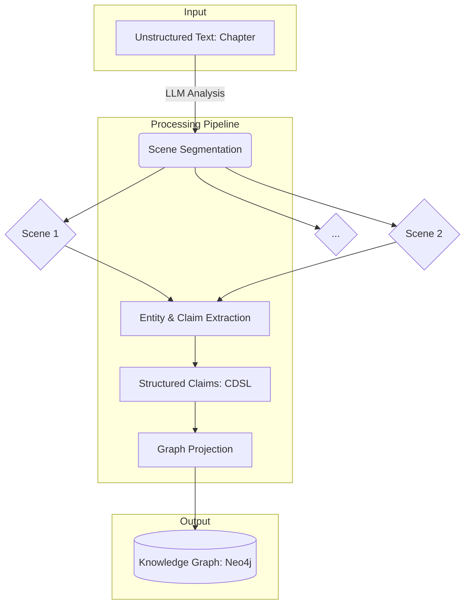
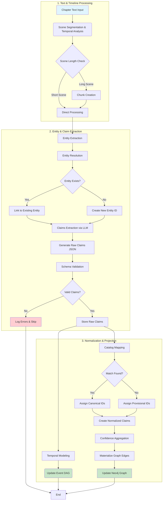

> **Research only - not an implementation target**

# LoreVault Claims–Entities Core Domain Model and Graph Process (POC)

This is the introduction and reference for LoreVault's core Claims–Entities model and the end‑to‑end graph‑building process. It consolidates decisions and rationales from prior design notes and fixes conflicts in favor of the current POC model.

## Goals and design rationale

- Preserve rich narrative context while producing a compact, queryable graph.
- Favor consensus over single-truth: aggregate many noisy, viewpointed claims.
- Be spoiler‑aware: gate knowledge by publication progress, not just canonical time.
- Keep the surface small: few entity kinds, three claim bins, boring IDs.
- Make events first‑class to anchor narrative time without overfitting timelines.
- Separate taxonomy (catalog) from extraction to minimize drift and ease curation.

## The ingestion process: from narrative to graph

LoreVault transforms unstructured narrative text into a queryable knowledge graph through a multi-stage process that begins with segmentation and builds up to entity relationships.



### Chapter → Scene segmentation

The foundation of our approach is **Scene** as the fundamental unit of narrative analysis. A Scene represents a coherent narrative segment with consistent:
- Time and place
- Character set  
- Narrative voice/perspective
- Thematic focus

Scenes are detected through LLM analysis of chapters, identifying natural breaks in the narrative flow. Each Scene becomes an **Event** entity in our graph—a temporal anchor point that can later be related to other Events via Allen interval relations.

### Entity extraction and graph projection intent

Within each Scene, we extract **Entities**—the people, places, objects, concepts, and events that populate the narrative universe. Our goal is to project these entities into a durable knowledge graph where:

- Entities persist across scenes and books  
- Relationships between entities are explicit and queryable
- The graph grows incrementally as new content is processed
- Multiple perspectives on the same facts can coexist

The challenge is handling the **shifting messages** inherent in prose: unreliable narrators, character opinions, gradual revelation of facts, and contradictory information. This is where **Claims** become essential.

### Claims: managing viewpoints and uncertainty

Rather than trying to extract a single "truth" from narrative text, we capture **Claims**—individual assertions made by sources (narrators, characters, documents) about entities and their relationships. Each Claim carries:

- **Source attribution**: who made this assertion
- **Certainty level**: how confident the source appears
- **Provenance**: exactly where in the text this came from
- **Qualifiers**: hedging, conditions, specifics

Claims aggregate over time into consensus facts. If multiple reliable sources assert that "Spock is half-Vulcan" with high certainty, this becomes a confident edge in the graph. If sources contradict each other, we preserve both viewpoints and mark the relationship as "contested."

### Three-bin claim structure

Claims fall into three fundamental patterns:

1. **Ascription** — "subject has/is property=value"
   - `Luke has force_sensitivity=high`
   - `Alien endoskeleton composed_of=silica`

2. **Relation** — "subject relates_to object via relationship"
   - `Luke participated_in=Battle of Hoth`
   - `Tatooine located_in=Outer Rim`

3. **Comparison** — "subject vs target on dimension"
   - `Luke force_sensitivity > Han force_sensitivity`
   - `Imperial destroyer size > Rebel cruiser size`

This three-bin structure captures the fundamental ways entities can relate while keeping the model tractable.

## Temporal modeling: Events as narrative anchors

### The Event DAG (Directed Acyclic Graph)

Narrative time forms a **partial order** rather than a linear timeline. Events can be:
- Sequential (A happens before B)
- Concurrent (A happens during B)  
- Nested (A contains B)
- Causally related (A enables B)

We model this as a DAG using **Allen interval relations**:
- `before/after`: sequential ordering
- `during/contains`: nesting relationships  
- `overlaps`: partial temporal overlap
- `meets`: adjacent events
- `equals`: same timespan

**Rationale for DAG**: Narratives rarely provide complete temporal information. Characters may reference events out of order, flashbacks create non-linear revelation, and some events have ambiguous timing. A DAG preserves what we know while allowing for incomplete information and future refinement.

### Event granularity spectrum

Events exist at multiple granularities:

- **Scene-level**: "The Battle of Hoth" (our starting point)
- **Higher-order**: "The Galactic Civil War" (spans multiple books)
- **Lower-order**: "Luke fires his blaster" (extracted from detailed scenes)

Scene segmentation gives us natural Event boundaries, but the system can extract finer or coarser events as Claims warrant. A scene with many character interactions might spawn multiple events; an entire chapter describing "The Ancient Times" might be one event.

### Events anchor Claims

Events serve as temporal anchors for other Claims. Rather than trying to assign absolute timestamps, we attach Claims to Events:

- `Claim: "Luke is strong" anchored_to=Battle_of_Hoth`
- `Event: Battle_of_Hoth before=Empire_Strikes_Back_ending`

This creates a web of relative temporal relationships that can answer queries like "What did we know about Luke's abilities by the end of Empire Strikes Back?"

## Scene Analysis and Skeleton Timeline

A foundational "skeleton" timeline is constructed during the initial chapter ingestion, providing a robust temporal backbone for all subsequent analysis. This is achieved by treating each detected scene as a structural `Event` and establishing its relationship to the previous scene.

### LLM-Powered Scene Segmentation

During chapter processing, the LLM is responsible for:
1.  **Segmentation**: Identifying the boundaries of each scene in order.
2.  **Temporal Relation**: Determining the temporal relationship of each new scene to the one immediately preceding it, using the Allen interval relations.
3.  **Certainty Classification**: Classifying its confidence in the temporal link not with a vague number, but with a structured `CertaintyLevel` enum (`Explicit`, `StronglyImplied`, `WeaklyImplied`, `Heuristic`).
4.  **Rationale**: Providing the specific text from the source that justifies the temporal link and certainty level.
5.  **Flagging**: Identifying non-linear narrative structures like flashbacks or parallel points-of-view.

The ingestion service then converts the `CertaintyLevel` into a durable, calibrated numerical weight for graph analysis. The default assumption for consecutive scenes is `meets` with a `Heuristic` certainty, which can be easily overridden by stronger textual evidence.

### Cross-Chapter and Cross-Book Context

To ensure timeline continuity, the ingestion process provides the LLM with context from previous content:
-   **Cross-Chapter**: When processing Chapter N, a summary of the final scene of Chapter N-1 is included in the prompt.
-   **Cross-Book**: When processing Book M, a summary of the final scene of Book M-1 can be provided.

This allows the LLM to establish an explicit temporal link (e.g., `meets`, `before`) across boundaries, preventing temporal gaps and correctly handling multi-part narratives.

## Canonical JSON for Claims

While a human-readable DSL is useful for examples, the canonical, machine-parseable format for claims extracted by the LLM is **JSON**, validated against a strict schema. This ensures data quality and decouples the extraction process from the taxonomy management.

### The Two-Phase Vocabulary Process

The system is designed to recognize that property and relation *identities* are not known at the moment of extraction. The process is therefore split into two phases:

1.  **Extraction to Raw Claims**: The LLM extracts claims containing `propertyDescription` and `relationDescription` fields—natural language descriptions of the relationship (e.g., `"home planet is"`, `"participated in"`). Entity IDs, however, *are* known at this stage, as they are resolved just prior to claim extraction.
2.  **Mapping to Normalized Claims**: A downstream "Catalog Mapping" service takes the raw claims and matches the descriptions against the official taxonomy using vector and keyword search. It then replaces the description fields with the canonical `propertyId` and `relTypeId`.

This two-phase approach makes the LLM's job simpler and more reliable, while centralizing the difficult task of taxonomy alignment.

### Example Raw Claim (JSON)

```json
{
  "type": "relation",
  "subjectId": "E:person/luke",
  "relationDescription": "participated in",
  "objectId": "E:event/battle_of_hoth",
  "certainty": 0.95,
  "source": { "role": "narrator" },
  "pub": { "..."},
  "offsets": { "start": 1024, "end": 1050 }
}
```

This raw claim is stored as immutable evidence. After catalog mapping, a new, "normalized" version is created for graph projection.

## End-to-end ingestion pipeline

### Visual flow diagram



### Detailed pipeline stages

1.  **Scene Segmentation & Temporal Analysis**: The LLM identifies scene boundaries and determines the temporal relationship (`meets`, `before`, etc.) between each scene and the previous one, creating a "skeleton timeline".
2.  **Entity Extraction**: Identify all mentioned entities (people, places, objects, events, etc.) within each scene.
3.  **Entity Resolution**: Match mentions to existing entities in the knowledge graph or create new canonical entity IDs.
4.  **Claims Extraction**: The LLM extracts ascriptions, relations, and comparisons, outputting them as a structured JSON document. This "raw claim" uses natural language `propertyDescription` and `relationDescription` fields.
5.  **Schema Validation**: The raw claims JSON is validated against the official schema to ensure structural integrity before further processing.
6.  **Store Raw Claims**: The validated, raw claims are stored as immutable, append-only evidence.
7.  **Temporal Modeling**: The temporal relationships from the skeleton timeline are processed to create or update the Event DAG in the graph.
8.  **Catalog Mapping**: The `propertyDescription` and `relationDescription` from the raw claims are matched against the vocabulary in the Catalog service to find the corresponding canonical `propertyId` and `relTypeId`.
9.  **Confidence Aggregation**: The system computes a consensus confidence score for facts that have multiple claims supporting or denying them.
10. **Edge Materialization**: Graph edges representing facts, properties, and relationships are created or updated when their aggregated confidence exceeds a defined threshold.
11. **Spoiler Gating**: All materialized edges are tagged with detailed publication coordinates to enable spoiler-aware queries.

### The feedback loop

As claims accumulate, patterns emerge:
- Frequent provisional properties get promoted to canonical
- Entity disambiguation improves with more context
- Confidence thresholds can be tuned based on human review
- Temporal relationships become more complete

This creates a **self-improving system** where early extractions inform later processing while maintaining complete audit trails.

## Supporting technical components

Now that we've established the ingestion flow, let's detail the supporting components that make this process work.

### Entity taxonomy (cardinal kinds)

An Entity kind is a bounded, mutually distinguishable concept; together they're expressive enough for narrative universes:

- **Individual**: personal agency (persons, sentient AIs)
- **Collective**: collective agency (factions, organizations, teams, governments)
- **Object**: inanimate materials, tools, artifacts, structures
- **Location**: spatial references (places, regions, coordinates)
- **Concept**: abstract categories and ideas; includes biological classifications (Species)
- **Event**: temporal occurrences (happenings, sequences, arcs)

**Notes and rationale**:
- Species as Concept: biological taxonomy (e.g., Vulcan) is conceptual, not an acting collective.
- Subtypes are allowed (e.g., `:Spaceship` is an `:Object` and an `:Entity`) via labels/tags; keep the root set small.
- Claim is not a cardinal entity kind. Claims are append‑only provenance records and may be projected as nodes for explainability but are not part of the `:Entity` taxonomy.

### ID conventions

- Entities: `E:<kind>/<slug>` (e.g., `E:individual/kaladin`, `E:location/urithiru`, `E:concept/vulcan`)
- Properties: `P:<facet>` (e.g., `P:body.composition`, `P:physical.strength`)
- Relation types: `R:<type>` (e.g., `R:participated_in`, `R:located_in`)
- Claims: `C:<opaque-or-local-id>` (e.g., `C:bk1-ch1-s1-0003`)

### Detailed claim model (three bins)

All claims carry: `sourceId`, `subjectId`, `certainty (0..1)`, `polarity (assert|deny, default assert)`, `qualifiers?`, `pubCoords`, `chunkId`, `offsets`.

- **Ascription** — "subject has/is …"
  - Fields: `propertyId` (from catalog), `value` (typed literal or `objectId`), `subjectivity? (0..1)`
- **Relation** — "subject relates_to object (type)"
  - Fields: `relTypeId`, `objectId`
- **Comparison** — "subject vs target along property"
  - Fields: `propertyId`, `op (lt|gt|≈|=)`, `targetId`

**Ability consolidation**: "Ability" is an Ascription (e.g., `P:ability.*`) with optional `qualifiers.actions` for verb lists. A DSL `Ability(...)` shorthand may normalize to Ascription.

**Other node types**:
- Value: literal carrier node for typed values (text/number/date), target of ascriptions when not an entity.
- Claim: append‑only provenance records; may be projected as lightweight nodes but are not `:Entity`.

### Publication coordinates

Used for spoiler gating, reproducibility, and cross‑work federation.

**Minimum fields (POC)**:
- universe (required; user input)
- series (optional; user input)
- bookNumber (required; user input)
- chapterNumber (required; user input)
- sceneIndex (required; calculated per chapter)

**Derived/materialized forms**:
- pubOrdinal: monotonic integer for ordering
- pubKey: e.g., `cosmere/mistborn/001/000001` (zero‑padded, lexicographically sortable)

**Guidance**:
- Always gate within a universe (+ series when applicable).
- Use pubOrdinal for numeric thresholds; pubKey is human‑friendly.

### Identity and version pattern (future‑ready)

Anchor chronology via Event nodes; attach claims to Event anchors and subjects/objects. Version nodes are optional in the POC (deferred), with the intended pattern:

Identity node → HAS_VERSION → Version node → supported by Claim(s)

**Rationale**:
- Clean separation of enduring identity from time‑bounded state.
- Enables "character development" queries without complicating base IDs.

## Catalog microservice (taxonomy)

Purpose: standardize properties and relation types; enable semantic retrieval and drift control.

**Minimal tables (logical)**:
- properties(id, label, description, valueType, allowedKinds, subjectTypes, comparable?, directionality?, synonyms[], status, replacedBy?, embedding)
- reltypes(id, label, description, subjectTypes, objectTypes, inverseId?, synonyms[], status, embedding)
- actions(id, label, description, synonyms[], status, embedding)

**Retrieval**: hybrid search (BM25 + vector) → filter by constraints → top‑K options (IDs + gloss). Unknowns are emitted as `provisional_*` and queued for curation.

**Statuses**: `active | provisional | deprecated | merged` with `replacedBy` for migrations.

## Confidence aggregation

Per aggregate key, compute support/deny with source weights and claim certainty.

- support = Σ(sourceReliability × certainty × evidenceQuality)
- deny = Σ(... for negative evidence)
- confRaw = α·ln(1+support) − β·ln(1+deny) + γ·avg(sourceReliability)
- confidence = sigmoid(confRaw) ∈ [0,1]
- status ∈ {consensus, contested, denied, speculative}
- Projection threshold: start at 0.6 (tune with review data)

**Default reliabilities**: narrator 0.95, domain expert 0.75, named witness 0.6, unreliable 0.3. Apply hedge penalties via qualifiers.

## The Catalog: a separate vocabulary service

Role: provide a canonical, curated vocabulary for properties, relationships, and entity types to prevent semantic drift and simplify querying.

**Minimal tables (logical)**:
- properties(id, label, description, valueType, allowedKinds, subjectTypes, comparable?, directionality?, synonyms[], status, replacedBy?, embedding)
- reltypes(id, label, description, subjectTypes, objectTypes, inverseId?, synonyms[], status, embedding)
- actions(id, label, description, synonyms[], status, embedding)

**Retrieval**: hybrid search (BM25 + vector) → filter by constraints → top‑K options (IDs + gloss). Unknowns are emitted as `provisional_*` and queued for curation.

**Statuses**: `active | provisional | deprecated | merged` with `replacedBy` for migrations.

## Example (claims → aggregates → graph)

**Claims (normalized)**:
- Ascription: `subject=E:species/alien_vancouver`, `key=P:body.composition`, `value=E:material/silica`, `certainty=0.60`, `qualifiers={part:'endoskeleton'}`, `pub={...}`
- Relation: `subject=E:species/alien_vancouver`, `type=R:appeared_at`, `object=E:location/vancouver`, `certainty=0.90`, `pub={...}`
- Comparison: `subject=E:species/alien_vancouver`, `property=P:strength`, `op:'<'`, `target=E:species/human`, `certainty=0.80`, `pub={...}`

**Aggregates (examples)**:
- attr aggregate → confidence 0.82, anchor pub* (earliest) {...}
- rel aggregate → confidence 0.91, anchor pub* (earliest) {...}
- comp aggregate → confidence 0.78, anchor pub* (earliest) {...}

**Projected**:
- Nodes: `E:species/alien_vancouver` (:Concept), `E:material/silica` (:Concept), `E:location/vancouver` (:Location)
- Edges:
  - `alien_vancouver -[:HAS_PROPERTY {propertyId:'P:body.composition', aggregateId:'agg-123', confidence:0.82, pubUniverse:'u', pubBookNumber:1, pubChapterNumber:5, pubSceneIndex:2, pubOrdinal:1005002, pubKey:'u/s/0001/0005/0002', qualifierPart:'endoskeleton'}]-> silica`
  - `alien_vancouver -[:REL {relTypeId:'R:appeared_at', aggregateId:'agg-456', confidence:0.91, pubUniverse:'u', pubBookNumber:1, pubChapterNumber:5, pubSceneIndex:2, pubOrdinal:1005002, pubKey:'u/s/0001/0005/0002'}]-> vancouver`
  - `alien_vancouver -[:COMP {propertyId:'P:strength', op:'<', aggregateId:'agg-789', confidence:0.78, pubUniverse:'u', pubBookNumber:1, pubChapterNumber:5, pubSceneIndex:2, pubOrdinal:1005002, pubKey:'u/s/0001/0005/0002'}]-> human`

If a scene yields an event `E:event/first_contact_vancouver`:
- `alien_vancouver -[:REL {relTypeId:'R:participated_in', ...}]-> first_contact_vancouver`
- `first_contact_vancouver -[:TEMPORAL {type:'before', confidence:0.7}]-> evacuation_sequence`

## Spoiler‑aware querying

- Store `pub*` on edges (pubUniverse/Series/Book/Chapter/Scene + pubOrdinal + pubKey).
- Filter within a universe/series where `pubOrdinal ≤ boundaryOrdinal` or `pubKey ≤ boundaryKey`. Example:
  - `WHERE r.pubUniverse = $u AND r.pubSeries = $s AND r.pubOrdinal <= $boundaryOrdinal`
- Provide strict (≤) and relaxed (oversample + filter) modes.

## Quality gates and metrics (POC)

**Quality gates**:
- Offsets ⊆ chunk ⊆ scene ⊆ chapter
- IDs exist in catalogs; constraints respected (subjectTypes/objectTypes)
- No duplicate aggregates within the same (subject,…,value) window
- Promote only if aggregate changes confidence/status/firstSeen

**Indicative POC metrics**:
- Catalog seed: ~100–150 properties, 25–40 relation types, 20–30 actions
- Catalog mapping: ≥70% top‑1 on a labeled sample
- Entity resolution: ≥85% precision / ≥75% recall on core entities in the test book
- Temporal ordering: ≥80% correct pairwise ordering on annotated event pairs
- Projection acceptance: ≥80% of projected edges judged correct in spot checks
