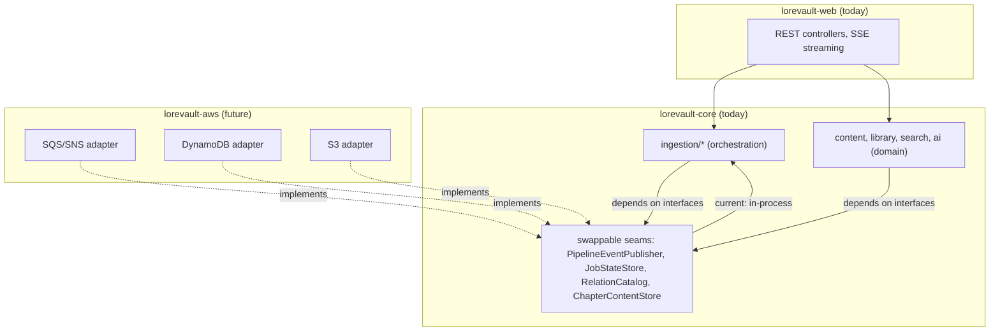

# Orchestration / Domain Separation — May 2026

**Date:** May 2026  
**Status:** Brainstorm — not yet accepted  
**Purpose:** Explore whether and how LoreVault should separate its pipeline orchestration layer from business logic, both as a domain hygiene matter and as preparation for a future AWS cloud-native deployment.

---

## 1. Why This Exists

LoreVault's ingestion pipeline is event-driven and multi-stage, and it currently lives entirely within `lorevault-core` alongside domain logic, Neo4j repositories, AI integration, and search. The project author believed they were using "Spring Modulith" because the pipeline uses Spring `ApplicationEvent` for inter-stage coordination — but Spring Modulith is a specific library for enforceable internal module boundaries, and no Modulith dependency exists in the POMs.

The pipeline coordination code (submission, stage handlers, fan-in completion, job state, event contracts) and the domain logic (content entities, library structure, relation catalog, search, AI) are mixed in one Maven module. This brainstorm examines whether that separation should become explicit, how, and when.

This is also preparation for the AWS cloud-native learning path (see §9), where orchestration state and message dispatch will migrate to DynamoDB, SQS, and Step Functions. Clean seams now mean a clean store-swap later.

---

## 2. Current State

### 2.1 Module structure

```
lorevault-kb
  lorevault-core    # domain logic + pipeline orchestration + AI + search
  lorevault-web     # Spring Boot app, REST controllers, SSE streaming
```

`lorevault-web` depends on `lorevault-core`. `lorevault-core` has no dependency on `lorevault-web`.

### 2.2 Package structure in lorevault-core

```
com.lorevault.api
  ai/               # LLM integration, embedding, chunking
  config/           # Spring configuration
  content/          # domain entities, repositories, chapter/scene/chunk/mention/timeline
  health/           # actuator health indicators
  ingestion/        # pipeline orchestration — the concern at issue
    completion/     # fan-in completion coordinator
    content/        # chunking + embedding stage handlers
    events/         # pipeline event contracts
    infrastructure/ # persistence helpers for pipeline stages
    job/            # ingestion job state and status tracking
    pipeline/       # shared step/status utilities
    resolution/    # entity and event resolution lanes
    scene/          # scene detection handler
    submission/     # chapter submission entrypoint
    triad/          # triad extraction handler
  library/          # book/series/universe domain
  search/           # retrieval, Q&A, semantic search
```

### 2.3 What is orchestration vs. domain

| Concern | Current home | Character |
|---------|-------------|-----------|
| Chapter submission, pipeline kickoff, stage dispatch | `ingestion.submission` | Orchestration — decides *when* things run |
| Stage handlers (chunking, embedding, scene detection) | `ingestion.content`, `ingestion.scene` | Hybrid — orchestration shell calling domain work |
| Fan-in completion coordination | `ingestion.completion` | Orchestration — tracks *whether* things finished |
| Job state, status tracking, step metadata | `ingestion.job`, `ingestion.pipeline` | Orchestration — pipeline coordination state |
| Pipeline event contracts | `ingestion.events` | Orchestration — inter-stage messaging |
| Content entities, Neo4j repositories | `content` | Domain — what the system *is about* |
| Library structure (book/series/universe) | `library` | Domain |
| Search, Q&A, retrieval | `search` | Domain |
| LLM calls, embedding, prompt management | `ai` | Domain — core capability |
| Resolution lanes | `ingestion.resolution` | Domain-heavy, but triggered by orchestration |

The key distinction: **orchestration** decides *when* and *in what order* things happen. **Domain** is *what* the system computes. The ingestion subtree mixes both.

### 2.4 Relevant existing decisions

- **ADR 003** — prefer direct services over internal indirection. Keep interfaces only at true external or infrastructural boundaries.
- **ADR 004** — keep the event-driven ingestion pipeline. Remove ceremony, not stage boundaries.
- **ADR 011** — capability-oriented internal package structure, not `application/domain/infrastructure` layering inside every feature.

These are not contradictions to separation. The question is whether orchestration is a *different capability* from domain logic, not whether to add abstract layers inside one capability.

---

## 3. The Misunderstanding: Application Events Are Not Modulith

Spring `ApplicationEvent` provides decoupled publish/subscribe within a single JVM. That is genuinely useful — it is how the pipeline coordinates today.

But Spring Modulith is a separate library that:

- defines named application modules with explicit API packages and internal packages
- enforces at test time that modules do not reach into each other's internals
- verifies event listeners are registered on the correct module
- provides documentation generation from module boundaries

LoreVault uses application events for coordination, which is good. It does not use Modulith for boundary enforcement, which means the current separation between orchestration and domain is conventional, not tested or verified.

**Key insight:** The gap is not "Spring Events vs. Modulith" — it is "convention-only boundaries vs. enforceable boundaries." The question is whether enforcing that boundary is worth doing now, and if so, by what mechanism.

---

## 4. Options

### Option A: Do nothing now — trust the package boundary

Keep orchestration and domain in `lorevault-core`, separated by package convention (`ingestion` vs. `content/library/search`). No new module, no Modulith dependency.

**Pros:** Zero cost. Already works. No build complexity.  
**Cons:** No enforcement. A handler in `ingestion` can reach into `content` internals. The boundary is a comment, not a contract.

### Option B: Introduce Spring Modulith within lorevault-core

Add the Spring Modulith dependency. Define internal modules (e.g., `ingestion-pipeline`, `domain-content`, `domain-library`, `domain-search`). Write architecture tests that verify orchestration does not reach into domain internals directly.

**Pros:** Enforceable boundaries without splitting Maven modules. Modulith tests prevent drift. Documentation generated from module definitions.  
**Cons:** Adds a library dependency. Modulith's conventions may conflict with ADR 011's capability-oriented packaging. Learning curve for Modulith's module definition style.

### Option C: Introduce swappable seams — ports without Modulith

Define a small number of explicit interfaces (ports) for the seams that will change when moving to AWS:

- `JobStateStore` — today: `ConcurrentHashMap`; later: DynamoDB
- `PipelineEventPublisher` — today: Spring `ApplicationEvent`; later: SQS/SNS
- `RelationCatalog` — today: in-process; later: DynamoDB with GSIs

No new Maven module. No Modulith. Just key interfaces that orchestration code depends on, with current implementations in core. Domain logic remains unaware of these interfaces.

**Pros:** Focused on the exact seams that matter for AWS migration. Aligns with ADR 003 (interfaces only at true external boundaries). Minimal ceremony. No new libraries.  
**Cons:** Only covers the known migration seams — doesn't prevent general cross-contamination between orchestration and domain code. Enforcement is conventional everywhere else.

### Option D: Extract a third Maven module (lorevault-pipeline or lorevault-orchestration)

Create `lorevault-pipeline` alongside `lorevault-core` and `lorevault-web`. Move pipeline orchestration (submission, stage handlers, completion, job state, events) into it. `lorevault-web` depends on both. `lorevault-pipeline` depends on `lorevault-core`.

```text
lorevault-web
  ├── depends on lorevault-pipeline
  └── depends on lorevault-core
lorevault-pipeline
  └── depends on lorevault-core
lorevault-core
  └── no dependency on pipeline or web
```

**Pros:** Maven-enforced build-time boundary. Separate artifact. Can evolve pipeline independently. Clear dependency direction.  
**Cons:** Build and dependency management overhead. Stage handlers are hybrid (orchestration shell + domain work) — moving them means either splitting each handler or accepting that the pipeline module still contains domain calls. The stage handlers call domain services in core, so the dependency is `pipeline → core`, but the handler bodies are entangled. May be premature before the AWS store-swap design is settled.

---

## 5. Recommendation

**Option C (swappable seams) and Option B (Modulith boundaries) are complementary — do both, starting with the catalog module.**

The previous version of this brainstorm recommended Option C only, treating Modulith as a later graduation. That was wrong. Swappable seams define *what crosses the boundary* (the interface contracts). Modulith defines *that the boundary exists* (preventing bypass). You need both: contracts without enforcement are suggestions; enforcement without contracts is a cage without doors.

### 5.1 Module map

| Modulith module | Package | Boundary | Rationale |
|---|---|---|---|
| `catalog` | `com.lorevault.api.catalog` | **Closed** from day one | Greenfield, clear contract, different access pattern — see planning doc for design details |
| `ingestion` | `com.lorevault.api.ingestion` | Open initially | Orchestration concern — close when `PipelineEventPublisher` and `JobStateStore` seams are settled |
| `content` | `com.lorevault.api.content` | Open initially | Core domain — close when `ChapterContentStore` seam is settled |
| `library` | `com.lorevault.api.library` | Open initially | Core domain — low cross-contamination risk |
| `search` | `com.lorevault.api.search` | Open initially | Retrieval concern — close when API boundary is tighter |
| `ai` | `com.lorevault.api.ai` | Open initially | Infrastructure concern — close when LLM abstraction is stable |

This is an incremental path, not a big redesign. Start with one closed module. Close others as their seams become clear.

### 5.2 Swappable seams and Modulith are complementary

Swappable seams define *what crosses the boundary* (the interface contracts). Modulith defines *that the boundary exists* (preventing bypass). You need both:

- **Modulith** prevents `ingestion` from reaching into `catalog` internals directly. It forces all cross-module access through the API package.
- **Swappable seams** allow `RelationCatalog` to start as an in-process map and graduate to DynamoDB without changing callers.

Closing a Modulith module without a seam means the boundary is enforced but the implementation is cemented. Adding seams without Modulith means the contract is defined but bypassable. You need both.

For the catalog module specifically, the planning doc (`2026-05-13T2027_relation-catalog-module.md`) owns the detailed design: API/internal package structure, seam contracts, and why catalog is the right first closed module. The general strategy (incremental closure, seams-first) lives here.

### 5.3 Why not a third Maven module (Option D)

The AWS migration depends on clean seams, not Maven modules. When SQS replaces Spring events, the change is in `PipelineEventPublisher`'s implementation, not in which JAR it lives in. Stage handlers are hybrid (orchestration shell + domain work), so moving them to a separate module either splits every handler or accepts entangled cross-module calls. Maven extraction is valuable when there is concrete deployment or dependency pressure. It is not the right mechanism for enforceable boundaries — Modulith does that within a single Maven module.

### 5.4 Swappable seams to define

```text
PipelineEventPublisher
  void publish(PipelineEvent event)
  — today: ApplicationEventPublisher adapter
  — later: SQS/SNS adapter

JobStateStore
  Optional<IngestionJob> findJob(JobId id)
  IngestionJob save(IngestionJob job)
  — today: ConcurrentHashMap-backed store
  — later: DynamoDB-backed store

RelationCatalog
  List<CandidateRelation> findCandidates(CatalogQuery query)
  CandidateRelation registerProvisional(CatalogQuery query, String observedName)
  — today: in-process map or service
  — later: DynamoDB with GSIs on {name, subjectKind, objectKind}

ChapterContentStore
  Optional<ChapterContent> findContent(ChapterId id)
  void store(ChapterId id, ChapterContent content)
  — today: Neo4j rawText property
  — later: S3 object with Neo4j reference
```

### 5.5 Where these seams live

- Interfaces in `lorevault-core` — they are core domain abstractions, not infrastructure adapters
- In-process implementations in `lorevault-core` — they are the current default
- AWS implementations in a future `lorevault-aws` module that depends on core and provides adapter beans
- `lorevault-web` selects the implementation via Spring profile

---

## 6. Visualization



---

## 7. What Not to Do

- **Do not add a third Maven module yet.** Build-time enforcement is valuable, but the seams are not mature enough. Adding a module now means moving files twice: once into the module and once when AWS reshapes the boundaries. Use Modulith for boundary enforcement within core; add a Maven module only when there is concrete deployment or dependency pressure.
- **Do not make domain services depend on orchestration interfaces.** The dependency direction is: orchestration → domain. Domain code should not know about job state, pipeline events, or message dispatch.
- **Do not introduce AWS-shaped abstractions too early.** Name ports after domain concepts (`JobStateStore`, `PipelineEventPublisher`), not after infrastructure (`DynamoDBJobRepository`, `SqsEventBridge`). The implementation swap is a Spring profile change, not a rename.
- **Do not close every Modulith module at once.** Start with `catalog` as the only closed module. Close others incrementally as their seams become clear and their API packages stabilize. Closing modules before their API boundaries are settled creates friction, not safety.
- **Do not split stage handlers into orchestration shell + domain work** just to achieve package purity. Handlers are legitimately hybrid. The right boundary is the port they call through, not a line inside the handler class.

---

## 8. Relationship to Other Plans

| Document | Relationship |
|----------|-------------|
| AWS Cloud-Native Learning Path | This brainstorm defines the seams that Phase 1 (ECS), Phase 5 (SQS/SNS), Phase 6 (DynamoDB), and Phase 3 (S3) will plug into |
| StageRun DAG Observability | The `JobStateStore` seam should accommodate StageRun-based orchestration state, not just the current `StatusRecord` chain |
| Event-Driven Architecture Plan | The `PipelineEventPublisher` seam is the local face of the event-driven pipeline; the AWS learning path will provide remote-capable implementations |
| ADR 003 (Direct Services) | This proposal is consistent with ADR 003 — interfaces only at real external boundaries, which these seams are |
| ADR 011 (Capability-Oriented Packages) | Seam interfaces are a capability concern (`ingestion.pipeline`, `ingestion.job`), not a layered concern |
| Minimal Relation Catalog | The catalog is the first closed Modulith module and the first swappable seam. Detailed module boundary design lives in the planning doc; this brainstorm owns the general strategy (incremental closure, seams + Modulith complementarity). |

---

## 9. Open Questions

- **Should swappable seams use Spring's `@ConditionalOnProperty` or explicit profile-based configuration?** Profile-based is simpler and more transparent for a learning project. Conditional properties add inference complexity.
- **How many stage handlers need to be refactored before they call domain services only through ports?** Some handlers directly call repository methods or domain services. The first pass should identify which calls go through existing service boundaries already (the easy ones) and which would need a new port interface (the harder ones).
- **Should `lorevault-aws` be a separate repository or a Maven module in the same reactor?** For the AWS learning path, a separate cloned repo (`lorevault-aws`) keeps concerns completely independent. A reactor module keeps build convenience. The brainstorm on AWS learning path currently favors a separate clone.
- **When should other modules be closed?** Close a module when its API package is stable enough that external callers consistently go through it rather than reaching into internals. `ingestion` is the next candidate once `PipelineEventPublisher` and `JobStateStore` seams are settled. `content` follows when `ChapterContentStore` is defined.