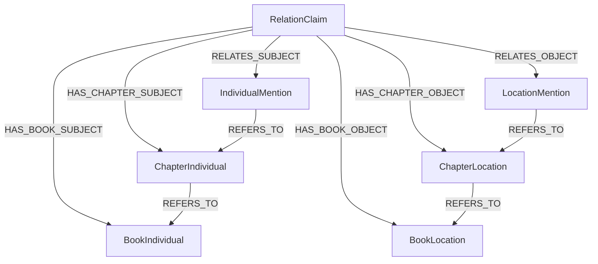

# Claim-Entity Linking Proposal — May 2026

**Date:** May 2026
**Status:** Brainstorm — conceptual design for linking RelationClaim nodes to entity nodes in the resolution ladder
**Purpose:** Fill the gap left by Phase 0's "best-effort" deferral of subject/object entity linking, and define a pattern that survives the book reduction delete-and-rebuild cycle

---

## Problem

RelationClaim nodes are scene-local evidence extracted during triad analysis. They carry subject and object references as flat string properties (`subjectKind`, `subjectName`, `objectKind`, `objectName`) but have **no graph edges** to the entity nodes they reference.

This means:

1. **No graph traversal from claims to entities.** You cannot ask "which individuals does this claim connect?" without string matching against `normalizedName`.
2. **No graph traversal from entities to claims.** You cannot ask "what relations involve Kaladin?" without scanning all RelationClaim nodes and filtering by `subjectName`/`objectName`.
3. **The flat strings are denormalized and fragile.** They reflect the LLM's raw extraction, not the canonical entity identity. "Kaladin" and "kaladin" and "Kaladin Stormblessed" may all appear as `subjectName` for the same entity.
4. **M4 (REL edge projection) was previously seen as the path to entity-connected relations.** With claim-entity linking in place, M4's core value proposition — enabling graph traversal between entities via typed relations — is already achieved. M4 becomes a query optimization layer at best, and potentially unnecessary.

The original Phase 0 plan acknowledged this gap:

> "Subject/object mention linking (`RELATES_SUBJECT`/`RELATES_OBJECT` edges) — the repository methods exist but are not called yet; linking requires matching LLM-extracted names to persisted mention IDs, which needs a name-resolution step"

But it left the design unspecified. This proposal fills that gap.

---

## Conceptual Foundation

### RelationClaim is evidence, not interpretation

This follows the project's established evidence-vs-interpretation layering:

- **Evidence layer** (scene-local): `*Mention` nodes, `RelationClaim` nodes — ephemeral, per-extraction, never merged away
- **Interpretation layer** (canonical): `Chapter*`, `Book*` nodes — aggregated, rebuilt on re-ingestion

RelationClaim belongs in the evidence layer. It stays anchored to its Scene. What changes as reduction happens is **which entity nodes its edges point to**, not the claim itself.

### The delete-and-rebuild cycle is a feature, not a bug

Book reduction (and chapter resolution) use a delete-and-rebuild pattern:

```cypher
-- BookIndividualGraphRepository.deleteByBookId()
MATCH (ci:ChapterIndividual)-[r:REFERS_TO]->(:BookIndividual {bookId: $bookId})
DELETE r
WITH DISTINCT $bookId AS bookId
OPTIONAL MATCH (bi:BookIndividual {bookId: bookId})
DETACH DELETE bi
```

`DETACH DELETE` destroys **all** incoming edges to the deleted nodes. If RelationClaim had `HAS_SUBJECT → BookIndividual` edges, they would be silently severed on every book reduction cycle.

This means any edge pattern that points to Chapter* or Book* nodes must be **rebuilt** during the reduction cycle — just like `REFERS_TO` edges from Mention→ChapterIndividual and ChapterIndividual→BookIndividual are already rebuilt.

---

## Proposed Design: Layered Materialization

Three layers of edges, each with a distinct relationship type name and a distinct lifecycle:



### Layer 1: Evidence edges (survives all cycles)

| Edge | From | To | Lifecycle |
|------|------|----|-----------|
| `RELATES_SUBJECT` | RelationClaim | *Mention (Individual, Location, Object, Collective, Event) | Created once at claim creation, never deleted |

These edges connect the claim to the scene-local evidence nodes. Mention nodes are never deleted (they're evidence), so these edges are stable.

### Layer 2: Chapter shortcuts (rebuilt during chapter resolution)

| Edge | From | To | Lifecycle |
|------|------|----|-----------|
| `HAS_CHAPTER_SUBJECT` | RelationClaim | Chapter* (ChapterIndividual, ChapterLocation, etc.) | Recreated during chapter resolution |

These edges are shortcuts for chapter-scoped queries. They are destroyed by `DETACH DELETE` during chapter resolution and must be rebuilt alongside the Chapter* nodes.

### Layer 3: Book shortcuts (rebuilt during book reduction)

| Edge | From | To | Lifecycle |
|------|------|----|-----------|
| `HAS_BOOK_SUBJECT` | RelationClaim | Book* (BookIndividual, BookLocation, etc.) | Recreated during book reduction |

These edges are shortcuts for book-scoped queries. They are destroyed by `DETACH DELETE` during book reduction and must be rebuilt alongside the Book* nodes.

### Why distinct relationship type names

Using the same relationship name (`RELATES_SUBJECT`) at every scope level forces query-time disambiguation by checking the target node's label. Distinct names (`RELATES_SUBJECT`, `HAS_CHAPTER_SUBJECT`, `HAS_BOOK_SUBJECT`) make Cypher queries self-documenting and unambiguous:

```cypher
-- Chapter-scoped query: find all claims involving a chapter individual
MATCH (rc:RelationClaim)-[:HAS_CHAPTER_SUBJECT]->(ci:ChapterIndividual {chapterId: $chapterId})
RETURN rc.relationName, rc.subjectName, rc.objectName

-- Book-scoped query: find all claims involving a book individual
MATCH (rc:RelationClaim)-[:HAS_BOOK_SUBJECT]->(bi:BookIndividual {bookId: $bookId})
RETURN rc.relationName, rc.subjectName, rc.objectName
```

### Why not Option A (replace edges on promotion)

Option A would retarget `HAS_SUBJECT` from ChapterIndividual → BookIndividual during book reduction. This loses the chapter-scope link. A chapter-scoped query would no longer find the claim's chapter-level entity reference.

### Why not Option B (add parallel edges, one-time)

Option B would add `HAS_SUBJECT → BookIndividual` edges once during book reduction, but the delete-and-rebuild cycle would destroy them on the next reduction. They would never be recreated, silently severing the claim-to-entity link.

---

## Entity Kind Coverage

RelationClaim's `subjectKind` and `objectKind` can reference five entity kinds:

| Kind | Mention type | Chapter type | Book type |
|------|-------------|-------------|-----------|
| Individual | IndividualMention | ChapterIndividual | BookIndividual |
| Location | LocationMention | ChapterLocation | BookLocation |
| Object | ObjectMention | ChapterObject | BookObject |
| Collective | CollectiveMention | ChapterCollective | BookCollective |
| Event | EventMention | ChapterEvent | BookEvent |

Each kind produces three edge types per endpoint (subject/object):

| Edge type | Subject variant | Object variant |
|-----------|----------------|----------------|
| Evidence | `RELATES_SUBJECT` | `RELATES_OBJECT` |
| Chapter shortcut | `HAS_CHAPTER_SUBJECT` | `HAS_CHAPTER_OBJECT` |
| Book shortcut | `HAS_BOOK_SUBJECT` | `HAS_BOOK_OBJECT` |

That's 6 relationship types total, each polymorphic in their target (can point to any of the 5 entity kinds at that scope level).

---

## Matching Strategy

### Layer 1: Claim → Mention matching

At claim creation time, the LLM provides `subjectKind` + `subjectName` and `objectKind` + `objectName`. The pipeline has already persisted all entity mentions for the scene. Matching strategy:

1. **Exact normalizedName match** within the same scene: find the `*Mention` node where `normalizedName` matches the claim's `subjectName`/`objectName` (after normalization) and the kind matches.
2. **Best-effort**: if no match is found (extraction timing, name normalization differences, entity not extracted), the edge is not created. The flat string properties (`subjectKind`, `subjectName`, `objectKind`, `objectName`) remain as fallback.
3. **One claim can link to multiple mentions of different kinds** — but in practice, `subjectKind` constrains the target to one kind lane.

The normalization function should match the one used in `IndividualPersistenceService` (trim, lowercase, collapse whitespace).

### Layer 2: Claim → Chapter* matching (rebuilt during chapter resolution)

After chapter resolution creates new ChapterIndividual (etc.) nodes and `REFERS_TO` edges from Mentions:

```cypher
-- Re-link chapter-level subject edges for a chapter
MATCH (rc:RelationClaim {chapterId: $chapterId})-[:RELATES_SUBJECT]->(m:Mention)
MATCH (m)-[:REFERS_TO]->(ce) WHERE ce:ChapterEntity AND ce.chapterId = $chapterId
MERGE (rc)-[:HAS_CHAPTER_SUBJECT]->(ce)
```

This must run after `linkMentionsToChapterIndividual()` (or equivalent for each entity kind) in the chapter resolution pipeline.

### Layer 3: Claim → Book* matching (rebuilt during book reduction)

After book reduction creates new BookIndividual (etc.) nodes and `REFERS_TO` edges from Chapter*:

```cypher
-- Re-link book-level subject edges for a book
MATCH (rc:RelationClaim)-[:HAS_CHAPTER_SUBJECT]->(ci:ChapterIndividual)
MATCH (ci)-[:REFERS_TO]->(bi:BookIndividual {bookId: $bookId})
MERGE (rc)-[:HAS_BOOK_SUBJECT]->(bi)
```

This must run after `linkChapterIndividualsForBookAndNameToBookIndividual()` in the book reduction pipeline.

---

## bookId Resolution

RelationClaim currently has `bookId = null` at creation time. For Layer 3 (book shortcuts), the claim needs a `bookId` for efficient Cypher queries.

**Resolution strategy:** Set `bookId` on RelationClaim during claim creation. The `chapterId` is already populated on RelationClaim, and Chapter has `bookId` as a property. A simple lookup resolves it:

```java
// In RelationClaimPersistenceService, after creating the RelationClaim:
UUID bookId = resolveBookId(chapterId);  // Chapter.bookId lookup
```

This is a prerequisite for Layer 3 but also useful independently for book-scoped claim queries.

---

## Impact on M4 (REL Edge Projection)

The original catalog roadmap included M4: project `REL` edges between canonical entities:

```cypher
(:BookIndividual)-[:REL {definitionKey: 'R:is_a_member_of'}]->(:BookCollective)
```

With claim-entity linking in place, the same query is already answerable:

```cypher
MATCH (bi:BookIndividual {normalizedName: 'kaladin'})<-[:HAS_BOOK_SUBJECT]-(rc:RelationClaim)
      -[:HAS_BOOK_OBJECT]->(bc:BookCollective)
WHERE rc.definitionKey = 'R:is_a_member_of'
RETURN bc.displayName, rc.evidenceText
```

The `REL` edge would be a **derived denormalization** — collapsing a two-hop path through RelationClaim into a single edge. With claim-entity linking, it's not a prerequisite for traversal anymore. It's a query convenience optimization at best.

And it comes with costs:
- Another projection to maintain (rebuild when claims change, when book reduction runs)
- Loss of provenance — a `REL` edge between two BookIndividuals doesn't tell you *which scene* or *which claim* established the relation
- Aggregation semantics are ambiguous — if 3 claims say "Kaladin is a member of the Knights Radiant", do you get 3 `REL` edges or 1? What about conflicting certainty levels?

**Assessment:** M4 as originally conceived (project `REL` edges between canonical entities) is largely superseded by claim-entity linking. The graph is already traversable. What M4 might become instead:

- A **query optimization layer** — materialized views for common traversal patterns, but explicitly derived and rebuildable
- A **spoiler-gating surface** — if you want to gate at the entity-relation level rather than the claim level
- Or it might just **not be needed** — the two-hop path through RelationClaim is fine for most queries

This should be re-evaluated once claim-entity linking is in place and real query patterns emerge.

---

## Relationship to Catalog Module (Axis 1)

Claim-entity linking (this proposal, Axis 2) is **orthogonal** to the catalog module (Axis 1):

| | Catalog (Axis 1) | Entity Edges (Axis 2) |
|---|---|---|
| **Question answered** | What *type* of relation is this? | *Which* entities does this claim connect? |
| **Storage** | PostgreSQL (catalog definitions) | Neo4j (graph edges) |
| **Current state** | M0+M1 shipped | Deferred, repo methods exist but unused |
| **Depends on** | Nothing (standalone module) | Entity resolution ladder (Mention → Chapter → Book) |
| **Unblocks** | Typed relation identity for queries | Graph traversal from claims to entities |

The two axes converge at query time: a useful relation query needs both *what type* (catalog) and *which entities* (edges). But they can be built and shipped independently.

---

## Implementation Steps

### Step 1: Link RelationClaim → Mention at claim creation (Layer 1)

**Scope:** Small, self-contained, zero risk to existing pipeline.

**Changes:**
- `RelationClaimPersistenceService`: After saving each RelationClaim, call `linkSubjectMention()` and `linkObjectMention()` with the matched Mention node ID
- `RelationClaimGraphRepository`: The methods `linkSubjectMention()` and `linkObjectMention()` already exist — they just need to be called
- Add a matching method to find Mentions by `sceneId` + `normalizedName` + kind
- Handle the case where no matching Mention is found (best-effort, log a warning)

**Prerequisite:** None. Mentions are already persisted before RelationClaims in the pipeline.

### Step 2: Resolve bookId on RelationClaim

**Scope:** Small, independent of Step 1.

**Changes:**
- `RelationClaimPersistenceService`: After creating each RelationClaim, resolve `bookId` from `chapterId → bookId` and set it on the node
- Update Neo4j indexes to include `bookId` for claim queries

**Prerequisite:** None.

### Step 3: Add chapter-level shortcuts during chapter resolution (Layer 2)

**Scope:** Moderate. Touches chapter resolution pipeline for each entity kind.

**Changes:**
- After each entity persistence service creates Chapter* nodes and `REFERS_TO` edges, add a Cypher query to re-link `HAS_CHAPTER_SUBJECT`/`HAS_CHAPTER_OBJECT` edges from RelationClaim to the new Chapter* nodes
- This follows the same pattern as the existing `linkMentionsToChapterIndividual()` calls

**Prerequisite:** Step 1 (need `RELATES_SUBJECT`/`RELATES_OBJECT` edges to traverse from claim to mention to chapter entity).

### Step 4: Add book-level shortcuts during book reduction (Layer 3)

**Scope:** Moderate. Touches book reduction pipeline for each entity kind.

**Changes:**
- After each book reduction service creates Book* nodes and `REFERS_TO` edges, add a Cypher query to re-link `HAS_BOOK_SUBJECT`/`HAS_BOOK_OBJECT` edges from RelationClaim to the new Book* nodes
- This follows the same pattern as the existing `linkChapterIndividualsForBookAndNameToBookIndividual()` calls

**Prerequisite:** Step 2 (need `bookId` on RelationClaim for efficient queries) and Step 3 (need `HAS_CHAPTER_SUBJECT` edges to traverse from claim to chapter entity to book entity).

### Step 5: Extend to all entity kinds

**Scope:** Repeatable. Steps 1-4 initially implement for Individual only. Extend to Location, Object, Collective, Event.

**Each kind needs:**
- Matching logic in `RelationClaimPersistenceService` for the kind-specific Mention type
- Re-link Cypher in chapter resolution for the kind-specific Chapter* type
- Re-link Cypher in book reduction for the kind-specific Book* type

---

## Sequencing Analysis

### Can claim-entity linking and catalog M2/M3 proceed in parallel?

Yes. They touch different code paths:
- Catalog M2/M3: `lorevault-catalog` module, PostgreSQL, embedding infrastructure
- Claim-entity linking: `lorevault-core`, Neo4j repositories, persistence services, ingestion handlers

### Recommended sequence

**Step 1 (Mention links) should come first**, before catalog M2/M3:

1. It's small and self-contained (the repo methods already exist)
2. It completes the Phase 0 promise that was deferred
3. It unblocks graph traversal immediately — you can query "what claims involve Kaladin?" via `MATCH (rc:RelationClaim)-[:RELATES_SUBJECT]->(m:IndividualMention {normalizedName: 'kaladin'})`
4. It's a prerequisite for Steps 3-4 anyway
5. M2/M3 are enhancements (metrics, embedding matching) that don't unlock new graph capabilities

After Step 1, M2/M3 and Steps 2-4 can proceed in parallel if desired.

### Universe-level extension

When `UniverseIndividual` (etc.) nodes are eventually added to the ladder, the same pattern extends naturally:

- Add `HAS_UNIVERSE_SUBJECT` / `HAS_UNIVERSE_OBJECT` edges
- Rebuild them during universe reduction
- Same delete-and-rebuild pattern, same layered materialization

No architectural change needed. The pattern scales by adding layers, not by restructuring existing ones.

---

## Open Questions

1. **Should `RELATES_SUBJECT`/`RELATES_OBJECT` be renamed?** The existing repo methods use these names. They're fine for Layer 1 (evidence edges to Mentions). The chapter and book shortcuts use distinct names (`HAS_CHAPTER_SUBJECT`, `HAS_BOOK_SUBJECT`). No conflict.

2. **Should we match on `displayName` as a fallback?** The primary match is `normalizedName`. But the LLM might produce a name that matches a `displayName` but not the `normalizedName` (e.g., "Kaladin Stormblessed" vs "kaladin"). Should we try `displayName` as a secondary match?

3. **How to handle kind mismatches?** The LLM might label a subject as "Individual" when the matching Mention is actually a "Collective" (e.g., "The Knights Radiant" could be either). Should we match across kinds, or strictly within the same kind?

4. **Should we populate `bookId` on RelationClaim during creation or as a separate step?** Resolving `bookId` from `chapterId → bookId` is straightforward but requires a Neo4j traversal. It could be done in the same persistence call or as a separate enrichment step.

5. **Should Layer 2 and 3 be implemented for all entity kinds simultaneously, or one kind at a time?** Individual is the most common kind (39% of claims in Phase 0 results). Starting with Individual and extending to other kinds follows the same pattern the project used for entity resolution.

6. **Should M4 (REL edge projection) be re-scoped or dropped?** With claim-entity linking in place, M4's original value proposition (enabling graph traversal between entities via typed relations) is already achieved. M4 could become a query optimization layer, a spoiler-gating surface, or be deferred entirely until real query patterns show the two-hop path is too expensive.

---

## Links

- `docs/planning/2026-05-07T1917_relation-evidence-harvesting.md` — Phase 0 implementation notes (deferred mention linking)
- `docs/planning/2026-05-13T2027_relation-catalog-module.md` — Catalog module design (M0+M1 shipped)
- `docs/brainstorm/entity-pipelines/2026-04-13T2332_individual-resolution-proposal.md` — Scoped identity ladder pattern
- `docs/patterns/ingestion/entity-resolution-ladder.md` — Entity resolution pattern documentation
- `docs/concepts/entity-claim-model.md` — Entity/claim model concepts
- `docs/adr/012-dual-database-transaction-boundary.md` — Dual-database transaction boundary (catalog: PostgreSQL, core: Neo4j)