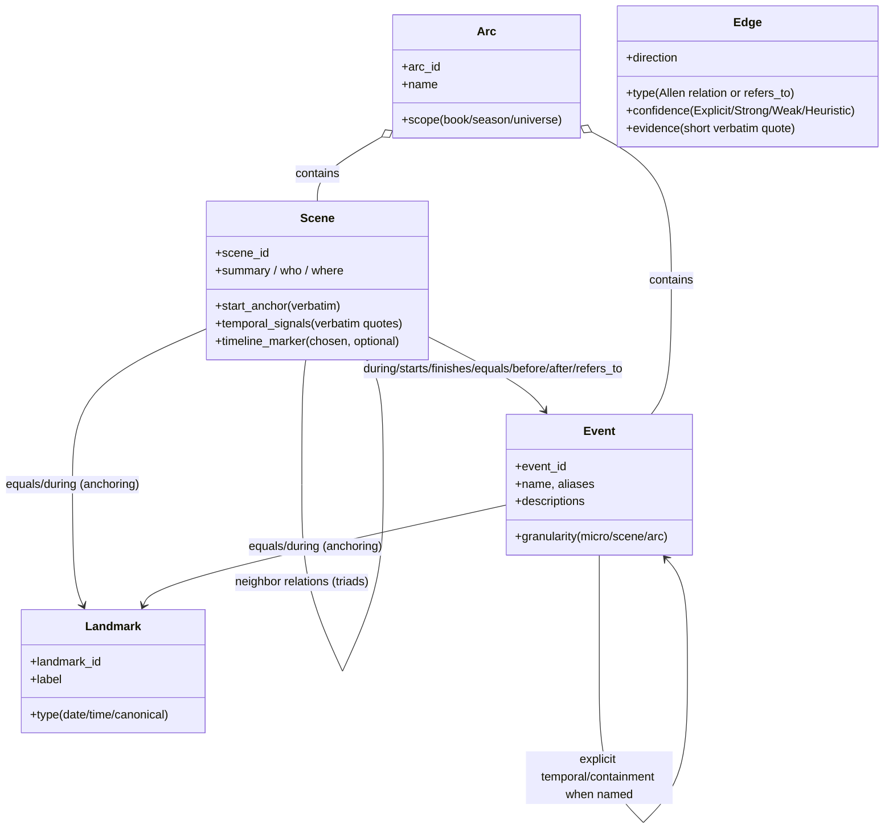
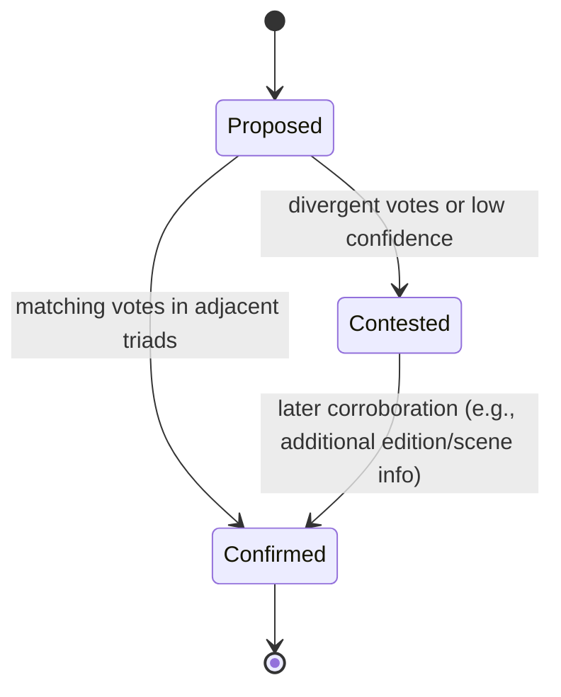
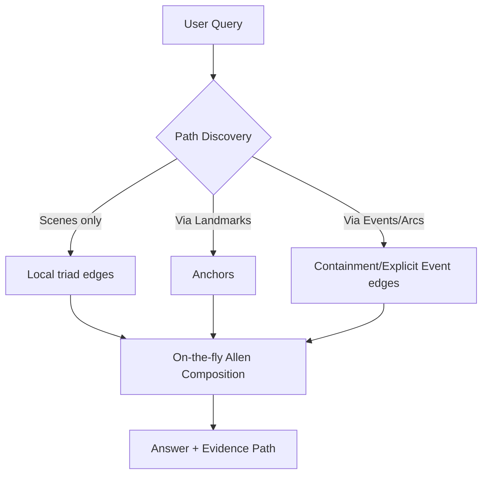
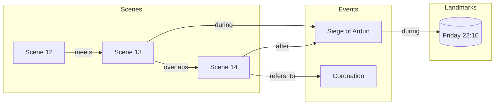

# Narrative Event DAG — Triad-Only, Gazetteer-Aware Specification

> Scope: End-to-end process for building and querying a sparse, auditable **Event DAG** for narrative fiction, powered by **rolling triad analysis** of scenes and a **gazetteer-driven Event Linker**. This spec is conceptual (no implementation code) and emphasizes sparsity, auditability, and cross‑work scalability.

---

## 1) Core Principles

1. **Local evidence first**: We only persist relations that are directly grounded in the text we read.
2. **Triads, not globals**: Temporal ordering is established via **triads** (Prev–Curr–Next) around each scene.
3. **Partial order, not a line**: We maintain a **DAG** using Allen interval relations; uncertainty is allowed and carried forward.
4. **No transitive materialization**: We **do not** store inferred long-range edges (e.g., from A→B and B→C to A→C). Transitive reasoning happens **at retrieval time**.
5. **Events ≠ Scenes**: Scenes are narrative slices; **Events** are canonical happenings at multiple granularities. Scenes provide evidence about Events.
6. **Sparsity by design**: Each scene has a tight edge budget (prev/next + ≤1 landmark + ≤1 container/primary event). Landmarks align timelines without densifying scene↔scene links.

---

## 2) Conceptual Data Model

- **Scene**: A contiguous narrative unit within a chapter/episode (identified by a stable ID and a start anchor). Scenes carry summaries, who/where, verbatim temporal signals, and selected timeline markers.
- **Event**: A canonical happening (multi-granularity: micro ↔ scene-sized ↔ arc-level). Independent of scene boundaries; identified and curated in an Event Catalog (gazetteer).
- **Landmark**: Absolute or canonical temporal anchors (dates, clock times, named historical moments, franchise-wide milestones).
- **Arc**: A container event representing an extended storyline (war, journey, investigation). Arcs **contain** events and scenes.
- **Edge**: A labeled relation with confidence and evidence. We use Allen interval relations (before/after, meets, overlaps, during/contains, equals, starts/finished_by, etc.) plus a light non-temporal `refers_to`.



---

## 3) End-to-End Pipeline (Triad-Only)

### 3.1 Intake & Normalization

- Ingest chapter/episode text and normalize minimally (whitespace, headings) so anchors are findable and stable.
- Maintain the publication order (reading order) of scenes; do not re-order at this stage.

### 3.2 Chapter Segmentation — Scene Detection & Cards

- Identify scenes and assign **stable IDs** (e.g., chapter-scoped indices).
- For each scene, capture:

  - **start_anchor** (verbatim, unique within chapter/episode).
  - **summary** (what happens), **who**, **where**.
  - **verbatim temporal signals** (e.g., “the next morning”, “Friday, 10:15 p.m.”) with minimal nearby context.
  - **timeline_marker** candidate (pick the most specific absolute cue if present).

- **Boundary rule**: The end of a scene is determined by the next scene’s start (or chapter end). No model-generated end anchors.

### 3.3 Scene Analysis — Triad Temporal Resolver

- For each interior scene _i_, construct a **triad**: `Prev = i−1`, `Curr = i`, `Next = i+1`. At chapter boundaries, triads cross chapter edges.
- Resolver outputs for **Curr**:

  - Relation to **Prev** (Allen label + confidence + brief verbatim evidence).
  - Relation to **Next** (Allen label + confidence + brief verbatim evidence).
  - Final **timeline_marker** (the single most specific absolute marker for **Curr**, if any).

- Evidence must prefer **verbatim** lexical cues (e.g., “meanwhile”, “later that night”, “during the ceremony”), absolute dates/times, or named events.

### 3.4 Natural Confirmation via Overlap

- Every adjacent pair `(i, i+1)` appears in two triads: once centered on `i`, once on `i+1`.
- We record both predictions. If they agree → **confirmed**. If they diverge → **contested** and both are retained with their confidences.
- No additional scene↔scene edges are created to resolve conflicts.

### 3.5 Event Linker (Decoupled, Gazetteer-Aware)

- After triads, a background semantic pass reads each scene to identify **mentioned or depicted Events** and attaches **Scene ↔ Event** links:

  - **Onstage** → typically `during` (or `starts/finishes/equals` when signaled).
  - **Retrospective** → the Scene is **after** the Event.
  - **Prospective** → the Scene is **before** the Event.
  - **Aftermath/Reference** → `refers_to` (non-temporal) unless the text commits to time.
  - **Container** → Scene is `during` Arc/Event; **Hosted** → Scene `contains` a micro-event.

- Each link includes a relation label, confidence, and a short evidence quote. New, clearly nameable events become **proposals** for curation.

### 3.6 Landmark Attachment (Optional but Powerful)

- A small, canonical set of **Landmarks** (dates, named battles, festival days) is maintained.
- Scenes and Events may carry a single, most-specific **anchoring** attachment to a Landmark using `equals` or `during`.
- Landmarks enable cross-book alignment without dense scene↔scene links.

### 3.7 Graph Assembly (Sparse, Acyclic, Auditable)

- **Nodes**: Scenes, Events, Landmarks, Arcs.
- **Edges** (persisted facts only):

  - Scene↔Scene: **only neighbor relations** from triads (Prev and Next), with confirmation state (confirmed/contested).
  - Scene↔Event: links from the Event Linker with role-driven relations.
  - Event↔Event: only **explicit** temporal/containment relations named in text.
  - Scene↔Landmark / Event↔Landmark: anchoring attachments.
  - Arc↔Scene / Arc↔Event: containment.

- **Acyclicity**: Confirmed temporal edges must not form cycles. If a new confirmed edge would create a cycle, it is downgraded to **contested** (or rejected) rather than forcing a guess.
- **No transitive edges** are materialized.

```mermaid
flowchart LR
  subgraph Intake
    A[Chapters/Episodes]
  end
  A --> B[Chapter Segmentation: Scene Cards]
  B --> C[Scene Analysis: Triad Temporal Resolver]
  C --> D{Edge Agreement?}
  D -- Agree --> E[Scene↔Scene edges (confirmed)]
  D -- Diverge --> F[Scene↔Scene edges (contested)]
  B --> G[Event Linker]
  G --> H[Scene↔Event links]
  B --> I[Landmark Attachment]
  I --> J[Scene/Event↔Landmark]
  E & F & H & J --> K[(Event DAG Store)]
```

---

## 4) Edge Semantics & Confidence

- **Allen Relations** supported: `before/after`, `meets/met_by`, `overlaps/overlapped_by`, `during/contains`, `equals`, `starts/started_by`, `finishes/finished_by`.
- **Non-temporal**: `refers_to` (mention without temporal commitment).
- **Confidence Levels**: `Explicit` (verbatim connective or absolute marker), `StronglyImplied` (clear causal/clock evidence), `WeaklyImplied` (plausible but sparse), `Heuristic` (default fallback when evidence is minimal).
- **Evidence**: short verbatim quotes (bounded length) that justify each edge; evidence aids audit and reviewer triage.



---

## 5) Sparsity Rules (to prevent graph blow-up)

- **Edge budget per Scene**: prev/next from triads; ≤1 Landmark; ≤1 primary Event/Arc attachment; optional low-confidence `refers_to` mentions.
- **No long-range Scene↔Scene edges** unless the text makes an explicit cross-reference (“two years after the Siege of X”).
- **Canonical registries**: Maintain compact, curated catalogs for Events, Landmarks, and Arcs.
- **Uncertainty is first-class**: contested edges remain as parallel labels with confidences; do not resolve by adding more edges.

---

## 6) Retrieval-Time Reasoning (Lazy Inference)

- For queries like “Is A before C across the trilogy?”:

  - Navigate via **confirmed** local Scene edges, **Event/Arc containment**, and **Landmarks**.
  - Apply **Allen relation composition** on the fly to infer long-range order **without** persisting new edges.
  - Prefer paths with Landmarks and explicit Event relations; report confidence and show the best evidence path.



---

## 7) Quality & Governance (Conceptual)

- **Auditability**: Every persisted edge has an evidence quote and a confidence label.
- **Versioning**: Scenes and Events maintain provenance (which edition/source; which triad pass). Changes never silently overwrite; they append.
- **Curation Loop**: New Event proposals are reviewed; aliases consolidated; contested edges can be promoted to confirmed upon additional evidence.
- **Evaluation**: Track precision/recall of Event linking, agreement rate between overlapping triads, and coverage of absolute markers.

---

## 8) Typical Outputs

- **Scene Cards** enriched with: chosen timeline marker, relations to neighbors (with confidence), and any Scene↔Event/Arc/Landmark attachments.
- **Event DAG** that is sparse, acyclic (on confirmed edges), and auditably grounded in text quotes.
- **Continuity Report**: highlights of overlaps/intercuts, flashbacks/prolepses, nested ceremonies/arcs, and areas of uncertainty.

---

## 9) Non-Goals / Guardrails

- We do **not** produce a fully linearized master timeline in storage.
- We do **not** infer or persist transitive Scene↔Scene or Event↔Event edges.
- We avoid model-generated end anchors; the end of a scene is derived from the next scene’s start.
- We avoid densifying the graph with casual references; `refers_to` remains low-confidence and non-temporal.

---

## 10) Example Miniature (Illustrative)



> Reading this graph: local scene order is based on triad evidence; long-range reasoning (e.g., where **S1** sits relative to **E2**) is inferred at retrieval-time via **E1** and **L1**, without storing extra transitive edges.

---

### Summary

This specification delivers a **triad-first**, **gazetteer-aware** approach that builds a **lean Event DAG** grounded in verbatim textual evidence, scales across long narrative arcs and franchises, and stays sparse by deferring transitive reasoning to **retrieval time**. It strikes a balance between granular scene understanding and franchise-level temporal navigation, without graph blow-up.
