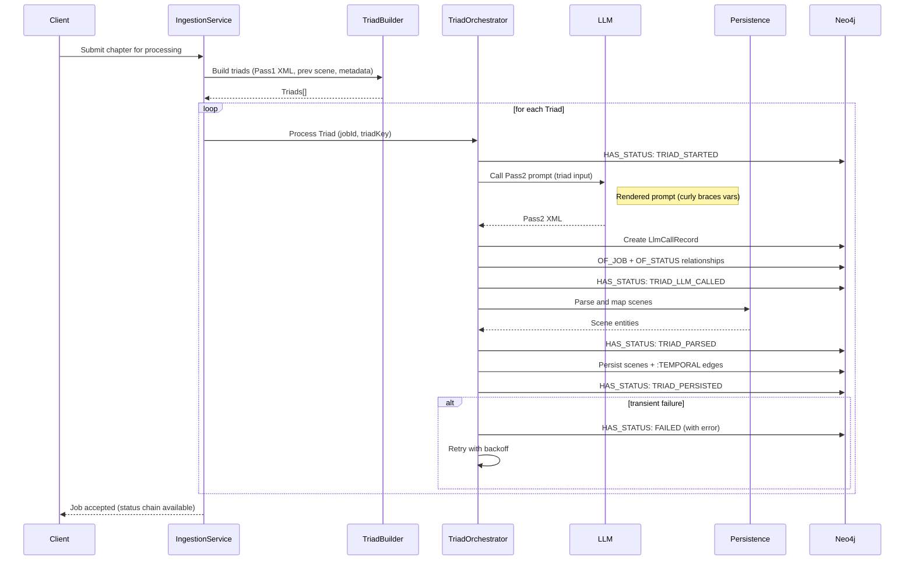

# Triad Orchestration Process (v0.8.3+)

Purpose: describe how triads are constructed and processed during Pass 2 scene normalization, including status emission and LLM call logging for observability.

## Triad Definition

A triad bundles the context needed for cross-chapter temporal reasoning:

- currentChapterPass1Xml: Pass 1 output for the current chapter
- previousChapterLastScene: prior chapter's final scene context summary and temporal marker (if available)
- chapterMetadata: title, book/series context used for disambiguation

## Orchestration Flow

1. Build Triads
   - For each chapter, assemble the triad (skip previous chapter component when not available)
   - Prefer in-memory scene context to avoid premature persistence during analysis

2. Per-Triad Normalization
   - Run Pass 2 normalization for each triad independently
   - Emit per-triad status records: STARTED → LLM_CALLED → PARSED → PERSISTED (or FAILED)
   - Link LLM calls to the corresponding triad status record for traceability

3. Retry Behavior
   - On transient failures, retry at triad granularity
   - Status chain reflects retries without duplicating legacy step names

## Sequence Diagram

## Observability

- Status Records: append-only per-triad chain linked to the parent ingestion job
- LLM Call Records: linked to both the ingestion job and the triad status record
- Structured Logs: include triad identifiers, chapter order, scene index ranges

## Persistence Notes

- Pass 2 outputs strict `scenes` XML which is then mapped to Scene nodes
- Temporal relationships are persisted as a single `:TEMPORAL` edge with relationType/certaintyLevel/marker
- Cross-chapter relations can be created when sufficient evidence exists via the triad context

## Error Handling

- Parsing failures: record FAILED status for the triad, include error context
- LLM call failures: record status with provider/model and latency to support diagnosis
- Partial Success: unaffected triads proceed; failed ones can be retried independently
