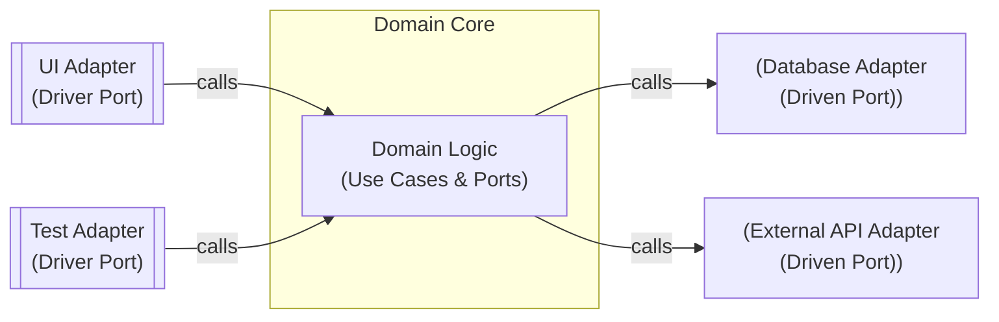

> **Research only - not an implementation target**

# Testing Patterns for Growing Codebases

## Introduction

In a growing codebase, a robust testing strategy is essential to maintain code quality and developer confidence. As new features and components are added, tests ensure that existing behavior remains correct and new code works as intended. This guide distills deep insights into testing patterns – focusing on ideas and architecture rather than code snippets – to help you structure tests for a scalable, maintainable backend system. We will explore how to apply testing best practices in the context of modern Java backend projects (e.g. Spring Boot applications using Maven), with paradigms like hexagonal (ports & adapters) architecture and CQRS, and with technologies such as Neo4j (graph database), PostgreSQL/pgvector (vector search), and even AI-oriented components (knowledge bases and GraphRAG integrations).

**Scope:** We'll concentrate on backend automated testing (unit, integration, etc.), as opposed to end-to-end UI tests (E2E testing is a different beast and out of scope). The patterns here are domain-agnostic, though we'll occasionally use examples inspired by a knowledge-base GraphRAG system (an AI-powered knowledge graph with natural language querying) to illustrate concepts. Our goal is to emphasize testing ideas and patterns, not specific implementations. Diagrams and external resources are included to clarify key points.

## Balancing Test Types with the Testing Pyramid

Before diving into specific patterns, it's important to have a high-level strategy for different types of tests. A widely-used model is the **Testing Pyramid¹**, which advises having a broad base of fast, isolated tests and a narrow top of slower, end-to-end tests:

A three-layer testing pyramid emphasizes having many fast unit tests (bottom), a moderate number of integration tests (middle), and fewer end-to-end tests (top). Each layer has a distinct scope and purpose.

• **Unit Tests (Base of Pyramid):** These tests focus on small units of code (often a single class or function) in isolation. Unit tests are fast, reliable, and easy to maintain, forming the largest part of your test suite². They should run frequently (e.g. on each build or commit) to catch regressions early³. In practice, unit tests might stub or fake any external dependencies (databases, network calls, etc.) so that the logic under test can be verified without external interference⁴. For example, if your code has a service that depends on a database, a unit test might replace the database call with a stubbed response to validate how the service logic handles it.

• **Integration Tests (Middle of Pyramid):** These tests cover interactions between components or with external systems. They are fewer than unit tests and run a bit slower, but they verify that modules work together correctly⁵. In a backend project, integration tests might involve starting up part of the Spring application context (e.g. loading the repository layer and a real database) or calling a REST API endpoint in a local environment to see the whole request-through-database cycle. Integration tests help catch issues with wiring, configuration, or compatibility between modules that unit tests (which isolate components) might miss. Because they touch more resources, they tend to run less frequently (perhaps on each push or at key milestones) to balance coverage with speed⁶.

• **End-to-End (E2E) Tests (Top of Pyramid):** These simulate real user scenarios in a fully deployed system – for example, launching the application and driving it through UI or API calls with real databases. They are the fewest in number and the slowest⁷. While critical for validating entire workflows, E2E tests are brittle and complex, so we keep them to a minimum⁸. (Since this guide focuses on backend testing patterns, we will not delve into E2E details here.)

The testing pyramid's key insight is that most of your testing effort should be at the lower levels (unit tests) which are cheap to write and run, ensuring fast feedback and preventing bugs from propagating¹⁸. Higher-level tests are important but should be fewer, acting as final safety nets. This balanced approach leads to quicker iterations, improved code quality, and more stable releases⁹¹⁰.

## Hexagonal Architecture and Testability (Ports & Adapters Pattern)

When your project adopts the hexagonal architecture (ports and adapters) paradigm, it can significantly improve testability and maintainability of a growing codebase. In a ports-and-adapters design, the core business logic (the "domain") is kept at the center, isolated from outside concerns. It communicates with the outside world through abstract interfaces (ports). The concrete implementations of these interfaces (adapters) handle details like databases, web APIs, or UI, and they plug into the core at runtime. This architecture decouples business logic from infrastructure, making the core logic independent of frameworks or databases¹¹¹².

One huge advantage of this decoupling is the ability to test the domain core in isolation by substituting real adapters with testing adapters or test doubles. In the hexagonal approach, every port can have a real adapter (for production) and a fake or mock adapter for testing¹³¹⁴. By providing a test driver on the input side and stubbed/mocked adapters on the outgoing side, you can test the core application logic without involving external systems¹⁴. In other words, "place a test double at each port to test the component in isolation." This ensures that tests execute quickly and focus purely on business logic, while still exercising the same interfaces used in production.

For example, consider a simplified Hexagonal architecture diagram for a backend service:

In the above diagram, the Domain Core defines ports (interfaces) for inputs and outputs. Driver adapters (like a UI controller or a test harness) invoke the domain through input ports. Driven adapters (like a database repository or external API client) implement the output ports required by the domain. In tests, you can replace the real adapters with test doubles (e.g. an in-memory repository, or a stubbed external API) to isolate and test the domain logic.

Because the domain depends only on abstractions, you can start developing and testing business logic before deciding on concrete technologies¹⁵¹⁶. For instance, you might begin with an in-memory implementation of a repository port (storing data in a list) to quickly test domain behavior, deferring the decision of using Neo4j vs. Postgres for later¹⁷. This prevents early technical choices from influencing domain design and lets you evolve the storage solution independently¹⁶. When the time comes to integrate a real database, the domain tests you wrote against the port interface will still pass as long as the new adapter correctly fulfills the port contract¹⁸¹⁹.

### Testing patterns in Ports & Adapters:

• **Unit-testing the Domain in Isolation:** Use fake adapters or stubs for infrastructure. For example, if the domain logic needs to query a knowledge graph, define a `KnowledgeGraphPort` interface. In a unit test, provide a fake implementation of this port that returns predetermined results (representing, say, a small test graph) so you can verify how the domain logic handles various graph query outcomes. The domain layer (business rules) can be exercised via its driver port (e.g. calling an application service or use-case method) with all external interactions satisfied by fakes. This way, tests run in-memory and quickly, yet cover the core logic thoroughly. As Alistair Cockburn notes, in hexagonal architecture you should test the application core by swapping out real adapters for test doubles, thereby isolating the core from external effects¹⁴.

• **Testing Real Adapters with Contract Tests:** Each real adapter (database, API client, etc.) can be tested against the expectations of the port. A recommended pattern is to have a shared test suite that any implementation of a port must pass²⁰²¹. For example, suppose you have a `UserRepository` port with methods like `save(User)` and `findByEmail(String)`²². You can write an abstract test class (or interface of tests) for `UserRepository` behavior (e.g., saving a user and retrieving it should return the same data, saving an existing user updates it, duplicate emails are rejected, etc.). Then you run this test suite against different adapters: an in-memory repo adapter, a JPA/Postgres adapter, a Neo4j adapter, etc. In Java, this might be done by subclassing the test for each adapter, or using a parameterized test approach. The DZone article on hexagonal testing demonstrates this: they wrote tests once using the port interface, then reused them for an in-memory implementation and a PostgreSQL JPA implementation, simply switching the wiring in a setup method²³. The outcome was that switching from an in-memory adapter to a real database didn't require any test changes – the same tests passed, proving the new adapter conforms to the expected behavior¹⁸. This pattern greatly reduces duplication in tests and ensures consistency across environments.

• **Integration-testing the Whole Application (minus external I/O):** With hexagonal structure, another powerful approach is to write integration tests that execute the app with all its real components (adapters) except the actual external resources. For instance, you can start up the Spring Boot application (loading the real web controllers, services, and repository that talk to a database) but redirect the actual database calls to an ephemeral in-memory database or a containerized database for test purposes. Using tools like Testcontainers (which can spin up a disposable Postgres or Neo4j instance in a container for the duration of the test) is a popular way to incorporate real infrastructure in integration tests without external dependencies. These tests often operate at the boundary of your hexagon – for example, sending an HTTP request to the REST API (driver adapter) and asserting that it returns the expected result after going through the domain and hitting the database. The key is that such tests run the system in "full stack" mode except for controlled replacements for truly external systems (like using an in-memory message broker instead of a real one, etc.). This gives high confidence that your wiring and configuration are correct in a production-like setup. (We'll discuss more on managing external dependencies in the next section.)

In summary, the ports-and-adapters pattern inherently supports a layered testing strategy: you test the domain with no external distractions, test each adapter in isolation (with the domain expectations reused), and test the assembled system with either fakes or real components as needed. This architecture "comes with built-in testing of the Application Core," as one author puts it²⁴, enabling a growing project to keep its core logic well-verified even as new adapters or technologies are added around it. By decoupling the core, "the hexagon can be run by different drivers and tested in isolation from its external recipients (databases, etc.)"²⁵ – a critical property for sustainable growth.

## Unit Testing the Core Domain and Services

Unit tests are the backbone of your test suite. They are meant to be small, fast, and focused. In a large codebase, having a solid suite of unit tests for each component (e.g. service classes, utility functions, domain model behaviors) gives you quick feedback on failures and confidence when refactoring. Here are some patterns and tips for effective unit testing in backend systems:

• **Arrange-Act-Assert (AAA) or Given-When-Then:** Structure each test clearly in three phases. First, set up the context and inputs ("Arrange" or Given), then execute the unit under test ("Act" or When), then verify the outcome ("Assert" or Then). For example, suppose you have a service method `generateGraphSummary()` that interacts with a graph database port. In a unit test, you might arrange a fake graph port to return a known small graph, act by calling `generateGraphSummary()`, and then assert that the summary data matches expectations. This pattern makes tests readable and ensures they each verify one logical behavior.

• **Use Meaningful Test Data and Scenarios:** As codebases grow, it's easy for tests to become hard to understand if they use abstract or trivial data. Instead, use descriptive sample data or scenarios that reflect real usage. For instance, if testing a knowledge base service, you might create a fake knowledge graph with a few nodes ("Alice works at CompanyX") to simulate a real query scenario. This makes the test serve as documentation for what the code should do. Tools like Test Data Builders or factory methods can help create test objects with minimal boilerplate, improving clarity.

• **Isolate External Dependencies:** A unit test should not touch databases, file systems, network, or other external systems. This is where test doubles (dummy, stub, fake, mock, spy – see Glossary) come in. Use stubs or fakes to simulate the behavior of collaborating components. For example, if a service method sends an email via an SMTP server, your unit test can use a stub email sender that simply records that an email "would have been sent," allowing the test to assert that the email-sending logic was invoked correctly, without actually sending anything. Likewise, in a CQRS setup, a command handler that normally publishes an event can be given a fake event publisher that just collects published events into a list for the test to inspect. The goal is to keep the unit test focused on your code's reaction to various conditions, not on the correctness of external systems.

• **Favor Fakes over Mocks for Domain Testing:** There's an important distinction in types of test doubles. Fakes are usually simpler implementations of an interface that have working behavior (though not as scalable or robust as the real thing), whereas mocks are strict, expectation-based substitutes (often configured to expect certain calls). In growing codebases, leaning on fakes can make tests more maintainable than heavy mocking. For instance, an in-memory database or repository is a fake – it behaves like the real DB (stores data, can query it), but entirely in memory and with simplistic logic. Martin Fowler describes a fake as "a working implementation, but usually taking some shortcut that makes it not suitable for production (an InMemoryTestDatabase is a good example)"²⁶. Using a fake repository in many unit tests is often easier to manage than setting up complex mock expectations, and it tests more of your code's real behavior. Mocks can be reserved for truly external interactions where simulating a whole subsystem is overkill. When you do use mocks, be careful to assert only on relevant interactions; over-specifying mock expectations can lead to brittle tests that break with unrelated refactoring²⁷²⁸.

• **Test Behavior, Not Implementation:** Write tests that validate the outcomes of code (returned values, state changes, interactions triggered) rather than the exact lines executed internally. This way, if you refactor the internals of a method, your tests will still pass as long as the externally observable behavior remains correct. For example, if you have a sorting function for search results, a good test would assert that the output list is sorted as expected given an input, not that a particular sorting algorithm or number of loops occurred. This principle ensures tests support refactoring rather than hinder it.

• **Fast Feedback Loop:** Ensure unit tests run extremely fast (seconds, ideally) so developers will run them often. Use continuous integration to run unit tests on every push. If a unit test suite becomes slow as it grows, consider splitting some tests into a separate suite or optimizing fixture setup. In a Spring Boot context, note that loading the Spring container is not necessary for pure unit tests – instantiate the object under test directly. Spring's testing annotations (like `@SpringBootTest`) load a full application context which is slow, so reserve those for integration tests. For simple service or domain tests, you can use plain JUnit or Mockito to inject dependencies manually or with lightweight frameworks, keeping tests blazing fast.

By writing clear, focused unit tests for your core logic, you create a safety net that lets the team extend and modify the codebase with confidence. When an unexpected bug pops up, you can add a new unit test to prevent regressions in the future – over time building a regression suite that grows with the code.

## Integration Testing Patterns for Persistence and Adapters

Integration tests play a critical role in a growing backend project: they ensure that modules and services interact correctly with real infrastructure or with each other. While unit tests guard the logic in isolation, integration tests catch issues in the glue between components – misconfigurations, incompatible data models, transaction issues, etc. Here are key patterns for integration testing:

• **Database Integration Testing:** In backends using databases (SQL or NoSQL), you'll want tests that actually exercise the data layer. One common pattern is to use an in-memory database (for SQL, something like H2) or an embedded version of the database if available (Neo4j has an embedded mode, for example) during tests. Spring Boot provides `@DataJpaTest`²⁹³⁰, which by default will spin up an H2 in-memory database and configure Spring Data JPA for it, allowing you to test your repository layer quickly²³³¹. If your production DB is PostgreSQL and you're using features like pgvector, an in-memory H2 might not support that – in such cases, consider Testcontainers to run a real PostgreSQL in a container during the test, or configure `@DataJpaTest` to not replace the real data source and point it to a test database. The DZone example earlier showed a `StudentRepositoryJpaIT` test class that uses `@Testcontainers` to start a PostgreSQL container and sets Spring properties to use it, so the JPA repository is tested against a real Postgres instance²³³². The advantage of this approach is high fidelity – you catch issues with real SQL constraints or queries – though at the cost of speed. For faster tests, you might run most repository tests with an in-memory store and have a smaller set of tests with Testcontainers to verify platform-specific details. Either way, automating the DB setup and teardown (using transactions or cleaning between tests) is important to keep tests independent and repeatable.

• **Web/API Integration Testing:** If your project has a REST API (e.g., Spring MVC controllers), integration tests can start the web layer and call the APIs to verify end-to-end request handling. Spring's `@WebMvcTest` or `@SpringBootTest(webEnvironment = RANDOM_PORT)` are useful here. For example, you can launch the application in a test configuration (maybe with an in-memory DB) and then use a `TestRestTemplate` or `MockMvc` to simulate HTTP calls to your endpoints, asserting on the JSON responses. This tests the web controller, request mapping, validation, and possibly the service and repository layers beneath (depending on how much of the context you load). It's a good idea to include some critical user flows as integration tests at the API level (e.g., "create an entity, then fetch it back via the API"). These tests are slower than pure unit tests but give confidence that the system's pieces work together correctly.

• **Modular Integration Tests (Service Layer):** Not all integration tests need to fire up the whole app. You can test smaller combinations of components. For example, test the service layer with the repository, without starting the web layer. This can be done by using Spring's context slicing (loading only Service and Repository beans), or simply instantiating the service and injecting a real repository connected to a test database. This is a middle ground where you are testing integration between your core components and the DB, but not involving controllers or the full HTTP stack. It keeps tests more focused and often faster than full-blown end-to-end tests, but still covers transactions, ORMs, etc.

• **Managing External System Integrations:** If your code calls external services (e.g., an OAuth provider, a payment API, or an LLM endpoint for AI), integration testing those can be tricky. Hitting real external systems in tests is usually undesirable (slow, flaky, and not repeatable). The pattern here is to use test doubles or emulators at the boundary. For instance, one could use a local mock server to stand in for external HTTP APIs during integration tests. Tools like WireMock can stub out REST endpoints. In a ports-and-adapters context, you might have an adapter that calls an external API through a port interface; for integration testing that adapter, you can point it to a local stub service. Another approach for third-party systems is contract testing (for microservice interactions or external APIs), where you verify that the requests your code generates conform to expectations and maybe reuse those expectations in a test of the real service's sandbox. The key is to not completely ignore those integrations in tests – have some test that covers the logic of calling them (even if hitting a fake endpoint) to catch issues like bad URL paths, missing headers, etc.

• **Spring Boot Test Slices:** Spring Boot's testing framework has specialized test slice annotations that load only parts of the application context²⁹. We mentioned `@DataJpaTest` (loads JPA/ repository layer with an in-memory DB by default) and `@WebMvcTest` (loads controllers and related components, but not the service or repository beans). There are others like `@JsonTest` (for testing JSON serialization) and `@SpringBootTest` (which loads everything, used for full integration). The pattern here is: use the most narrowly-scoped context you need for the test. Narrow slices mean faster tests and fewer unrelated failures. For example, if you want to test that your validation annotations on a controller work, `@WebMvcTest` will start just the web layer and allow you to test the controller in isolation (with maybe mocked dependencies). If you want to test JPA mappings and queries, `@DataJpaTest` will start the DB layer and not, say, the web server. Using test slices keeps tests focused and speeds up execution²⁹. As the codebase grows, this practice prevents every test from becoming an expensive integration test.

• **Environment Parity and Configuration:** It's good to make your test environment as close to production as practical, within the scope of integration tests. That might mean using the same database engine (Postgres, Neo4j) in tests (thanks to containers or an embedded mode) rather than an entirely different in-memory store that could mask differences. It also means applying the same configuration where possible – for instance, if production uses Flyway migrations on startup, your integration test should run those migrations on the test DB as well, to catch any migration issues. As your codebase and team grow, having a robust integration-test environment as part of CI/CD ensures that issues surface early, not after deployment.

Finally, consider the testing pyramid in terms of volume: you'll have fewer integration tests than unit tests. Pick the most important integration scenarios to test – the ones that involve key components talking to each other or critical infrastructure. For example, one integration test for saving and retrieving an object from each repository, one for each major service workflow through the API, etc. Don't try to cover every edge case with integration tests (that's what unit tests are for); instead use integration tests as smoke tests for the system's wiring and configuration.

## Testing Patterns for CQRS and Event-Driven Components

Many modern systems use architectural patterns like CQRS (Command Query Responsibility Segregation) and event-driven processing. These bring additional considerations for testing, since the write side (commands) and read side (queries) are separated, and often asynchronous or eventually consistent. Here's how you can approach testing in such systems:

• **Command Handler Testing:** In CQRS, commands (writes) are handled by command handlers which update state (often publishing domain events or writing to a store), and queries (reads) are handled by separate query handlers or read models optimized for retrieval. For the command side, treat each command handler's logic as you would any service logic: write unit tests for the business rules it encapsulates. For example, if you have a `CreateUserCommandHandler`, you can unit test it by injecting a fake repository (to simulate saving a user) and perhaps a fake event publisher (if it should emit a "UserCreated" event). The test would send in a `CreateUserCommand` and assert that the repository's save was called with correct data and that a "UserCreated" event was published. The core idea is to test that given certain inputs (command), the correct side effects occur (state change or events). Because of ports & adapters, your command handler likely calls a port like `UserRepository` – you can use an in-memory implementation of this repository in your unit test to verify the handler's behavior.

• **Testing Domain Events and Asynchrony:** If your system uses domain events or an event bus to propagate changes from the command side to the query side (or other subsystems), testing this can be tricky due to asynchrony. One approach for unit testing the domain event logic is to avoid actual threading or messaging – instead, use a fake event bus that simply records events or directly calls the event handler. For instance, if a `CreateUserCommandHandler` publishes `UserCreatedEvent`, and you have an event handler that listens to this event to update a read model, you can test the event handler separately as a unit (injecting a fake read-model repository to see that it writes the correct projection). Full end-to-end testing of the async flow might require an integration test where you trigger the command in a running system and then poll the query side until it reflects the change. However, for most cases, you can get good coverage by testing each piece in isolation: command logic, event handling logic, query logic.

• **Integration Testing CQRS End-to-End:** A powerful pattern for CQRS systems is to write an integration test that executes a command and then queries the result in one flow. This kind of test treats the system almost like a black box (though you might run it in process). For example, using the actual database, you could: start a transaction (or use a fresh test database), execute the command handler (or API call that triggers it), then query the read side (maybe by directly calling the query handler or hitting a GET endpoint), and assert that the read model reflects the write. Such a test verifies the full cycle of CQRS: that the write side correctly persisted changes and any projection or read-store update happened so the query side is up-to-date. On a smaller scale, a Stack Overflow user once noted that an effective way to test CQRS was to "write integration tests that push commands into your domain, then use the queries to get the data back out… for assertions."³³ This ensures the two halves (write and read) are working in concert. If your read model updates are eventually consistent (asynchronous), you may need to build a small wait/retry into the test or better yet use hooks to synchronize (for test purposes, maybe the event handler can signal when done). But if the projection update is quick, a simple approach is to loop for a short time until the query returns the expected result, then assert.

• **Testing Idempotency and Concurrency:** CQRS and event-driven designs often emphasize handling concurrency (since reads and writes are separate) and idempotent processing of events. It's worth having tests for scenarios like "processing the same event twice does not break the system" or "two commands at the same time result in correct final state." These might be more specialized integration tests. For concurrency, you can use multi-threaded tests or simply simulate sequences of operations. For idempotency, you could call an event handler twice with the same event and assert that the outcome is still correct (no duplicates in the read model, etc.). These tests help ensure your system's resilience in real-world conditions where things can happen out of order or more than once.

• **Tooling:** Leverage testing tools for event-driven systems. For instance, if using a message queue or Kafka for events, you might use an embedded broker for tests. If your events are just in-memory (within the same JVM using Spring events or similar), you can use listeners in tests to capture them. The key is to not exclude the event mechanisms from testing altogether – you should have at least some tests that the wiring of events from command to query works (even if it's one integrated test as described earlier).

CQRS adds complexity, but the testing fundamentals remain: keep unit tests focused on one handler or projector at a time using fakes, and use integration tests to cover the pieces working together. Since the team is already using ports & adapters, the command and query handlers likely depend on interfaces (ports) for persistence or external calls, making it straightforward to substitute fakes in tests. Over time, as you gain experience, you'll refine which parts of the CQRS flow to test at which level (unit vs integration). A common outcome is many unit tests for the domain and command logic, and a few high-level integration tests for representative full flows.

## Ensuring Test Reliability with Contract Tests and Test Doubles

As your codebase and test suite grow, you may end up relying on many test doubles (stubs, fakes, mocks) in your tests. These are invaluable for isolation and speed, but they carry a risk: what if the fake doesn't behave exactly like the real component? A classic example is using an in-memory fake database in tests – it might not enforce the same constraints or transaction behaviors as the real SQL database, possibly giving you false confidence. To mitigate this, teams often use contract tests or adapter tests for their fakes and stubs:

• **Contract Tests for Adapters:** A contract test is essentially an integration test that verifies an adapter (or external service) meets a certain contract or behaves like the stub you use in unit tests. We discussed earlier how to have a shared test suite for a port that both the fake and real implementations must pass – that is one form of contract test (contract between port and adapter). Another form is for external services: if you are stubbing an external API in your tests, you should have a test (perhaps calling the actual API's sandbox or a local simulation) to ensure your stub is not lying. For instance, if your system integrates with a payment API and you simulate its responses in unit tests, write a contract test that sends a sample request to the real (or sandbox) API to ensure the response format and behavior match your stub. This prevents divergence where your tests might all be green, but only because your stub is outdated or incorrect.

• **Faithful Fakes with Reference Scenarios:** When creating a fake component for tests, base its behavior on real data or scenarios whenever possible. If you have a fake Neo4j graph for testing, maybe load it with a miniature dataset that reflects actual data shape. If using a fake vector search (pgvector), perhaps use a small array of vectors and a simple distance calculation to simulate it. Then have a few integration tests with the real Neo4j or pgvector to verify, for those same inputs, the real system responds similarly. The idea is to increase confidence that your fakes are "faithful." This doesn't mean making fakes overly complex – they should still be simpler than the real thing – but they should cover the key behaviors your code relies on.

• **Stub vs. Mock – be mindful:** Overuse of mocks (with strict expectations on calls) can lead to fragile tests that fail if you refactor internal interactions. If you find many tests breaking due to internal changes rather than true regressions, that's a sign your tests are too tightly coupled to implementation. Prefer stubs (which just return canned answers) or fakes (which have internal state but no prescribed expectations) for most cases, using mocks primarily when you really need to verify interaction ordering or frequency (which is relatively rare in business logic). One testing strategy blog even quips that "from a pure maintainability perspective, using mocks creates more trouble than not using them", cautioning that tests asserting on mock interactions can break for wrong reasons³⁴³⁵. So use them judiciously and keep assertions high-level when possible.

• **Hybrid Testing Strategy:** Some teams combine fast, isolated tests with a few slower, high-fidelity tests in what's sometimes called the "testing trophy" or a balanced strategy. For example, you might have many fast acceptance tests that run the application with almost everything stubbed (so they are like end-to-end tests but using stubs for all external calls and databases, making them fast). In exchange, you then maintain a smaller set of integration/contract tests that ensure those stubs align with reality³⁶. In one approach, every adapter had a stub for fast tests, and a set of slower tests verified each stub against the real adapter's behavior³⁶. This allowed confidence in the fast tests. However, one must be careful: if the contract tests miss some cases, your fast tests could give false positives (this was a noted pitfall in that approach)³⁷. The lesson is: whichever way you mix and match, periodically review your test coverage and fidelity. If a production bug occurs because a fake didn't emulate a certain edge case of the real system, write a new test (maybe an integration test) to cover that scenario going forward.

In summary, ensure that your usage of test doubles doesn't drift too far from reality. Write integration tests for critical paths and behaviors to pin down the correct behavior of the real components. This is especially pertinent for things like database constraints, transaction boundaries, or external APIs where the real behavior can be more complex than your simplified test version. By maintaining some contract tests, you effectively test your tests, making sure the scaffolding you built in tests accurately reflects the production environment.

## Maintaining a Healthy Test Suite as the Codebase Grows

Beyond specific patterns, there are meta-level practices to keep your test suite effective and sustainable as your project scales:

• **Continuous Integration (CI):** Automate running the tests on a CI server for every commit or pull request. This way, any failing test or breaking change is caught early. A fast unit test suite shines here – it gives quick feedback to developers. Integration tests, which may take longer, can still run in CI but perhaps in parallel or on a schedule if needed. Treat a failing test as a high-priority issue – a broken test suite can demoralize the team and cause mistrust in tests. Keep the build green so it's clear when new regressions appear.

• **Testing Culture and Refactoring:** Encourage the team to view tests as part of the codebase that needs care. As designs evolve, refactor tests to match new structures. For example, if you split a service into two, also split and refactor the tests that were covering it. Remove or update tests that no longer apply to avoid legacy tests that constrain new implementations. A well-factored test suite (using helper methods, builders, and a consistent style) will be easier to maintain over time. It can be useful to establish guidelines for writing tests (naming conventions, where to put test classes, etc.) so the suite stays organized as it grows to hundreds or thousands of tests.

• **Selective Test Execution:** As codebases grow, running all tests might become slow (even with mostly unit tests, sheer volume can add up). Make use of test groupings or tags. For instance, you could mark slow integration tests with a category and by default run only unit tests during development, but run the full suite in CI or on nightly builds. Maven/Surefire or Gradle can be configured to run different groups. This way, developers get quick feedback from unit tests, and the slower tests still run regularly to catch integration issues. Just be cautious to not neglect the results of the slower tests; failures there need attention too.

• **Test Coverage and Gaps:** Code coverage tools can be helpful to identify untested parts of the codebase, but don't obsess over percentage. 100% coverage is not the goal – having meaningful tests for critical logic is. Use coverage to see if any important module lacks tests. As you add new features, always add tests alongside. If a bug is found, write a test that reproduces it (to prevent regression) before fixing. Over time, this practice leads to very thorough coverage of the most important code paths. For less critical or trivial code, tests can be lighter. Also remember some things are hard to unit test (like random number generation or current time); in those cases, consider wrapping such calls so you can control them in tests (e.g., inject a Clock instance), or use integration tests where needed.

• **Focus on Deterministic Tests:** Flaky tests (tests that sometimes pass, sometimes fail) can plague a large test suite. They erode trust. Common causes include reliance on timing (thread sleeps or waiting for async results with fixed timeouts), tests depending on order or shared state, or external network calls timing out. Strive to make each test independent and deterministic. If you find a test occasionally fails, investigate why and fix the root cause (don't just re-run it). For instance, if an asynchronous test is flaky, adjust it to wait properly for a condition or refactor the code to allow hooking a callback in tests. A stable test suite is crucial – developers should feel that if a test fails, it's because of a real issue, not a test glitch.

• **Documentation and Learning:** Use your tests as documentation for new team members. Well-written tests can illustrate how the system is supposed to work. Consider adding behavioral descriptions in test names, e.g., `shouldReturnSuggestionsFromGraph_whenQueryContainsKeyword()`. Moreover, keep sharing knowledge about testing patterns within the team – for example, if someone figures out a good way to test the GraphRAG integration (perhaps by snapshotting a known small graph and vector index), share that approach so others can replicate it in their tests. Evolving a large project is a team effort; a collective understanding of testing best practices will ensure consistency and help avoid anti-patterns.

• **Revisit the Test Strategy Periodically:** As the system evolves (maybe you introduce a new persistence layer, or split into microservices, or add a caching layer), revisit your testing strategy. The patterns in this guide (unit vs integration balance, hexagonal isolation, etc.) should still apply, but you might calibrate the focus. For example, if you break the monolith into services, you'll add API contract tests or consumer-driven contract tests to ensure each service's API meets clients' expectations. Or if you integrate more AI components (say calling an LLM), you might write specialized tests to validate that integration (perhaps using a smaller local model or mocking the API with known prompts). A living test strategy ensures your tests remain aligned with the architecture.

In conclusion, a growing codebase can remain high-quality and agile if accompanied by a well-thought-out, evolving test suite. By applying the patterns of layered testing (pyramid), leveraging architectural separation (ports & adapters) for testability, and continuously refining your approach (based on what the team learns), you'll create a culture where testing is a help, not a hindrance. The team's curiosity and eagerness to learn – for example, their interest in ports & adapters and production-ready patterns – will pay off as they experiment with these testing techniques and see the benefits firsthand. Testing may not prevent all bugs, but it provides a safety net and learning feedback loop that is invaluable for long-term development.

## Glossary

• **Automated Testing:** The use of software tools and frameworks to run tests on code automatically (as opposed to manual testing). This includes unit tests, integration tests, and other types of tests that run in an automated fashion, often as part of a CI pipeline.

• **Backend Testing:** Testing the server-side or business logic part of an application (as opposed to front-end/UI). In Java/Spring Boot projects, this typically involves testing controllers, services, repositories, databases, and APIs without a user interface.

• **CI/CD (Continuous Integration/Continuous Delivery):** Practices where developers frequently integrate code into a shared repository (CI), and automated builds and tests verify each change. CD extends this to automatic deployment. A CI system runs your test suite on each commit, catching issues early and enforcing quality.

• **CQRS (Command Query Responsibility Segregation):** An architectural pattern that separates read operations (queries) from write operations (commands). Instead of a single model or object handling both, the system has distinct command handlers (to update state, often emitting events) and query handlers (to read state, often from a read-optimized database). This can improve scalability and simplify complex domains, but adds complexity in syncing the read model with writes. In testing, CQRS means you often test commands and queries separately, and possibly use integration tests to ensure they work together.

• **Contract Test:** A type of integration test that checks whether an implementation meets a specified contract or interface expectations. For example, a contract test might verify that a mock service used in testing responds the same way as the real service, or that a service's API adheres to what its consumers expect. In hexagonal architecture, contract tests can ensure that a fake adapter and a real adapter both satisfy the domain port's requirements.

• **Domain (Domain Model / Domain Logic):** In software architecture, "the domain" refers to the core business logic and data models of the application – essentially, the parts of the code that represent the concepts and rules of the business or problem space (as opposed to technical infrastructure). Domain logic is typically independent of specific technologies. In Domain-Driven Design (DDD), you model this explicitly via entities, value objects, aggregates, etc. Here we use "domain" to mean the central logic of the application that hexagonal architecture tries to isolate behind ports.

• **End-to-End (E2E) Test:** A test that verifies a complete workflow of an application from the end-user's perspective, interacting with the system as a black box. For a web app, an E2E test might involve a browser automation clicking through UI, or sending HTTP requests to a deployed service, and checking that the expected outcomes occur (database updated, UI shows correct data, etc.). E2E tests cover the entire stack (including networking, databases, etc.) and thus are slow and prone to flakiness, but they are useful to ensure the whole system works together.

• **Fake (Test Fake):** A fake is a type of test double that has a working implementation, but is simplified or not suitable for production. Fakes often simulate a whole subsystem in memory. Example: an in-memory database or an in-memory implementation of a repository interface. Fakes handle logic (e.g., store records in a list and implement queries) so the system thinks it's using the real thing. Fakes are used to speed up tests by avoiding external calls, while still exercising logic (unlike stubs, which just return fixed values).

• **Framework (Software Framework):** A platform or library that provides a foundation for developing applications. In this context:
  - **Spring Boot:** A popular Java framework that simplifies configuring and running Spring applications. It provides auto-configuration and starters for web servers, data access, security, etc., making it easier to create production-ready applications. It also includes testing support (annotations and utilities to test Spring apps).
  - **JUnit:** The de-facto unit testing framework for Java. It allows writing test methods with assertions, and running them to get pass/fail results. Modern versions (JUnit 5) provide annotations like `@Test`, `@BeforeEach`, etc., to structure tests.
  - **Mockito:** A mocking framework for Java that allows creation of mock objects, specifying their behavior, and verifying interactions. Often used in unit tests to simulate dependencies.
  - **Testcontainers:** A Java library that makes it easy to run Docker containers for test purposes. Commonly used to spin up databases (PostgreSQL, etc.) or other services in integration tests, ensuring a test runs with a fresh, real instance of the dependency.

• **GraphRAG:** Short for Graph Retrieval-Augmented Generation. It's a technique in AI systems where a knowledge graph is used as part of the context retrieval process for large language model (LLM) generation. In a standard RAG system, a question is answered by retrieving relevant text (often via vector similarity search) and feeding it to the LLM. GraphRAG enhances this by leveraging a graph database that stores knowledge with relationships, to retrieve not just isolated text snippets but a connected subgraph of information. This provides richer context and can improve accuracy and explainability of the AI's answer³⁸³⁹. In our context, the project's core includes a GraphRAG system, meaning it likely uses Neo4j (graph DB) along with pgvector (vector search in Postgres) to find and compose relevant information for answering natural language queries.

• **Hexagonal Architecture (Ports and Adapters):** An architectural style (also known as ports & adapters) that emphasizes a separation between the core logic (inside the hexagon) and the outer layers that interact with external systems. The core defines ports (interfaces) for input (driving ports, e.g., services that the outside world can call) and output (driven ports, e.g., gateways to external resources like databases). Adapters implement these ports – e.g., a REST controller is an adapter on a driving port, a repository implementation is an adapter on a driven port. The term "hexagonal" comes from picturing the application core as a hexagon with different ports on its sides. The main goal is to make the core independent of technology details, which also makes it naturally testable in isolation⁹²⁵.

• **Integration Test:** A test that checks the interaction between multiple components of the system. This is broader than a unit test. Integration tests typically involve real (or at least more complete) implementations of subsystems – for example, testing your data access code with a real database, or calling your web API and seeing it go through all layers. Integration tests in a Spring app might load a Spring context (or part of it) and involve multiple beans. They ensure that components work together correctly (e.g., your JPA annotations match the DB schema, or your REST endpoint is correctly wired to service and repository). Integration tests are slower and more complex than unit tests, but they catch issues that arise from the wiring between modules or from environmental configurations.

• **Java:** A popular programming language (and platform) widely used for enterprise and backend applications. In this context, Java is the language of the project, using frameworks like Spring Boot for development and JUnit for testing.

• **Jargon:** In the context of this glossary, "jargon" refers to specialized terms and abstractions used in software development and testing (such as those listed here). Understanding jargon is important for team communication; hence we compile these definitions for clarity.

• **Knowledge Base:** A store of information or data that a system uses to answer questions or make decisions. In an AI context (like the project mentioned), a knowledge base could be a collection of documents, a graph of entities, or any structured information that the AI can query. The system being built uses a knowledge base (possibly a graph database like Neo4j) to retrieve information in response to natural language queries.

• **Mermaid:** A Markdown-friendly diagramming tool that uses text syntax to generate diagrams (flowcharts, sequence diagrams, etc.). In this guide, we used Mermaid to create diagrams (like the hexagon architecture figure). It's often used in documentation to include simple charts or graphs in Markdown files.

• **Mock (Mock Object):** A type of test double that not only simulates a dependency but also allows you to verify interactions with it. Mocks are typically pre-programmed with expectations: e.g., you expect that a method X should be called once with value 42, and the mock can fail the test if that interaction doesn't happen exactly as specified. Mocks are useful for interaction testing (ensuring certain methods were called) and for isolating the unit under test. However, overusing mocks can lead to brittle tests, because they tie the test to internal details of the code's behavior (see Fake and Stub for comparison). In frameworks like Mockito, a mock can be created and you can specify `verify(mock).someMethod(42)` to assert it was called.

• **Maven:** A build automation and project management tool for Java (and other JVM languages). Maven uses a pom.xml file to manage project configuration, dependencies, and plugins. In the context of testing, Maven can run tests during the build (for example, `mvn test` runs the unit tests). It also handles test scope dependencies (libraries needed only for tests). The project being discussed likely uses Maven to compile code, run tests, and package the Spring Boot application.

• **Natural Language Query (NLQ):** A query expressed in natural human language. In context, "RAG NLQ" implies a natural language question that is answered using a Retrieval-Augmented Generation approach. Testing an NLQ system might involve ensuring that given a certain plain English question, the system's retrieval components find the right knowledge base entries and that the response generator produces a coherent answer. NLQ systems are challenging to test due to the variability of language, but one might use predetermined questions and expected answer parts to verify correctness.

• **Neo4j:** A popular graph database management system. It stores data as nodes and relationships (edges), rather than tables. It allows complex network queries using patterns. In a testing context, Neo4j can be used via an embedded database (running an instance in-memory) or via Testcontainers to spin up a real Neo4j instance. If your application uses Neo4j, you'd want integration tests to ensure your Cypher queries and data mappings work correctly. Graph data often requires testing that certain relationships exist or that traversals yield expected results.

• **pgvector (Postgres pgvector):** An extension for PostgreSQL that enables storing and querying vector embeddings. Embeddings are numerical representations of data (like text or images); pgvector allows similarity search on those vectors (e.g., find the closest vectors to a query vector). In an AI/semantic search context, this is used to find relevant text chunks. Testing pgvector integration might involve inserting some known vectors and querying for a close match to ensure the extension is configured and behaving as expected. In general, it's a lower-level detail; from a testing pattern perspective, using a real Postgres with pgvector in integration tests (or a sufficiently similar setup) would be important to ensure queries return expected results (since an in-memory stub of vector search might not capture all behavior).

• **Ports and Adapters:** See Hexagonal Architecture. Ports are the abstract interfaces in hexagonal architecture (defining what the core needs or offers), and adapters are the concrete implementations or callers that connect the core to external systems. "Ports and Adapters" is just another name for hexagonal architecture, emphasizing the interchangeable plug-in nature of components.

• **PostgreSQL (Postgres):** A relational database system known for its robustness and features. Here it's used likely as a primary data store, and possibly extended with pgvector for vector similarity. From a testing viewpoint, if your app uses Postgres, you might run tests against Postgres itself (with a test database) or use an in-memory alternative (but for features like pgvector, you'd stick with Postgres). Tools like Testcontainers help run Postgres for tests. Postgres also offers a wealth of features (constraints, JSON columns, etc.), so integration tests help ensure your code's usage of these features works as expected.

• **Retrieval-Augmented Generation (RAG):** An AI pattern where an LLM (Large Language Model) is combined with a retrieval step. Before the model answers a question, the system retrieves relevant information (documents, knowledge base entries, etc.) and provides that to the model as context. This ensures the answer is grounded in up-to-date and factual information, mitigating issues like hallucinations⁴⁰. In testing a RAG system, one might test the retrieval component (does it find relevant documents given a query?) and the integration (does the final answer contain information from those docs?). Since LLM output can be nondeterministic, testing often involves checking for inclusion of key facts or overall correctness rather than exact match.

• **Spring Boot:** A convention-over-configuration framework built on Spring. It simplifies starting new Spring projects by providing starters (bundled dependencies) and auto-configuration. Spring Boot lets you create standalone applications (with an embedded server like Tomcat) and is widely used for microservices and web APIs. In testing, Spring Boot provides annotations to easily test slices of the application (controllers, JPA, etc., as discussed). Spring's inversion of control (dependency injection) and context management influence testing: e.g., you might use `@SpringBootTest` to load the full app context in a test, or use mocking to avoid it. Knowing Spring Boot is key for understanding how to wire up components in tests or how to replace beans (like replacing a real bean with a test double bean for an integration test).

• **Stub:** A stub is a simple test double that provides canned answers to calls, without implementing full behavior and typically without any logic beyond what's programmed for the test⁴¹. For example, a stub repository might just have a method `findById(id)` that returns a specific object if id matches some test value, or returns null otherwise – it doesn't actually query anything or store data. Stubs are used to isolate the unit under test by replacing collaborators with a version that gives predictable outputs. Unlike mocks, stubs usually do not record how they were called (so you don't assert on interactions, only on the returned results). Stubs are straightforward and are often defined inline in a test or via a library like Mockito (e.g., `when(mock.method()).thenReturn(value)` sets up a stubbed response).

• **Test Double:** A general term for any object that stands in for a real component in a test⁴². This includes dummies, stubs, fakes, spies, and mocks (see those entries). The term comes from the idea of a stunt double in movies – used to take the place of the real actor for certain scenes. In testing, test doubles let you simulate parts of the system that would be impractical or undesirable to use in tests (like calling an external service or doing network I/O). Gerard Meszaros coined this term to encompass all the various kinds of substitute objects⁴².

• **Test Slice (Spring Test Slice):** A feature of Spring Boot testing where you only load a portion of the application configuration for testing purposes²⁹. For example, `@WebMvcTest` loads the web layer beans (controllers, filters, etc.) but not the database or other beans, allowing you to test controllers in isolation. `@DataJpaTest` loads JPA-related components (entity manager, repositories) and sets up an in-memory database by default, without loading web controllers or the full app. These slices make tests faster and more focused by not starting the whole application. They are an important practice in large Spring applications to keep test times manageable.

• **Testing Pyramid:** A conceptual diagram that visualizes the ideal distribution of test types in a software project¹. It has three layers shaped like a pyramid: the broad base is unit tests (many, fast), the middle layer is integration tests (fewer, slower), and the small top is end-to-end tests (fewest, slowest). The pyramid promotes having a lot of fast, granular tests and fewer high-level tests, to achieve both coverage and efficiency¹⁸. Mike Cohn is credited with popularizing it. It's a guideline to prevent the situation where a team relies mostly on slow end-to-end tests (which is like an inverted pyramid – unstable). In practice, the "exact" ratios vary, but the principle is to invest heavily in unit tests, have a healthy but smaller set of integration tests, and a minimal critical set of E2E tests.

• **Test Runner / Test Harness:** A tool or framework that executes tests and reports results. JUnit is a test runner for unit tests. A test harness might also refer to code that sets up the conditions for a test – e.g., in hexagonal architecture, you might write a test harness that acts as a driver adapter, invoking the application with certain inputs and capturing outputs. The harness isn't part of production code, but it "wraps" the system for testing purposes. For example, writing a main method that simulates user input for a console app to test its output could be a test harness. In our context, a test harness could be as simple as a JUnit test class that manually constructs the domain with fake adapters (that test class is effectively the harness driving the domain).

• **Unit Test:** The smallest scope of testing, focusing on one "unit" of code – typically a single class or a small cluster of closely related classes. Unit tests verify that a specific piece of code works in isolation from the rest of the system. They use test doubles to replace collaborators and should run extremely fast. The goal is to pinpoint issues at the function/method level and ensure each piece of logic behaves correctly for various inputs. A well-written unit test covers a single concern and has clear pass/fail criteria on the result of the unit (return value, state change, or interaction with a mocked dependency). In a large codebase, unit tests provide localized safety nets that make debugging easier (when one fails, you know exactly which component is broken).

---

¹ The testing pyramid: Strategic software testing for Agile teams - CircleCI  
https://circleci.com/blog/testing-pyramid/

² ³ ⁴ ⁵ ⁶ ⁷ ⁸ The Pattern: Ports and Adapters (Hexagonal Architecture) - Bagrat Mukaelyan | Software Engineer | Writer  
https://mbagrat.com/architecture/the-pattern-ports-and-adapters-hexagonal-architecture/

⁹ ¹⁰ ¹¹ ¹² ¹³ ²⁵ Component plus strategy.pdf  
https://alistaircockburn.com/Component%20plus%20strategy.pdf

¹⁴ Testing Repository Adapters With Hexagonal Architecture  
https://dzone.com/articles/testing-repository-adapters-with-hexagonal-architecture

¹⁵ ¹⁶ ¹⁷ ¹⁸ ¹⁹ ²⁰ ²¹ ²² ²³ ³¹ ³² Ports-and-Adapters Architecture: The Pattern - Burkhard Stubert  
https://embeddeduse.com/2023/08/24/ports-and-adapters-architecture-the-pattern/

²⁴ Test Double  
https://martinfowler.com/bliki/TestDouble.html

²⁶ ⁴¹ ⁴² unit testing - What's the difference between faking, mocking, and stubbing? - Stack Overflow  
https://stackoverflow.com/questions/346372/whats-the-difference-between-faking-mocking-and-stubbing

²⁷ ²⁸ ³⁴ ³⁵ Mastering Testing Efficiency in Spring Boot: Optimization Strategies and Best Practices  
https://engineering.zalando.com/posts/2023/11/mastering-testing-efficiency-in-spring-boot-optimization-strategies-and-best-practices.html

²⁹ ³⁰ c# - Applying CQRS - Is unit testing the thin read layer necessary? - Stack Overflow  
https://stackoverflow.com/questions/4869633/applying-cqrs-is-unit-testing-the-thin-read-layer-necessary

³³ use case driven: Hexagonal architecture: don't get lost on your right-side  
http://tpierrain.blogspot.com/2020/03/hexagonal-architecture-dont-get-lost-on.html

³⁶ ³⁷

³⁸ ³⁹ ⁴⁰ What Is GraphRAG?  
https://neo4j.com/blog/genai/what-is-graphrag/