# Individual Resolution Ladder Pattern

**Status:** Established

## Purpose

This pattern explains how LoreVault currently turns extracted scene-local identity evidence into chapter-level and book-level identity structures during ingestion.

The implemented ladder is:

- `Scene -[:MENTIONS]-> IndividualMention`
- `IndividualMention -[:REFERS_TO]-> ChapterIndividual`
- `ChapterIndividual -[:REFERS_TO]-> BookIndividual`

This pattern is the present-state mechanism for scoped identity resolution. It documents what the code does today, not the earlier proposal space.

## Why the ladder exists

LoreVault treats identity resolution as a scoped aggregation problem rather than immediate canonicalization.

- `IndividualMention` preserves evidence from a specific scene
- `ChapterIndividual` consolidates same-person mentions within one chapter
- `BookIndividual` provides a thin cross-chapter identity backbone within one book

The result is a map/reduce identity flow that fits the chapter-oriented ingestion pipeline and spoiler-aware product shape.

## Mechanism Overview

### 1) Scene detection persists evidence first

`SceneDetectionHandler` runs scene detection and triad extraction for a chapter.

After scenes are localized and persisted, `IndividualPersistenceService` writes extracted `IndividualMention` nodes and links them to their owning `Scene`.

Important properties on persisted mentions include:

- `displayName`
- `normalizedName`
- `aliases`
- `activity`
- `age`
- `physicalProperties`
- `sceneId`
- `chapterId`
- `bookId`
- `resolutionStatus`
- `extractionIndex`

The evidence layer is written before any identity consolidation happens.

### 2) `ScenesDetectedEvent` forks into two branches

Once scenes and mention evidence are persisted, `SceneDetectionHandler` publishes `ScenesDetectedEvent`.

That event fans out into two independent branches:

- **content branch** — chunking then embedding
- **identity branch** — chapter resolution then book reduction

This keeps identity work reactive to ingestion without forcing it into the chunking/embedding handlers.

### 3) Chapter-level resolution groups mentions deterministically

`ChapterIndividualResolutionHandler` listens to `ScenesDetectedEvent` and calls `ChapterIndividualResolutionService.resolveChapter(chapterId)`.

The current implementation is deterministic and intentionally conservative:

- existing chapter-level resolution state for the chapter is deleted
- mention candidates are grouped by `normalizedName`
- one `ChapterIndividual` is created per group
- `IndividualMention -[:REFERS_TO]-> ChapterIndividual` links are recreated
- linked mentions are marked `chapter-resolved`

Current `ChapterIndividual` state is intentionally minimal:

- `chapterId`
- `displayName`
- `normalizedName`
- `mentionCount`

This proves the graph shape before adding richer aggregate identity facts.

### 4) Book-level reduction groups chapter identities upward

`BookIndividualReductionHandler` listens to `ChapterIndividualsResolvedEvent` and calls `BookIndividualReductionService.resolveBook(bookId)`.

The current implementation uses a deterministic reduction query to gather distinct normalized names across a book's chapter-level identities, select a representative chapter identity, and rebuild thin `BookIndividual` nodes.

Current `BookIndividual` state is:

- `bookId`
- `displayName`
- `normalizedName`
- `chapterIndividualCount`
- `representativeChapterIndividualId`
- `firstSeenChapterId`

`BookIndividual` is deliberately thin. It is a continuity structure, not a bag of all revealable facts.

## Event Chain

### Full flow

```mermaid
graph LR
    Submit["IngestionService"] --> ChapterEvt["ChapterIngestionEvent"]
    ChapterEvt --> Detect["SceneDetectionHandler"]
    Detect --> ScenesEvt["ScenesDetectedEvent"]

    ScenesEvt --> Chunking["ChunkingHandler"]
    Chunking --> ChunksEvt["ChunksCreatedEvent"]
    ChunksEvt --> Embedding["EmbeddingHandler"]
    Embedding --> EmbeddingsDone["EmbeddingsCompletedEvent"]

    ScenesEvt --> ChapterResolve["ChapterIndividualResolutionHandler"]
    ChapterResolve --> ChapterResolved["ChapterIndividualsResolvedEvent"]
    ChapterResolved --> BookReduce["BookIndividualReductionHandler"]
    BookReduce --> BookReduced["BookIndividualsReducedEvent"]

    EmbeddingsDone --> Complete["IngestionCompletionCoordinator"]
    BookReduced --> Complete
    Complete --> Done["IngestionCompletedEvent"]
```

### Completion semantics

`IngestionCompletedEvent` is terminal for chapter ingestion.

LoreVault now treats both post-scene branches as required work:

- embedding branch must finish
- book-level identity reduction branch must finish

`IngestionCompletionCoordinator` waits for both `EmbeddingsCompletedEvent` and `BookIndividualsReducedEvent` for the same `(jobId, chapterId)` before it marks the job complete and publishes `IngestionCompletedEvent`.

## Idempotency and Coordination

### Scene detection

`SceneDetectionHandler` checks for existing scenes before rerunning detection. If scenes already exist, it emits `ScenesDetectedEvent` using the persisted state and skips duplicate scene creation.

### Chunking

`ChunkingHandler` checks:

- `chunkRepo.existsForChapterViaScenes(chapterId)`
- fallback `chunkRepo.existsForChapter(chapterId)`

If chunks already exist, it emits `ChunksCreatedEvent` with the existing count and skips rebuilding chunks.

### Embeddings

`EmbeddingService` uses an `embeddingHash` derived from `modelId + contentHash` to decide whether a chunk actually needs re-embedding.

That means reruns skip already-up-to-date embeddings.

### Chapter resolution

`ChapterIndividualResolutionService` uses a delete-and-rebuild strategy for one chapter at a time. Given the same mention set, the result is deterministic and safe to rerun.

### Book reduction

`BookIndividualReductionService` also uses delete-and-rebuild semantics, but automatic triggering exposed a concurrency race when multiple chapter completions for the same book arrived close together.

The implemented fix is a per-book `ReentrantLock` keyed by `bookId` so book reduction is serialized per book.

## Manual Trigger Points

Automatic event-driven processing is the default, but manual command endpoints remain available:

- chapter individual resolution endpoint
- book individual reduction endpoint

These allow explicit reruns without disabling the automatic path.

## Recent Hardening Relevant To This Pattern

### Coordinated completion

Identity reduction is no longer treated as optional post-processing after ingestion completion. It is part of the completion contract.

### Book-level concurrency control

Per-book locking prevents concurrent delete-and-rebuild reduction races from violating unique constraints.

### Deterministic chunk ordering across the parallel branch

The content branch now persists `HAS_CHUNK.chunkIndex`, and chunk reads order by scene index plus relationship chunk index. This keeps scene-to-chunk-to-embedding traversal deterministic while the identity branch runs in parallel.

### Retry escalation for low scene-localization coverage

Scene detection now treats excessive scene loss during localization as retryable failure. This matters here because unresolved localization can prevent the evidence layer from being persisted cleanly.

## Boundaries

This pattern covers:

- the scoped identity ladder
- the event chain that drives it
- idempotency and completion semantics

This pattern does **not** cover:

- future embedding-assisted candidate generation for identity matching
- broader entity extraction for locations or collectives
- claim extraction or canonical fact modeling
- cross-book or cross-series identity resolution

## Primary References

- `ingestion-pipeline.md`
- `../brainstorm/individual-resolution/individual-resolution-proposal-april-2026.md` (proposal history + implementation notes)

## Key Code References

- `lorevault-api/src/main/java/com/lorevault/api/ingestion/SceneDetectionHandler.java`
- `lorevault-api/src/main/java/com/lorevault/api/ingestion/IndividualPersistenceService.java`
- `lorevault-api/src/main/java/com/lorevault/api/ingestion/ChapterIndividualResolutionHandler.java`
- `lorevault-api/src/main/java/com/lorevault/api/ingestion/ChapterIndividualResolutionService.java`
- `lorevault-api/src/main/java/com/lorevault/api/ingestion/BookIndividualReductionHandler.java`
- `lorevault-api/src/main/java/com/lorevault/api/ingestion/BookIndividualReductionService.java`
- `lorevault-api/src/main/java/com/lorevault/api/ingestion/IngestionCompletionCoordinator.java`
- `lorevault-api/src/main/java/com/lorevault/api/content/IndividualMention.java`
- `lorevault-api/src/main/java/com/lorevault/api/content/ChapterIndividual.java`
- `lorevault-api/src/main/java/com/lorevault/api/content/BookIndividual.java`
