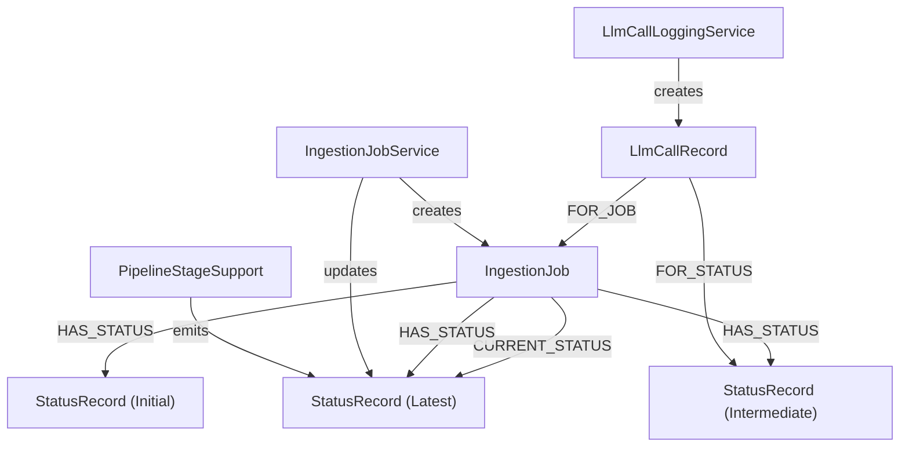
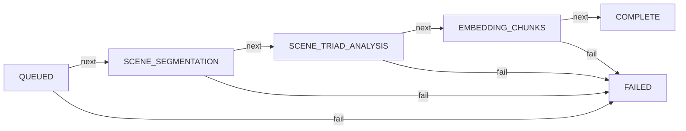

# Ingestion Observability Pattern

**Status:** Established

## Design Philosophy

LoreVault's ingestion pipeline involves multiple async stages, LLM calls, and potential failures. A single mutable status field would hide what actually happened during a job's lifecycle. The solution is an append-only `StatusRecord` chain attached to each `IngestionJob`, plus per-call `LlmCallRecord` nodes for LLM interactions.

This gives full auditability: every stage transition, every LLM call, and every failure is recorded as a separate node in the graph. Status updates use `REQUIRES_NEW` transaction propagation so they survive even if the outer stage transaction fails. LLM call records link to both the parent job and optionally to the specific status record that triggered them, which is useful for triad-level correlation.

## Component Map

## Status Lifecycle

The `IngestionStatus` enum represents the progression of a job through the pipeline. Each handler emits status updates at stage start and stage completion. Triad analysis emits one `SCENE_TRIAD_ANALYSIS` status per triad for fine-grained visibility.

`COMPLETE` and `FAILED` are terminal states. Each status has a `progressPercent` value (e.g., QUEUED=0, SCENE_SEGMENTATION=25, EMBEDDING_CHUNKS=50, COMPLETE=100).

## LLM Call Records

Every LLM call (Pass 1 scene detection, Pass 2 triad analysis) is recorded as an `LlmCallRecord`. Records capture the provider, model, token counts (prompt + completion), timing, and request/response payload. These records link to the parent `IngestionJob` via a `FOR_JOB` relationship. When processing triads, records also link to the specific `StatusRecord` via `FOR_STATUS` for per-triad correlation. Separate records are created per retry attempt, ensuring old evidence is preserved rather than overwritten.

## StatusRecord Properties

Each `StatusRecord` has a `Map<String, String> properties` for stage-specific metadata. Examples of properties stored include:

- `chapterId` (on QUEUED)
- `triadIndex`, `prevSceneId`, `currentSceneId`, `nextSceneId` (on SCENE_TRIAD_ANALYSIS)
- `chunkCount`, `chapterLength`, `completedAt`, `version`, `pipeline` (on COMPLETE)
- `failureCode`, `failureMessage`, `failureExceptionType`, `failureStage`, `failureDetail.*` (on FAILED)

## Failure Details Extraction

When a job fails, the `FAILED` status record carries structured failure information in its properties map. `PipelineStageSupport` builds `IngestionFailure` objects which are serialized into the properties map. `TriadAnalysisException` is unwrapped specially to preserve triad-specific failure context. `IngestionJobService.extractFailureDetails()` reconstructs `FailureDetails` from the properties for API responses.

## Boundaries

- **Pipeline flow** — see the Ingestion Pipeline Pattern
- **Triad analysis specifics** — see the Triad Analysis Pattern
- **API response shape** — `JobStatusResponse` is a web concern, not documented here
- **Metrics/Prometheus** — not yet implemented; this pattern covers graph-level observability only

## Primary References

- `../development/current/data-model/ingestion-job-and-status.md`
- `../development/current/data-model/llm-call-records.md`
