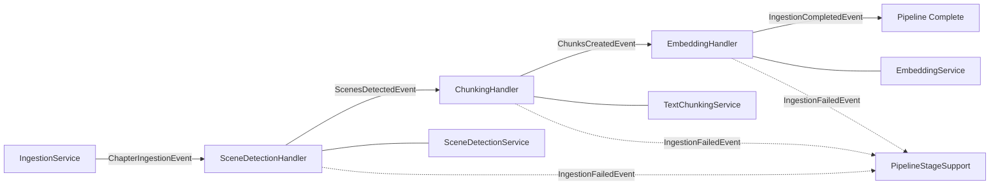
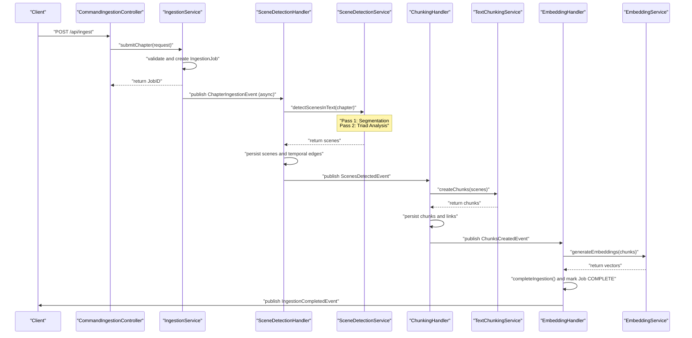

# Ingestion Pipeline Pattern

**Status:** Established

### Design Philosophy
LoreVault ingests narrative chapter text through a staged, event-driven pipeline. This architecture treats ingestion as a series of discrete transformations, from raw text to structured scenes, granular chunks, and vector embeddings. Each stage operates as a decoupled unit, ensuring that the complex process of understanding narrative structure remains manageable and observable.

Stages communicate asynchronously through Spring application events, which isolates failures and preserves partial progress. If chunking fails during a run, the scene detection results from the previous stage survive. This decoupling allows the system to scale specific parts of the pipeline independently and provides a natural boundary for transactional integrity.

The pipeline uses `@Async` event listeners to ensure stages run in separate threads after the publishing transaction commits. A shared `PipelineStageSupport` class provides consistent failure handling across all stages. It manages failure events, updates job statuses, and classifies errors as retryable or terminal. The two-pass scene detection process, involving initial segmentation and subsequent temporal triad analysis, represents the most computationally expensive portion of this flow.

### Component Map

### Sequence Diagram: Full Pipeline Happy Path

### Pipeline Stage Detail

**Stage 1: Chapter Submission** (`IngestionService`)
- Validates the incoming chapter and deduplicates based on a content hash to prevent redundant processing.
- Creates an `IngestionJob` with an initial `QUEUED` status to track the lifecycle of the request.
- Publishes a `ChapterIngestionEvent` within a Spring `@Transactional` context.
- The downstream listeners only fire after the initial transaction commits, ensuring the job record is visible to background threads.

**Stage 2: Scene Detection** (`SceneDetectionHandler`)
- Maintains idempotency by checking for existing scenes in the repository before starting work.
- Executes Pass 1: Uses an LLM for initial segmentation followed by XML parsing and a 3-tier fallback for coordinate localization.
- Executes Pass 2: Performs triad analysis to establish complex temporal relationships and persists these as edges in the graph.
- Automatically creates default sequential temporal edges through the `DefaultTemporalEdgeService`.
- Classified as retryable for transient LLM, API, or connection timeout errors.

**Stage 3: Chunking** (`ChunkingHandler`)
- Checks the repository to see if chunks already exist for the chapter's scenes to ensure idempotent behavior.
- Extracts raw scene text using the character offsets established during the detection phase.
- Breaks each scene into overlapping segments via the `TextChunkingService` to maintain narrative context across boundaries.
- Adjusts chunk coordinates to be chapter-relative, providing a consistent reference frame for the entire text.
- Persists the resulting chunks and creates explicit links to their parent scenes.

**Stage 4: Embedding + Completion** (`EmbeddingHandler`)
- Generates vector embeddings for every chunk created in the previous stage using the configured embedding model.
- Invokes `completeIngestion()` to aggregate final statistics, such as total scene count, chunk count, and processed character length.
- Updates the `IngestionJob` status to `COMPLETE` and records final metadata.
- Handles retries for external API failures or network-related connection errors.

### Failure Handling
The `PipelineStageSupport.runStage()` utility wraps every stage in a try-catch block to provide uniform error management. When a failure occurs, the system emits an `IngestionFailedEvent` and updates the job status to `FAILED`. This update includes a structured `IngestionFailure` object containing the error type, message, and diagnostic properties.

Each handler defines its own retryability logic. For instance, LLM provider errors are marked as retryable, while a missing chapter entity is treated as a terminal state. The system specifically unwraps `TriadAnalysisException` to preserve granular details about which part of the temporal analysis failed. To prevent cascading failures in the event-driven loop, exceptions are recorded and swallowed by the handler rather than being rethrown.

### Idempotency
To support safe event re-delivery and manual restarts, each handler verifies its current state before performing work. The `SceneDetectionHandler` queries `sceneRepo.findByChapterId()` and skips processing if scenes are already present. Similarly, the `ChunkingHandler` uses `chunkRepo.existsForChapterViaScenes()` to determine if chunking is already finished. This check allows the pipeline to resume from the last successful stage if interrupted.

### Boundaries
- **Triad analysis details** — The internal logic for temporal triad classification is documented in the Triad Analysis Pattern.
- **Observability model** — The tracking of job statuses and LLM call records is handled by the Observability Pattern.
- **Scene coordinate localization** — The 3-tier fallback matching logic resides within the `SceneProcessingService` and is not covered here.
- **LLM prompt templates** — Templates are managed by the `PromptRepository` and are external to the pipeline flow.
- **Content hierarchy** — The management of Universes, Series, and Books is the responsibility of the `LibraryService`.

### Primary References
- `../development/current/processes/scene-detection-specification.md`
- `../development/current/processes/triad-orchestration.md`
- `../adr/004-keep-the-event-driven-ingestion-pipeline.md`
- `../development/current/data-model/ingestion-job-and-status.md`
