# Entity Resolution Ladder

**Status:** Established

## Purpose

This pattern explains how LoreVault turns scene-local entity evidence into chapter-level and book-level entity structures during ingestion.

The general ladder shape is:

- `Scene -[:CONTAINS]-> EntityMention`
- `EntityMention -[:REFERS_TO]-> ChapterEntity`
- `ChapterEntity -[:REFERS_TO]-> BookEntity`

LoreVault currently implements four regular entity lanes following this ladder:

- **Individual** — `IndividualMention → ChapterIndividual → BookIndividual`
- **Location** — `LocationMention → ChapterLocation → BookLocation`
- **Object** — `ObjectMention → ChapterObject → BookObject`
- **Collective** — `CollectiveMention → ChapterCollective → BookCollective`

Each lane runs as an independent sibling branch off `ScenesDetectedEvent`. All four book-reduced events are required completion-barrier branches in the ingestion completion contract.

Event resolution is a distinct special-case pipeline path. It uses event-specific extraction, chapter event aggregation, event embeddings, ANN candidate generation, semantic merge verification, and book event writes rather than the regular entity ladder described here.

## Why the ladder exists

LoreVault treats entity resolution as a scoped aggregation problem rather than immediate global canonicalization.

- `EntityMention` preserves evidence from a specific scene.
- `ChapterEntity` consolidates same-entity mentions within one chapter.
- `BookEntity` provides a thin cross-chapter identity backbone within one book.

The result is a map/reduce entity flow that fits chapter-oriented ingestion and spoiler-aware retrieval.

## Shared Mechanism

### 1) Evidence layer written first

`SceneDetectionHandler` persists real `Scene` nodes first.

After scenes are localized and saved, each entity persistence service resolves `sceneIndex → Scene.id` and writes `EntityMention` nodes plus `Scene -[:CONTAINS]-> EntityMention` links using persisted scene IDs.

The implemented scene-local evidence lanes are:

- `IndividualPersistenceService`
- `LocationPersistenceService`
- `ObjectPersistenceService`
- `CollectivePersistenceService`

The evidence layer is written before any entity consolidation happens.

All regular entity lanes use the shared `ConsolidationEngine<S>` (in `orchestration/consolidation/`) for entity clustering. The engine uses connected-components algorithm with alias-aware identity key extraction via `NameKeys`. Individual `EntityMerger<S,T>` lambdas handle type-specific field collapsing. See [Unified Entity Consolidation](../../planning/2026-05-27T0015_unified-entity-consolidation.md).

### 2) `ScenesDetectedEvent` fans out into sibling branches

Once scene persistence and scene-local evidence persistence are complete, `SceneDetectionHandler` publishes `ScenesDetectedEvent`.

That event feeds:

- content branch — chunking then embedding
- Individual branch — chapter resolution then book reduction
- Location branch — chapter resolution then book reduction
- Object branch — chapter resolution then book reduction
- Collective branch — chapter resolution then book reduction
- Event branch — chapter event resolution, event embedding, and same-book ANN candidate generation

Entity lanes are sibling branches, not sub-steps of each other or of the content branch.

### 3) Chapter-level resolution groups mentions and creates chapter entities

Each regular entity lane has a `Chapter*ConsolidationHandler` that listens to `ScenesDetectedEvent` and calls its `Chapter*ConsolidationService.resolveChapter(chapterId)`.

Shared behavior across lanes:

- existing chapter-level entity state for the chapter is removed inside the chapter-resolution transaction
- mention candidates are grouped by lane-specific deterministic rules
- one `Chapter*` node is created per group
- `EntityMention -[:REFERS_TO]-> Chapter*` links are recreated
- linked mentions are marked `chapter-resolved`
- empty mention sets are valid terminal results and still emit chapter-resolved events

Chapter aggregate nodes are derived projections. They may be rebuilt by their owning chapter resolver as long as downstream dependent projections are recomputed or invalidated according to the handler retry-safety contract.

### 4) Book-level reduction groups chapter entities upward

Each regular entity lane has a `Book*ConsolidationHandler` that listens to its lane's `Chapter*ConsolidatedEvent` and calls its `Book*ConsolidationService.resolveBook(bookId)`.

Shared behavior across lanes:

- book reduction is serialized per book using the persisted `BookReductionClaim` guard
- `Chapter*` nodes for the book are gathered and grouped deterministically
- a representative chapter entity and first-seen chapter reference are kept
- thin `Book*` nodes are replaced as one coherent transactional write
- `Chapter* -[:REFERS_TO]-> Book*` links are recreated
- empty candidate sets are valid terminal empty replacements and still emit book-reduced events

Book reducers must not publish `Book*ConsolidatedEvent` for claim contention, retry exhaustion, or work that did not reach a coherent terminal state. Claim contention is represented as retryable stage failure rather than alternate success.

`Book*` nodes are deliberately thin continuity structures for retrieval and navigation, not rich aggregate fact models.

## Implemented Lanes

### Individual Lane

**Ladder:** `Scene -[:CONTAINS]-> IndividualMention -[:REFERS_TO]-> ChapterIndividual -[:REFERS_TO]-> BookIndividual`

**Evidence fields:** `displayName`, `normalizedName`, `aliases`, `activity`, `age`, `physicalProperties`, scope IDs, `resolutionStatus`, and `extractionIndex`.

**Grouping:** mentions and chapter aggregates are grouped by `normalizedName` and aliases via shared `ConsolidationEngine` with connected-components clustering

**Aggregate state:** `ChapterIndividual` carries display/name/count state; `BookIndividual` carries display/name/count plus representative chapter individual and first-seen chapter IDs.

**Key components:** `IndividualPersistenceService`, `ChapterIndividualConsolidationHandler`, `ChapterIndividualConsolidationService`, `BookIndividualConsolidationHandler`, `BookIndividualConsolidationService`, `ChapterIndividualsConsolidatedEvent`, `BookIndividualsConsolidatedEvent`.

### Location Lane

**Ladder:** `Scene -[:CONTAINS]-> LocationMention -[:REFERS_TO]-> ChapterLocation -[:REFERS_TO]-> BookLocation`

**Evidence fields:** `displayName`, `normalizedName`, `aliases`, `kind`, `region`, `description`, scope IDs, `resolutionStatus`, and `extractionIndex`.

**Grouping:** mentions are grouped by exact normalized primary/display name and exact normalized aliases via shared `ConsolidationEngine`

**Aggregate state:** `ChapterLocation` and `BookLocation` preserve aliases in addition to display/name/count and representative IDs.

**Key components:** `LocationPersistenceService`, `ChapterLocationConsolidationHandler`, `ChapterLocationConsolidationService`, `BookLocationConsolidationHandler`, `BookLocationConsolidationService`, `ChapterLocationsConsolidatedEvent`, `BookLocationsConsolidatedEvent`.

### Object Lane

**Ladder:** `Scene -[:CONTAINS]-> ObjectMention -[:REFERS_TO]-> ChapterObject -[:REFERS_TO]-> BookObject`

**Evidence fields:** `displayName`, `normalizedName`, `aliases`, `type`, `material`, `purpose`, `description`, scope IDs, `resolutionStatus`, and `extractionIndex`.

**Grouping:** Object v1 groups by `normalizedName` and aliases via shared `ConsolidationEngine` with connected-components clustering. Aliases and descriptive fields are carried forward as representative metadata, not merge authority. This avoids over-merging generic object language such as “sword”, “door”, “key”, or “ship”.

**Aggregate state:** `ChapterObject` and `BookObject` preserve aliases plus representative `type`, `material`, `purpose`, and `description` metadata.

**Key components:** `ObjectPersistenceService`, `ChapterObjectConsolidationHandler`, `ChapterObjectConsolidationService`, `BookObjectConsolidationHandler`, `BookObjectConsolidationService`, `ChapterObjectsConsolidatedEvent`, `BookObjectsConsolidatedEvent`.

### Collective Lane

**Ladder:** `Scene -[:CONTAINS]-> CollectiveMention -[:REFERS_TO]-> ChapterCollective -[:REFERS_TO]-> BookCollective`

**Evidence fields:** `displayName`, `normalizedName`, `aliases`, `collectiveType`, `certainty`, `evidence`, scope IDs, `resolutionStatus`, and `extractionIndex`.

**Grouping:** Collective v1 groups by `normalizedName` and aliases via shared `ConsolidationEngine` with connected-components clustering. Aliases, type, certainty, and evidence are retained as representative metadata rather than transitive merge keys.

**Aggregate state:** `ChapterCollective` and `BookCollective` preserve aliases plus representative `collectiveType`, `certainty`, and `evidence` metadata.

**Key components:** `CollectivePersistenceService`, `ChapterCollectiveConsolidationHandler`, `ChapterCollectiveConsolidationService`, `BookCollectiveConsolidationHandler`, `BookCollectiveConsolidationService`, `ChapterCollectivesConsolidatedEvent`, `BookCollectivesConsolidatedEvent`.

## Event Chain

```mermaid
graph LR
    Submit["IngestionService"] --> ChapterEvt["ChapterIngestionEvent"]
    ChapterEvt --> Detect["SceneDetectionHandler"]
    Detect --> ScenesEvt["ScenesDetectedEvent"]

    ScenesEvt --> Chunking["ChunkingHandler"]
    Chunking --> ChunksEvt["ChunksCreatedEvent"]
    ChunksEvt --> Embedding["EmbeddingHandler"]
    Embedding --> EmbeddingsDone["EmbeddingsCompletedEvent"]

    ScenesEvt --> ChapterResolveInd["ChapterIndividualConsolidationHandler"]
    ChapterResolveInd --> ChapterResolvedInd["ChapterIndividualsConsolidatedEvent"]
    ChapterResolvedInd --> BookReduceInd["BookIndividualConsolidationHandler"]
    BookReduceInd --> BookReducedInd["BookIndividualsConsolidatedEvent"]

    ScenesEvt --> ChapterResolveLoc["ChapterLocationConsolidationHandler"]
    ChapterResolveLoc --> ChapterResolvedLoc["ChapterLocationsConsolidatedEvent"]
    ChapterResolvedLoc --> BookReduceLoc["BookLocationConsolidationHandler"]
    BookReduceLoc --> BookReducedLoc["BookLocationsConsolidatedEvent"]

    ScenesEvt --> ChapterResolveObj["ChapterObjectConsolidationHandler"]
    ChapterResolveObj --> ChapterResolvedObj["ChapterObjectsConsolidatedEvent"]
    ChapterResolvedObj --> BookReduceObj["BookObjectConsolidationHandler"]
    BookReduceObj --> BookReducedObj["BookObjectsConsolidatedEvent"]

    ScenesEvt --> ChapterResolveCol["ChapterCollectiveConsolidationHandler"]
    ChapterResolveCol --> ChapterResolvedCol["ChapterCollectivesConsolidatedEvent"]
    ChapterResolvedCol --> BookReduceCol["BookCollectiveConsolidationHandler"]
    BookReduceCol --> BookReducedCol["BookCollectivesConsolidatedEvent"]

    ScenesEvt --> ChapterResolveEvt["ChapterEventConsolidationHandler"]
    ChapterResolveEvt --> ChapterResolvedEvt["ChapterEventsConsolidatedEvent"]
    ChapterResolvedEvt --> EventEmbedding["ChapterEventEmbeddingHandler"]
    EventEmbedding --> BookEventCandidates["BookEventCandidatesGeneratedEvent"]

    EmbeddingsDone --> Complete["IngestionPipelineCoordinator"]
    BookReducedInd --> Complete
    BookReducedLoc --> Complete
    BookReducedObj --> Complete
    BookReducedCol --> Complete
    ChapterResolvedEvt --> Complete
    BookEventCandidates --> Complete
    Complete --> Done["IngestionCompletedEvent"]
```

## Completion semantics

`IngestionCompletedEvent` is terminal for chapter ingestion.

`IngestionPipelineCoordinator` waits for all required completion-barrier events for the same `(jobId, chapterId)` before publishing `IngestionCompletedEvent`:

- `EmbeddingsCompletedEvent` (content branch)
- `BookIndividualsConsolidatedEvent` (Individual lane)
- `BookLocationsConsolidatedEvent` (Location lane)
- `BookObjectsConsolidatedEvent` (Object lane)
- `BookCollectivesConsolidatedEvent` (Collective lane)
- `ChapterEventsConsolidatedEvent` (event-resolution path)
- `BookEventCandidatesGeneratedEvent` (event embedding and ANN candidate path)

Entity lanes and the event path are part of the completion contract, not optional post-processing.

## Retry and replay safety

Regular entity handlers follow the [Handler Retry-Safety Pattern](handler-retry-safety.md): each handler owns its projection scope, emits downstream events only after coherent output exists, and treats retryable/deferred work as something other than alternate success.

Manual rerun endpoints exist for chapter resolution and book reduction in each regular lane. They follow the same ownership and event semantics as automatic event-driven processing.

## Future Entity Lanes

The remaining regular entity lane currently planned is Concept: `ConceptMention → ChapterConcept → BookConcept`. Concept is intentionally deferred until its extraction boundaries and subtype discipline are specified.

## Boundaries

This pattern covers:

- the shared regular entity resolution ladder structure
- Individual, Location, Object, and Collective lane implementations
- event-chain placement and fan-out/fan-in shape for regular entity lanes
- retry-safety and completion semantics across regular entity lanes

This pattern does **not** cover:

- event resolution internals, event embeddings, ANN candidate generation, semantic merge verification, or BookEvent writes
- Concept resolution, which is not implemented yet
- embedding-assisted candidate generation for regular entity matching
- claim extraction or canonical fact modeling
- cross-book or cross-series entity resolution
- Location geocoding, lat/lng, external place IDs, containment graphs, or geo heuristics

## Primary References

- `ingestion-pipeline.md`
- `handler-retry-safety.md`
- `../../adr/008-define-ingestion-completion-across-parallel-branches.md`

## Key Code References

**Individual lane:** `IndividualPersistenceService`, `ChapterIndividualConsolidationHandler`, `ChapterIndividualConsolidationService`, `BookIndividualConsolidationHandler`, `BookIndividualConsolidationService`, `IndividualMention`, `ChapterIndividual`, `BookIndividual`.

**Location lane:** `LocationPersistenceService`, `ChapterLocationConsolidationHandler`, `ChapterLocationConsolidationService`, `BookLocationConsolidationHandler`, `BookLocationConsolidationService`, `LocationMention`, `ChapterLocation`, `BookLocation`.

**Object lane:** `ObjectPersistenceService`, `ChapterObjectConsolidationHandler`, `ChapterObjectConsolidationService`, `BookObjectConsolidationHandler`, `BookObjectConsolidationService`, `ObjectMention`, `ChapterObject`, `BookObject`.

**Collective lane:** `CollectivePersistenceService`, `ChapterCollectiveConsolidationHandler`, `ChapterCollectiveConsolidationService`, `BookCollectiveConsolidationHandler`, `BookCollectiveConsolidationService`, `CollectiveMention`, `ChapterCollective`, `BookCollective`.

**Shared:** `SceneDetectionHandler`, `SceneRelationshipAnalysisService`, `TriadAnalysisModels`, `IngestionPipelineCoordinator`, `BookConsolidationClaimService`.
