# Entity Resolution Ladder

**Status:** Established

## Purpose

This pattern explains how LoreVault turns scene-local entity evidence into chapter-level and book-level entity structures during ingestion.

The general ladder shape is:

- `Scene -[:MENTIONS]-> EntityMention`
- `EntityMention -[:REFERS_TO]-> ChapterEntity`
- `ChapterEntity -[:REFERS_TO]-> BookEntity`

LoreVault currently implements two entity lanes following this ladder:

- **Individual** — `IndividualMention → ChapterIndividual → BookIndividual`
- **Location** — `LocationMention → ChapterLocation → BookLocation`

Each lane runs as an independent sibling branch off `ScenesDetectedEvent`. Both lanes are required branches in the ingestion completion contract.

This pattern documents the present-state mechanism. Future event resolution is a distinct special case not covered here.

## Why the ladder exists

LoreVault treats entity resolution as a scoped aggregation problem rather than immediate canonicalization.

- `EntityMention` preserves evidence from a specific scene
- `ChapterEntity` consolidates same-entity mentions within one chapter
- `BookEntity` provides a thin cross-chapter identity backbone within one book

The result is a map/reduce entity flow that fits the chapter-oriented ingestion pipeline and spoiler-aware product shape.

## Shared Mechanism

### 1) Evidence layer written first

`SceneDetectionHandler` persists real `Scene` nodes first.

After scenes are localized and saved, each entity lane's persistence service resolves `sceneIndex → Scene.id` and writes `EntityMention` nodes plus `Scene -[:MENTIONS]-> EntityMention` links using persisted scene IDs.

The evidence layer is written before any entity consolidation happens.

### 2) `ScenesDetectedEvent` fans out into entity branches

Once scene persistence is complete, `SceneDetectionHandler` publishes `ScenesDetectedEvent`.

That event feeds three required follow-up flows:

- **content branch** — chunking then embedding
- **Individual branch** — chapter resolution then book reduction
- **Location branch** — chapter resolution then book reduction

Entity lanes are sibling branches, not sub-steps of each other or of the content branch.

### 3) Chapter-level resolution groups mentions and creates chapter entities

Each entity lane has a `ChapterEntityResolutionHandler` that listens to `ScenesDetectedEvent` and calls its `ChapterEntityResolutionService.resolveChapter(chapterId)`.

The shared behavior across lanes:

- existing chapter-level entity state for the chapter is deleted
- mention candidates are grouped by normalized name (details differ per entity type — see entity sections below)
- one `ChapterEntity` node is created per group
- `EntityMention -[:REFERS_TO]-> ChapterEntity` links are recreated
- linked mentions are marked `chapter-resolved`

Chapter entity state is intentionally minimal in both lanes. Both proove the graph shape before adding richer aggregate facts.

### 4) Book-level reduction groups chapter entities upward

Each entity lane has a `BookEntityReductionHandler` that listens to its lane's `ChapterEntitiesResolvedEvent` and calls its `BookEntityReductionService.resolveBook(bookId)`.

The shared behavior across lanes:

- existing book-level entity state for the book is deleted
- `ChapterEntity` nodes for the book are gathered and clustered by normalized name
- a representative chapter entity and first-seen chapter reference are kept
- thin `BookEntity` nodes are rebuilt
- `ChapterEntity -[:REFERS_TO]-> BookEntity` links are recreated

`BookEntity` is deliberately thin in both lanes. It is a continuity structure for retrieval and navigation, not a rich aggregate facts model.

Book reduction is serialized per book using a persisted `BookReductionClaim` in Neo4j so concurrent delete-and-rebuild runs for the same `bookId` do not overlap, even across multiple JVM instances.

---

## Individual Lane

**Ladder:** `Scene -[:MENTIONS]-> IndividualMention -[:REFERS_TO]-> ChapterIndividual -[:REFERS_TO]-> BookIndividual`

### Evidence fields (IndividualMention)

- `displayName`
- `normalizedName`
- `aliases`
- `activity`
- `age`
- `physicalProperties`
- `sceneId`, `chapterId`, `bookId`
- `resolutionStatus`
- `extractionIndex`

### Chapter grouping

Mentions are grouped by `normalizedName` only. One `ChapterIndividual` is created per distinct normalized name group.

### ChapterIndividual state

- `chapterId`
- `displayName`
- `normalizedName`
- `mentionCount`

### BookIndividual state

- `bookId`
- `displayName`
- `normalizedName`
- `chapterIndividualCount`
- `representativeChapterIndividualId`
- `firstSeenChapterId`

### Key handlers and services

- `IndividualPersistenceService` — writes `IndividualMention` nodes and scene links
- `ChapterIndividualResolutionHandler` / `ChapterIndividualResolutionService` — chapter-level grouping
- `BookIndividualReductionHandler` / `BookIndividualReductionService` — book-level reduction
- Events: `ChapterIndividualsResolvedEvent`, `BookIndividualsReducedEvent`

---

## Location Lane

**Ladder:** `Scene -[:MENTIONS]-> LocationMention -[:REFERS_TO]-> ChapterLocation -[:REFERS_TO]-> BookLocation`

### Evidence fields (LocationMention)

- `displayName`
- `normalizedName`
- `aliases`
- `kind`
- `region`
- `description`
- `sceneId`, `chapterId`, `bookId`
- `resolutionStatus`
- `extractionIndex`

The `kind`, `region`, and `description` fields are Location-specific and have no Individual equivalent.

### Chapter grouping

Mentions are grouped by exact normalized primary/display name **and** exact normalized aliases. Alias overlap bridges multiple exact-match groups transitively. One `ChapterLocation` is created per resulting cluster.

This transitive alias bridging is more sophisticated than the Individual lane's name-only grouping.

### ChapterLocation state

- `chapterId`
- `displayName`
- `normalizedName`
- `aliases`
- `mentionCount`

### BookLocation state

- `bookId`
- `displayName`
- `normalizedName`
- `aliases`
- `chapterLocationCount`
- `representativeChapterLocationId`
- `firstSeenChapterId`

Both chapter and book Location state carry `aliases` forward, unlike the Individual lane.

### Key handlers and services

- `LocationPersistenceService` — writes `LocationMention` nodes and scene links
- `ChapterLocationResolutionHandler` / `ChapterLocationResolutionService` — chapter-level grouping
- `BookLocationReductionHandler` / `BookLocationReductionService` — book-level reduction
- Events: `ChapterLocationsResolvedEvent`, `BookLocationsReducedEvent`

---

## Event Chain

```mermaid
graph LR
    Submit["IngestionService"] --> ChapterEvt["ChapterIngestionEvent"]
    ChapterEvt --> Detect["SceneDetectionHandler"]
    Detect --> ScenesEvt["ScenesDetectedEvent"]

    ScenesEvt --> Chunking["ChunkingHandler"]
    Chunking --> ChunksEvt["ChunksCreatedEvent"]
    ChunksEvt --> Embedding["EmbeddingHandler"]
    Embedding --> EmbeddingsDone["EmbeddingsCompletedEvent"]

    ScenesEvt --> ChapterResolveInd["ChapterIndividualResolutionHandler"]
    ChapterResolveInd --> ChapterResolvedInd["ChapterIndividualsResolvedEvent"]
    ChapterResolvedInd --> BookReduceInd["BookIndividualReductionHandler"]
    BookReduceInd --> BookReducedInd["BookIndividualsReducedEvent"]

    ScenesEvt --> ChapterResolveLoc["ChapterLocationResolutionHandler"]
    ChapterResolveLoc --> ChapterResolvedLoc["ChapterLocationsResolvedEvent"]
    ChapterResolvedLoc --> BookReduceLoc["BookLocationReductionHandler"]
    BookReduceLoc --> BookReducedLoc["BookLocationsReducedEvent"]

    EmbeddingsDone --> Complete["IngestionCompletionCoordinator"]
    BookReducedInd --> Complete
    BookReducedLoc --> Complete
    Complete --> Done["IngestionCompletedEvent"]
```

### Completion semantics

`IngestionCompletedEvent` is terminal for chapter ingestion.

`IngestionCompletionCoordinator` waits for all three required branches to complete for the same `(jobId, chapterId)` before publishing `IngestionCompletedEvent`:

- `EmbeddingsCompletedEvent` (content branch)
- `BookIndividualsReducedEvent` (Individual lane)
- `BookLocationsReducedEvent` (Location lane)

Entity lanes are part of the completion contract, not optional post-processing.

## Idempotency

### Scene detection

`SceneDetectionHandler` checks for existing scenes before rerunning detection. If scenes already exist, it emits `ScenesDetectedEvent` from the persisted state and skips duplicate scene creation.

### Chapter resolution (both lanes)

Both `ChapterIndividualResolutionService` and `ChapterLocationResolutionService` use a delete-and-rebuild strategy for one chapter at a time. Given the same mention set, the result is deterministic and safe to rerun.

### Book reduction (both lanes)

Both book reduction services use delete-and-rebuild semantics. Automatic triggering is serialized per book via the persisted `BookReductionClaim` guard keyed by `bookId`, which prevents overlapping reduction runs and avoids the old single-JVM-only lock limitation.

## Manual Trigger Points

Automatic event-driven processing is the default for both entity lanes, but manual command endpoints remain available at both the chapter resolution and book reduction level for each lane.

These allow explicit reruns without disabling the automatic path.

## Future Entity Lanes

The Individual and Location lanes follow the same structural template and can serve as a reference for adding further entity types.

Future event resolution (timeline events, `FutureEvent`) is a **distinct special case** not addressed by this pattern. FutureEvent resolution involves different semantics than the mention-evidence-to-identity aggregation described here, and is documented separately when implemented.

## Boundaries

This pattern covers:

- the shared entity resolution ladder structure
- the Individual and Location lane implementations
- the event chain and fan-out shape
- idempotency and completion semantics across lanes

This pattern does **not** cover:

- future event resolution (separate special case)
- embedding-assisted candidate generation for entity matching
- claim extraction or canonical fact modeling
- cross-book or cross-series entity resolution
- Location geocoding, lat/lng, external place IDs, containment graphs, or geo heuristics

## Primary References

- `ingestion-pipeline.md`
- `../../adr/008-define-ingestion-completion-across-parallel-branches.md`

## Key Code References

**Individual lane:**
- `IndividualPersistenceService.java`
- `ChapterIndividualResolutionHandler.java`
- `ChapterIndividualResolutionService.java`
- `BookIndividualReductionHandler.java`
- `BookIndividualReductionService.java`
- `IndividualMention.java`, `ChapterIndividual.java`, `BookIndividual.java`

**Location lane:**
- `LocationPersistenceService.java`
- `ChapterLocationResolutionHandler.java`
- `ChapterLocationResolutionService.java`
- `BookLocationReductionHandler.java`
- `BookLocationReductionService.java`
- `LocationMention.java`, `ChapterLocation.java`, `BookLocation.java`

**Shared:**
- `SceneDetectionHandler.java`
- `IngestionCompletionCoordinator.java`
