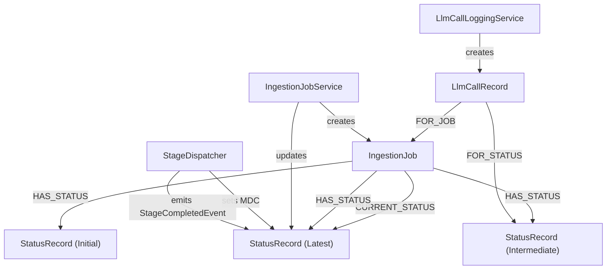
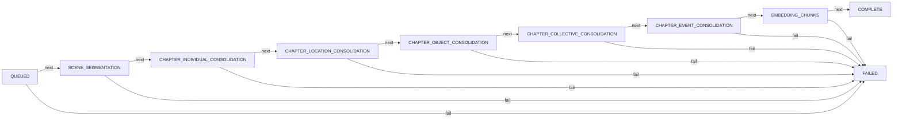

# Ingestion Observability Pattern

**Status:** Established

## Design Philosophy

LoreVault's ingestion pipeline involves multiple async stages, LLM calls, and potential failures. A single mutable status field would hide what actually happened during a job's lifecycle. The solution is an append-only `StatusRecord` chain attached to each `IngestionJob`, plus per-call `LlmCallRecord` nodes for LLM interactions.

This gives full auditability: every stage transition, every LLM call, and every failure is recorded as a separate node in the graph. Status updates use `REQUIRES_NEW` transaction propagation so they survive even if the outer stage transaction fails. LLM call records link to both the parent job and optionally to the specific status record that triggered them, which is useful for triad-level correlation.

## Component Map

## Status Lifecycle

The `IngestionStatus` enum represents the progression of a job through the pipeline. Each handler emits status updates at stage start and stage completion.

`COMPLETE` and `FAILED` are terminal states. Each status has a `progressPercent` value (e.g., QUEUED=0, SCENE_SEGMENTATION=25, EMBEDDING_CHUNKS=50, COMPLETE=100).

Note: The actual pipeline has more stages than shown here. This diagram shows the primary happy path. Each stage can also transition to FAILED.

## LLM Call Records

Every LLM call (chapter segmentation scene detection, scene analysis triad analysis) is recorded as an `LlmCallRecord`. Records capture the provider, model, token counts (prompt + completion), timing, and request/response payload. These records link to the parent `IngestionJob` via a `FOR_JOB` relationship. When processing triads, records also link to the specific `StatusRecord` via `FOR_STATUS` for per-triad correlation. Separate records are created per retry attempt, ensuring old evidence is preserved rather than overwritten.

## StatusRecord Properties

Each `StatusRecord` has a `Map<String, String> properties` for stage-specific metadata. Examples of properties stored include:

- `chapterId` (on QUEUED)
- `triadIndex`, `prevSceneId`, `currentSceneId`, `nextSceneId`, `prevSceneIndex`, `currentSceneIndex`, `nextSceneIndex` (on SCENE_TRIAD_ANALYSIS; IDs are correlation keys, indexes are ordering metadata)
- `chunkCount`, `chapterLength`, `completedAt`, `version`, `pipeline` (on COMPLETE)
- `failureCode`, `failureMessage`, `failureExceptionType`, `failureStage`, `failureDetail.*` (on FAILED)

## Stage Provenance and MDC

The `StageDispatcher` sets three MDC fields before executing each handler:

- `stage` — the `StageKey` name (e.g., `SCENE_SEGMENTATION`)
- `jobId` — the ingestion job ID
- `stageId` — the `Stage` node ID (the durable execution identity)

These fields are cleared after handler execution. All log statements emitted during a stage execution automatically carry these fields when using the logging pattern `log.info("[STAGE_KEY] ...", ...)`.

Additionally, every domain node created during pipeline execution carries a `stageId` property (`@Property("stageId") UUID stageId`). This provides graph-level audit: any node can be traced back to the `Stage` node that created it via `MATCH (n {stageId: $stageId})`.

## Failure Details Extraction

When a job fails, the `FAILED` status record carries structured failure information in its properties map. `StageDispatcher` wraps handler execution in an error boundary and converts exceptions to `StepResult.failure()` or `StepResult.retryableFailure()`. The `IngestionFailure` object is still used for structured failure details. `IngestionJobService.extractFailureDetails()` reconstructs `FailureDetails` from the properties for API responses.

## Boundaries

- **Pipeline flow** — see the Ingestion Pipeline Pattern
- **Triad analysis specifics** — see the Triad Analysis Pattern
- **API response shape** — `JobStatusResponse` is a web concern, not documented here
- **Metrics/Prometheus** — not yet implemented; this pattern covers graph-level observability only

## Primary References

- **Application-level logging rules** — see `../../rules/logging-philosophy.md` and ADR 009
- **StageDispatcher architecture & stageId provenance** — see ADR-013, ADR-014, ADR-015
