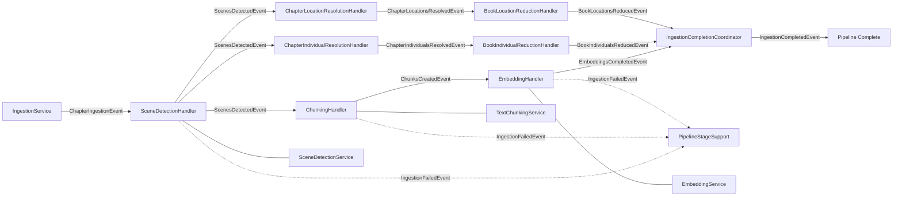
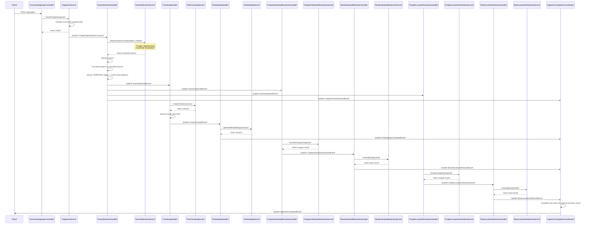

# Ingestion Pipeline Pattern

**Status:** Established

### Design Philosophy
LoreVault ingests narrative chapter text through a staged, event-driven pipeline. This architecture treats ingestion as a series of discrete transformations, from raw text to structured scenes, granular chunks, vector embeddings, and scene-derived entity structures. Each stage operates as a decoupled unit, ensuring that the complex process of understanding narrative structure remains manageable and observable.

Stages communicate asynchronously through Spring application events, which isolates failures and preserves partial progress. If chunking fails during a run, the scene detection results from the previous stage survive. This decoupling allows the system to scale specific parts of the pipeline independently and provides a natural boundary for transactional integrity.

The pipeline uses `@Async` event listeners to ensure stages run in separate threads after the publishing transaction commits. A shared `PipelineStageSupport` class provides consistent failure handling across all stages. It manages failure events, updates job statuses, and classifies errors as retryable or terminal. The scene stage remains the most computationally expensive portion of this flow because it includes LLM segmentation/localization, scene persistence, and post-persistence triad analysis.

### Component Map


### Sequence Diagram: Full Pipeline Happy Path


### Pipeline Stage Detail

**Stage 1: Chapter Submission** (`IngestionService`)
- Validates the incoming chapter and deduplicates based on a content hash to prevent redundant processing.
- Treats submission-critical lookups as fail-closed workflow boundaries rather than best-effort fallbacks.
- Uses typed submission exceptions for lookup/persistence failures so duplicate-work creation does not proceed from ambiguous repository state.
- Creates an `IngestionJob` with an initial `QUEUED` status to track the lifecycle of the request.
- Publishes a `ChapterIngestionEvent` within a Spring `@Transactional` context.
- The downstream listeners only fire after the initial transaction commits, ensuring the job record is visible to background threads.

**Stage 2: Scene Detection + evidence persistence** (`SceneDetectionHandler`)
- Maintains idempotency by checking for existing scenes in the repository before starting work.
- Executes Chapter Segmentation: Uses an LLM for initial segmentation followed by XML parsing and a 3-tier fallback for coordinate localization.
- Persists localized scenes first so all subsequent processing uses stable scene IDs.
- Executes Scene Analysis post-persistence: Performs triad analysis to establish complex temporal relationships and to extract scene-local entity evidence.
- Automatically creates default sequential temporal edges through the `DefaultTemporalEdgeService`.
- Persists scene-local `IndividualMention` and `LocationMention` evidence after real scene IDs exist.
- Classified as retryable for transient LLM, API, or connection timeout errors.

**Stage 3: Chunking** (`ChunkingHandler`)
- Checks the repository to see if chunks already exist for the chapter's scenes to ensure idempotent behavior.
- Extracts raw scene text using the character offsets established during the detection phase.
- Breaks each scene into overlapping segments via the `TextChunkingService` to maintain narrative context across boundaries.
- Adjusts chunk coordinates to be chapter-relative, providing a consistent reference frame for the entire text.
- Persists the resulting chunks and creates explicit links to their parent scenes.

**Stage 4: Embedding branch** (`EmbeddingHandler`)
- Generates vector embeddings for every chunk created in the previous stage using the configured embedding model.
- Treats backend embedding failures and malformed non-empty embedding responses as typed stage failures instead of silently returning `0` updated embeddings.
- Preserves legitimate no-work semantics only when there are no chunks to embed or all embeddings are already current.
- Publishes `EmbeddingsCompletedEvent` with the final scene/chunk/embedding counts and processed chapter length.
- Handles retries for external API failures or network-related connection errors.

**Stage 5: Entity reduction branches** (`ChapterIndividualResolutionHandler`, `BookIndividualReductionHandler`, `ChapterLocationResolutionHandler`, `BookLocationReductionHandler`)
- `ScenesDetectedEvent` triggers sibling Entity branches after scene persistence.
- Individual flow resolves `IndividualMention -> ChapterIndividual -> BookIndividual`.
- Location flow resolves `LocationMention -> ChapterLocation -> BookLocation`.
- Both flows use conservative delete-and-rebuild semantics for their scoped reduction steps.

**Stage 6: Coordinated completion** (`IngestionCompletionCoordinator`)
- Waits for all required post-scene branches for the same `(jobId, chapterId)`.
- Current completion contract requires:
  - `EmbeddingsCompletedEvent`
  - `BookIndividualsReducedEvent`
  - `BookLocationsReducedEvent`
  - `ChapterEventsResolvedEvent`
- Only then is the job marked complete and `IngestionCompletedEvent` emitted.
- On `IngestionFailedEvent`, the coordinator now removes retained fan-in state for that `(jobId, chapterId)` and treats the key as terminal-failed so late success-branch events cannot recreate stale completion state after a failure.

### Abstract Orchestration Model

At an abstract level, the ingestion pipeline is best understood as a task graph connected by application events.

- A handler performs one bounded task for a specific `(jobId, chapterId)` or `(jobId, bookId)` scope.
- On success, that handler emits one domain-level pipeline event describing what is now durably true enough for downstream work to begin.
- Downstream handlers subscribe to that event and start their own bounded tasks asynchronously after the publishing transaction commits.
- Failure is not modeled as an alternate success path. Instead, failures emit `IngestionFailedEvent` and terminate the affected branch.

This means the pipeline is not a single long-running transaction and not a scheduler timeline. It is a causal event chain where each emitted event unlocks the next unit of work.

### Task -> Event -> Trigger Matrix

| Completed task | Success event emitted | Downstream task(s) triggered |
|---|---|---|
| Chapter submission and job creation (`IngestionService`) | `ChapterIngestionEvent` | Scene detection (`SceneDetectionHandler`) |
| Scene detection, scene persistence, temporal-edge materialization, scene-local evidence persistence (`SceneDetectionHandler`) | `ScenesDetectedEvent` | Chunk creation (`ChunkingHandler`), chapter individual resolution (`ChapterIndividualResolutionHandler`), chapter location resolution (`ChapterLocationResolutionHandler`), chapter event resolution (`ChapterEventResolutionHandler`) |
| Chunk creation and persistence (`ChunkingHandler`) | `ChunksCreatedEvent` | Embedding generation (`EmbeddingHandler`) |
| Embedding generation (`EmbeddingHandler`) | `EmbeddingsCompletedEvent` | Completion coordination state update (`IngestionCompletionCoordinator`) |
| Chapter-level individual resolution (`ChapterIndividualResolutionHandler`) | `ChapterIndividualsResolvedEvent` | Book-level individual reduction (`BookIndividualReductionHandler`) |
| Book-level individual reduction (`BookIndividualReductionHandler`) | `BookIndividualsReducedEvent` | Completion coordination state update (`IngestionCompletionCoordinator`) |
| Chapter-level location resolution (`ChapterLocationResolutionHandler`) | `ChapterLocationsResolvedEvent` | Book-level location reduction (`BookLocationReductionHandler`) |
| Book-level location reduction (`BookLocationReductionHandler`) | `BookLocationsReducedEvent` | Completion coordination state update (`IngestionCompletionCoordinator`) |
| Completion preconditions satisfied for the job/chapter (`IngestionCompletionCoordinator`) | `IngestionCompletedEvent` | Terminal success notification / downstream consumers |
| Any stage fails (`PipelineStageSupport`) | `IngestionFailedEvent` | Terminal failure notification / downstream consumers |

### Event Semantics By Boundary

The important contract is not just that an event was emitted, but what downstream handlers are allowed to assume when they receive it.

**`ChapterIngestionEvent`**
- Means the ingestion job and chapter already exist and the initial submission transaction committed.
- Allows async pipeline work to begin against durable identifiers.

**`ScenesDetectedEvent`**
- Means scenes for the chapter are durably persisted and can be referenced by stable scene IDs.
- Also means scene-level temporal materialization and scene-local evidence persistence have already happened far enough for downstream chunking and entity-resolution branches to trust the scene graph.
- This is the main fan-out point in the pipeline.

**`ChunksCreatedEvent`**
- Means chunk nodes and scene-to-chunk links exist.
- Allows embedding generation to treat chunk persistence as complete for that chapter.

**`ChapterIndividualsResolvedEvent` / `ChapterLocationsResolvedEvent`**
- Mean the chapter-scoped reduction pass is complete for that evidence type.
- Allow the corresponding book-scoped reduction step to rebuild the book-level aggregate.

**`BookIndividualsReducedEvent` / `BookLocationsReducedEvent` / `EmbeddingsCompletedEvent` / `ChapterEventsResolvedEvent`**
- Mean one of the required post-scene branches has finished.
- Do not individually complete the ingestion job.
- Instead, they contribute to the completion barrier tracked by `IngestionCompletionCoordinator`.

**`IngestionCompletedEvent`**
- Means all required branches for the chapter have finished and the job can be treated as terminally successful.

**`IngestionFailedEvent`**
- Means the current stage failed and the job was transitioned to a terminal failed state with structured failure details.
- It is a terminal branch outcome, not a retry command.

### Failure Semantics

- `PipelineStageSupport` treats typed workflow failures carrying structured `IngestionFailure` payloads as first-class stage outcomes.
- Known business failures are preserved into status/failure events instead of being flattened into generic runtime errors or false-success counters.
- This is especially important for chapter submission, scene detection/localization, and embedding generation, where the current implementation now fails closed for ambiguous or malformed outcomes.

### Fan-out and Join Shape

The runtime shape is:

1. **Single entry** at chapter submission.
2. **Single first worker** for scene detection.
3. **Fan-out** after `ScenesDetectedEvent` into:
   - chunk/embedding branch
   - individual resolution branch
   - location resolution branch
   - chapter event resolution branch
4. **Join** inside `IngestionCompletionCoordinator`, which waits for the required terminal branch events.
5. **Single terminal outcome**, either `IngestionCompletedEvent` or `IngestionFailedEvent`.

This join is intentionally event-based rather than call-stack-based. No branch directly calls another branch's service to declare the whole job complete.

### Concurrency and Timing View

The following Mermaid Gantt is an illustrative runtime view of how the async branches overlap after scene detection completes.

- It is not a scheduling guarantee.
- It does not imply fixed durations.
- It exists to make fan-out, concurrency, and join behavior easier to reason about.

```mermaid
gantt
    title "Illustrative ingestion concurrency view"
    dateFormat X
    axisFormat "%L"

    section "Entry"
    "Chapter submission" :done, submit, 0, 1
    "Scene detection and scene persistence" :active, scenes, after submit, 4

    section "Fan-out after ScenesDetectedEvent"
    "Chunk creation" :chunks, after scenes, 2
    "Chapter individual resolution" :chapterIndividuals, after scenes, 3
    "Chapter location resolution" :chapterLocations, after scenes, 3
    "Chapter event resolution" :chapterEvents, after scenes, 3

    section "Downstream branch work"
    "Embedding generation" :embeddings, after chunks, 3
    "Book individual reduction" :bookIndividuals, after chapterIndividuals, 2
    "Book location reduction" :bookLocations, after chapterLocations, 2

    section "Join"
    "Completion coordination" :join, after embeddings, 1
    "Completion coordination waits for individual branch" :milestone, after bookIndividuals, 0
    "Completion coordination waits for location branch" :milestone, after bookLocations, 0
    "Completion coordination waits for chapter event branch" :milestone, after chapterEvents, 0
    "Ingestion completed" :milestone, complete, after join, 0
```



Read this diagram as:

- scene detection is the first substantial worker stage
- `ScenesDetectedEvent` creates the main parallel fan-out
- chunking, chapter individual resolution, chapter location resolution, and chapter event resolution can overlap
- embedding generation depends on chunking only
- book-level reductions depend on their corresponding chapter-level reductions only
- overall completion still waits for all required terminal branch events, even if one branch finished much earlier than the others

This view is especially useful for reasoning about:

- where concurrency actually begins
- which stages are serial dependencies versus parallel siblings
- where a stalled branch prevents `IngestionCompletedEvent`
- which stages are likely long poles in end-to-end latency

### What This Pattern Deliberately Abstracts Away

This document describes the orchestration contract, not every internal sub-step.

- The internal triad window logic and temporal relation classification stay in the Triad Analysis Pattern.
- The append-only status model and LLM call correlation stay in the Observability Pattern.
- Per-service heuristics such as segmentation fallback, coordinate localization, or reduction internals are intentionally summarized here rather than exhaustively specified.

The goal of this document is to make the causal event graph legible: which task runs, which event it emits, and which downstream tasks that event unlocks.

### Failure Handling
The `PipelineStageSupport.runStage()` utility wraps every stage in a try-catch block to provide uniform error management. When a failure occurs, the system emits an `IngestionFailedEvent` and updates the job status to `FAILED`. This update includes a structured `IngestionFailure` object containing the error type, message, and diagnostic properties.

Each handler defines its own retryability logic. For instance, LLM provider errors are marked as retryable, while a missing chapter entity is treated as a terminal state. The system specifically unwraps `TriadAnalysisException` to preserve granular details about which part of the temporal analysis failed. To prevent cascading failures in the event-driven loop, exceptions are recorded and swallowed by the handler rather than being rethrown.

### Idempotency
To support safe event re-delivery and manual restarts, each handler verifies its current state before performing work. The `SceneDetectionHandler` queries `sceneRepo.findByChapterId()` and skips processing if scenes are already present. Similarly, the `ChunkingHandler` uses `chunkRepo.existsForChapterViaScenes()` to determine if chunking is already finished. The scoped entity-reduction handlers use deterministic delete-and-rebuild behavior, and book-level reduction is serialized per book where needed. These checks allow the pipeline to resume from the last successful stage if interrupted.

### Boundaries
- **Triad analysis details** — The internal logic for temporal triad classification is documented in the Triad Analysis Pattern.
- **Observability model** — The tracking of job statuses and LLM call records is handled by the Observability Pattern.
- **Scene coordinate localization** — The 3-tier fallback matching logic resides within the `SceneProcessingService` and is not covered here.
- **LLM prompt templates** — Templates are managed by the `PromptRepository` and are external to the pipeline flow.
- **Content hierarchy** — The management of Universes, Series, and Books is the responsibility of the `LibraryService`.

### Primary References
- `../../adr/004-keep-the-event-driven-ingestion-pipeline.md`

---

## Contributor Constraints

### Executor Binding

All ingestion pipeline handlers must use `@Async("ingestionTaskExecutor")`.

```java
// Required
@Async("ingestionTaskExecutor")
@EventListener
public void onScenesDetected(ScenesDetectedEvent event) { ... }

// Wrong — silently falls back to default executor
@Async
@EventListener
public void onScenesDetected(ScenesDetectedEvent event) { ... }
```

`ingestionTaskExecutor` is the named bean defined in `IngestionTaskExecutorConfig`.
Do not use bare `@Async` in any class in the `ingestion` package.

### Correlation Fields

Every ingestion event class must carry both `jobId` and `correlationId`.

- `jobId` — stable identifier for the ingestion job, used for status tracking and log
  aggregation across all pipeline stages.
- `correlationId` — per-request trace identifier, propagated into MDC on every thread
  that handles the event.

Neither field is optional. Events without both fields cannot be traced through async
log lines spanning multiple handlers and threads.

### Transactional Event Scoping

`SceneDetectionHandler` is the only pipeline handler that uses
`@TransactionalEventListener(AFTER_COMMIT)`. Do not change it to `@EventListener`.

All downstream handlers (`ChunkingHandler`, `EmbeddingHandler`,
`ChapterLocationResolutionHandler`, `ChapterIndividualResolutionHandler`) use
plain `@EventListener + @Async("ingestionTaskExecutor")`.

**Why:** `@TransactionalEventListener(AFTER_COMMIT)` prevents scene detection from
firing if the chapter ingestion transaction rolls back. Downstream handlers process
work that is already durably committed — they do not need the publication-side
transaction guarantee. Do not propagate `AFTER_COMMIT` further downstream.

### Fan-In Coordinator

`IngestionCompletionCoordinator` expects exactly four branches to complete before
firing `IngestionCompletedEvent`:

1. Embedding path: `ChunkingHandler → EmbeddingHandler`
2. Location path: `ChapterLocationResolutionHandler → BookLocationReductionHandler`
3. Individual path: `ChapterIndividualResolutionHandler → BookIndividualReductionHandler`
4. Chapter event path: `ChapterEventResolutionHandler`

**Do not add a new pipeline branch without updating the coordinator's expected count.**
The coordinator uses an atomic counter. Adding a branch without incrementing the expected
count causes premature completion — the job completes before all work is done.

If a branch fails, the coordinator must still reach a terminal state. Unhandled branch
failures leave the job permanently in `IN_PROGRESS`.
| Chapter event co-reference and chapter event aggregation (`ChapterEventResolutionHandler`) | `ChapterEventsResolvedEvent` | Completion coordination state update (`IngestionCompletionCoordinator`) |
