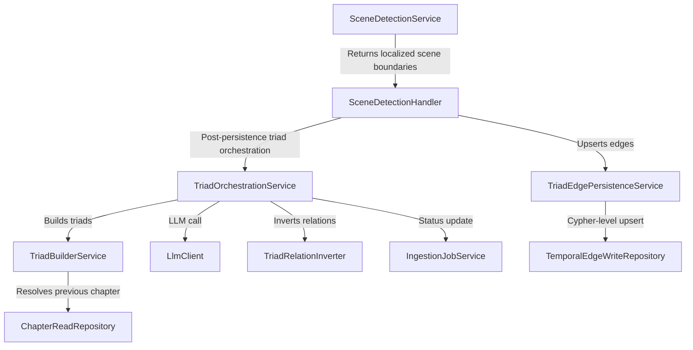
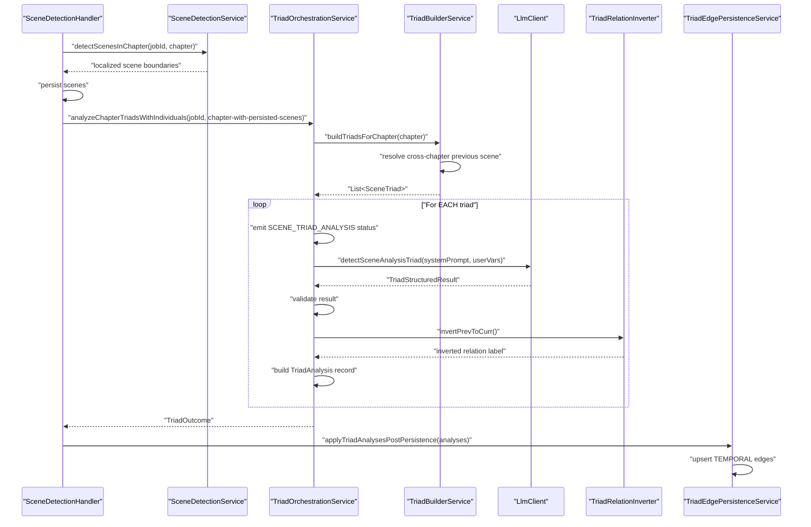

# Triad Analysis Pattern

**Status:** Established

## Design Philosophy

Triad analysis exists to solve the problem of inferring temporal relationships between narrative scenes in LoreVault. Determining whether scenes happen before, after, overlap, or contain one another is a complex task that requires significant narrative context. A naive approach might attempt to analyze all scenes in a book simultaneously, but this does not scale and leads to poor results because the Large Language Model (LLM) loses focus when presented with too much information.

The triad approach provides a sliding window of three scenes (previous, current, next) to the LLM. This focused context allows the model to concentrate on the immediate temporal transitions and overlaps between a specific scene and its neighbors. By providing the preceding and succeeding scenes, the system ensures that the LLM has the necessary narrative markers to identify continuity and temporal flow.

This mechanism also supports cross-chapter continuity. When the system analyzes the first scene of a chapter, it resolves the last scene of the prior chapter to serve as the previous scene in the triad. The resulting output consists of Allen's Interval Algebra relations with associated certainty levels, which are then persisted as TEMPORAL edges within the Neo4j graph database to build the story's timeline.

## Component Map

## Sequence Diagram: Happy Path

## Key Data Structures

### Scene-local entity evidence

Scene analysis now emits both temporal-relation output and scene-local entity evidence. The entity evidence is persisted after scenes are saved so every mention can be linked to a stable `Scene.id`.

Implemented scene-local entity evidence lanes:

- `IndividualMention`
- `LocationMention`
- `ObjectMention`
- `CollectiveMention`

These evidence nodes feed the regular entity resolution ladder documented in [Entity Resolution Ladder](entity-resolution-ladder.md). Concept evidence is intentionally deferred until the Concept lane has a narrower extraction and subtype contract.

### Temporal triad output

**SceneTriad**
- `previous: Scene` — The scene immediately preceding the current one. This may be from a prior chapter or null for the first scene of the first chapter.
- `current: Scene` — The central scene being analyzed for its temporal placement.
- `next: Scene` — The scene immediately following the current one. This is null for the final scene in a chapter.

**TriadStructuredResult**
- `timelineMarker: String` — A hint or description from the LLM regarding the scene's placement on the story timeline.
- `previousToCurrent: TriadRelation` — The temporal relationship from the previous scene to the current scene.
- `currentToNext: TriadRelation` — The temporal relationship from the current scene to the next scene.

**TriadRelation**
- `temporalType: String` — The inferred temporal relation type used by the triad pipeline, currently before, after, overlaps, or contains. Legacy `meets`/`met_by` inputs coarsen to before/after; legacy `equals` inputs coarsen to overlaps.
- `certainty: String` — The confidence level assigned by the LLM (Explicit, StronglyImplied, WeaklyImplied, or Heuristic).
- `evidence: String` — The specific textual evidence or reasoning provided by the LLM for the relationship.

**TriadAnalysis**
- `previousSceneId, currentSceneId, nextSceneId: UUID` — Unique identifiers for the scenes in the triad.
- `timelineMarker: String` — The timeline placement hint.
- `prevToCurrType, prevToCurrCertainty, prevToCurrEvidence: String` — Details for the forward relation from previous to current.
- `currToNextType, currToNextCertainty, currToNextEvidence: String` — Details for the forward relation from current to next.
- `currVsPrevInverted: String` — The inverted Allen relation (for example, if previous is before current, then current is after previous).

**Certainty-to-Weight Mapping**
| Certainty | Weight |
|---|---|
| Explicit | 0.9 |
| StronglyImplied | 0.7 |
| WeaklyImplied | 0.5 |
| Heuristic | 0.3 |

## Allen Relation Inversion Table

| prev to curr | curr vs prev (inverted) |
|---|---|
| before | after |
| overlaps | overlapped_by |
| contains | during |

## Practical Classification Rule for `contains`

- `contains` / `during` is intentionally narrower than generic concurrency.
- The triad pipeline should use `contains` only when the evidence supports full enclosure: one interval is already in progress, the nested interval occurs inside it, and the enclosing interval clearly continues afterward.
- If the evidence only shows interruption, simultaneous action, or soft coexistence, the safer inferred label is `overlaps`.
- When the model is uncertain between `contains` and `overlaps`, LoreVault prefers `overlaps` to avoid fake boundary precision.

## Cross-Chapter Resolution

The TriadBuilderService resolves the previous scene for the first scene of a chapter using the following logic:
1. It identifies the `bookId` and `chapterNumber` for the current chapter.
2. If the `chapterNumber` is 1 or less, there is no prior chapter to resolve, so it returns null.
3. It calls `ChapterReadRepository.findChapterIdsUpTo(bookId, chapterNumber)` to retrieve an ordered list of chapter IDs.
4. It finds the ID of the chapter immediately preceding the current one in that list.
5. It loads all scenes for that previous chapter via `SceneGraphRepository.findByChapterId()`.
6. It identifies the scene with the highest `sceneIndex` as the last scene of that chapter.
7. If any step fails or no scenes are found, it falls back gracefully by returning null, meaning the triad will simply have no previous scene.

## Failure Handling

The system uses `TriadAnalysisException` to manage errors during this process. This exception wraps an `IngestionFailure` with triad-specific metadata, including the triad index, the scene IDs involved, and the name of the relation being processed.

Validation failures during triad processing produce specific error codes to help diagnose issues with the LLM response:
- `TRIAD_RESPONSE_MISSING`: The LLM failed to return a valid result object.
- `TRIAD_RELATION_MISSING`: One of the expected relations (prev-to-curr or curr-to-next) is absent.
- `TRIAD_RELATION_TYPE_MISSING`: The relation exists but lacks a temporal type.
- `TRIAD_RELATION_CERTAINTY_MISSING`: The relation exists but lacks a certainty level.

The `PipelineStageSupport.extractFailure()` method is configured to unwrap these exceptions for structured reporting within the ingestion pipeline.

## Boundaries

The triad analysis pattern is focused on temporal inference and does not cover:
- **Scene detection (Chapter Segmentation)**: The initial identification of scene boundaries is handled by the general ingestion pipeline pattern.
- **Coordinate localization**: The 3-tier anchor matching for text positioning is part of the `SceneProcessingService`.
- **LLM prompt design**: The actual text of the prompts is managed separately in the `PromptRepository`.
- **Retry logic**: Retrying failed LLM calls is the responsibility of the `LlmRetryStrategy` within `SceneDetectionService`.
- **Default temporal edges**: The creation of basic sequential edges between scenes is handled by the `DefaultTemporalEdgeService`.

## Primary References

- `../../adr/004-keep-the-event-driven-ingestion-pipeline.md`
