# Location Resolution Ladder Pattern

**Status:** Established

## Purpose

This pattern explains how LoreVault currently turns extracted scene-local `Location` evidence into chapter-level and book-level Location structures during ingestion.

The implemented ladder is:

- `Scene -[:MENTIONS]-> LocationMention`
- `LocationMention -[:REFERS_TO]-> ChapterLocation`
- `ChapterLocation -[:REFERS_TO]-> BookLocation`

This is the present-state mechanism for the second scoped Entity lane after Individuals. It documents what the code does today, not the wider proposal space.

## Why the ladder exists

LoreVault wanted the next query-side product work to become entity-aware rather than staying narrowly shaped around individuals.

- `LocationMention` preserves scene-local evidence
- `ChapterLocation` consolidates same-place references within one chapter
- `BookLocation` provides a thin cross-chapter Location backbone within one book

This makes the graph more symmetrical for later Q&A and navigation work while keeping the first Location slice conservative.

## Mechanism Overview

### 1) Scene detection carries Location extraction alongside Individual extraction

The scene-analysis prompt already asks for Locations.

`TriadOrchestrationService` and `SceneDetectionService` now carry structured Location data with these fields:

- `primaryName`
- `aliases`
- `kind`
- `region`
- `description`

The scene-detection outcome now includes scene-level Location extractions in parallel with scene-level Individual extractions.

### 2) Scene persistence happens before mention persistence

`SceneDetectionHandler` still persists real `Scene` nodes first.

After scenes are localized and saved, `LocationPersistenceService` resolves `sceneIndex -> Scene.id` and writes `LocationMention` nodes plus `Scene -[:MENTIONS]-> LocationMention` links using persisted scene IDs.

Important persisted mention properties include:

- `displayName`
- `normalizedName`
- `aliases`
- `kind`
- `region`
- `description`
- `sceneId`
- `chapterId`
- `bookId`
- `resolutionStatus`
- `extractionIndex`

The evidence layer is written before any Location consolidation happens.

### 3) Post-scene processing fans out into sibling branches

Once scene persistence is done, `SceneDetectionHandler` publishes `ScenesDetectedEvent`.

That event now feeds three required follow-up flows:

- **content branch** — chunking then embedding
- **Individual branch** — chapter resolution then book reduction
- **Location branch** — chapter resolution then book reduction

The `Location` lane is a sibling branch, not a sub-step of the `Individual` lane.

### 4) Chapter-level Location resolution groups mentions conservatively

`ChapterLocationResolutionHandler` listens to `ScenesDetectedEvent` and calls `ChapterLocationResolutionService.resolveChapter(chapterId)`.

The current implementation is deterministic and intentionally conservative:

- existing `ChapterLocation` state for the chapter is deleted
- `LocationMention` candidates are grouped by exact normalized primary/display name and exact normalized aliases
- alias overlap can bridge multiple exact-match groups transitively
- one `ChapterLocation` is created per resulting cluster
- `LocationMention -[:REFERS_TO]-> ChapterLocation` links are recreated
- linked mentions are marked `chapter-resolved`

Current `ChapterLocation` state is intentionally thin:

- `chapterId`
- `displayName`
- `normalizedName`
- `aliases`
- `mentionCount`

### 5) Book-level Location reduction groups chapter locations upward

`BookLocationReductionHandler` listens to `ChapterLocationsResolvedEvent` and calls `BookLocationReductionService.resolveBook(bookId)`.

The current implementation:

- gathers `ChapterLocation` nodes for the book through `ChapterLocationGraphRepository.findByBookId(...)`
- clusters them by exact normalized name and exact normalized aliases
- keeps a representative chapter location and first-seen chapter reference
- rebuilds thin `BookLocation` nodes
- recreates `ChapterLocation -[:REFERS_TO]-> BookLocation` links

Current `BookLocation` state is:

- `bookId`
- `displayName`
- `normalizedName`
- `aliases`
- `chapterLocationCount`
- `representativeChapterLocationId`
- `firstSeenChapterId`

`BookLocation` is deliberately thin. It is a continuity structure for retrieval and navigation, not a place-ontology model.

## Event Chain

### Full flow

```mermaid
graph LR
    Submit["IngestionService"] --> ChapterEvt["ChapterIngestionEvent"]
    ChapterEvt --> Detect["SceneDetectionHandler"]
    Detect --> ScenesEvt["ScenesDetectedEvent"]

    ScenesEvt --> Chunking["ChunkingHandler"]
    Chunking --> ChunksEvt["ChunksCreatedEvent"]
    ChunksEvt --> Embedding["EmbeddingHandler"]
    Embedding --> EmbeddingsDone["EmbeddingsCompletedEvent"]

    ScenesEvt --> ChapterResolveInd["ChapterIndividualResolutionHandler"]
    ChapterResolveInd --> ChapterResolvedInd["ChapterIndividualsResolvedEvent"]
    ChapterResolvedInd --> BookReduceInd["BookIndividualReductionHandler"]
    BookReduceInd --> BookReducedInd["BookIndividualsReducedEvent"]

    ScenesEvt --> ChapterResolveLoc["ChapterLocationResolutionHandler"]
    ChapterResolveLoc --> ChapterResolvedLoc["ChapterLocationsResolvedEvent"]
    ChapterResolvedLoc --> BookReduceLoc["BookLocationReductionHandler"]
    BookReduceLoc --> BookReducedLoc["BookLocationsReducedEvent"]

    EmbeddingsDone --> Complete["IngestionCompletionCoordinator"]
    BookReducedInd --> Complete
    BookReducedLoc --> Complete
    Complete --> Done["IngestionCompletedEvent"]
```

### Completion semantics

`IngestionCompletedEvent` remains terminal for chapter ingestion.

LoreVault now treats all required post-scene branches as part of the completion contract:

- embedding branch must finish
- book-level Individual reduction branch must finish
- book-level Location reduction branch must finish

`IngestionCompletionCoordinator` waits for `EmbeddingsCompletedEvent`, `BookIndividualsReducedEvent`, and `BookLocationsReducedEvent` for the same `(jobId, chapterId)` before it marks the job complete and publishes `IngestionCompletedEvent`.

## Boundaries And Non-Goals

This pattern covers:

- the scoped Location ladder
- the sibling-branch ingestion shape
- exact-match and alias-bridge reduction behavior
- completion semantics relevant to the Location lane

This pattern does **not** cover:

- lat/lng or geocoding
- canonical external place IDs
- containment graphs
- address decomposition
- fuzzy matching or geo heuristics
- generalized multi-Entity framework extraction
- future Q&A behavior built on top of these nodes

## Primary References

- `individual-resolution-ladder.md`
- `ingestion-pipeline.md`
- `../adr/008-define-ingestion-completion-across-parallel-branches.md`

## Key Code References

- `lorevault-api/src/main/java/com/lorevault/api/ai/TriadOrchestrationService.java`
- `lorevault-api/src/main/java/com/lorevault/api/ai/SceneDetectionService.java`
- `lorevault-api/src/main/java/com/lorevault/api/ingestion/SceneDetectionHandler.java`
- `lorevault-api/src/main/java/com/lorevault/api/ingestion/LocationPersistenceService.java`
- `lorevault-api/src/main/java/com/lorevault/api/ingestion/ChapterLocationResolutionHandler.java`
- `lorevault-api/src/main/java/com/lorevault/api/ingestion/ChapterLocationResolutionService.java`
- `lorevault-api/src/main/java/com/lorevault/api/ingestion/BookLocationReductionHandler.java`
- `lorevault-api/src/main/java/com/lorevault/api/ingestion/BookLocationReductionService.java`
- `lorevault-api/src/main/java/com/lorevault/api/ingestion/IngestionCompletionCoordinator.java`
- `lorevault-api/src/main/java/com/lorevault/api/content/LocationMention.java`
- `lorevault-api/src/main/java/com/lorevault/api/content/ChapterLocation.java`
- `lorevault-api/src/main/java/com/lorevault/api/content/BookLocation.java`
