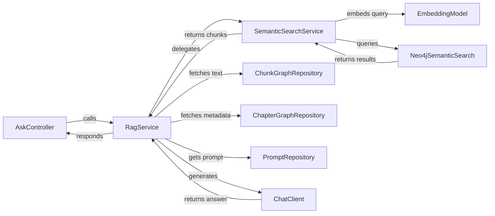

# RAG Retrieval Chain Pattern

**Status:** Established

## Design Philosophy

LoreVault answers questions about fictional universes using Retrieval-Augmented Generation (RAG). The system ensures that answers are grounded in the source material while strictly respecting the reader's progress through a series or book.

The chain follows a strict retrieve-then-generate pattern. It first finds relevant content via vector similarity search and then synthesizes an answer using an LLM with that content as context. This one-pass approach avoids the complexity of agent loops while maintaining high precision.

Spoiler awareness is baked into the retrieval step. The vector search applies publication coordinate filtering and reader progress constraints before returning results to the orchestration layer. This prevents the LLM from ever seeing information the user has not reached. The system uses oversampling and post-filtering to handle the gap between raw vector relevance and spoiler-filtered results.

Citations are first-class components of the architecture. Every answer includes the source chunks used for generation, mapped to their `PublicationCoordinates` (universe, series, book, and chapter). The RAG chain does not use an external retrieval tool or agent loop. It's a single-pass pipeline that moves from retrieval to filtering, generation, and finally citation.

## Component Map

## Sequence Diagram: Full RAG Request

1. The client sends an `AskRequest` containing the question, topK, score threshold, visibility settings, and publication filters.
2. `AskController` receives the request and calls `RagService.ask(request)`.
3. `RagService` calls `buildSearchRequest()`, which converts the incoming ask filters into semantic search filters after performing hierarchy validation.
4. `RagService` calls `SemanticSearchService.search(searchRequest)`.
5. `SemanticSearchService` generates a query embedding via `EmbeddingModel.embed()`.
6. `SemanticSearchService` converts the filters and calls `Neo4jSemanticSearch.search(embedding, topK, filters, visibility)`.
7. `Neo4jSemanticSearch` builds and executes a Cypher query using `db.index.vector.queryNodes()`. This query includes publication coordinate filters and a spoiler clause, ordering by similarity score and applying the topK limit.
8. Results return to the `RagService`.
9. `RagService` applies `filterByThreshold()`, removing any results that fall below the specified similarity score.
10. If no results remain after filtering, the service returns a "No evidence found" response to the controller.
11. `RagService` calls `buildContextFromEvidence()`. This step fetches the full text for each chunk from the `ChunkGraphRepository` and constructs a numbered context string with book and chapter annotations.
12. `RagService` calls `generateAnswer()`:
    - It retrieves the `rag-answer-generation` system prompt from the `PromptRepository`.
    - It builds the user prompt by combining the original question with the assembled context.
    - It calls `ChatClient.prompt().system().user().call().content()` to get the LLM output.
13. `RagService` builds citations using the search results and chapter metadata from `PublicationCoordinates`.
14. The service returns an `AskResponse` containing the answer, citations, and processing metadata.

## Key Data Structures

### AskRequest
- `question: String` — The user's question.
- `topK: int` — Number of results to retrieve from the vector index.
- `threshold: Double` — Minimum similarity score required for inclusion.
- `visibility: SpoilerVisibility` — Reader progress for spoiler filtering.
- `filters: AskFilters` — Publication coordinate filters for the search.

### AskResponse
- `answer: String` — The generated answer from the LLM.
- `citations: List<CitationDto>` — The source chunks with their coordinates and scores.
- `metadata: AskMetadata` — Stats including timing, model used, and chunk counts.

### CitationDto
- `chunkId: UUID` — Unique identifier for the source chunk.
- `score: double` — The similarity score returned by the vector search.
- `snippet: String` — A truncated version of the chunk text.
- `coordinates: PublicationCoordinates` — Full location data: universe, series, bookTitle, bookNumber, chapterNumber, and chapterTitle.

## Filter Hierarchy Validation

The `RagService.validateAndConvertFilters()` method enforces a strict hierarchy to ensure search parameters remain logical:
- A `chapterNumber` filter requires a corresponding `bookNumber`. It's ignored otherwise.
- A `bookNumber` filter requires a `series` filter. If the series is missing, the book and chapter filters are cleared.
- A `series` filter requires a `universe` filter. If the universe is missing, all more specific filters are cleared.
- If all filters are determined to be invalid after this validation, no filters are applied to the retrieval step.

## Context Building

When preparing the prompt for the LLM, the `RagService` does not rely on the snippets returned by the search. Instead, it fetches the full text for each result from the `ChunkGraphRepository`.

Each chunk is assigned a number in the context string, such as `[1]` or `[2]`. This helps the LLM reference specific pieces of evidence. When available, book and chapter annotations like `(Book 2, Chapter 5)` are appended to the chunk text. This assembled context is then passed to the LLM as part of the user prompt to ensure the generated answer is grounded in specific, verifiable locations in the text.

## Boundaries

- **Spoiler filtering details** — The logic for the spoiler-aware query is defined in the Spoiler-Aware Retrieval Pattern.
- **Embedding generation** — Chunk embeddings are generated during the ingestion process, not during the query chain.
- **Vector index management** — The creation and maintenance of the Neo4j vector index is an infrastructure concern.
- **Prompt engineering** — The specific templates for answer generation are managed by the `PromptRepository`.
- **Semantic search standalone** — The `POST /api/query/ask/vector` endpoint uses the `SemanticSearchService` directly, skipping the generation step.

## Primary References

- `../../adr/006-spoiler-aware-search-design.md`
- `../../adr/001-neo4j-for-graph-and-vectors.md`
