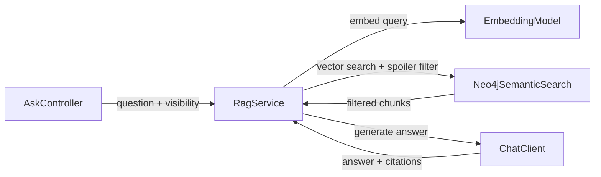

# Spoiler-Aware Retrieval Pattern

**Status:** Established

### Design Philosophy
LoreVault serves readers who may be partway through a book series. Returning content from later books would spoil the story, making traditional semantic search alone insufficient. A highly relevant chunk from Book 5 is objectively harmful to a reader who is only on Book 2.

The spoiler-aware retrieval pattern ensures every request includes a `SpoilerVisibility` envelope. This envelope specifies the reader's exact progress per series by book number and optional chapter number. Semantic relevance and story progress must both be satisfied for a piece of information to reach the user.

Filtering occurs after the vector search within the database query. This is an intentional design choice because Neo4j vector index queries do not support pre-filtering on arbitrary properties. To compensate for the potential loss of results during this post-filter stage, the system oversamples the vector index by a default multiplier of 3x the requested topK before filtering down to the final result set. Series that a reader has not specified progress for default to a conservative HIDE policy to prevent accidental spoilers, though this is configurable to SHOW.

### Component Map

### Sequence Diagram: Spoiler-Filtered RAG Request
1. The Client sends a question along with a `SpoilerVisibility` object containing the target universe, a list of series progress, and an unconfigured series policy.
2. `AskController` receives the request and invokes `RagService.ask()`.
3. `RagService` constructs a `SemanticSearchRequest` that includes the visibility constraints.
4. `SemanticSearchService` uses the `EmbeddingModel` to generate a vector embedding of the user's query.
5. `SemanticSearchService` calls `Neo4jSemanticSearch.search(embedding, topK, filters, visibility)`.
6. `Neo4jSemanticSearch` executes a Cypher query that:
   - Calls `db.index.vector.queryNodes()` using a limit calculated as `oversampleMultiplier * topK`.
   - Applies publication coordinate filters for the universe, series, book, and chapter.
   - Applies the spoiler clause based on series progress predicates and the unconfigured policy.
   - Returns the top `topK` results sorted by similarity score.
7. The search results are returned to the `RagService`.
8. `RagService` applies a final similarity threshold filter to ensure quality.
9. `RagService` provides the filtered evidence to the `ChatClient` to generate a natural language answer.
10. `RagService` constructs the final response, including citations mapped to `PublicationCoordinates`.

### Spoiler Filtering Mechanism
The Cypher-level spoiler clause is the core of the pattern. It uses the `SpoilerVisibility` structure to determine which chunks are safe to return.

**SpoilerVisibility structure:**
- `universe`: The specific universe being queried.
- `seriesProgress`: A list of `SeriesProgress` objects defining the reader's current location.
- `unconfiguredSeriesPolicy`: A policy (SHOW or HIDE) for series not explicitly mentioned in the progress list.

**SeriesProgress structure:**
- `series`: The unique name of the series.
- `readThroughBookNumber`: The number of the last book the reader has completed.
- `readThroughChapterNumber`: The optional chapter number the reader has reached in their current book.

**Cypher spoiler predicate logic:**
A content chunk is considered visible if it meets one of these conditions:
1. The chunk belongs to a series in the progress list and its `bookNumber` is strictly less than the `readThroughBookNumber`.
2. The chunk belongs to a series in the progress list, its `bookNumber` equals the `readThroughBookNumber`, and its `chapterNumber` is less than or equal to the `readThroughChapterNumber`.
3. The series is not in the progress list and the `unconfiguredSeriesPolicy` is set to SHOW.

### Oversampling Strategy
Because filtering happens after the initial vector similarity match, many of the most relevant results might be spoilers. If the system only requested the exact number of results desired (topK), the final list after filtering could be empty or too small to provide a good answer.

To solve this, the vector index query requests `topK * oversampleMultiplier` candidates. The default multiplier is 3, meaning for a request of 5 results, the system evaluates the top 15 matches. After the spoiler predicates are applied, the remaining valid results are capped back at the original `topK`. This multiplier is configurable via `lorevault.search.oversample-multiplier`.

### Publication Coordinate Filters
Separate from the spoiler visibility logic, queries can be explicitly restricted to specific parts of the library:
- `universe`: Restricts results to a single universe.
- `series`: Restricts results to a specific series (requires universe).
- `bookNumber`: Restricts results to a specific book (requires series).
- `chapterNumber`: Restricts results to a specific chapter (requires bookNumber).

The `RagService.validateAndConvertFilters()` method enforces hierarchy validation. A chapter filter without a book filter is ignored, a book filter without a series is ignored, and a series filter without a universe is ignored.

### Boundaries
- **Embedding generation**: Handled by the ingestion pipeline pattern, not the retrieval pattern.
- **Chunk text storage**: Chunks are stored and managed by the ingestion pipeline.
- **Timeline search**: Temporal or chronological search is not yet implemented. This pattern covers vector similarity only.
- **User profiles**: Spoiler visibility settings are passed per-request and are not currently persisted in a user database.
- **Cross-series spoiler logic**: Not implemented. Each series is filtered independently based on the user's progress in that specific series.

### Primary References
- `../adr/006-spoiler-aware-search-design.md`
- `../development/current/data-model/content-hierarchy-integration.md`

