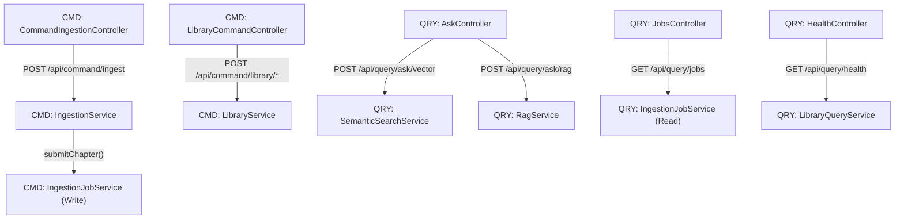

# CQRS Command-Query Separation Pattern

**Status:** Established

## Design Philosophy

LoreVault separates command (write) and query (read) operations at both the controller and service layer. This separation is structural rather than physical. There are no separate read and write databases, and the system does not use event sourcing. Instead, the architecture uses different URL paths, different controller classes, and different service methods to distinguish between operations.

Commands are operations that change the state of the system, such as submitting a chapter or creating a universe, series, or book. Queries are operations that read the state of the system, such as asking questions, listing jobs, or checking health. This separation makes it clear at the API level whether a request modifies the system or simply retrieves information.

## Component Map

## URL Convention

The URL structure in LoreVault follows a strict convention to make the intent of each API call visible:

- Commands: `/api/command/{domain}/{action}`. Examples include `/api/command/ingest` and `/api/command/library/create-book`.
- Queries: `/api/query/{domain}/{action}`. Examples include `/api/query/jobs` and `/api/query/ask/rag`.

The use of the `/api/command/` versus `/api/query/` prefix provides an immediate indication of whether an operation is intended to be side-effect free or if it will modify data.

## Service Layer Split

The service layer mirrors the CQRS split found in the web layer. Services are generally categorized by whether they handle mutations or data retrieval.

**Write services:**
- `IngestionService`: Handles chapter submission and the initiation of ingestion jobs.
- `LibraryService`: Manages the creation and modification of the library hierarchy, including universes, series, and books.
- `IngestionJobService`: Manages the job lifecycle, including creating, completing, failing, and updating job statuses.

**Read services:**
- `LibraryQueryService`: Performs reads against the library hierarchy.
- `SemanticSearchService`: Executes vector-based searches.
- `RagService`: Handles RAG-based question answering.
- `IngestionJobService`: Provides methods for querying the status and details of ingestion jobs.

Note that `IngestionJobService` serves both sides of the architecture. It handles lifecycle mutations and status queries. This is a pragmatic consolidation rather than a strict split, reflecting the needs of the system while maintaining the overall pattern.

## Repository Layer

The repository layer also demonstrates this separation of concerns:

- `ChapterGraphRepository`: Dedicated to write operations such as saving and deleting chapter nodes.
- `ChapterReadRepository`: Optimized for read operations, including finding chapters by ID or retrieving chapters up to a specific number.
- `IngestionJobGraphRepository`: Handles both read and write operations for jobs. This follows the pragmatic consolidation seen in the service layer.

## Boundaries

The CQRS pattern in LoreVault has specific boundaries and does not apply to every part of the system:

- **Event-driven pipeline**: The internal workings of the ingestion pipeline are covered by the Ingestion Pipeline Pattern and do not follow the controller-based CQRS structure.
- **UI controllers**: The `web/ui/` package contains Thymeleaf controllers for the web interface. These do not follow the command and query URL convention.
- **Legacy endpoints**: Certain diagnostic and administrative endpoints, such as `/api/status` and `/actuator/*`, predate the CQRS structure and are maintained for compatibility.

## Primary References

- `../../adr/003-prefer-direct-services-over-ports-and-mappers.md`
