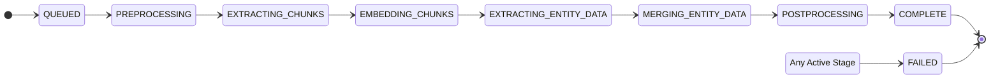

# Chapter Ingestion Job Specification

**Purpose**: Defines the data model for tracking an asynchronous chapter ingestion process via a historical log of immutable status records. This specification details the `IngestionJob` and `StatusRecord` entities, their relationships, and the state transition model that governs the ingestion workflow.

**Scope**: This document covers the `IngestionJob` and `StatusRecord` entities and their lifecycle. It excludes implementation details of the orchestration logic itself but provides the data model foundation for it.

**Dependencies**:
- **Architecture Document**: `docs/architecture.md`
- **Data Specification**: `docs/spec/core-data-model.md`
- **Process Specification**: `docs/spec/content-ingestion-process.md`

## Process Overview

To manage the system's complex, asynchronous ingestion tasks, a job's progress is tracked using an event-sourcing pattern. Each job is represented by an `IngestionJob` entity, and its entire history is captured as an append-only log of immutable `StatusRecord` events.

This approach provides detailed observability and a complete audit trail, which is central to the system's design. To balance performance and data integrity, the `IngestionJob` maintains a direct reference to its `currentStatus` record for efficient querying, while the full history is available for detailed analysis.

## Job Lifecycle

1.  **CREATE**: When a client submits a chapter, an `IngestionJob` is created, and an initial `StatusRecord` with the status `QUEUED` is generated and linked to the job. The `IngestionJob` ID is returned to the client.
2.  **TRANSITION**: As the `Orchestration Service` guides the job through the pipeline (e.g., from preprocessing to synthesis), it creates a *new* `StatusRecord` for each state transition. The `IngestionJob`'s reference to the `currentStatus` is updated to point to this new record.
3.  **TERMINATE**: When the process finishes, a final `StatusRecord` is created with a terminal state (`COMPLETE` or `FAILED`). The parent `IngestionJob`'s `completedAt` timestamp is set.

## State Management

### State Transition Diagram

### State Definitions

| State | Description |
| :--- | :--- |
| **QUEUED** | The request has been accepted and is awaiting processing by a worker. |
| **PREPROCESSING_STARTED** | Job dequeued. Text normalization and content hash deduplication is in progress. |
| **DETECTING_SCENES** | The local SLM is actively analyzing the text to identify semantic scene boundaries. |
| **EXTRACTING_ENTITIES** | The local SLM is performing its initial pass to extract all potential entity mentions (characters, locations, etc.). |
| **EMBEDDING_CHUNKS**| The system is creating technical chunks from the identified scenes and generating their vector embeddings. |
| **SYNTHESIZING_CHARACTERS** | The RAG loop is active for character entities. The system is synthesizing structured data for characters via the powerful external LLM. |
| **SYNTHESIZING_LOCATIONS** | The RAG loop is active for location entities. |
| **SYNTHESIZING_ITEMS** | The RAG loop is active for item entities. (This pattern repeats for all configured entity types). |
| **PERSISTING_DATA** | All synthesis is complete. The system is performing final conflict resolution and saving the enhanced entity data to the database. |
| **COMPLETE** | All stages finished successfully. The ingested content is now available for querying. |
| **FAILED** | The process terminated due to an unrecoverable error. Details are logged in the final status record. |

## Interface Specifications

### `IngestionJob` Entity

| Attribute | Logical Type | Loading | Description |
| :--- | :--- | :--- | :--- |
| `id` | `UUID` | Eager | Primary Key. The unique identifier for the job. |
| `chapterId` | `UUID` | Eager | Foreign Key to the `chapters` record this job is processing. |
| `currentStatus` | `StatusRecord` | Eager | A direct reference to the most recent `StatusRecord` for this job. Used for efficient status queries. |
| `statusHistory` | `List<StatusRecord>` | Lazy | The complete, ordered list of all status records for this job, providing a full audit trail. |
| `createdAt` | `Timestamp` | Eager | Timestamp of the job's creation. |
| `completedAt` | `Timestamp` | Eager | Timestamp of the job's termination (null until finished). |

### `StatusRecord` Entity

| Attribute | Logical Type | Description |
| :--- | :--- | :--- |
| `id` | `UUID` | Primary Key for the status record. |
| `jobId` | `UUID` | Foreign Key linking to `ingestion_jobs.id`. |
| `timestamp` | `Timestamp` | The precise time this status was recorded. |
| `status` | `String` | The job state at this point in time (e.g., `PREPROCESSING`). |
| `stepDescription`| `String` | A short, user-friendly message for the event (e.g., "SLM analysis complete, 12 entities found."). |
| `progressPercent`| `Integer` | Estimated completion percentage at this point (0-100). |
| `properties` | `JSON` | A flexible field to store structured metadata relevant to this event (e.g., entities extracted, error details, performance metrics). |

## Error Handling

- Upon an unrecoverable error, a final `StatusRecord` **MUST** be created with `status` = `FAILED`.
- The `properties` field of the `FAILED` record **MUST** be populated with relevant error details, such as an error code, message, and stack trace.
- The `Orchestration Service` is responsible for ensuring this final status is recorded.

## Performance Requirements

- Database `INSERT`s on the `status_records` table must be highly performant.
- The `status_records` table must be indexed on `(jobId, timestamp DESC)` for efficient retrieval of a job's history.
- Queries for jobs based on their current status (via `IngestionJob.currentStatus`) must be highly efficient.

## Integration Points

- **API Layer**: Creates the initial `IngestionJob` and the first `StatusRecord` (`QUEUED`).
- **Orchestration Service**: Creates all subsequent `StatusRecord`s and updates the parent `IngestionJob`'s `currentStatus` reference and `completedAt` timestamp within atomic transactions.
- **Query API / Monitoring UI**: Reads the `ingestion_jobs` table to get current job statuses and can lazily load the `statusHistory` for detailed views.

## Validation Criteria

- The sequence of `status` values in a job's `statusHistory` must follow the defined state transition model.
- The `currentStatus` reference on an `IngestionJob` must always point to the `StatusRecord` with the most recent timestamp for that job.
- `FAILED` records must contain structured error details in their `properties` field.
- `COMPLETE` records must have a `progressPercent` of 100.
