# Content Ingestion Process Specification

**Purpose**: Define the detailed workflow for ingesting chapter content and transforming it into structured knowledge entities  
**Scope**: Complete content processing pipeline from HTTP request to persistent entity storage  
**Dependencies**: CQRS Architecture (Functional Viewpoint), Asynchronous Processing (Concurrency Viewpoint), Text Chunking (text-chunking-specification.md)

## Implementation Status

**Current Version**: v0.3.0 - Scene Detection & Hierarchical Structure  
**Next Version**: v0.4.0 - AI Enhancement & Vector Embeddings  
**Latest Update**: 2025-08-07 - XML-based scene detection implemented

## Process Overview

The content ingestion process transforms unstructured narrative text into searchable knowledge entities through a multi-stage pipeline. The current v0.3.0 implementation provides AI-powered scene detection with XML-based parsing, creating a Chapter → Scene → Chunk hierarchy for semantic content organization.

## Current Implementation (v0.2.0)

### Content Ingestion & Chunking Workflow

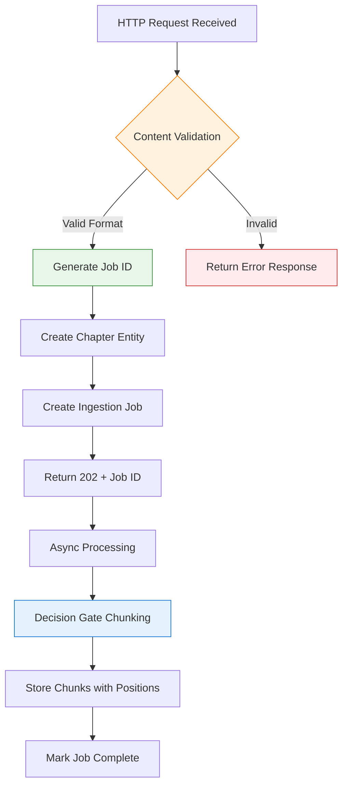

**v0.2.0 Features Implemented**:
- ✅ **Chapter Entity Storage**: Persistent storage with content hashing for deduplication
- ✅ **Ingestion Job Tracking**: Comprehensive job lifecycle with status updates
- ✅ **Chunking**: chunking with 5000-char threshold and 15% overlap
- ✅ **Chunk Entity Storage**: Position-aware chunks with content hashes
- ✅ **REST API Endpoints**: Chapter submission and job status tracking
- ✅ **Database Schema**: PostgreSQL with Flyway migrations (V001, V002)

**Current Processing Pipeline**:
1. **Content Reception**: Validate and store chapter content with metadata
2. **Job Creation**: Create trackable ingestion job with status updates
3. **Text Chunking**: Apply decision gate logic (≤5000 chars = single chunk, >5000 chars = sliding window with 15% overlap) using specification-compliant algorithm (see [Text Chunking Specification](text-chunking-specification.md))
4. **Chunk Storage**: Persist chunks with position coordinates and content hashes
5. **Job Completion**: Update job status with final chunk count and completion time

**Architecture Benefits**:
- **Deduplication**: Content hashing prevents duplicate processing
- **Traceability**: Complete job lifecycle tracking for monitoring
- **Scalability**: Async processing foundation ready for AI enhancement
- **Data Integrity**: Position coordinates ensure chunk reconstruction capability
- **Performance**: Local processing with no external API dependencies

## Detailed Workflow

### Current Implementation (v0.2.0)

The following stages are **currently implemented and working**:

### Stage 1: Content Reception and Validation (✅ IMPLEMENTED)

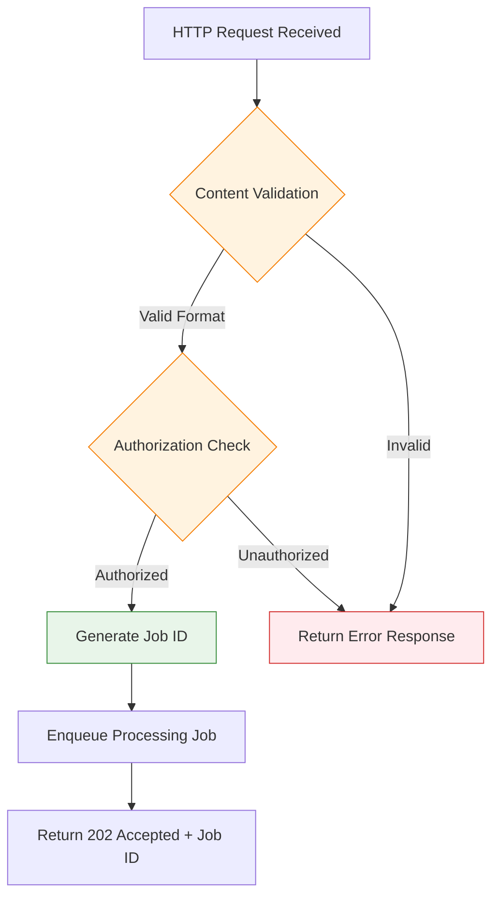

**Validation Criteria** (Currently Implemented):
- Content length: 100 - 50,000 characters
- Format: Plain text with basic validation
- Required fields: title, content, publication coordinates
- Deduplication: SHA-256 content hashing

### Stage 2: Content Storage and Chunking (✅ IMPLEMENTED)

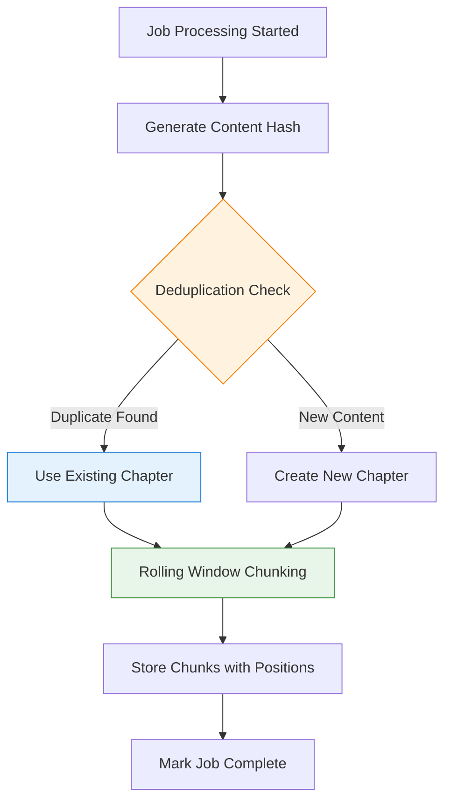

**Current Processing Rules**:
- **Content Hashing**: SHA-256 of normalized content for deduplication
- **Text Chunking**: Rolling window algorithm with 30% overlap (detailed in [Text Chunking Specification](text-chunking-specification.md))
- **Position Tracking**: Start/end character coordinates for each chunk
- **Content Hash Storage**: Per-chunk hashing for future deduplication

### Future Stages (Planned Implementation)

The following stages represent the **future vision** and are not yet implemented:

### Stage 3: Local Intelligence Processing (🔄 PLANNED v0.3.0)

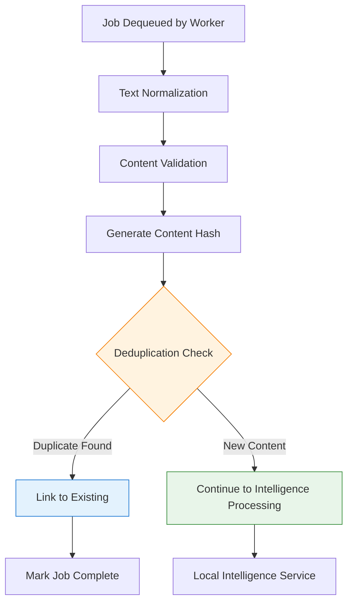

**Processing Rules**:
- **Text Normalization**: Remove formatting artifacts, normalize whitespace, handle encoding
- **Content Validation**: Verify content meets processing requirements (length, format)
- **Hashing Algorithm**: SHA-256 of normalized content for deduplication
- **Deduplication Scope**: Check against existing content hashes in database
- **Intelligence Ready**: Prepare clean, validated text for Local Intelligence Service

### Stage 3: Local Intelligence Processing

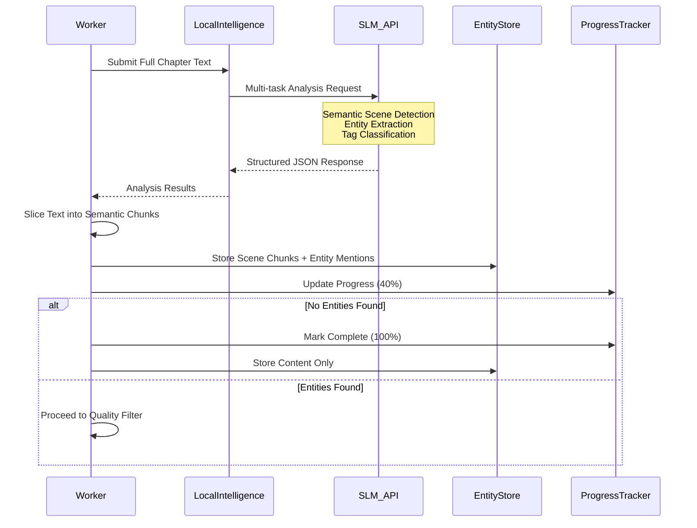

**Local Intelligence Service Specifications**:
- **Input**: Complete chapter text (up to 50,000 characters)
- **SLM Model**: Gemma 3B or equivalent small language model via API
- **Multi-task Processing**: Single API call performs three critical tasks:
  1. **Semantic Scene Detection**: Identify narrative boundaries (time, location, character focus shifts)
  2. **Entity Extraction**: Extract characters, locations, items, organizations with mentions
  3. **Tag Classification**: Identify thematic tags and content categories

**Structured Output Format**:
```json
{
  "tags": ["diplomacy", "first contact", "military strategy"],
  "entities": {
    "characters": ["Kevin Jenkins", "Kirk", "Adrian Saunders"],
    "locations": ["Earth", "Gao", "Zadershil"],
    "items": ["Fusion Torch", "Jump Drive"],
    "organizations": ["Human Defense Force", "Gao Republic"]
  },
  "scenes": [
    {
      "index": 1,
      "coordinates": [0, 351],
      "context": "Character introduction scene"
    },
    {
      "index": 2,
      "coordinates": [352, 744],
      "context": "First contact dialogue"
    }
  ]
}
```

**Processing Advantages**:
- **Semantic Chunking**: Context-aware scene boundaries vs. programmatic splitting
- **Single API Call**: Maximizes value from SLM interaction, reduces latency
- **Structured Output**: Predictable JSON format eliminates string parsing complexity
- **Quality Gatekeeper**: Intelligent filtering before expensive external AI processing

### Stage 4: Semantic Chunking and Quality Assessment

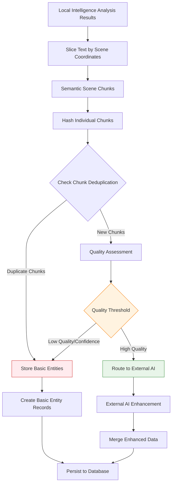

**Quality Criteria for External Processing**:
- **Entity Density**: More than 3 entities per semantic scene
- **Entity Variety**: At least 2 different entity types present per scene
- **Scene Complexity**: Presence of interactions or relationships between entities
- **Tag Richness**: Presence of thematic tags indicating narrative complexity
- **Scene Coherence**: Well-defined scene boundaries with clear context

### Stage 5: External AI Enhancement (Conditional)

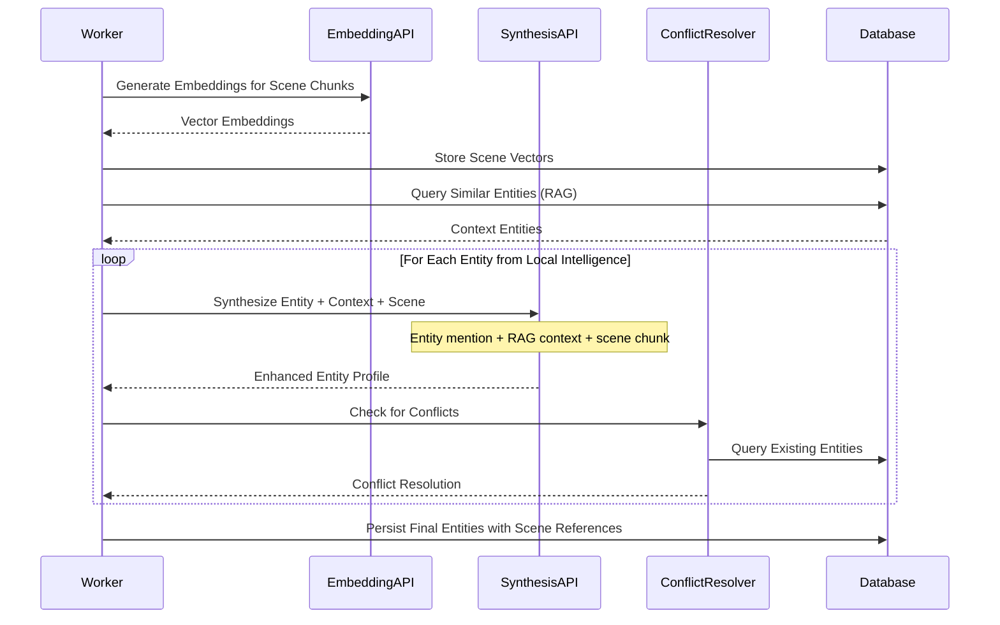

**External AI Processing Specifications**:
- **Embedding Generation**: Convert semantic scene chunks to 1536-dimension vectors
- **RAG Context**: Retrieve top 5 similar entities for each entity mention
- **Synthesis Input**: Entity mention + context entities + full scene chunk + thematic tags
- **Synthesis Output**: Enhanced entity profiles with relationships and scene context
- **Conflict Resolution**: Merge similar entities, resolve contradictions using scene evidence
- **Scene Preservation**: Maintain references between entities and their source scenes

## State Management

### Current Job State Transitions (✅ IMPLEMENTED)

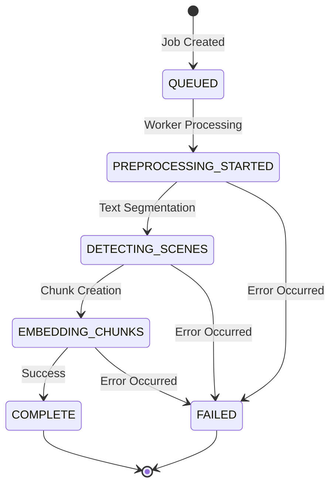

**Current State Persistence**:
- **QUEUED**: Job ID, chapter ID, created timestamp
- **PREPROCESSING_STARTED**: Progress 5%, "Starting content segmentation"
- **DETECTING_SCENES**: Progress 15%, "Performing deterministic text segmentation" 
- **EMBEDDING_CHUNKS**: Progress 45%, "Created N chunks from chapter content"
- **COMPLETE**: Progress 100%, "Chapter processing completed successfully. Created N chunks."
- **FAILED**: Error message, failure stage, timestamp

**Database Schema** (Current):
- `ingestion_jobs`: Job tracking with current status and progress
- `status_records`: Complete audit trail of all status transitions
- `chapters`: Content storage with publication coordinates and content hashing
- `chunks`: Text segments with position coordinates and content hashes

### Future State Management (v0.3.0+ Planned)

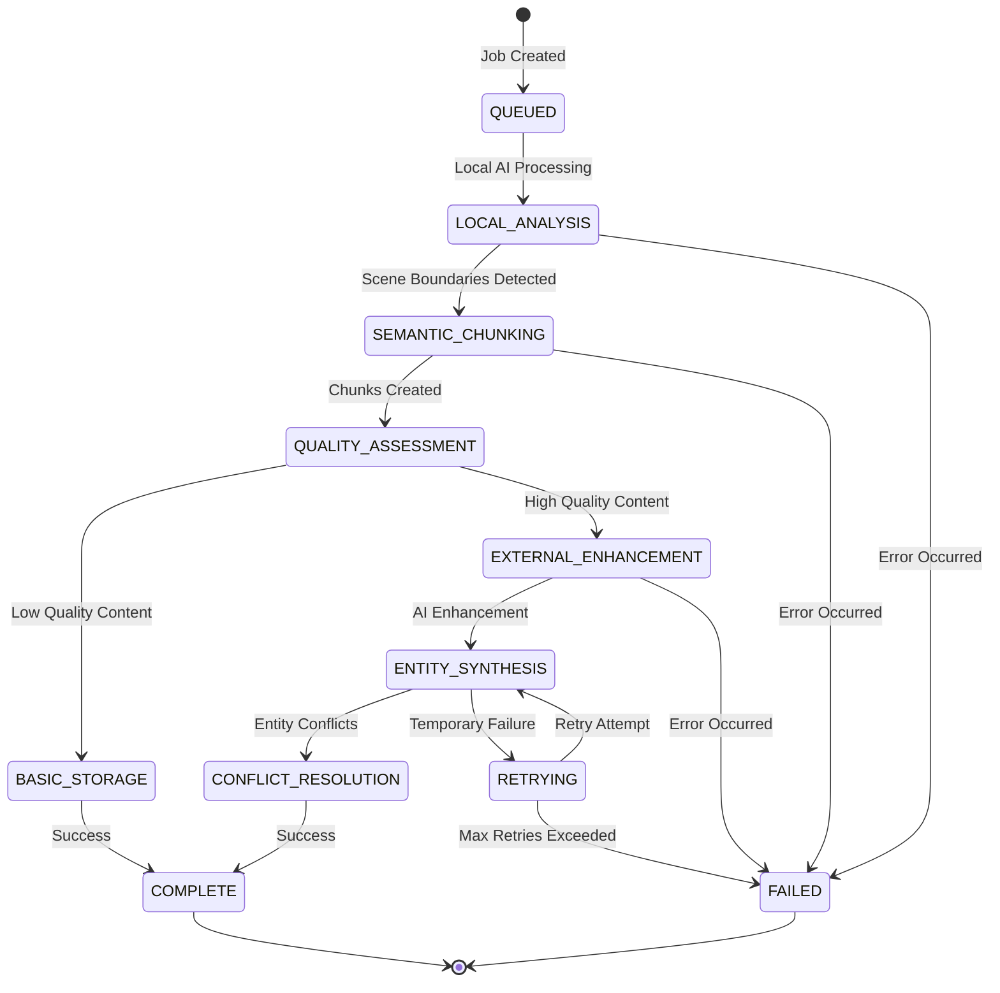

**Future State Categories**:
- **Processing States**: Local analysis, semantic chunking, external enhancement
- **Quality Gates**: Assessment checkpoints for AI enhancement routing
- **Error Handling**: Retry logic for transient failures, permanent failure handling

## Milestone Summary

### ✅ v0.2.0 DELIVERED (Current Implementation)

**Core Infrastructure**:
- [x] Chapter entity storage with publication coordinate metadata
- [x] Content deduplication via SHA-256 hashing
- [x] Asynchronous job processing with comprehensive status tracking
- [x] REST API endpoints for chapter submission and job monitoring
- [x] PostgreSQL database schema with Flyway migrations

**Text Processing**:
- [x] Rolling window chunking algorithm with 30% overlap (see [Text Chunking Specification](text-chunking-specification.md))
- [x] Sentence-boundary-aware segmentation (200-1200 character chunks)
- [x] Position coordinate tracking for chunk reconstruction
- [x] Per-chunk content hashing for future deduplication

**System Quality**:
- [x] Comprehensive unit and integration test coverage
- [x] CQRS architecture compliance
- [x] Spring Boot framework integration
- [x] Testcontainers-based integration testing with real PostgreSQL

### ✅ v0.3.0 IMPLEMENTED (Scene Detection & Hierarchy)

**Semantic Structure**:
- [x] External AI integration for scene boundary detection (Google Gemini)
- [x] XML-based LLM response parsing for reliable prose handling
- [x] Scene entity creation with context metadata
- [x] Hierarchical content structure (Chapter → Scene → Chunk)
- [x] Two-stage processing: AI identification + coordinate localization
- [x] Retry mechanisms with exponential backoff for API resilience

**Quality & Reliability**:
- [x] Comprehensive unit test coverage for XML parsing
- [x] Error handling and graceful degradation
- [x] Trace-level logging for debugging AI interactions
- [x] Integration with Chapter aggregate pattern

### 🔄 v0.4.0 PLANNED (AI Enhancement & Intelligence)

**Enhanced Scene Analysis**:
- [ ] Character presence tracking within scenes
- [ ] Location extraction and scene tagging
- [ ] Emotional tone analysis per scene

**Intelligence Processing**:
- [ ] Local LLM integration for cost reduction
- [ ] Entity extraction (characters, locations, items, organizations)
- [ ] Thematic tag classification
- [ ] Quality assessment for AI enhancement filtering

### 🔮 v0.5.0+ FUTURE (Vector Processing & Search)

**Vector Processing**:
- [ ] Vector embedding generation for semantic search
- [ ] pgvector integration for similarity queries
- [ ] RAG (Retrieval-Augmented Generation) context assembly

**AI Enhancement**:
- [ ] External AI API integration (GPT-4, Claude) for entity enhancement
- [ ] Cost-optimized processing through local filtering
- [ ] Conflict resolution for entity merging
- [ ] Enhanced entity profiles with relationship mapping

## Current API Interface (v0.2.0)

**Note**: For detailed API specifications, see [REST API Specification](rest-api-specification.md).

### Content Submission Interface (✅ IMPLEMENTED)

**Current Implementation**: File-based multipart upload
- **Endpoint**: `POST /api/ingest/submit-file`
- **Format**: Multipart form data with file upload and metadata parameters
- **Response**: HTTP 202 with jobId and chapterId

### Job Status Interface (✅ IMPLEMENTED)

**Current Implementation**: RESTful job monitoring
- **Endpoint**: `GET /api/jobs/{jobId}`
- **Response**: Complete job status with history and progress tracking

## Future Vision (v0.3.0+)

### Planned API Evolution

**Enhanced Content Submission** (v0.3.0):
- **Endpoint**: `POST /api/v1/chapters` with JSON payload
- **Features**: Enhanced metadata, estimated completion times
- **Quality**: Automatic quality assessment and routing

**Advanced Job Monitoring** (v0.3.0):
- **Enhanced Status**: Entity counts, processing stage details
- **Real-time Updates**: WebSocket support for live progress
- **Quality Metrics**: Confidence scores, enhancement decisions

### Entity Lifecycle States (v0.3.0+)

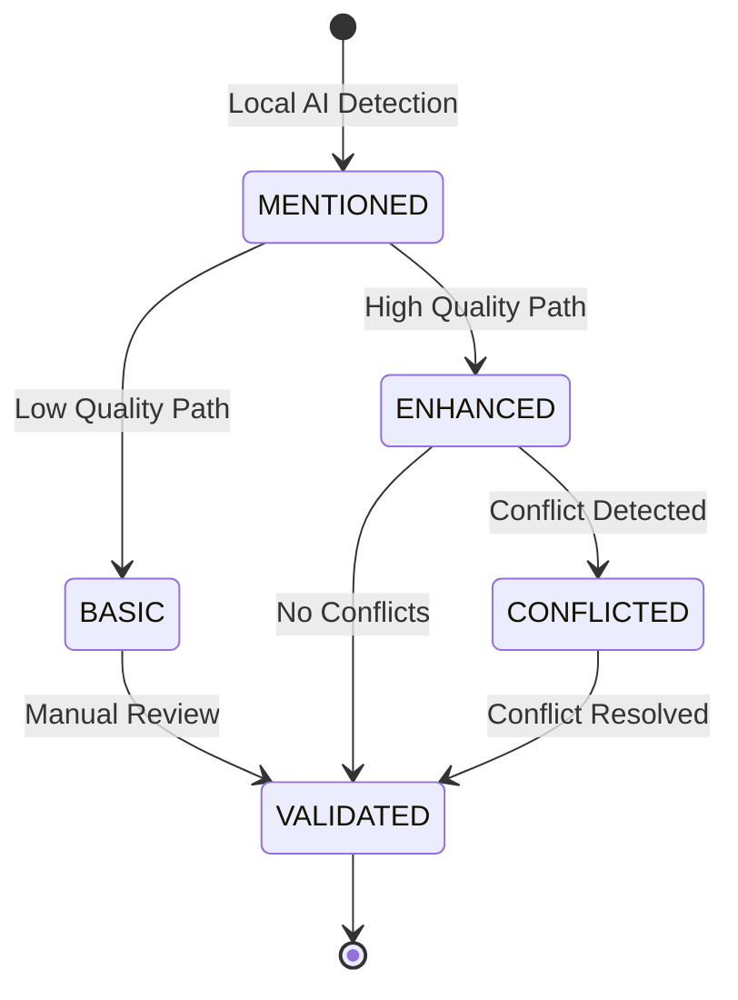

**Entity Processing Flow**:
- **MENTIONED**: Entities detected by local AI during scene analysis
- **BASIC**: Low-quality entities stored without external AI enhancement
- **ENHANCED**: High-quality entities processed through external AI synthesis
- **VALIDATED**: Final state after conflict resolution and quality validation

## Error Handling

### Error Categories and Recovery

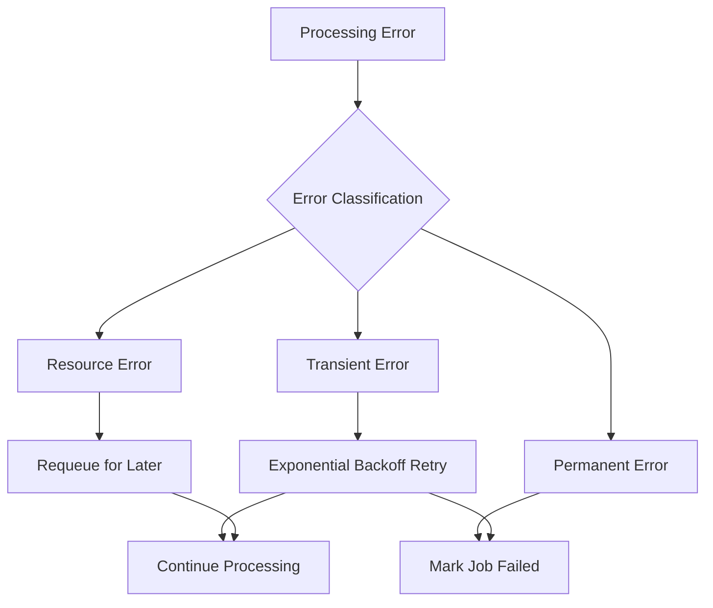

**Error Handling Specifications**:
- **Transient Errors**: Network timeouts, temporary API failures
  - **Retry Strategy**: Exponential backoff, max 3 attempts, 1s/2s/4s delays
- **Permanent Errors**: Invalid content format, authorization failures
  - **Action**: Immediate failure, no retry
- **Resource Errors**: Rate limits, quota exceeded
  - **Action**: Requeue with delay, respect rate limit headers

### Error Response Formats

**Processing Errors**:
```json
{
  "job_id": "uuid-v4",
  "status": "FAILED",
  "error": {
    "code": "CONTENT_TOO_LARGE",
    "message": "Content exceeds maximum size limit of 50,000 characters",
    "details": {
      "content_size": 75000,
      "max_allowed": 50000
    }
  }
}
```

## System Requirements & Integration

### Performance Requirements

**Response Time Targets**:
- Content Submission: < 200ms response time
- Status Queries: < 100ms response time  
- Processing Completion: < 5 minutes for typical chapter (5,000 characters)

**Throughput Specifications**:
- Peak Load: 100 concurrent chapter submissions
- Sustained Load: 500 chapters per hour
- Queue Capacity: 1,000 pending jobs maximum

### Integration Points

**Database Integration**:
- PostgreSQL with pgvector for similarity search (future)
- Job tracking via relational tables with status audit trail
- Content storage with deduplication and position tracking

**External Service Integration** (v0.3.0+):
- Local AI: Small Language Model for content analysis
- External AI: GPT-4/Claude for entity enhancement (v0.4.0+)
- Rate limiting and cost optimization through local filtering

## Validation Criteria

### ✅ Current Implementation Validation (v0.2.0)

**Functional**: Content processing, job tracking, chunking algorithm, deduplication
**Performance**: Response times, processing throughput, database efficiency  
**Data Integrity**: Position coordinates, content hashes, schema relationships

### 🔄 Future Validation Targets (v0.3.0+)

**Quality**: Entity extraction accuracy > 85%, enhanced entity profiles
**Performance**: 100 concurrent users, optimized external API costs
**Integration**: Vector embeddings, conflict resolution, error recovery
