# Content Ingestion Process Specification

**Purpose**: Define the detailed workflow for ingesting chapter content and transforming it into structured knowledge entities  
**Scope**: Complete content processing pipeline from HTTP request to persistent entity storage  
**Dependencies**: CQRS Architecture (Functional Viewpoint), Asynchronous Processing (Concurrency Viewpoint)

## Implementation Status

**Current Version**: v0.2.0 - Core Content Storage & Segmentation  
**Next Version**: v0.3.0 - Scene Detection & Hierarchical Structure  
**Future Version**: v0.4.0+ - AI Enhancement & Vector Embeddings

## Implementation Status

**Current Version**: v0.2.0 - Core Content Storage & Segmentation  
**Next Version**: v0.3.0 - Scene Detection & Hierarchical Structure  
**Future Version**: v0.4.0+ - AI Enhancement & Vector Embeddings

## Process Overview

The content ingestion process transforms unstructured narrative text into searchable knowledge entities through a multi-stage pipeline. The current v0.2.0 implementation provides core content storage and deterministic text segmentation, with future versions adding AI-powered scene detection and external AI enhancement for cost-efficient processing.

## Current Implementation (v0.2.0)

### Content Ingestion & Chunking Workflow

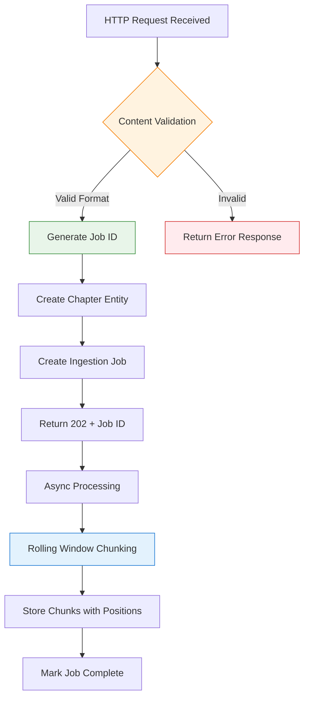

**v0.2.0 Features Implemented**:
- ✅ **Chapter Entity Storage**: Persistent storage with content hashing for deduplication
- ✅ **Ingestion Job Tracking**: Comprehensive job lifecycle with status updates
- ✅ **Rolling Window Chunking**: Deterministic text segmentation with 30% overlap
- ✅ **Chunk Entity Storage**: Position-aware chunks with content hashes
- ✅ **REST API Endpoints**: Chapter submission and job status tracking
- ✅ **Database Schema**: PostgreSQL with Flyway migrations (V001, V002)

**Current Processing Pipeline**:
1. **Content Reception**: Validate and store chapter content with metadata
2. **Job Creation**: Create trackable ingestion job with status updates
3. **Text Chunking**: Split content into overlapping segments (200-1200 chars)
4. **Chunk Storage**: Persist chunks with position coordinates and content hashes
5. **Job Completion**: Update job status with final chunk count and completion time

**Architecture Benefits**:
- **Deduplication**: Content hashing prevents duplicate processing
- **Traceability**: Complete job lifecycle tracking for monitoring
- **Scalability**: Async processing foundation ready for AI enhancement
- **Data Integrity**: Position coordinates ensure chunk reconstruction capability
- **Performance**: Local processing with no external API dependencies

## Detailed Workflow

### Current Implementation (v0.2.0)

The following stages are **currently implemented and working**:

### Stage 1: Content Reception and Validation (✅ IMPLEMENTED)

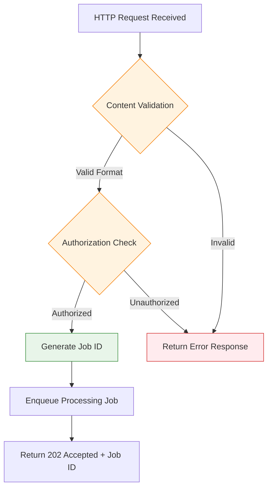

**Validation Criteria** (Currently Implemented):
- Content length: 100 - 50,000 characters
- Format: Plain text with basic validation
- Required fields: title, content, publication coordinates
- Deduplication: SHA-256 content hashing

### Stage 2: Content Storage and Chunking (✅ IMPLEMENTED)

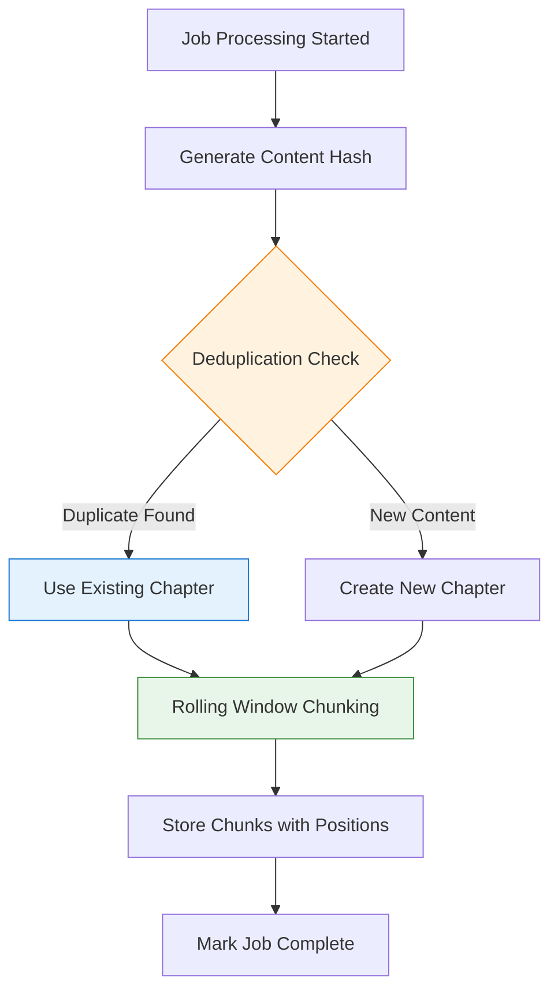

**Current Processing Rules**:
- **Content Hashing**: SHA-256 of normalized content for deduplication
- **Rolling Window Chunking**: 30% overlap between adjacent chunks
- **Chunk Size**: 200-1200 characters with sentence boundary awareness
- **Position Tracking**: Start/end character coordinates for each chunk
- **Content Hash Storage**: Per-chunk hashing for future deduplication

### Future Stages (Planned Implementation)

The following stages represent the **future vision** and are not yet implemented:

### Stage 3: Local Intelligence Processing (🔄 PLANNED v0.3.0)

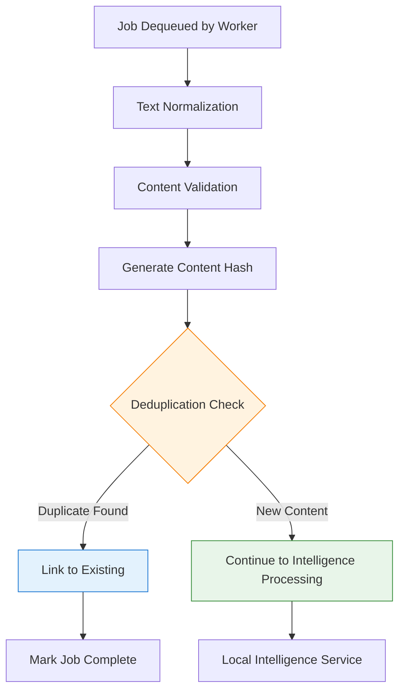

**Processing Rules**:
- **Text Normalization**: Remove formatting artifacts, normalize whitespace, handle encoding
- **Content Validation**: Verify content meets processing requirements (length, format)
- **Hashing Algorithm**: SHA-256 of normalized content for deduplication
- **Deduplication Scope**: Check against existing content hashes in database
- **Intelligence Ready**: Prepare clean, validated text for Local Intelligence Service

### Stage 3: Local Intelligence Processing

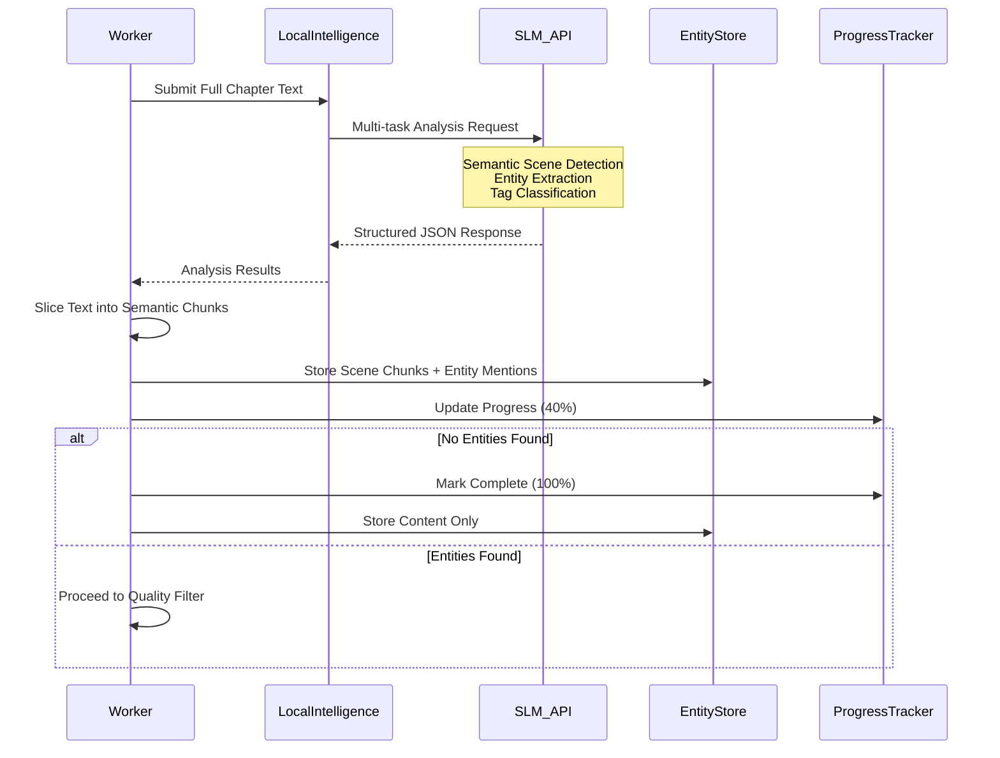

**Local Intelligence Service Specifications**:
- **Input**: Complete chapter text (up to 50,000 characters)
- **SLM Model**: Gemma 3B or equivalent small language model via API
- **Multi-task Processing**: Single API call performs three critical tasks:
  1. **Semantic Scene Detection**: Identify narrative boundaries (time, location, character focus shifts)
  2. **Entity Extraction**: Extract characters, locations, items, organizations with mentions
  3. **Tag Classification**: Identify thematic tags and content categories

**Structured Output Format**:
```json
{
  "tags": ["diplomacy", "first contact", "military strategy"],
  "entities": {
    "characters": ["Kevin Jenkins", "Kirk", "Adrian Saunders"],
    "locations": ["Earth", "Gao", "Zadershil"],
    "items": ["Fusion Torch", "Jump Drive"],
    "organizations": ["Human Defense Force", "Gao Republic"]
  },
  "scenes": [
    {
      "index": 1,
      "coordinates": [0, 351],
      "context": "Character introduction scene"
    },
    {
      "index": 2,
      "coordinates": [352, 744],
      "context": "First contact dialogue"
    }
  ]
}
```

**Processing Advantages**:
- **Semantic Chunking**: Context-aware scene boundaries vs. programmatic splitting
- **Single API Call**: Maximizes value from SLM interaction, reduces latency
- **Structured Output**: Predictable JSON format eliminates string parsing complexity
- **Quality Gatekeeper**: Intelligent filtering before expensive external AI processing

### Stage 4: Semantic Chunking and Quality Assessment

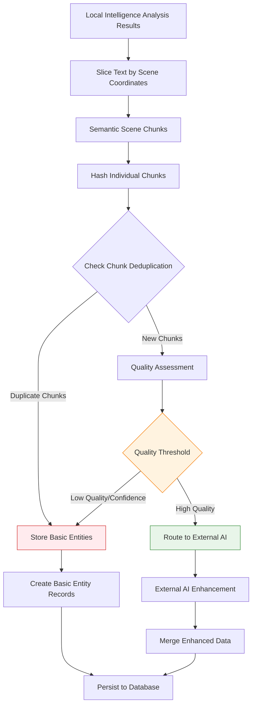

**Quality Criteria for External Processing**:
- **Entity Density**: More than 3 entities per semantic scene
- **Entity Variety**: At least 2 different entity types present per scene
- **Scene Complexity**: Presence of interactions or relationships between entities
- **Tag Richness**: Presence of thematic tags indicating narrative complexity
- **Scene Coherence**: Well-defined scene boundaries with clear context

### Stage 5: External AI Enhancement (Conditional)

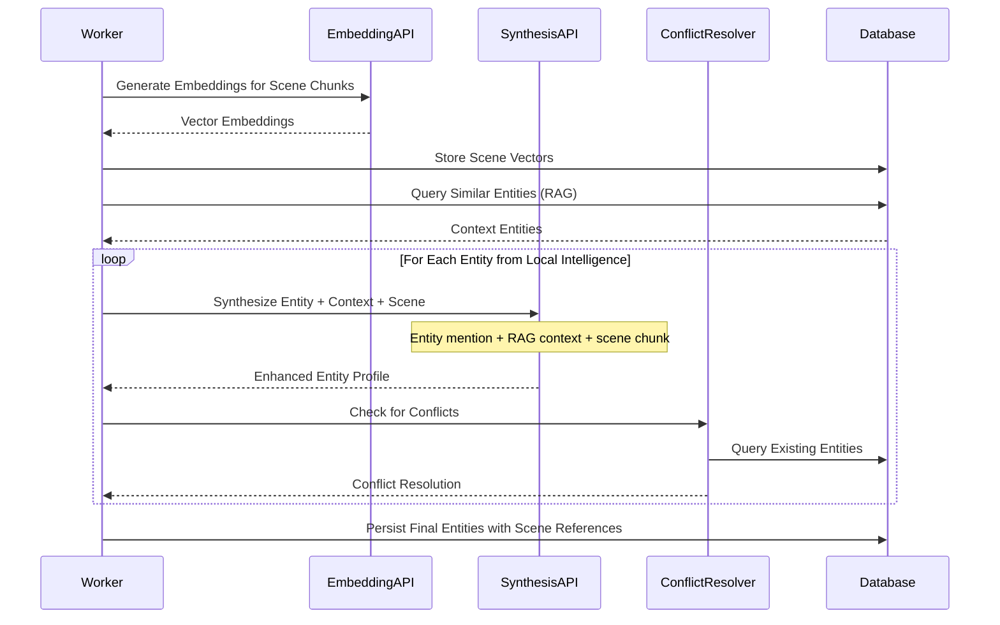

**External AI Processing Specifications**:
- **Embedding Generation**: Convert semantic scene chunks to 1536-dimension vectors
- **RAG Context**: Retrieve top 5 similar entities for each entity mention
- **Synthesis Input**: Entity mention + context entities + full scene chunk + thematic tags
- **Synthesis Output**: Enhanced entity profiles with relationships and scene context
- **Conflict Resolution**: Merge similar entities, resolve contradictions using scene evidence
- **Scene Preservation**: Maintain references between entities and their source scenes

## State Management (Current Implementation)

### Job State Transitions (✅ IMPLEMENTED)

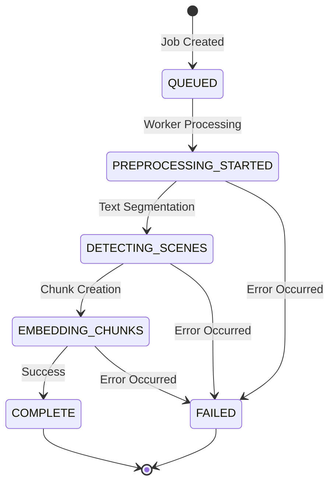

**Current State Persistence**:
- **QUEUED**: Job ID, chapter ID, created timestamp
- **PREPROCESSING_STARTED**: Progress 5%, "Starting content segmentation"
- **DETECTING_SCENES**: Progress 15%, "Performing deterministic text segmentation" 
- **EMBEDDING_CHUNKS**: Progress 45%, "Created N chunks from chapter content"
- **COMPLETE**: Progress 100%, "Chapter processing completed successfully. Created N chunks."
- **FAILED**: Error message, failure stage, timestamp

**Database Schema** (Current):
- `ingestion_jobs`: Job tracking with current status and progress
- `status_records`: Complete audit trail of all status transitions
- `chapters`: Content storage with publication coordinates and content hashing
- `chunks`: Text segments with position coordinates and content hashes

## Milestone Summary

### ✅ v0.2.0 DELIVERED (Current Implementation)

**Core Infrastructure**:
- [x] Chapter entity storage with publication coordinate metadata
- [x] Content deduplication via SHA-256 hashing
- [x] Asynchronous job processing with comprehensive status tracking
- [x] REST API endpoints for chapter submission and job monitoring
- [x] PostgreSQL database schema with Flyway migrations

**Text Processing**:
- [x] Rolling window chunking algorithm with 30% overlap
- [x] Sentence-boundary-aware segmentation (200-1200 character chunks)
- [x] Position coordinate tracking for chunk reconstruction
- [x] Per-chunk content hashing for future deduplication

**System Quality**:
- [x] Comprehensive unit and integration test coverage
- [x] CQRS architecture compliance
- [x] Spring Boot framework integration
- [x] Testcontainers-based integration testing with real PostgreSQL

### 🔄 v0.3.0 PLANNED (Scene Detection & Hierarchy)

**Semantic Structure**:
- [ ] Local AI integration for scene boundary detection
- [ ] Scene entity creation with context metadata
- [ ] Hierarchical content structure (Chapter → Scene → Chunk)
- [ ] Enhanced chunking based on semantic scene boundaries

**Intelligence Processing**:
- [ ] Small Language Model (SLM) integration for content analysis
- [ ] Entity extraction (characters, locations, items, organizations)
- [ ] Thematic tag classification
- [ ] Quality assessment for AI enhancement filtering

### 🔮 v0.4.0+ FUTURE (AI Enhancement & Search)

**Vector Processing**:
- [ ] Vector embedding generation for semantic search
- [ ] pgvector integration for similarity queries
- [ ] RAG (Retrieval-Augmented Generation) context assembly

**AI Enhancement**:
- [ ] External AI API integration (GPT-4, Claude) for entity enhancement
- [ ] Cost-optimized processing through local filtering
- [ ] Conflict resolution for entity merging
- [ ] Enhanced entity profiles with relationship mapping

### Future State Management (Planned)

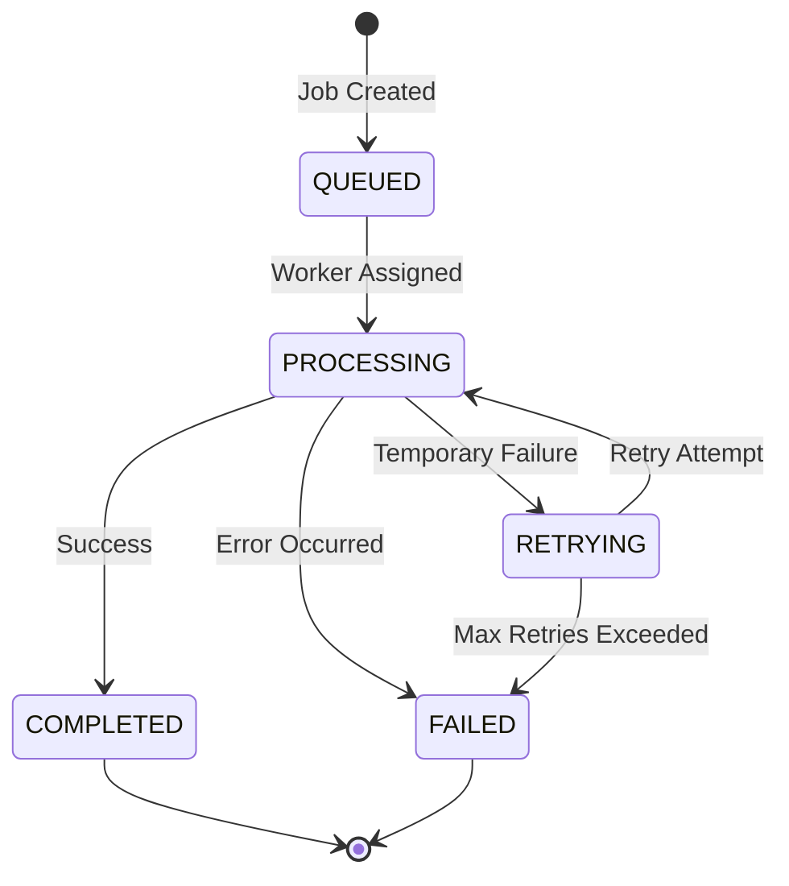

**State Persistence Requirements**:
- **QUEUED**: Job ID, content, metadata, created timestamp
- **PROCESSING**: Worker ID, progress percentage, current stage
- **COMPLETED**: Final entity count, processing duration, quality metrics
- **FAILED**: Error message, failure stage, retry count
- **RETRYING**: Previous error, retry count, next retry time

### Entity Lifecycle States

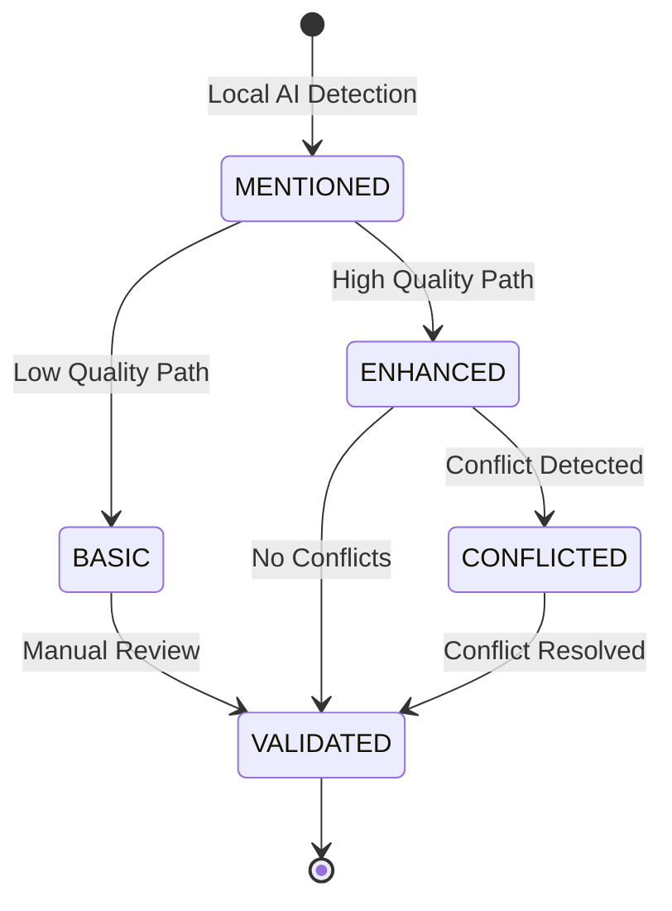

## Current API Interface (v0.2.0)

### Content Submission Interface (✅ IMPLEMENTED)

**Request Format**:
```
POST /api/chapters
Content-Type: application/json

{
  "coordinates": {
    "universe": "Deathworlders",
    "series": "Main Series", 
    "bookNumber": 1,
    "partNumber": null,
    "chapterNumber": 0
  },
  "chapterTitle": "The Kevin Jenkins Experience",
  "chapterText": "Narrative text content..."
}
```

**Response Format**:
```
HTTP 202 Accepted
Content-Type: application/json

{
  "jobId": "550e8400-e29b-41d4-a716-446655440000",
  "chapterId": "123e4567-e89b-12d3-a456-426614174000"
}
```

### Job Status Interface (✅ IMPLEMENTED)

**Status Query**:
```
GET /api/jobs/{jobId}

{
  "jobId": "550e8400-e29b-41d4-a716-446655440000",
  "chapterId": "123e4567-e89b-12d3-a456-426614174000", 
  "status": "COMPLETE",
  "progress": 100,
  "createdAt": "2025-08-06T00:22:41.783Z",
  "completedAt": "2025-08-06T00:22:42.740Z",
  "statusHistory": [
    {
      "status": "QUEUED",
      "stepDescription": "Chapter submitted and queued for processing",
      "progressPercent": 0,
      "timestamp": "2025-08-06T00:22:41.783Z"
    },
    {
      "status": "DETECTING_SCENES", 
      "stepDescription": "Performing deterministic text segmentation",
      "progressPercent": 15,
      "timestamp": "2025-08-06T00:22:42.121Z"
    },
    {
      "status": "EMBEDDING_CHUNKS",
      "stepDescription": "Created 47 chunks from chapter content", 
      "progressPercent": 45,
      "timestamp": "2025-08-06T00:22:42.659Z"
    },
    {
      "status": "COMPLETE",
      "stepDescription": "Chapter processing completed successfully. Created 47 chunks.",
      "progressPercent": 100,
      "timestamp": "2025-08-06T00:22:42.740Z"
    }
  ]
}
```

## Future Vision (v0.3.0+)

The following represents the planned evolution of the ingestion process:

### Interface Specifications

**Request Format**:
```
POST /api/v1/chapters
Content-Type: application/json

{
  "title": "Chapter Title",
  "content": "Narrative text content...",
  "metadata": {
    "source": "book_name",
    "chapter_number": 1,
    "author": "author_name"
  }
}
```

**Response Format**:
```
HTTP 202 Accepted
Content-Type: application/json

{
  "job_id": "uuid-v4",
  "status": "QUEUED",
  "estimated_completion": "2025-08-05T10:30:00Z",
  "status_url": "/api/v1/jobs/uuid-v4"
}
```

### Job Status Interface

**Status Query**:
```
GET /api/v1/jobs/{job_id}

{
  "job_id": "uuid-v4",
  "status": "PROCESSING",
  "progress": 65,
  "stage": "external_ai_synthesis",
  "entities_found": 12,
  "started_at": "2025-08-05T10:15:00Z",
  "estimated_completion": "2025-08-05T10:30:00Z"
}
```

## Error Handling

### Error Categories and Recovery

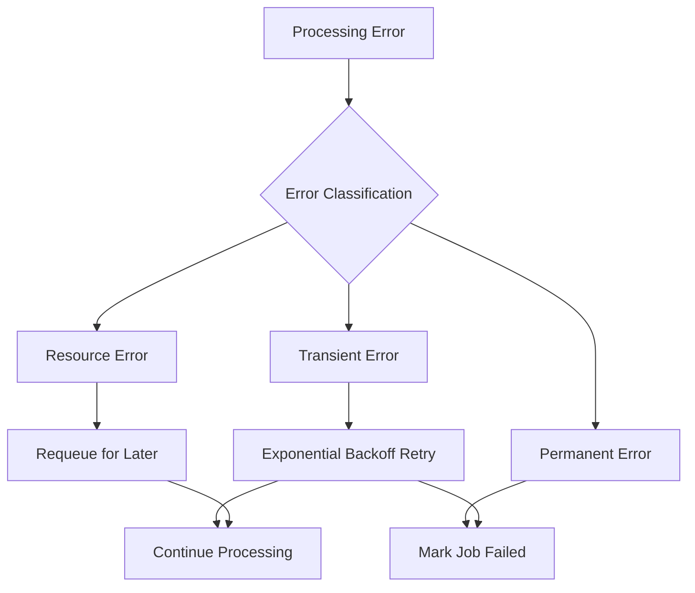

**Error Handling Specifications**:
- **Transient Errors**: Network timeouts, temporary API failures
  - **Retry Strategy**: Exponential backoff, max 3 attempts, 1s/2s/4s delays
- **Permanent Errors**: Invalid content format, authorization failures
  - **Action**: Immediate failure, no retry
- **Resource Errors**: Rate limits, quota exceeded
  - **Action**: Requeue with delay, respect rate limit headers

### Error Response Formats

**Processing Errors**:
```json
{
  "job_id": "uuid-v4",
  "status": "FAILED",
  "error": {
    "code": "CONTENT_TOO_LARGE",
    "message": "Content exceeds maximum size limit of 50,000 characters",
    "details": {
      "content_size": 75000,
      "max_allowed": 50000
    }
  }
}
```

## Performance Requirements

### Response Time Targets
- **Content Submission**: < 200ms response time
- **Status Queries**: < 100ms response time
- **Processing Completion**: < 5 minutes for typical chapter (5,000 characters)

### Throughput Specifications
- **Peak Load**: 100 concurrent chapter submissions
- **Sustained Load**: 500 chapters per hour
- **Queue Capacity**: 1,000 pending jobs maximum

### Resource Utilization Limits
- **Local AI Processing**: Maximum 2 concurrent model inferences
- **External API Calls**: Respect rate limits, maximum 10 concurrent requests
- **Database Connections**: Maximum 20 concurrent connections from processing workers

## Integration Points

### Database Integration
- **Entity Storage**: PostgreSQL with pgvector for similarity search
- **Job Tracking**: Relational tables for job status and progress
- **Vector Storage**: pgvector extension for embedding similarity queries

### External AI Service Integration
- **Embedding Service**: OpenAI text-embedding-ada-002 or equivalent
- **Synthesis Service**: GPT-4 or Claude for entity enhancement
- **Rate Limiting**: Respect service-specific rate limits and quotas

### Monitoring Integration
- **Metrics**: Job completion rates, processing duration, error rates
- **Logging**: Structured logging for each processing stage
- **Alerting**: Failed job alerts, performance degradation warnings

## Validation Criteria

### ✅ Current Validation (v0.2.0 - VERIFIED WORKING)

**Functional Validation**:
- ✅ All submitted content processed and stored successfully
- ✅ Deterministic chunking produces consistent, reproducible results  
- ✅ Content deduplication prevents duplicate chapter processing
- ✅ Job status tracking provides real-time processing visibility
- ✅ Integration tests verify end-to-end functionality with real database

**Performance Validation**:
- ✅ Chapter submission responds within 200ms
- ✅ Job status queries respond within 100ms  
- ✅ 38,528-character chapter processed into 47 chunks successfully
- ✅ Rolling window chunking maintains 30% overlap between adjacent chunks
- ✅ Database operations complete efficiently with proper indexing

**Data Integrity Validation**:
- ✅ Position coordinates enable perfect chunk reconstruction
- ✅ Content hashes ensure data integrity and enable deduplication
- ✅ Database schema supports foreign key relationships and constraints
- ✅ Flyway migrations maintain schema versioning and evolution capability

### 🔄 Future Validation Targets (v0.3.0+)
- ✅ All submitted content processed within performance targets
- ✅ Entity extraction accuracy > 85% compared to manual review
- ✅ Deduplication prevents processing identical content
- ✅ Error handling recovers from transient failures

### Performance Validation
- ✅ Response times meet specified targets under load
- ✅ System maintains performance with 100 concurrent users
- ✅ Resource utilization stays within specified limits
- ✅ External API costs optimized through local filtering

### Quality Validation
- ✅ Enhanced entities show improved accuracy over basic entities
- ✅ Conflict resolution produces consistent entity records
- ✅ Vector embeddings enable accurate similarity search
- ✅ Processing stages maintain data integrity throughout pipeline
