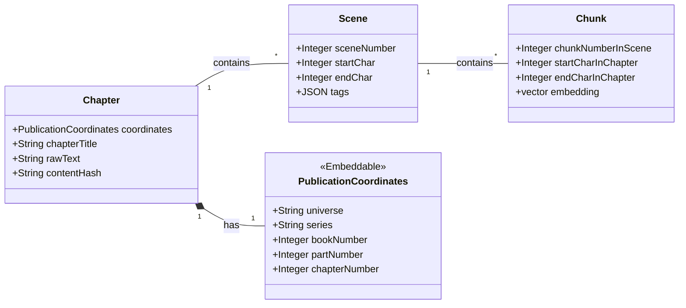

# Core Data Model Specification

**Purpose**: This specification defines the logical data structures, relationships, and rationale for storing the core content within the LoreVault system. It details the hierarchical model used to represent chapters, scenes, and chunks of narrative text.

**Scope**: This document covers the data model for ingesting and storing the primary source text and its subdivisions. This includes the `Chapter`, `Scene`, and `Chunk` entities, as well as the `PublicationCoordinates` component. The model for storing extracted, synthesized entity profiles (e.g., `CHARACTERS`, `LOCATIONS` from the architecture document) is out of scope for this specification.

**Dependencies**:
- **Architecture Document**: Information Viewpoint (03-information-viewpoint.md)
- **Process Specification**: Content Ingestion Process (content-ingestion-process.md)

## Process Overview

The primary goal of the LoreVault system is to create a "structured and searchable knowledge base from unstructured narrative text". The core data model is designed to support this by organizing content into a three-tiered hierarchy: `Chapter` -> `Scene` -> `Chunk`.

This structure serves two main purposes:

1. **Enabling Granular AI Processing**: It provides semantically coherent `Chunks` of text that are optimized for Retrieval-Augmented Generation (RAG). This allows the powerful synthesis LLM to work with focused, relevant context.
2. **Supporting Advanced Features**: It establishes a detailed coordinate system that is essential for user-facing features like spoiler prevention, allowing content to be filtered based on a user's progress through the narrative.

The model is designed to be persisted in a PostgreSQL database, leveraging extensions like `pgvector` for storing vector embeddings.

## Detailed Workflow

The data model is realized through a set of interconnected entities that represent the content hierarchy. The relationship between these entities is visualized in the following domain diagram.

### Domain Class Diagram

### Entity Descriptions

- **PublicationCoordinates**: An embeddable component that defines the precise location of a chapter within the overall fictional universe. It is a value object that provides a consistent structure for addressing content.
- **Chapter**: The root entity representing a single, complete chapter from a source book. It contains the full raw text and high-level metadata. It acts as the "source of truth" from which scenes and chunks are derived.
- **Scene**: A semantic subdivision of a Chapter. Scenes are identified by the Local Intelligence Service based on narrative shifts. They provide logical context and carry thematic tags that can inform downstream processing.
- **Chunk**: A technical subdivision of a Scene. Chunks are the most granular level of the hierarchy and are sized for optimal performance in the RAG process. Each chunk has a vector embedding for semantic retrieval.

## State Management

The data model is designed around the principle of source text immutability.

- **Initial Creation**: When a chapter is first ingested, a `Chapter` record is created along with all its derived `Scene` and `Chunk` records. The `content_hash` of the chapter's `raw_text` ensures that identical content is not processed twice.
- **Updates**: The `raw_text` of an existing `Chapter` record should be treated as immutable. If a chapter is updated in the source material, a new `Chapter` record (with a new hash and ID) should be created to represent the new version. Logic may be required to archive or supersede the old version's data.
- **Data Integrity**: The relationships between entities (e.g., a `Chunk` must belong to a `Scene`) are maintained through relational constraints.

## Interface Specifications

The following tables define the logical data contracts for each entity.

### `PublicationCoordinates` (Embeddable)

| Attribute | Logical Type | Description |
|-----------|--------------|-------------|
| `universe` | `String` | The top-level fictional universe. |
| `series` | `String` | The series within the universe. |
| `bookNumber` | `Integer` | The order of the book in the series. |
| `partNumber` | `Integer` | The part number within the book. |
| `chapterNumber` | `Integer` | The chapter number. |

### `Chapter` Entity

| Attribute | Logical Type | Description |
|-----------|--------------|-------------|
| `id` | `UUID` | Unique identifier for the chapter. |
| `coordinates` | `PublicationCoordinates` | Embedded coordinates object. |
| `chapterTitle` | `String` | The title of the chapter. |
| `rawText` | `Text` | The full, unmodified chapter text. |
| `contentHash` | `String` | A SHA-256 hash of `rawText` for deduplication. |
| `embedding` | `Vector` | A vector embedding of the entire chapter for high-level analysis. |

### `Scene` Entity

| Attribute | Logical Type | Description |
|-----------|--------------|-------------|
| `id` | `UUID` | Unique identifier for the scene. |
| `chapterId` | `UUID` | Foreign key referencing the parent `Chapter`. |
| `sceneNumber` | `Integer` | The sequential order of the scene within the chapter. |
| `startChar` | `Integer` | The starting character position in the parent chapter's `rawText`. |
| `endChar` | `Integer` | The ending character position in the parent chapter's `rawText`. |
| `tags` | `JSON` | Thematic tags identified by the Local Intelligence Service. |

### `Chunk` Entity

| Attribute | Logical Type | Description |
|-----------|--------------|-------------|
| `id` | `UUID` | Unique identifier for the chunk. |
| `sceneId` | `UUID` | Foreign key referencing the parent `Scene`. |
| `chunkNumberInScene`| `Integer` | The sequential order of the chunk within its scene. |
| `startCharInChapter`| `Integer` | The absolute start position in the chapter's `rawText`. |
| `endCharInChapter`| `Integer` | The absolute end position in the chapter's `rawText`. |
| `embedding` | `Vector` | The vector embedding used for RAG semantic search. |

## Error Handling

The data model must enforce integrity. The persistence layer should handle:

- **Constraint Violations**: Rejecting any `Scene` or `Chunk` that does not have a valid, existing parent ID.
- **Duplicate Content**: Rejecting a new `Chapter` if its `content_hash` already exists in the database.
- **Invalid Coordinates**: Rejecting data where `endChar` is less than `startChar`.

## Performance Requirements

To ensure the "read" side of the system is "fast and efficient", the following are required:

- **Coordinate Indexing**: The persistence layer must have a multi-column index on the coordinate fields (`universe`, `series`, `bookNumber`, `chapterNumber`) to allow for fast filtering, which is essential for the spoiler-prevention feature.
- **Hash Indexing**: The `content_hash` field on the `chapters` table must be indexed to enable fast lookups during the deduplication check of the ingestion process.
- **Vector Indexing**: The `embedding` field on the `chunks` table must have an appropriate vector index (e.g., HNSW or IVFFlat) to enable efficient, large-scale semantic search.

## Integration Points

This data model is central to the LoreVault system and integrates with several key components:

- **Content Ingestion Process**: This process, managed by the `Orchestration Service`, is the primary writer to this data model. It creates `Chapter`, `Scene`, and `Chunk` records.
- **RAG-Powered Synthesis**: The `SynthesisClient` indirectly reads from this model during its "Retrieve" step, performing a vector search on the `chunks` table to gather context.
- **Query Service**: The `Query Service` is the primary reader of this model, using the coordinate system and relational links to serve structured data to the user.

## Validation Criteria

The data model implementation will be considered successful if the following criteria are met:

- A `Chunk` record cannot be persisted without a valid foreign key to a `Scene` record.
- A `Scene` record cannot be persisted without a valid foreign key to a `Chapter` record.
- Attempting to insert a `Chapter` with a `content_hash` that already exists results in a rejected transaction.
- Queries filtering on the `LoreCoordinates` fields execute within acceptable performance limits (e.g., sub-second response time for spoiler-prevention checks).
- The data structure can be successfully mapped to application-level objects (e.g., JPA Entities) as defined in the domain diagram.
