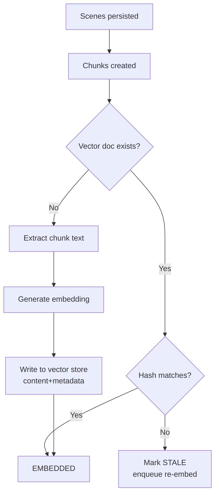
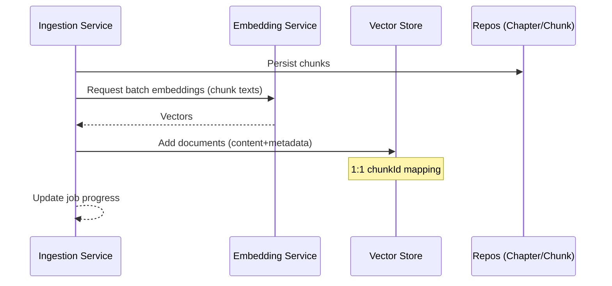

# PGVector Integration & Embedding Storage Specification

Purpose: Define how vector embeddings are generated, stored, and queried using a dedicated vector store integrated with pgvector, while keeping LoreVault domain metadata in relational tables.
Scope: Chunk-level embeddings in v0.5.0; extensible to other data types (entities, summaries) in future versions. No implementation code or SQL included.
Dependencies: Content Ingestion Process, Core Data Model (Chapter → Scene → Chunk), Scene Detection & Chunking specifications.

## Process Overview
The system generates embeddings for semantic chunks and stores them in a dedicated vector store (pgvector-backed), separate from domain tables. The vector store holds:
- content: exact chunk text
- metadata: identifiers and search-relevant attributes (e.g., chunkId, chapterId, publication coordinates)

Semantic search queries compute an embedding for the query and retrieve top-K similar documents from the vector store using cosine similarity and ANN indexing. Results are joined back to domain metadata via IDs.

## Detailed Workflow

1. Chunk Creation (existing)
- Scenes detected and persisted
- Chunks derived from scenes and persisted with coordinates + contentHash

2. Vector Document Production (new)
- For each persisted chunk, extract text using Chapter.rawText[start:end]
- Generate embedding via configured Embedding Model (e.g., Gemini embedding)
- Write document to vector store with minimal metadata and content hash

3. Backfill & Drift Handling (new)
- Backfill job identifies chunks without vector docs and enqueues embedding
- Drift detection compares metadata.contentHash vs. Chunk.contentHash to mark vector docs stale and re-embed

4. Semantic Search (new)
- User submits query → embedding generated
- Vector store similarity search (cosine) with optional metadata filters
- Top-K results mapped back to chunks and enriched with chapter/scene context for the response

5. Future Extensions (planned)
- Additional vectorized content types (entities, summaries, tags) written to the same vector store with distinct metadata types

## State Management

Vector Document States
- MISSING: Chunk exists; no vector doc
- EMBEDDED: Vector doc present; contentHash matches chunk
- STALE: Vector doc present; contentHash mismatch (chapter/chunk updated)
- FAILED: Embedding generation or write failed; requires retry

Transitions
- MISSING → EMBEDDED: Successful generation & write
- EMBEDDED → STALE: Detected hash drift
- STALE → EMBEDDED: Re-embedded successfully
- Any → FAILED: Unrecoverable error (after retries)

Persistence Requirements
- Vector store is source of truth for embeddings and chunk text replicas
- Chunks remain authoritative for coordinates and contentHash
- No embedding columns in chunks table
- Vector document id equals the source entity id (e.g., chunkId); application enforces integrity

## Interface Specifications

Vector Document (conceptual)
- id: UUID (required) — equals the source entity id (e.g., chunkId)
- type: enum { CHUNK, ENTITY_CHARACTER, ENTITY_LOCATION, ENTITY_ITEM, ENTITY_FACTION, SUMMARY, TAG } (required)
- content: string (exact source text)
- metadata: object (minimal)
  - modelId: string (embedding model)
  - generatedAt: timestamp
  - optional (only if server-side filtering/strict drift is required):
    - chapterId: UUID
    - sceneId: UUID
    - contentHash: string

ID and Type Resolution
- Resolver uses (type, id) to locate authoritative metadata in relational tables
- No DB-level FK is required; the service layer performs lookups and joins
- If DB-enforced integrity is desired later, an FK column can be added on the domain table pointing to vector id

Embedding Generation Contract
- Input: text (<= provider max tokens)
- Output: vector[d] where d is configured dimension (default 1536)
- Batch API: accepts list of texts; returns list of vectors in order
- Error Handling: retry policy with exponential backoff; circuit-breaker friendly

Semantic Search API (conceptual)
- Request: { query: string, limit: int=10, threshold: 0.7, filters?: metadata filter expression }
- Behavior: compute query embedding → vector similarity search (cosine) → return sorted top-K where similarity >= threshold
- Response item: { type, id, content, similarity, chapter: { id, title, publicationCoordinates }, scene?: {...}, offsets?: { start, end } }

Metadata Filtering (conceptual)
- Default strategy: keep vector metadata minimal; apply filters after resolving (type,id) to relational data
- Optional: include selective fields (e.g., chapterId) in vector metadata to enable server-side pre-filtering when needed
- AND/OR semantics supported; portable expression language recommended when vector-level filters are enabled

## Error Handling

- Embedding model errors: transient network/timeouts → retry with exponential backoff; hard errors → mark FAILED, surface metrics
- Vector write errors: retry; if persistent, queue for later and log
- Drift mismatch: mark STALE and enqueue re-embedding. Drift detection strategies:
  - Timestamp-based (default): compare domain updatedAt vs metadata.generatedAt
  - Hash-based (optional): include contentHash in metadata and compare against Chunk.contentHash
- Oversized input: truncate or skip with signal; configurable policy

Recovery Procedures
- Scheduled backfill scans for MISSING/STALE and reprocesses in batches
- Admin endpoint or job can trigger re-embedding for a chapter or universe

## Performance Requirements

- Dimensions: 1536 default (configurable); chosen for recall vs. storage balance and ANN index compatibility
- Distance: cosine similarity
- Top-K: default 10; configurable up to operational limits
- Latency Targets (guidance):
  - Single query search (K=10): P95 < 150ms for typical corpus sizes in dev
  - Embedding generation: batch up to provider’s recommended size; target throughput > 200 chunks/min in dev
- Indexing: approximate nearest neighbor indexing to ensure sub-linear search behavior as corpus grows
- Storage: vector store holds full chunk texts; expect roughly proportional storage growth to chunks

## Integration Points

- Ingestion Pipeline: After chunk persistence; enqueue embedding generation per chunk; update job progress
- Backfill Runner: Periodic or on-demand re-embedding for MISSING/STALE
- Search Service: Query path uses vector store; enrich results by resolving (type,id) to Chapter/Scene/Chunk data
- Observability: Counters for generated, failed, missing, stale; timers for embedding and search latency

## Detailed Workflow Diagrams

## Validation Criteria

Functional
- For each chunk, a corresponding vector document exists and includes correct content and metadata
- Semantic search returns relevant chunks with similarity >= threshold and ordered by similarity
- Drift detection re-embeds when contentHash changes

Data Integrity
- metadata.chunkId maps to existing chunk; chapterId and offsets are consistent with relational data
- publicationCoordinates present when available

Performance
- Search latency meets targets at expected dataset sizes
- Embedding throughput meets targets with configured batch size

Reliability
- Retry policies in place for model and storage operations
- Backfill successfully reduces MISSING/STALE counts to zero over time

## Decision Log

- Separate vector store vs. embedding columns in chunks: Separate store chosen to keep domain model clean and enable reuse for future vectorized data (entities, summaries)
- Vector doc identity: Use (type, id) with id = source entity id to avoid extra FKs and enable polymorphic storage in a single table
- Content duplication: Store full source text in vector store for query performance; authoritative text remains Chapter.rawText
- Dimension: Default 1536 (configurable); balanced recall/storage; compatible with common ANN index limits
- Distance Metric: Cosine similarity for robust semantic retrieval across providers
- Filtering: Default to post-join filtering with minimal vector metadata; allow optional vector-side filters if needed later

## Future Extensions

- Additional document types: entity descriptions, scene summaries, tags with type-specific metadata
- Cross-type retrieval: filter by type and aggregate results across chunks/entities
- Reranking: lightweight LLM or cross-encoder reranking for top-K
- Hybrid search: combine keyword filters with vector similarity
- Multi-tenant isolation strategies if required later
