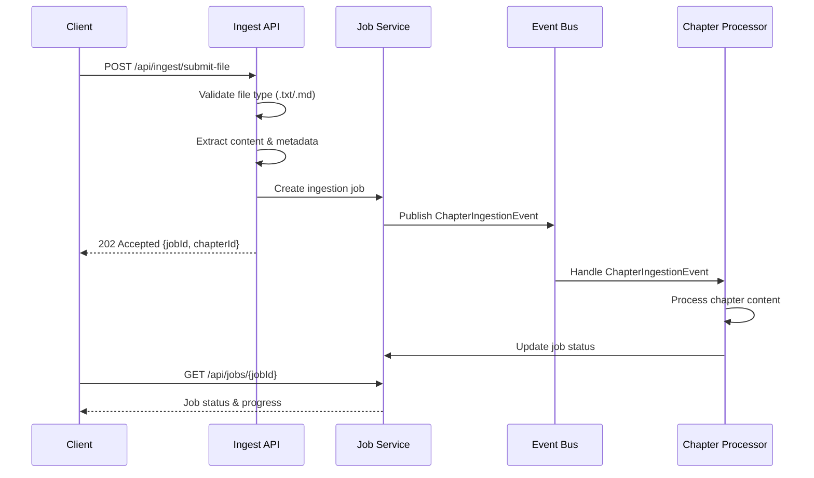
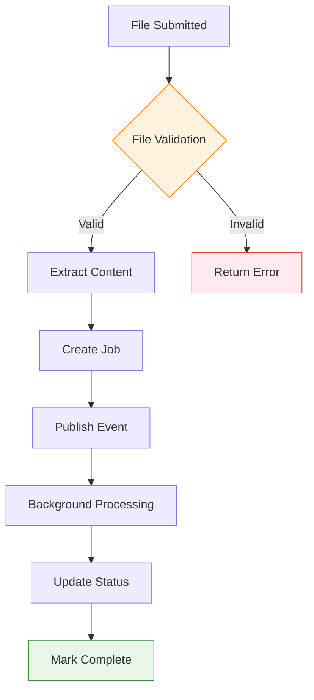

# LoreVault REST API Specification

**Purpose**: Define the complete REST API interface for the LoreVault content ingestion and lore exploration system, implementing CQRS patterns with clear command/query separation.

**Scope**: All public HTTP endpoints, request/response formats, error handling, and integration patterns for the LoreVault API. Covers current v0.3.x implementation and planned expansion through v1.0.0.

**Dependencies**: 
- Architecture Document: Functional Viewpoint (02-functional-viewpoint.md) - CQRS patterns
- Content Ingestion Process (content-ingestion-process.md) - Processing workflow
- Core Data Model (core-data-model.md) - Entity structures

## Process Overview

The LoreVault API implements a CQRS-aligned design that separates content ingestion commands from lore exploration queries. The API supports the complete workflow from content submission through processing job monitoring to structured lore access.

### Core API Domains

1. **Content Ingestion** (`/api/ingest/`): Command operations for submitting narrative content
2. **Job Monitoring** (`/api/jobs/`): Query operations for tracking processing status  
3. **Lore Exploration** (`/api/lore/`): Query operations for accessing structured knowledge

## Detailed Workflow

### Content Submission Flow




#### Submit File Endpoint

**Endpoint**: `POST /api/ingest/submit-file`  
**Purpose**: Submit narrative content files for processing  
**Content-Type**: `multipart/form-data`

**Request Parameters**:
```
file: MultipartFile          (required) - .txt or .md file
universe: string             (required) - Universe name (e.g., "Cosmere", "Middle Earth")
series: string               (optional) - Series name (e.g., "Mistborn", "The Lord of the Rings")
bookNumber: integer          (required) - Book number in series (1-based)
chapterNumber: integer       (required) - Chapter number in book (1-based)
partNumber: integer          (optional) - Part number within book (1-based)
title: string                (optional) - Chapter title (auto-extracted if omitted)
```

**Request Example**:
```bash
# Standalone book in a universe
curl -X POST /api/ingest/submit-file \
  -F "file=@chapter1.md" \
  -F "universe=Cosmere" \
  -F "bookNumber=1" \
  -F "chapterNumber=1" \
  -F "title=Warbreaker - Chapter 1"

# Book in a series
curl -X POST /api/ingest/submit-file \
  -F "file=@chapter1.md" \
  -F "universe=Cosmere" \
  -F "series=Mistborn" \
  -F "bookNumber=1" \
  -F "chapterNumber=1" \
  -F "title=The Final Empire - Chapter 1"
```

**Response Format**:
```json
{
  "jobId": "550e8400-e29b-41d4-a716-446655440000",
  "chapterId": "123e4567-e89b-12d3-a456-426614174000",
  "status": "submitted",
  "message": "Chapter submitted successfully for processing"
}
```

**Validation Rules**:
- File size limit: 1MB maximum
- Supported file types: `.txt`, `.md` for now
- Universe name: required, standard text (letters, numbers, spaces, hyphens, apostrophes)
- Series name: optional, standard text (letters, numbers, spaces, hyphens, apostrophes) 
- Book/chapter numbers: positive integers (1-based indexing)
- Part number: positive integer if provided (1-based indexing)
- Title: 1-500 characters if provided

### Job Monitoring Domain

#### Get Job Status

**Endpoint**: `GET /api/jobs/{jobId}`  
**Purpose**: Retrieve processing status for a specific job

**Path Parameters**:
```
jobId: UUID (required) - Unique job identifier
```

**Response Format**:
```json
{
  "jobId": "550e8400-e29b-41d4-a716-446655440000",
  "chapterId": "123e4567-e89b-12d3-a456-426614174000",
  "status": "EMBEDDING_CHUNKS",
  "progress": 45,
  "createdAt": "2025-08-06T10:15:00Z",
  "completedAt": null,
  "isComplete": false,
  "statusHistory": [
    {
      "status": "QUEUED",
      "stepDescription": "Chapter submitted and queued for processing",
      "timestamp": "2025-08-06T10:15:00Z",
      "progressPercent": 0
    },
    {
      "status": "DETECTING_SCENES",
      "stepDescription": "Performing deterministic text segmentation",
      "timestamp": "2025-08-06T10:15:30Z", 
      "progressPercent": 15
    },
    {
      "status": "EMBEDDING_CHUNKS",
      "stepDescription": "Created 47 chunks from chapter content",
      "timestamp": "2025-08-06T10:16:00Z",
      "progressPercent": 45
    }
  ]
}
```

#### List Jobs

**Endpoint**: `GET /api/jobs`  
**Purpose**: Retrieve list of jobs with optional filtering

**Query Parameters**:
```
universe: string (optional) - Filter by universe (matches Chapter.coordinates.universe)
status: string (optional) - One of [ACTIVE | QUEUED | PREPROCESSING_STARTED | DETECTING_SCENES | EMBEDDING_CHUNKS | COMPLETE | FAILED]
limit: integer (optional, default: 20, min: 1, max: 100) - Page size
offset: integer (optional, default: 0, min: 0) - Pagination offset
```

**Response Format**:
```json
{
  "jobs": [
    {
      "jobId": "550e8400-e29b-41d4-a716-446655440000",
      "chapterId": "123e4567-e89b-12d3-a456-426614174000",
      "universe": "Middle Earth",
      "series": "The Lord of the Rings",
      "bookNumber": 1,
      "partNumber": null,
      "chapterNumber": 2,
      "chapterTitle": "The Shadow of the Past",
      "status": "COMPLETE",
      "progress": 100,
      "createdAt": "2025-08-06T10:15:00Z",
      "completedAt": "2025-08-06T10:16:30Z"
    }
  ],
  "pagination": {
    "total": 1,
    "limit": 20,
    "offset": 0,
    "hasMore": false
  }
}
```

- ACTIVE returns jobs whose current status is not in [COMPLETE, FAILED].
- Results are ordered by `createdAt` desc.

### Lore Exploration Domain

#### List Chapters

**Endpoint**: `GET /api/lore/{universe}/chapters`  
**Purpose**: Retrieve chapters for a specific universe  
**Status**: Planned for v0.3.0+

**Path Parameters**:
```
universe: string (required) - Universe identifier
```

**Response Format** (Future):
```json
{
  "universe": "Middle Earth",
  "chapters": [
    {
      "chapterId": "123e4567-e89b-12d3-a456-426614174000",
      "book": "The Fellowship of the Ring",
      "title": "The Shadow of the Past",
      "chunkCount": 47,
      "processedAt": "2025-08-06T10:16:30Z"
    }
  ]
}
```

## State Management

### Job Status States

| Status | Progress % | Description | Terminal |
|--------|------------|-------------|----------|
| `QUEUED` | 0 | Job created, waiting for processing | No |
| `PREPROCESSING_STARTED` | 5 | Content validation and preparation | No |
| `DETECTING_SCENES` | 15 | Text segmentation in progress | No |
| `EMBEDDING_CHUNKS` | 45 | Chunk creation and storage | No |
| `COMPLETE` | 100 | Processing completed successfully | Yes |
| `FAILED` | varies | Processing failed with error | Yes |
| `ACTIVE` | varies | Job is currently being processed | No |

### Content Processing States



## Error Handling

### HTTP Status Codes

| Code | Usage | Scenarios |
|------|-------|-----------|
| `200 OK` | Successful query | Job status retrieved, chapters listed |
| `202 Accepted` | Command accepted | File submitted for processing |
| `400 Bad Request` | Client error | Invalid file type, missing parameters |
| `404 Not Found` | Resource not found | Job ID doesn't exist |
| `413 Payload Too Large` | File too large | File exceeds 1MB limit |
| `415 Unsupported Media Type` | Invalid file type | Non-.txt/.md file uploaded |
| `500 Internal Server Error` | Server error | Processing failure |

### Error Response Format

```json
{
  "error": {
    "code": "INVALID_FILE_TYPE",
    "message": "Only .txt and .md files are supported",
    "details": {
      "supportedTypes": [".txt", ".md"],
      "receivedType": ".pdf"
    }
  },
  "timestamp": "2025-08-06T10:15:00Z",
  "path": "/api/ingest/submit-file"
}
```

### Error Categories

#### Client Errors (4xx)

**File Validation Errors**:
- `INVALID_FILE_TYPE`: File extension not supported
- `FILE_TOO_LARGE`: File exceeds size limit
- `EMPTY_FILE`: File contains no content
- `INVALID_ENCODING`: File not UTF-8 encoded

**Parameter Validation Errors**:
- `MISSING_UNIVERSE`: Universe parameter required
- `INVALID_BOOK_NUMBER`: Book number must be positive integer
- `INVALID_CHAPTER_NUMBER`: Chapter number must be positive integer  
- `INVALID_PART_NUMBER`: Part number must be positive integer if provided
- `TITLE_TOO_LONG`: Chapter title exceeds 500 character limit  
- `INVALID_UNIVERSE_FORMAT`: Universe contains unsupported characters

#### Server Errors (5xx)

**Processing Errors**:
- `CONTENT_EXTRACTION_FAILED`: Unable to read file content
- `JOB_CREATION_FAILED`: Unable to create processing job
- `EVENT_PUBLISHING_FAILED`: Unable to publish processing event

## Performance Requirements

### Response Time Targets

| Operation | Target | Maximum |
|-----------|--------|---------|
| File submission | < 200ms | 500ms |
| Job status query | < 100ms | 200ms |
| Job list query | < 300ms | 1000ms |

### Throughput Specifications

| Operation | Peak Load | Sustained Load |
|-----------|-----------|----------------|
| File submissions | 10/minute | 100/hour |
| Status queries | 100/minute | 1000/hour |

### Resource Limits

| Resource | Limit | Rationale |
|----------|-------|-----------|
| File size | 1MB | Typical chapter length |
| Request timeout | 30 seconds | File upload completion |
| Job retention | 30 days | Historical tracking |

## Integration Points

### Event System Integration

**Published Events**:
- `ChapterIngestionEvent`: Triggered when file is successfully submitted
  - `jobId`: UUID
  - `chapterId`: UUID

**Event Handlers**:
- `ChapterProcessor.handleChapterIngestion()`: Processes submitted content

### Database Integration

**Tables Affected**:
- `chapters`: Content storage with universe/book context
- `ingestion_jobs`: Job tracking and status management
- `status_records`: Detailed progress history

### External Service Integration

**Future Integrations** (v0.3.0+):
- Local AI service (Gemma 3B): Scene detection and entity extraction
- External AI services (GPT-4/Claude): Advanced synthesis
- Vector database (pgvector): Semantic search capabilities

## Validation Criteria

### Functional Validation

**File Upload Success Criteria**:
- ✅ File uploaded and content extracted successfully
- ✅ Job created with QUEUED status
- ✅ ChapterIngestionEvent published
- ✅ Valid jobId and chapterId returned

**Job Monitoring Success Criteria**:
- ✅ Job status accurately reflects processing progress
- ✅ Status history provides complete audit trail
- ✅ Terminal states (COMPLETE/FAILED) correctly identified

### Performance Validation

**Load Testing Requirements**:
- Submit 10 files simultaneously within 5 seconds
- Query 100 job statuses within 10 seconds  
- Maintain < 200ms response time under normal load

### Error Handling Validation

**Error Response Validation**:
- ✅ Invalid file types rejected with appropriate error
- ✅ Missing parameters return clear validation messages
- ✅ Non-existent job IDs return 404 with helpful message

## API Evolution Strategy

### Version Compatibility

**Current Version**: v0.3.x (Scene Detection & Chunking)  
**API Stability**: File upload, job status, and job listing endpoints are stable for v0.3.x  
**Breaking Changes**: None planned for v0.3.x series

### Future Enhancements

**v0.4.0 Additions**:
- Entity extraction and synthesis endpoints (spec to be finalized)
- Vector embeddings and semantic search endpoints

**v1.0.0 Additions**:
- `/api/lore/{universe}/characters` endpoint
- Full entity relationship queries

### Deprecation Policy

**Advance Notice**: 6 months for breaking changes
**Support Period**: Previous major version supported for 12 months
**Migration Path**: Clear migration guides and compatibility layers

## Security Considerations

### Input Validation

**File Content Sanitization**:
- UTF-8 encoding validation
- Content length limits
- Malicious content scanning (future)

**Parameter Sanitization**:
- Universe/book name validation (standard text characters)
- SQL injection prevention
- XSS prevention in error messages

### Rate Limiting

**Per-Client Limits**:
- File uploads: 10 per minute
- Status queries: 100 per minute
- List queries: 20 per minute

### Future Security Enhancements

**Authentication** (v2.0+):
- API key authentication
- Universe-level access controls
- User-specific job filtering

**Authorization** (v2.0+):
- Universe ownership permissions
- Read-only vs. write access levels
- Admin vs. user role separation
