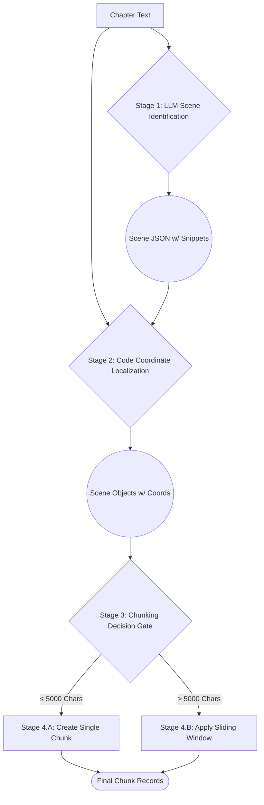

### **Specification: Chapter-to-Chunk Ingestion and Processing Workflow**

**Version**: 1.1  
**Date**: August 6, 2025  
**Author**: LoreVault Project

#### 1\. Overview

This document specifies the complete, end-to-end process for ingesting a raw `Chapter` text and decomposing it into its structured `Scene` and `Chunk` components. The workflow is designed to ensure maximum reliability and semantic coherence by decoupling AI-driven creative analysis from deterministic, code-based data processing. The final output is a set of structured data entities ready for the embedding and knowledge synthesis stages of the LoreVault pipeline.

#### 2\. Core Principles

  * **Separation of Concerns**: The AI's strength is semantic understanding; it will be used to *identify* scenes from the chapter. The application code's strength is precision; it will be used to *calculate* exact positional data.
  * **Semantic Coherence**: The `Scene` is the primary unit of narrative context. The `Chunk` is a technical subdivision of a `Scene`, optimized for embedding models.
  * **Processing Efficiency**: A conditional logic gate prevents unnecessary chunking operations on scenes that are already short enough for effective processing.

#### 3\. Detailed Workflow

The process consists of four primary stages that execute sequentially to process a chapter.

##### **Stage 1: Scene Identification (AI-Powered)**

  * **Input**: The full, unmodified text of a single `Chapter`.
  * **Action**: The chapter text is passed to the Gemma 3B model using the "Two-Pass" system prompt. The model is instructed to identify semantic scene breaks based on shifts in time, location, or character focus.
  * **Output**: A single JSON object containing a list of scene data structures. Each scene structure includes an `index`, a `context` description, and the `start_snippet` and `end_snippet` text fragments.

##### **Stage 2: Coordinate Localization (Code-Powered)**

  * **Input**: The JSON object from Stage 1 and the original chapter text.
  * **Action**: The application code iterates through each scene object in the received JSON. It performs deterministic string searches on the original chapter text to find the exact character positions of the `start_snippet` and `end_snippet`.
  * **Output**: A list of `Scene` data objects, now enriched with a populated `coordinates` array containing the 100% accurate, zero-indexed start and end character offsets.

##### **Stage 3: Chunking Decision Gate**

  * **Input**: A single `Scene` data object, including its full text content derived from the coordinates found in Stage 2.
  * **Action**: The application calculates the character count of the scene's text. (\***Implementation Note**: A threshold of **5000 characters** will be used as the equivalent of the specified \~900 words).
  * **Decision Logic**:
      * **IF** the scene's character count is less than or equal to 5000, it proceeds to **Stage 4.A**.
      * **IF** the scene's character count is greater than 5000, it proceeds to **Stage 4.B**.
  * **Rationale**: Avoids the computational overhead of the sliding window algorithm for scenes that are already small enough to be treated as a single, effective chunk.

##### **Stage 4: Chunk Generation**

This stage has two possible paths based on the decision from Stage 3.

  * **Stage 4.A: Single-Chunk Creation**

      * **Trigger**: The scene has ≤ 5000 characters.
      * **Action**: A single `Chunk` entity is created. The content of this chunk is the verbatim text of the parent `Scene`. Its coordinates are identical to the scene's coordinates.
      * **Output**: One `Chunk` record is persisted and linked to the parent `Scene` ID.

  * **Stage 4.B: Multi-Chunk Subdivision**

      * **Trigger**: The scene has \> 5000 characters.
      * **Action**: The **Sentence-Aware Sliding Window** algorithm is applied to the scene's text.
          * The text is first split into a list of sentences.
          * Sentences are grouped to form chunks of a target size (e.g., 2000-4000 characters).
          * Each chunk maintains a defined overlap with its neighbors (e.g., a 2-3 sentence overlap).
      * **Output**: Multiple `Chunk` records are persisted, each linked to the same parent `Scene` ID.

#### 4\. Data Flow Diagram

#### 5\. Final State

Upon completion of this workflow, the database will contain the `Chapter`, `Scene`, and `Chunk` records derived from the original chapter, with accurate relational links and positional data. This structured, hierarchical content is now ready for the subsequent embedding, analysis, and knowledge synthesis phases of the LoreVault pipeline.